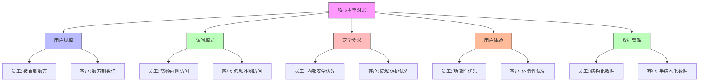

在数字化转型的浪潮中，企业面临着前所未有的身份管理挑战。传统的员工身份管理（Employee Identity Management）和新兴的客户身份管理（Customer Identity and Access Management, CIAM）正在从各自独立的领域走向融合，形成统一的身份治理新格局。理解这两种身份管理模式的异同，对于构建现代化的统一身份治理平台具有重要意义。

## 引言

随着企业业务边界的不断扩展，身份管理的范畴也在不断延伸。从最初的内部员工身份管理，到后来的合作伙伴身份管理，再到如今的客户身份管理，企业需要管理的身份类型日益多样化。CIAM作为专门面向客户身份管理的解决方案，与传统的员工身份管理在目标、需求、实现方式等方面存在显著差异，但也有很多共通之处。如何在统一的身份治理框架下，有效整合这两种身份管理模式，成为企业数字化转型中的重要课题。

## CIAM与员工身份管理的核心差异

### 用户规模与访问模式



### 详细差异分析

#### 1. 用户规模差异

```java
public class IdentityScaleComparison {
    
    // 员工身份管理规模
    public class EmployeeIdentityScale {
        private static final int MAX_EMPLOYEES = 100_000;        // 通常不超过10万
        private static final int ACTIVE_USERS = 80_000;           // 活跃用户占比80%
        private static final int PEAK_CONCURRENT = 50_000;        // 峰值并发用户
        private static final int AVERAGE_SESSION = 28_800;        // 平均会话时长(8小时)
        
        public ScaleMetrics getMetrics() {
            return ScaleMetrics.builder()
                .totalUsers(MAX_EMPLOYEES)
                .activeUsers(ACTIVE_USERS)
                .peakConcurrent(PEAK_CONCURRENT)
                .averageSessionDuration(AVERAGE_SESSION)
                .authenticationFrequency(AuthFrequency.HIGH)  // 高频认证
                .build();
        }
    }
    
    // 客户身份管理规模
    public class CustomerIdentityScale {
        private static final int MAX_CUSTOMERS = 100_000_000;     // 可达1亿
        private static final int ACTIVE_USERS = 10_000_000;        // 活跃用户占比10%
        private static final int PEAK_CONCURRENT = 1_000_000;     // 峰值并发用户
        private static final int AVERAGE_SESSION = 1_800;         // 平均会话时长(30分钟)
        
        public ScaleMetrics getMetrics() {
            return ScaleMetrics.builder()
                .totalUsers(MAX_CUSTOMERS)
                .activeUsers(ACTIVE_USERS)
                .peakConcurrent(PEAK_CONCURRENT)
                .averageSessionDuration(AVERAGE_SESSION)
                .authenticationFrequency(AuthFrequency.LOW)   // 低频认证
                .build();
        }
    }
    
    // 扩展性设计差异
    public class ScalabilityDesign {
        
        // 员工身份系统扩展性设计
        public EmployeeSystemDesign getEmployeeDesign() {
            return EmployeeSystemDesign.builder()
                .databaseSharding(false)  // 通常不需要分片
                .cachingStrategy(CacheStrategy.AGGRESSIVE)  // 激进缓存
                .sessionManagement(SessionManagement.SERVER_SIDE)  // 服务端会话
                .loadBalancing(LoadBalancing.ROUND_ROBIN)  // 简单负载均衡
                .build();
        }
        
        // 客户身份系统扩展性设计
        public CustomerSystemDesign getCustomerDesign() {
            return CustomerSystemDesign.builder()
                .databaseSharding(true)   // 必须分片
                .cachingStrategy(CacheStrategy.SMART)  // 智能缓存
                .sessionManagement(SessionManagement.CLIENT_SIDE)  // 客户端会话
                .loadBalancing(LoadBalancing.GEO_DISTRIBUTED)  // 地理分布式
                .cdnIntegration(true)     // CDN集成
                .build();
        }
    }
}
```

#### 2. 安全要求差异

```python
class SecurityRequirementsComparison:
    def __init__(self):
        self.employee_security = {
            'authentication': {
                'methods': ['password', 'mfa', 'certificate', 'biometric'],
                'strength': 'high',
                'compliance': ['SOX', 'HIPAA', 'ISO27001'],
                'audit': 'comprehensive'
            },
            'authorization': {
                'model': 'rbac_strict',
                'principle': 'least_privilege',
                'review': 'regular',
                'separation_of_duty': True
            },
            'data_protection': {
                'encryption': 'at_rest_and_transit',
                'backup': 'daily',
                'retention': '7_years',
                'privacy': 'internal_policy'
            }
        }
        
        self.customer_security = {
            'authentication': {
                'methods': ['password', 'social_login', 'passwordless', 'biometric'],
                'strength': 'adaptive',
                'compliance': ['GDPR', 'CCPA', 'PIPL'],
                'audit': 'selective'
            },
            'authorization': {
                'model': 'abac_flexible',
                'principle': 'context_aware',
                'review': 'event_driven',
                'separation_of_duty': False
            },
            'data_protection': {
                'encryption': 'at_rest_and_transit',
                'backup': 'hourly',
                'retention': 'customer_controlled',
                'privacy': 'regulation_driven'
            }
        }
    
    def compare_authentication_security(self):
        """比较认证安全要求"""
        return {
            'employee': {
                'focus': 'prevention',  # 预防为主
                'control': 'strict',    # 严格控制
                'verification': 'mandatory'  # 强制验证
            },
            'customer': {
                'focus': 'detection',   # 检测为主
                'control': 'adaptive',  # 自适应控制
                'verification': 'risk_based'  # 基于风险的验证
            }
        }
    
    def compare_authorization_models(self):
        """比较授权模型"""
        return {
            'employee': {
                'model_type': 'role_based',
                'assignment': 'administrative',
                'granularity': 'fine',
                'stability': 'high'
            },
            'customer': {
                'model_type': 'attribute_based',
                'assignment': 'self_service',
                'granularity': 'coarse',
                'stability': 'dynamic'
            }
        }
```

## 融合架构设计

### 统一身份治理架构

```sql
-- 统一身份治理数据库设计
CREATE TABLE unified_identities (
    id VARCHAR(50) PRIMARY KEY,
    identity_type VARCHAR(20) NOT NULL,  -- EMPLOYEE, CUSTOMER, PARTNER, SYSTEM
    username VARCHAR(100) NOT NULL,
    email VARCHAR(200),
    phone VARCHAR(20),
    status VARCHAR(20) DEFAULT 'ACTIVE',
    created_at TIMESTAMP DEFAULT CURRENT_TIMESTAMP,
    updated_at TIMESTAMP DEFAULT CURRENT_TIMESTAMP ON UPDATE CURRENT_TIMESTAMP,
    
    -- 员工特有字段
    employee_id VARCHAR(50),
    department VARCHAR(100),
    position VARCHAR(100),
    hire_date DATE,
    
    -- 客户特有字段
    customer_id VARCHAR(50),
    customer_tier VARCHAR(20),  -- PREMIUM, STANDARD, BASIC
    registration_source VARCHAR(50),  -- WEB, MOBILE, SOCIAL
    last_purchase_date TIMESTAMP,
    
    -- 通用字段
    profile_complete BOOLEAN DEFAULT FALSE,
    mfa_enabled BOOLEAN DEFAULT FALSE,
    password_last_changed TIMESTAMP,
    
    INDEX idx_identity_type (identity_type),
    INDEX idx_username (username),
    INDEX idx_email (email),
    INDEX idx_status (status)
);

-- 统一认证记录表
CREATE TABLE unified_auth_logs (
    id VARCHAR(50) PRIMARY KEY,
    identity_id VARCHAR(50) NOT NULL,
    identity_type VARCHAR(20) NOT NULL,
    auth_method VARCHAR(50) NOT NULL,  -- PASSWORD, MFA, SOCIAL, PASSWORDLESS
    auth_result VARCHAR(20) NOT NULL,  -- SUCCESS, FAILURE, CHALLENGE
    ip_address VARCHAR(45),
    user_agent TEXT,
    device_info JSON,
    risk_score DECIMAL(3,2),  -- 风险评分(0-10)
    session_id VARCHAR(100),
    created_at TIMESTAMP DEFAULT CURRENT_TIMESTAMP,
    
    FOREIGN KEY (identity_id) REFERENCES unified_identities(id),
    INDEX idx_identity_id (identity_id),
    INDEX idx_identity_type (identity_type),
    INDEX idx_auth_method (auth_method),
    INDEX idx_auth_result (auth_result),
    INDEX idx_created_at (created_at),
    INDEX idx_risk_score (risk_score)
);

-- 统一权限表
CREATE TABLE unified_permissions (
    id VARCHAR(50) PRIMARY KEY,
    identity_id VARCHAR(50) NOT NULL,
    identity_type VARCHAR(20) NOT NULL,
    resource_id VARCHAR(50) NOT NULL,
    action VARCHAR(50) NOT NULL,
    effect VARCHAR(10) NOT NULL,  -- ALLOW, DENY
    granted_by VARCHAR(50),
    granted_at TIMESTAMP DEFAULT CURRENT_TIMESTAMP,
    expires_at TIMESTAMP NULL,
    conditions JSON,  -- 条件表达式
    
    FOREIGN KEY (identity_id) REFERENCES unified_identities(id),
    INDEX idx_identity_id (identity_id),
    INDEX idx_identity_type (identity_type),
    INDEX idx_resource_action (resource_id, action),
    INDEX idx_effect (effect),
    INDEX idx_expires_at (expires_at)
);
```

### 身份生命周期管理

```javascript
// 统一身份生命周期管理服务
class UnifiedIdentityLifecycleService {
  constructor(identityRepository, notificationService, auditService) {
    this.identityRepository = identityRepository;
    this.notificationService = notificationService;
    this.auditService = auditService;
  }
  
  // 创建身份
  async createIdentity(identityData) {
    const { type, basicInfo, extendedInfo } = identityData;
    
    // 1. 验证基本信息
    await this._validateBasicInfo(basicInfo, type);
    
    // 2. 创建统一身份记录
    const identity = await this.identityRepository.create({
      identity_type: type,
      username: basicInfo.username,
      email: basicInfo.email,
      phone: basicInfo.phone,
      status: 'ACTIVE',
      ...this._mapExtendedInfo(extendedInfo, type)
    });
    
    // 3. 根据身份类型执行特定初始化
    switch (type) {
      case 'EMPLOYEE':
        await this._initializeEmployeeIdentity(identity, extendedInfo);
        break;
      case 'CUSTOMER':
        await this._initializeCustomerIdentity(identity, extendedInfo);
        break;
    }
    
    // 4. 发送欢迎通知
    await this._sendWelcomeNotification(identity);
    
    // 5. 记录审计日志
    await this.auditService.logIdentityCreation(identity);
    
    return identity;
  }
  
  // 员工身份初始化
  async _initializeEmployeeIdentity(identity, employeeInfo) {
    // 1. 分配默认角色
    await this._assignDefaultEmployeeRoles(identity.id);
    
    // 2. 创建员工档案
    await this._createEmployeeProfile(identity.id, employeeInfo);
    
    // 3. 设置入职流程
    await this._setupOnboardingProcess(identity.id);
    
    // 4. 配置安全设置
    await this._configureEmployeeSecurity(identity.id);
  }
  
  // 客户身份初始化
  async _initializeCustomerIdentity(identity, customerInfo) {
    // 1. 设置客户等级
    await this._setCustomerTier(identity.id, customerInfo.tier);
    
    // 2. 记录注册来源
    await this._recordRegistrationSource(identity.id, customerInfo.source);
    
    // 3. 发送验证邮件
    await this._sendVerificationEmail(identity);
    
    // 4. 配置个性化设置
    await this._configureCustomerPreferences(identity.id);
  }
  
  // 身份状态变更
  async changeIdentityStatus(identityId, newStatus, reason, changedBy) {
    const identity = await this.identityRepository.findById(identityId);
    
    // 1. 验证状态变更合法性
    if (!this._isValidStatusTransition(identity.status, newStatus)) {
      throw new Error(`无效的状态变更: ${identity.status} -> ${newStatus}`);
    }
    
    // 2. 执行状态变更
    const updatedIdentity = await this.identityRepository.updateStatus(
      identityId, 
      newStatus
    );
    
    // 3. 执行状态变更后的操作
    await this._handleStatusChange(identity, newStatus, reason);
    
    // 4. 发送通知
    await this._sendStatusChangeNotification(identity, newStatus, reason);
    
    // 5. 记录审计日志
    await this.auditService.logIdentityStatusChange({
      identityId,
      oldStatus: identity.status,
      newStatus,
      reason,
      changedBy,
      timestamp: new Date()
    });
    
    return updatedIdentity;
  }
  
  // 处理状态变更后的操作
  async _handleStatusChange(identity, newStatus, reason) {
    switch (newStatus) {
      case 'SUSPENDED':
        await this._suspendIdentity(identity, reason);
        break;
      case 'DISABLED':
        await this._disableIdentity(identity, reason);
        break;
      case 'ACTIVE':
        if (identity.status === 'SUSPENDED') {
          await this._unsuspendIdentity(identity);
        }
        break;
    }
  }
  
  // 暂停身份
  async _suspendIdentity(identity, reason) {
    // 1. 注销所有活跃会话
    await this._invalidateAllSessions(identity.id);
    
    // 2. 撤销临时权限
    await this._revokeTemporaryPermissions(identity.id);
    
    // 3. 记录暂停原因
    await this._recordSuspensionReason(identity.id, reason);
  }
  
  // 映射扩展信息
  _mapExtendedInfo(extendedInfo, type) {
    if (type === 'EMPLOYEE') {
      return {
        employee_id: extendedInfo.employeeId,
        department: extendedInfo.department,
        position: extendedInfo.position,
        hire_date: extendedInfo.hireDate
      };
    } else if (type === 'CUSTOMER') {
      return {
        customer_id: extendedInfo.customerId,
        customer_tier: extendedInfo.tier,
        registration_source: extendedInfo.source,
        last_purchase_date: extendedInfo.lastPurchaseDate
      };
    }
    return {};
  }
}
```

## 技术实现要点

### 认证融合策略

```java
public class UnifiedAuthenticationService {
    private final EmployeeAuthService employeeAuthService;
    private final CustomerAuthService customerAuthService;
    private final AdaptiveRiskService riskService;
    private final SessionManagementService sessionService;
    
    // 统一认证入口
    public AuthenticationResult authenticateUnified(AuthenticationRequest request) {
        // 1. 识别身份类型
        IdentityType identityType = identifyIdentityType(request.getUsername());
        
        AuthenticationResult result;
        
        // 2. 根据身份类型选择认证服务
        switch (identityType) {
            case EMPLOYEE:
                result = employeeAuthService.authenticate(request);
                break;
            case CUSTOMER:
                result = customerAuthService.authenticate(request);
                break;
            default:
                throw new AuthenticationException("未知身份类型");
        }
        
        // 3. 风险评估
        RiskAssessment riskAssessment = riskService.assessAuthenticationRisk(
            request, result, identityType);
        
        // 4. 自适应认证
        if (riskAssessment.getRiskLevel() > RiskLevel.LOW) {
            result = performAdaptiveAuthentication(request, result, riskAssessment);
        }
        
        // 5. 会话管理
        if (result.isSuccess()) {
            Session session = sessionService.createSession(result.getIdentity(), identityType);
            result.setSession(session);
        }
        
        // 6. 记录认证日志
        logAuthenticationAttempt(request, result, riskAssessment);
        
        return result;
    }
    
    // 自适应认证
    private AuthenticationResult performAdaptiveAuthentication(
            AuthenticationRequest request, 
            AuthenticationResult baseResult,
            RiskAssessment riskAssessment) {
        
        // 根据风险等级采取不同措施
        switch (riskAssessment.getRiskLevel()) {
            case MEDIUM:
                // 要求额外验证（如短信验证码）
                return requestAdditionalVerification(request, baseResult, VerificationType.SMS);
                
            case HIGH:
                // 要求强验证（如生物识别或硬件令牌）
                return requestStrongVerification(request, baseResult, VerificationType.BIOMETRIC);
                
            case CRITICAL:
                // 拒绝认证并触发安全事件
                triggerSecurityIncident(request, riskAssessment);
                return AuthenticationResult.failed("风险过高，认证被拒绝");
                
            default:
                return baseResult;
        }
    }
    
    // 身份类型识别
    private IdentityType identifyIdentityType(String identifier) {
        // 通过多种方式识别身份类型
        if (isEmployeeIdentifier(identifier)) {
            return IdentityType.EMPLOYEE;
        } else if (isCustomerIdentifier(identifier)) {
            return IdentityType.CUSTOMER;
        } else {
            // 尝试通过数据库查询确定
            return lookupIdentityType(identifier);
        }
    }
    
    // 风险感知认证
    public class AdaptiveRiskService {
        
        public RiskAssessment assessAuthenticationRisk(
                AuthenticationRequest request, 
                AuthenticationResult result,
                IdentityType identityType) {
            
            RiskAssessment.RiskAssessmentBuilder builder = RiskAssessment.builder();
            
            // 1. 地理位置风险
            GeoRisk geoRisk = assessGeographicRisk(request.getIpAddress(), result.getIdentity());
            builder.geoRisk(geoRisk);
            
            // 2. 设备风险
            DeviceRisk deviceRisk = assessDeviceRisk(request.getUserAgent(), request.getDeviceId());
            builder.deviceRisk(deviceRisk);
            
            // 3. 行为风险
            BehaviorRisk behaviorRisk = assessBehaviorRisk(request, result.getIdentity());
            builder.behaviorRisk(behaviorRisk);
            
            // 4. 时间风险
            TimeRisk timeRisk = assessTimeRisk(request.getTimestamp(), identityType);
            builder.timeRisk(timeRisk);
            
            // 5. 身份类型特定风险
            IdentitySpecificRisk identityRisk = assessIdentitySpecificRisk(
                result.getIdentity(), identityType);
            builder.identityRisk(identityRisk);
            
            // 计算综合风险评分
            double compositeScore = calculateCompositeRiskScore(
                geoRisk, deviceRisk, behaviorRisk, timeRisk, identityRisk);
            
            return builder
                .compositeScore(compositeScore)
                .riskLevel(determineRiskLevel(compositeScore))
                .assessmentTime(Instant.now())
                .build();
        }
    }
}
```

### 权限模型融合

```sql
-- 统一权限模型设计
CREATE TABLE unified_roles (
    id VARCHAR(50) PRIMARY KEY,
    role_name VARCHAR(100) NOT NULL,
    role_type VARCHAR(20) NOT NULL,  -- EMPLOYEE, CUSTOMER, SYSTEM
    description TEXT,
    is_active BOOLEAN DEFAULT TRUE,
    created_at TIMESTAMP DEFAULT CURRENT_TIMESTAMP,
    updated_at TIMESTAMP DEFAULT CURRENT_TIMESTAMP ON UPDATE CURRENT_TIMESTAMP,
    
    INDEX idx_role_name (role_name),
    INDEX idx_role_type (role_type),
    INDEX idx_is_active (is_active)
);

-- 角色权限关联表
CREATE TABLE role_permissions (
    id VARCHAR(50) PRIMARY KEY,
    role_id VARCHAR(50) NOT NULL,
    permission_id VARCHAR(50) NOT NULL,
    granted_at TIMESTAMP DEFAULT CURRENT_TIMESTAMP,
    granted_by VARCHAR(50),
    is_active BOOLEAN DEFAULT TRUE,
    
    FOREIGN KEY (role_id) REFERENCES unified_roles(id),
    FOREIGN KEY (permission_id) REFERENCES unified_permissions(id),
    INDEX idx_role_id (role_id),
    INDEX idx_permission_id (permission_id),
    INDEX idx_is_active (is_active)
);

-- 用户角色关联表
CREATE TABLE identity_roles (
    id VARCHAR(50) PRIMARY KEY,
    identity_id VARCHAR(50) NOT NULL,
    role_id VARCHAR(50) NOT NULL,
    assigned_at TIMESTAMP DEFAULT CURRENT_TIMESTAMP,
    assigned_by VARCHAR(50),
    expires_at TIMESTAMP NULL,
    is_active BOOLEAN DEFAULT TRUE,
    
    FOREIGN KEY (identity_id) REFERENCES unified_identities(id),
    FOREIGN KEY (role_id) REFERENCES unified_roles(id),
    INDEX idx_identity_id (identity_id),
    INDEX idx_role_id (role_id),
    INDEX idx_is_active (is_active),
    INDEX idx_expires_at (expires_at)
);

-- 创建权限视图
CREATE VIEW effective_permissions AS
SELECT 
    i.id as identity_id,
    i.identity_type,
    p.resource_id,
    p.action,
    p.effect,
    p.conditions,
    ir.assigned_at as role_assigned_at,
    p.granted_at as permission_granted_at
FROM unified_identities i
JOIN identity_roles ir ON i.id = ir.identity_id AND ir.is_active = TRUE
JOIN unified_roles r ON ir.role_id = r.id AND r.is_active = TRUE
JOIN role_permissions rp ON r.id = rp.role_id AND rp.is_active = TRUE
JOIN unified_permissions p ON rp.permission_id = p.id
WHERE i.status = 'ACTIVE'
  AND (p.expires_at IS NULL OR p.expires_at > NOW())
  AND (ir.expires_at IS NULL OR ir.expires_at > NOW());
```

## 最佳实践建议

### 架构设计原则

```python
class UnifiedIdentityArchitecturePrinciples:
    def __init__(self):
        self.principles = {
            'separation_of_concerns': {
                'description': '分离关注点，员工和客户身份在核心逻辑上分离',
                'implementation': [
                    '独立的认证流程',
                    '差异化的权限模型',
                    '专门的安全策略'
                ]
            },
            'unified_data_model': {
                'description': '统一的数据模型，共享核心身份信息',
                'implementation': [
                    '统一的身份标识',
                    '共享的审计日志',
                    '一致的API接口'
                ]
            },
            'adaptive_security': {
                'description': '自适应安全策略，根据身份类型调整安全级别',
                'implementation': [
                    '风险感知认证',
                    '动态权限控制',
                    '差异化监控告警'
                ]
            },
            'scalable_design': {
                'description': '可扩展的设计，支持大规模客户身份管理',
                'implementation': [
                    '微服务架构',
                    '无状态设计',
                    '弹性扩缩容'
                ]
            }
        }
    
    def get_architecture_guidelines(self):
        """获取架构设计指南"""
        return {
            'core_services': {
                'identity_management': '统一身份管理服务',
                'authentication_service': '统一认证服务',
                'authorization_service': '统一授权服务',
                'audit_service': '统一审计服务'
            },
            'supporting_services': {
                'notification_service': '通知服务',
                'risk_assessment_service': '风险评估服务',
                'session_management_service': '会话管理服务',
                'compliance_service': '合规服务'
            },
            'data_layer': {
                'primary_storage': '主数据存储（关系型数据库）',
                'cache_layer': '缓存层（Redis/Memcached）',
                'search_engine': '搜索引擎（Elasticsearch）',
                'analytics_store': '分析存储（数据仓库）'
            }
        }
```

### 迁移策略

```javascript
// CIAM与员工身份融合迁移策略
class IdentityFederationMigrationStrategy {
  constructor(currentEmployeeSystem, currentCustomerSystem) {
    this.employeeSystem = currentEmployeeSystem;
    this.customerSystem = currentCustomerSystem;
    this.migrationProgress = new Map();
  }
  
  // 制定迁移计划
  createMigrationPlan() {
    return {
      phases: [
        {
          phase: 'ASSESSMENT',
          duration: '2 weeks',
          activities: [
            '系统现状评估',
            '数据模型分析',
            '集成点识别',
            '风险评估'
          ],
          success_criteria: [
            '完成现状报告',
            '确定技术方案',
            '获得项目批准'
          ]
        },
        {
          phase: 'FOUNDATION',
          duration: '4 weeks',
          activities: [
            '统一数据模型设计',
            '核心服务开发',
            'API网关建设',
            '安全框架搭建'
          ],
          success_criteria: [
            '完成核心服务开发',
            '通过安全测试',
            'API文档发布'
          ]
        },
        {
          phase: 'EMPLOYEE_MIGRATION',
          duration: '6 weeks',
          activities: [
            '员工数据迁移',
            '认证流程对接',
            '权限模型转换',
            '用户培训'
          ],
          success_criteria: [
            '员工系统切换完成',
            '用户满意度>80%',
            '系统稳定性达标'
          ]
        },
        {
          phase: 'CUSTOMER_INTEGRATION',
          duration: '8 weeks',
          activities: [
            '客户数据整合',
            '体验优化',
            '安全增强',
            '监控完善'
          ],
          success_criteria: [
            '客户系统集成完成',
            '性能指标达标',
            '安全合规通过'
          ]
        },
        {
          phase: 'OPTIMIZATION',
          duration: '4 weeks',
          activities: [
            '性能调优',
            '功能完善',
            '文档更新',
            '知识转移'
          ],
          success_criteria: [
            '系统性能提升30%',
            '文档完整度100%',
            '团队培训完成'
          ]
        }
      ],
      rollback_plan: {
        'phase_based_rollback': '按阶段回滚',
        'data_rollback': '数据回滚机制',
        'service_degradation': '服务降级方案'
      }
    };
  }
  
  // 数据迁移策略
  async executeDataMigration() {
    // 1. 员工数据迁移
    await this._migrateEmployeeData();
    
    // 2. 客户数据迁移
    await this._migrateCustomerData();
    
    // 3. 数据验证
    await this._validateMigratedData();
    
    // 4. 数据同步
    await this._setupDataSynchronization();
  }
  
  // 员工数据迁移
  async _migrateEmployeeData() {
    const batchSize = 1000;
    let offset = 0;
    let hasMore = true;
    
    while (hasMore) {
      // 获取一批员工数据
      const employees = await this.employeeSystem.getEmployees(batchSize, offset);
      
      if (employees.length === 0) {
        hasMore = false;
        break;
      }
      
      // 转换数据格式
      const unifiedEmployees = employees.map(emp => this._transformEmployeeData(emp));
      
      // 批量插入统一身份系统
      await this._bulkInsertIdentities(unifiedEmployees);
      
      // 更新迁移进度
      this.migrationProgress.set('employee', offset + employees.length);
      
      offset += batchSize;
      
      // 避免过载，短暂休眠
      await this._sleep(1000);
    }
  }
  
  // 客户数据迁移
  async _migrateCustomerData() {
    // 客户数据迁移需要特别注意隐私保护
    const privacySettings = await this._getPrivacySettings();
    
    const batchSize = 5000;  // 客户数据量大，批次更大
    let offset = 0;
    let hasMore = true;
    
    while (hasMore) {
      // 获取一批客户数据
      const customers = await this.customerSystem.getCustomers(batchSize, offset);
      
      if (customers.length === 0) {
        hasMore = false;
        break;
      }
      
      // 根据隐私设置过滤数据
      const filteredCustomers = customers.filter(customer => 
        this._shouldMigrateCustomer(customer, privacySettings)
      );
      
      // 转换数据格式
      const unifiedCustomers = filteredCustomers.map(cust => 
        this._transformCustomerData(cust)
      );
      
      // 批量插入统一身份系统
      await this._bulkInsertIdentities(unifiedCustomers);
      
      // 更新迁移进度
      this.migrationProgress.set('customer', offset + customers.length);
      
      offset += batchSize;
      
      // 避免过载，短暂休眠
      await this._sleep(2000);
    }
  }
  
  // 数据验证
  async _validateMigratedData() {
    // 1. 数据完整性验证
    const employeeCount = await this._countMigratedEmployees();
    const expectedEmployeeCount = await this.employeeSystem.getEmployeeCount();
    
    if (employeeCount !== expectedEmployeeCount) {
      throw new Error(`员工数据迁移不完整: ${employeeCount}/${expectedEmployeeCount}`);
    }
    
    // 2. 数据一致性验证
    await this._validateDataConsistency();
    
    // 3. 功能验证
    await this._validateFunctionality();
  }
}
```

## 总结

CIAM与员工身份管理的融合是企业数字化转型的必然趋势。通过理解两者的核心差异，设计合理的融合架构，并遵循最佳实践，企业可以构建一个既满足内部员工需求又服务外部客户的统一身份治理平台。

关键要点包括：

1. **差异认知**：深入理解CIAM与员工身份管理在规模、安全、体验等方面的根本差异
2. **架构融合**：设计统一但差异化的架构，在共享核心能力的同时满足不同需求
3. **渐进实施**：采用分阶段迁移策略，降低实施风险
4. **安全平衡**：在提供良好用户体验的同时确保安全合规

在后续章节中，我们将继续探讨零信任架构中的身份新角色，为构建更加安全的现代化身份治理体系提供指导。