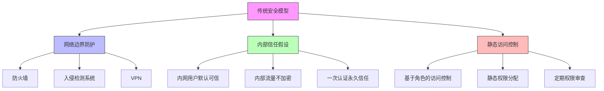

在网络安全威胁日益复杂的今天，传统的边界安全模型已经无法有效应对新型攻击手段。零信任（Zero Trust）安全架构作为一种新兴的安全理念，正在重塑企业安全防护体系。在零信任模型中，身份不再仅仅是访问控制的凭证，而是成为安全防护的核心要素。本文将深入探讨零信任架构中身份的新角色，以及如何构建适应零信任要求的现代化身份治理平台。

## 引言

零信任安全模型的核心理念是"永不信任，始终验证"（Never Trust, Always Verify）。这一理念颠覆了传统的"城堡和护城河"安全模型，不再假设网络内部是安全的，而是要求对每一次访问请求都进行严格验证。在这一新范式下，身份管理系统的角色发生了根本性变化，从被动的认证授权工具转变为主动的安全防护引擎。

## 零信任安全模型概述

### 传统安全模型的局限性



### 零信任安全模型核心原则

```java
public class ZeroTrustPrinciples {
    
    // 零信任核心原则
    public enum CorePrinciple {
        NEVER_TRUST_ALWAYS_VERIFY("永不信任，始终验证"),
        ASSUME_BREACH("假设已遭破坏"),
        LEAST_PRIVILEGE("最小权限"),
        EXPLICIT_VERIFICATION("显式验证"),
        MICROSEGMENTATION("微隔离");
        
        private final String description;
        
        CorePrinciple(String description) {
            this.description = description;
        }
        
        public String getDescription() {
            return description;
        }
    }
    
    // 零信任架构组件
    public class ZeroTrustArchitecture {
        
        // 身份引擎
        public class IdentityEngine {
            private final ContinuousAuthenticationService continuousAuth;
            private final RiskAssessmentService riskAssessment;
            private final ContextAwareService contextAware;
            
            public VerificationResult verifyAccess(AccessRequest request) {
                // 1. 身份验证
                AuthenticationResult authResult = continuousAuth.authenticate(
                    request.getIdentity(), 
                    request.getCredentials()
                );
                
                if (!authResult.isSuccess()) {
                    return VerificationResult.denied("身份验证失败");
                }
                
                // 2. 设备验证
                DeviceVerificationResult deviceResult = verifyDevice(request.getDevice());
                if (!deviceResult.isTrusted()) {
                    return VerificationResult.denied("设备验证失败");
                }
                
                // 3. 环境验证
                EnvironmentVerificationResult envResult = verifyEnvironment(request.getEnvironment());
                if (!envResult.isSecure()) {
                    return VerificationResult.denied("环境验证失败");
                }
                
                // 4. 风险评估
                RiskAssessment riskAssessment = this.riskAssessment.assess(
                    request, authResult, deviceResult, envResult
                );
                
                // 5. 上下文感知决策
                ContextDecision decision = contextAware.makeDecision(
                    request, authResult, deviceResult, envResult, riskAssessment
                );
                
                return VerificationResult.builder()
                    .allowed(decision.isAllowed())
                    .reason(decision.getReason())
                    .conditions(decision.getConditions())
                    .confidence(decision.getConfidence())
                    .build();
            }
        }
        
        // 策略引擎
        public class PolicyEngine {
            private final PolicyRepository policyRepository;
            private final PolicyEvaluationService policyEvaluator;
            
            public PolicyDecision evaluatePolicy(PolicyEvaluationContext context) {
                // 1. 获取适用策略
                List<Policy> applicablePolicies = policyRepository.getApplicablePolicies(context);
                
                // 2. 评估策略
                PolicyEvaluationResult result = policyEvaluator.evaluate(
                    applicablePolicies, context
                );
                
                // 3. 生成决策
                return PolicyDecision.builder()
                    .allowed(result.isAllowed())
                    .policyViolations(result.getViolations())
                    .recommendations(result.getRecommendations())
                    .build();
            }
        }
        
        // 数据保护引擎
        public class DataProtectionEngine {
            private final DataClassificationService classificationService;
            private final DataEncryptionService encryptionService;
            
            public DataProtectionResult protectData(DataAccessRequest request) {
                // 1. 数据分类
                DataClassification classification = classificationService.classify(
                    request.getResource()
                );
                
                // 2. 应用保护策略
                ProtectionPolicy policy = getProtectionPolicy(classification);
                
                // 3. 执行保护措施
                if (policy.requiresEncryption()) {
                    encryptionService.encrypt(request.getData());
                }
                
                if (policy.requiresTokenization()) {
                    tokenizationService.tokenize(request.getData());
                }
                
                return DataProtectionResult.success();
            }
        }
    }
}
```

## 身份在零信任中的新角色

### 从静态凭证到动态信任

```python
class ZeroTrustIdentityService:
    def __init__(self, auth_service, risk_service, context_service):
        self.auth_service = auth_service
        self.risk_service = risk_service
        self.context_service = context_service
        self.trust_scores = {}  # 动态信任评分
    
    def evaluate_identity_trust(self, identity_id, access_context):
        """评估身份信任度"""
        # 1. 基础认证状态
        auth_status = self.auth_service.get_authentication_status(identity_id)
        
        # 2. 行为分析
        behavior_score = self._analyze_behavior_patterns(identity_id, access_context)
        
        # 3. 风险评估
        risk_score = self.risk_service.assess_identity_risk(identity_id, access_context)
        
        # 4. 上下文验证
        context_score = self.context_service.evaluate_context(identity_id, access_context)
        
        # 5. 计算综合信任评分
        trust_score = self._calculate_trust_score(
            auth_status, behavior_score, risk_score, context_score
        )
        
        # 6. 更新信任评分
        self.trust_scores[identity_id] = trust_score
        
        return trust_score
    
    def _calculate_trust_score(self, auth_status, behavior_score, risk_score, context_score):
        """计算综合信任评分"""
        # 权重分配
        weights = {
            'authentication': 0.3,
            'behavior': 0.25,
            'risk': 0.25,
            'context': 0.2
        }
        
        # 计算加权分数
        trust_score = (
            auth_status.score * weights['authentication'] +
            behavior_score * weights['behavior'] +
            (1 - risk_score) * weights['risk'] +  # 风险越低，信任越高
            context_score * weights['context']
        )
        
        return min(max(trust_score, 0.0), 1.0)  # 限制在0-1之间
    
    def continuous_authentication(self, identity_id, session_id):
        """持续认证"""
        # 1. 监控会话活动
        session_activity = self._monitor_session_activity(session_id)
        
        # 2. 检测异常行为
        anomalies = self._detect_anomalies(identity_id, session_activity)
        
        # 3. 动态调整信任评分
        if anomalies:
            self._adjust_trust_score(identity_id, -0.1 * len(anomalies))
        
        # 4. 触发额外验证
        if self.trust_scores.get(identity_id, 1.0) < 0.5:
            return self._trigger_additional_verification(identity_id)
        
        return True
    
    def adaptive_access_control(self, identity_id, resource_id, action):
        """自适应访问控制"""
        # 1. 评估访问请求
        access_context = {
            'resource_id': resource_id,
            'action': action,
            'timestamp': datetime.utcnow(),
            'location': self._get_user_location(),
            'device': self._get_user_device()
        }
        
        # 2. 计算信任评分
        trust_score = self.evaluate_identity_trust(identity_id, access_context)
        
        # 3. 根据信任评分决定访问控制策略
        if trust_score > 0.8:
            # 高信任度 - 允许访问
            return AccessDecision.ALLOW
        elif trust_score > 0.5:
            # 中等信任度 - 条件访问
            return self._apply_conditional_access(identity_id, access_context)
        else:
            # 低信任度 - 拒绝访问
            return AccessDecision.DENY
```

### 身份断言与验证

```sql
-- 零信任身份断言表
CREATE TABLE zero_trust_identity_assertions (
    id VARCHAR(50) PRIMARY KEY,
    identity_id VARCHAR(50) NOT NULL,
    assertion_type VARCHAR(50) NOT NULL,  -- AUTHENTICATION, DEVICE, CONTEXT, BEHAVIOR
    assertion_data JSON NOT NULL,         -- 断言数据
    confidence_score DECIMAL(3,2) NOT NULL,  -- 置信度评分(0-1)
    validity_period INT NOT NULL,         -- 有效期(秒)
    issued_at TIMESTAMP DEFAULT CURRENT_TIMESTAMP,
    expires_at TIMESTAMP NOT NULL,
    issuer VARCHAR(100),                  -- 断言签发者
    signature VARCHAR(500),               -- 数字签名
    
    FOREIGN KEY (identity_id) REFERENCES unified_identities(id),
    INDEX idx_identity_id (identity_id),
    INDEX idx_assertion_type (assertion_type),
    INDEX idx_expires_at (expires_at),
    INDEX idx_confidence_score (confidence_score)
);

-- 身份信任评分历史表
CREATE TABLE identity_trust_history (
    id VARCHAR(50) PRIMARY KEY,
    identity_id VARCHAR(50) NOT NULL,
    trust_score DECIMAL(3,2) NOT NULL,
    score_components JSON,                -- 评分组成部分
    assessment_reason TEXT,               -- 评估原因
    assessed_at TIMESTAMP DEFAULT CURRENT_TIMESTAMP,
    
    FOREIGN KEY (identity_id) REFERENCES unified_identities(id),
    INDEX idx_identity_id (identity_id),
    INDEX idx_trust_score (trust_score),
    INDEX idx_assessed_at (assessed_at)
);

-- 持续验证事件表
CREATE TABLE continuous_verification_events (
    id VARCHAR(50) PRIMARY KEY,
    identity_id VARCHAR(50) NOT NULL,
    session_id VARCHAR(100),
    verification_type VARCHAR(50) NOT NULL,  -- BEHAVIOR, DEVICE, LOCATION
    event_data JSON NOT NULL,
    risk_score DECIMAL(3,2),              -- 风险评分
    action_taken VARCHAR(50),             -- ALLOW, CHALLENGE, DENY
    timestamp TIMESTAMP DEFAULT CURRENT_TIMESTAMP,
    
    FOREIGN KEY (identity_id) REFERENCES unified_identities(id),
    INDEX idx_identity_id (identity_id),
    INDEX idx_session_id (session_id),
    INDEX idx_verification_type (verification_type),
    INDEX idx_timestamp (timestamp)
);
```

```javascript
// 零信任身份验证服务
class ZeroTrustIdentityVerification {
  constructor(identityService, deviceService, riskService) {
    this.identityService = identityService;
    this.deviceService = deviceService;
    this.riskService = riskService;
    this.assertionCache = new Map();
  }
  
  // 零信任身份验证
  async verifyIdentityZeroTrust(accessRequest) {
    const { identityId, resource, action, context } = accessRequest;
    
    // 1. 收集验证证据
    const evidence = await this._collectVerificationEvidence(
      identityId, context
    );
    
    // 2. 生成身份断言
    const assertions = await this._generateIdentityAssertions(
      identityId, evidence
    );
    
    // 3. 评估整体信任度
    const trustAssessment = await this._assessOverallTrust(
      identityId, assertions
    );
    
    // 4. 做出访问决策
    const decision = await this._makeAccessDecision(
      identityId, resource, action, trustAssessment
    );
    
    // 5. 记录验证过程
    await this._logVerificationProcess(
      identityId, evidence, assertions, decision
    );
    
    return decision;
  }
  
  // 收集验证证据
  async _collectVerificationEvidence(identityId, context) {
    const evidence = {};
    
    // 身份认证证据
    evidence.authentication = await this.identityService.getAuthEvidence(
      identityId
    );
    
    // 设备证据
    evidence.device = await this.deviceService.getDeviceEvidence(
      context.deviceId
    );
    
    // 环境证据
    evidence.environment = await this._getEnvironmentEvidence(context);
    
    // 行为证据
    evidence.behavior = await this.identityService.getBehaviorEvidence(
      identityId, context
    );
    
    return evidence;
  }
  
  // 生成身份断言
  async _generateIdentityAssertions(identityId, evidence) {
    const assertions = [];
    
    // 生成认证断言
    const authAssertion = await this._createAssertion(
      identityId,
      'AUTHENTICATION',
      evidence.authentication,
      this._calculateAuthConfidence(evidence.authentication)
    );
    assertions.push(authAssertion);
    
    // 生成设备断言
    const deviceAssertion = await this._createAssertion(
      identityId,
      'DEVICE',
      evidence.device,
      this._calculateDeviceConfidence(evidence.device)
    );
    assertions.push(deviceAssertion);
    
    // 生成上下文断言
    const contextAssertion = await this._createAssertion(
      identityId,
      'CONTEXT',
      evidence.environment,
      this._calculateContextConfidence(evidence.environment)
    );
    assertions.push(contextAssertion);
    
    // 生成行为断言
    const behaviorAssertion = await this._createAssertion(
      identityId,
      'BEHAVIOR',
      evidence.behavior,
      this._calculateBehaviorConfidence(evidence.behavior)
    );
    assertions.push(behaviorAssertion);
    
    return assertions;
  }
  
  // 创建身份断言
  async _createAssertion(identityId, type, data, confidence) {
    const assertion = {
      id: this._generateAssertionId(),
      identityId: identityId,
      type: type,
      data: data,
      confidence: confidence,
      validityPeriod: this._getValidityPeriod(type, confidence),
      issuedAt: new Date(),
      issuer: 'ZeroTrustIdentityService'
    };
    
    // 添加数字签名
    assertion.signature = await this._signAssertion(assertion);
    
    // 设置过期时间
    assertion.expiresAt = new Date(
      assertion.issuedAt.getTime() + (assertion.validityPeriod * 1000)
    );
    
    // 缓存断言
    this.assertionCache.set(assertion.id, assertion);
    
    return assertion;
  }
  
  // 评估整体信任度
  async _assessOverallTrust(identityId, assertions) {
    // 计算加权信任评分
    let totalScore = 0;
    let totalWeight = 0;
    
    for (const assertion of assertions) {
      const weight = this._getAssertionWeight(assertion.type);
      totalScore += assertion.confidence * weight;
      totalWeight += weight;
    }
    
    const overallTrust = totalScore / totalWeight;
    
    // 结合历史信任评分
    const historicalTrust = await this.identityService.getHistoricalTrustScore(
      identityId
    );
    
    // 计算最终信任评分
    const finalTrust = (overallTrust * 0.7) + (historicalTrust * 0.3);
    
    return {
      score: finalTrust,
      assertions: assertions,
      timestamp: new Date()
    };
  }
  
  // 做出访问决策
  async _makeAccessDecision(identityId, resource, action, trustAssessment) {
    const trustScore = trustAssessment.score;
    
    // 根据信任评分做出决策
    if (trustScore >= 0.8) {
      // 高信任度 - 直接允许
      return {
        allowed: true,
        reason: 'High trust score',
        trustScore: trustScore,
        verificationLevel: 'BASIC'
      };
    } else if (trustScore >= 0.6) {
      // 中等信任度 - 条件允许
      const additionalVerification = await this._requestAdditionalVerification(
        identityId
      );
      
      if (additionalVerification.success) {
        return {
          allowed: true,
          reason: 'Conditional access granted',
          trustScore: trustScore,
          verificationLevel: 'ENHANCED'
        };
      } else {
        return {
          allowed: false,
          reason: 'Additional verification failed',
          trustScore: trustScore,
          verificationLevel: 'ENHANCED'
        };
      }
    } else {
      // 低信任度 - 拒绝访问
      return {
        allowed: false,
        reason: 'Low trust score',
        trustScore: trustScore,
        verificationLevel: 'NONE'
      };
    }
  }
}
```

## 技术实现要点

### 微隔离与细粒度访问控制

```java
public class MicrosegmentationAccessControl {
    private final PolicyEngine policyEngine;
    private final IdentityService identityService;
    private final ResourceService resourceService;
    
    // 微隔离策略
    public class MicrosegmentationPolicy {
        
        // 资源标签
        public class ResourceTag {
            private String key;
            private String value;
            private TagType type;  // SENSITIVITY, DEPARTMENT, ENVIRONMENT
            
            // getters and setters...
        }
        
        // 访问策略
        public class AccessPolicy {
            private String id;
            private String name;
            private List<ResourceTag> resourceTags;
            private List<IdentityTag> identityTags;
            private List<AccessRule> rules;
            private PolicyEffect defaultEffect;  // ALLOW or DENY
            
            // 条件表达式
            public class Condition {
                private String attribute;
                private Operator operator;
                private Object value;
                private LogicalOperator logicalOperator;  // AND, OR
                
                public boolean evaluate(PolicyContext context) {
                    Object contextValue = context.getAttribute(attribute);
                    switch (operator) {
                        case EQUALS:
                            return Objects.equals(contextValue, value);
                        case NOT_EQUALS:
                            return !Objects.equals(contextValue, value);
                        case GREATER_THAN:
                            return compare(contextValue, value) > 0;
                        case LESS_THAN:
                            return compare(contextValue, value) < 0;
                        case IN:
                            return value instanceof Collection && 
                                   ((Collection<?>) value).contains(contextValue);
                        default:
                            return false;
                    }
                }
            }
        }
    }
    
    // 细粒度访问决策
    public AccessDecision makeFineGrainedDecision(AccessRequest request) {
        // 1. 识别资源
        Resource resource = resourceService.getResource(request.getResourceId());
        
        // 2. 获取资源标签
        List<ResourceTag> resourceTags = resource.getTags();
        
        // 3. 识别身份
        Identity identity = identityService.getIdentity(request.getIdentityId());
        
        // 4. 获取身份标签
        List<IdentityTag> identityTags = identity.getTags();
        
        // 5. 构建策略上下文
        PolicyContext context = PolicyContext.builder()
            .identity(identity)
            .resource(resource)
            .action(request.getAction())
            .environment(request.getEnvironment())
            .timestamp(Instant.now())
            .build();
        
        // 6. 查找适用策略
        List<AccessPolicy> applicablePolicies = policyEngine.findApplicablePolicies(
            resourceTags, identityTags
        );
        
        // 7. 评估策略
        PolicyEvaluationResult result = policyEngine.evaluatePolicies(
            applicablePolicies, context
        );
        
        // 8. 做出最终决策
        return AccessDecision.builder()
            .allowed(result.isAllowed())
            .policyViolations(result.getViolations())
            .appliedPolicies(result.getAppliedPolicies())
            .decisionReason(result.getDecisionReason())
            .build();
    }
    
    // 动态策略更新
    public class DynamicPolicyUpdater {
        
        public void updatePolicyBasedOnBehavior(Identity identity, Resource resource) {
            // 1. 分析访问行为
            BehaviorAnalysis analysis = analyzeAccessBehavior(identity, resource);
            
            // 2. 识别异常模式
            List<Anomaly> anomalies = detectAnomalies(analysis);
            
            // 3. 调整策略
            if (!anomalies.isEmpty()) {
                adjustAccessPolicy(identity, resource, anomalies);
            }
        }
        
        private void adjustAccessPolicy(Identity identity, Resource resource, List<Anomaly> anomalies) {
            // 根据异常严重程度调整策略
            for (Anomaly anomaly : anomalies) {
                switch (anomaly.getSeverity()) {
                    case CRITICAL:
                        // 立即阻止访问
                        applyImmediateBlock(identity, resource);
                        break;
                    case HIGH:
                        // 增加验证要求
                        increaseVerificationRequirements(identity, resource);
                        break;
                    case MEDIUM:
                        // 发出警告并记录
                        issueWarningAndLog(identity, resource, anomaly);
                        break;
                }
            }
        }
    }
}
```

### 持续验证与风险评估

```python
class ContinuousVerificationService:
    def __init__(self, event_bus, risk_engine, notification_service):
        self.event_bus = event_bus
        self.risk_engine = risk_engine
        self.notification_service = notification_service
        self.session_monitors = {}
    
    def start_continuous_verification(self, session_id, identity_id):
        """启动持续验证"""
        # 1. 创建会话监控器
        monitor = SessionMonitor(session_id, identity_id)
        self.session_monitors[session_id] = monitor
        
        # 2. 订阅相关事件
        self.event_bus.subscribe(f"session.{session_id}.activity", 
                                self._handle_session_activity)
        self.event_bus.subscribe(f"session.{session_id}.risk", 
                                self._handle_risk_event)
        
        # 3. 启动监控循环
        monitor.start_monitoring()
    
    def _handle_session_activity(self, event):
        """处理会话活动事件"""
        session_id = event.session_id
        activity = event.activity
        
        # 1. 分析活动模式
        pattern_analysis = self._analyze_activity_pattern(session_id, activity)
        
        # 2. 评估风险
        risk_score = self.risk_engine.assess_activity_risk(activity, pattern_analysis)
        
        # 3. 更新会话风险评分
        self._update_session_risk(session_id, risk_score)
        
        # 4. 根据风险评分采取行动
        if risk_score > 0.8:
            self._trigger_high_risk_response(session_id, activity)
        elif risk_score > 0.5:
            self._trigger_medium_risk_response(session_id, activity)
    
    def _handle_risk_event(self, event):
        """处理风险事件"""
        session_id = event.session_id
        risk_factors = event.risk_factors
        
        # 1. 综合风险评估
        overall_risk = self.risk_engine.assess_comprehensive_risk(risk_factors)
        
        # 2. 更新会话状态
        self._update_session_state(session_id, overall_risk)
        
        # 3. 通知相关人员
        if overall_risk.score > 0.7:
            self.notification_service.send_security_alert(
                session_id, overall_risk, risk_factors
            )
    
    def _trigger_high_risk_response(self, session_id, activity):
        """触发高风险响应"""
        # 1. 立即暂停会话
        self._suspend_session(session_id)
        
        # 2. 要求重新认证
        reauth_required = self._request_reauthentication(session_id)
        
        # 3. 记录安全事件
        self._log_security_event(session_id, "HIGH_RISK_ACTIVITY", activity)
        
        # 4. 通知安全团队
        self.notification_service.notify_security_team(
            "高风险会话活动", 
            f"会话 {session_id} 检测到高风险活动: {activity}"
        )
    
    def _trigger_medium_risk_response(self, session_id, activity):
        """触发中等风险响应"""
        # 1. 增加监控频率
        self._increase_monitoring_frequency(session_id)
        
        # 2. 发出警告
        self._issue_warning(session_id, activity)
        
        # 3. 记录事件
        self._log_risk_event(session_id, "MEDIUM_RISK_ACTIVITY", activity)
```

## 部署与实施建议

### 架构设计原则

```yaml
# 零信任身份架构设计原则
zero_trust_identity_architecture:
  principles:
    - principle: "永不信任，始终验证"
      description: "对所有访问请求进行持续验证"
      implementation:
        - "多因子认证"
        - "持续风险评估"
        - "动态访问控制"
    
    - principle: "最小权限"
      description: "仅授予完成任务所需的最小权限"
      implementation:
        - "基于角色的访问控制"
        - "基于属性的访问控制"
        - "即时权限分配"
    
    - principle: "微隔离"
      description: "将网络分割为小的安全区域"
      implementation:
        - "细粒度访问策略"
        - "资源标签化"
        - "策略引擎"
    
    - principle: "自动化响应"
      description: "自动检测和响应安全威胁"
      implementation:
        - "实时监控"
        - "智能告警"
        - "自动阻断"
  
  components:
    identity_provider:
      type: "统一身份提供商"
      features:
        - "多协议支持(OIDC,SAML,LDAP)"
        - "多因子认证"
        - "自适应认证"
        - "身份断言"
    
    policy_engine:
      type: "策略引擎"
      features:
        - "细粒度策略"
        - "动态策略更新"
        - "策略评估"
        - "策略审计"
    
    risk_engine:
      type: "风险引擎"
      features:
        - "行为分析"
        - "风险建模"
        - "实时评估"
        - "威胁检测"
    
    monitoring_system:
      type: "监控系统"
      features:
        - "实时监控"
        - "日志分析"
        - "异常检测"
        - "告警通知"
```

### 迁移策略

```javascript
// 零信任迁移策略
class ZeroTrustMigrationStrategy {
  constructor(currentSystem, targetArchitecture) {
    this.currentSystem = currentSystem;
    this.targetArchitecture = targetArchitecture;
    this.migrationPhases = [];
  }
  
  createMigrationPlan() {
    return {
      phases: [
        {
          name: "评估与规划",
          duration: "4-6 weeks",
          activities: [
            "现状评估",
            "差距分析",
            "风险评估",
            "路线图制定"
          ],
          deliverables: [
            "现状报告",
            "差距分析报告",
            "风险评估报告",
            "实施路线图"
          ]
        },
        {
          name: "基础设施准备",
          duration: "8-12 weeks",
          activities: [
            "身份基础设施升级",
            "策略引擎部署",
            "风险引擎部署",
            "监控系统建设"
          ],
          deliverables: [
            "升级后的身份系统",
            "策略引擎",
            "风险引擎",
            "监控系统"
          ]
        },
        {
          name: "试点实施",
          duration: "6-8 weeks",
          activities: [
            "选择试点范围",
            "策略配置",
            "用户培训",
            "效果评估"
          ],
          deliverables: [
            "试点实施报告",
            "策略模板",
            "培训材料",
            "效果评估报告"
          ]
        },
        {
          name: "全面部署",
          duration: "12-16 weeks",
          activities: [
            "分阶段部署",
            "策略推广",
            "持续优化",
            "知识转移"
          ],
          deliverables: [
            "全面部署完成",
            "优化后的策略",
            "运维文档",
            "团队培训完成"
          ]
        },
        {
          name: "优化与完善",
          duration: "4-6 weeks",
          activities: [
            "性能调优",
            "策略完善",
            "文档更新",
            "经验总结"
          ],
          deliverables: [
            "优化报告",
            "完善策略",
            "更新文档",
            "经验总结报告"
          ]
        }
      ],
      success_criteria: [
        "身份验证成功率>99%",
        "平均认证时间<2秒",
        "风险检测准确率>95%",
        "用户满意度>85%",
        "安全事件减少50%"
      ]
    };
  }
  
  async executePhase(phaseName) {
    const phase = this.migrationPhases.find(p => p.name === phaseName);
    
    if (!phase) {
      throw new Error(`迁移阶段未找到: ${phaseName}`);
    }
    
    console.log(`开始执行迁移阶段: ${phaseName}`);
    
    // 1. 执行阶段活动
    for (const activity of phase.activities) {
      await this._executeActivity(activity, phase);
    }
    
    // 2. 验证交付物
    await this._verifyDeliverables(phase.deliverables);
    
    // 3. 评估阶段成果
    const assessment = await this._assessPhaseResults(phase);
    
    // 4. 记录阶段完成
    await this._recordPhaseCompletion(phase, assessment);
    
    return assessment;
  }
  
  async _executeActivity(activity, phase) {
    console.log(`执行活动: ${activity}`);
    
    switch (activity) {
      case "现状评估":
        return await this._performCurrentStateAssessment();
      case "差距分析":
        return await this._performGapAnalysis();
      case "风险评估":
        return await this._performRiskAssessment();
      case "身份基础设施升级":
        return await this._upgradeIdentityInfrastructure();
      case "策略配置":
        return await this._configurePolicies();
      default:
        console.log(`活动 ${activity} 需要手动执行`);
    }
  }
}
```

## 总结

零信任架构为现代企业安全防护提供了全新的思路和方法。在这一架构中，身份不再仅仅是访问控制的凭证，而是成为安全防护的核心要素。通过实施持续验证、动态信任评估、微隔离等技术手段，企业可以构建更加安全、灵活的身份治理体系。

关键要点包括：

1. **理念转变**：从静态信任转向动态验证，从边界防护转向身份中心
2. **技术实现**：通过身份断言、持续验证、风险评估等技术实现零信任要求
3. **架构设计**：构建支持微隔离、细粒度访问控制的现代化身份架构
4. **渐进实施**：采用分阶段迁移策略，降低实施风险

随着网络安全威胁的不断演进，零信任架构将成为企业安全防护的标配。身份管理系统作为零信任的核心组件，需要不断创新发展，以适应新的安全挑战和业务需求。