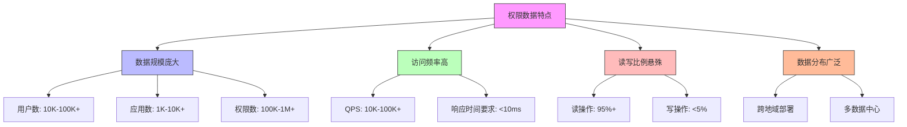

在大规模分布式系统中，权限管理面临着前所未有的挑战。随着用户数量、应用系统和权限策略的急剧增长，如何在保证系统高性能的同时确保权限数据的一致性，成为统一身份治理平台设计中的关键问题。本文将深入探讨大规模分布式系统下的权限缓存策略与一致性保障机制。

## 引言

在企业级统一身份治理平台中，权限验证是一个高频操作。每次用户访问受保护资源时，系统都需要进行权限检查。在小规模部署中，直接查询数据库可能已经足够。但当系统扩展到支持数万用户、数千应用、数十万权限时，直接查询数据库会导致严重的性能瓶颈。因此，合理的缓存策略和一致性保障机制成为系统设计的核心。

## 权限缓存的挑战

### 数据规模与访问模式

在大规模系统中，权限数据具有以下特点：



### 一致性与性能的平衡

权限缓存需要在一致性和性能之间找到平衡点：

1. **强一致性**：每次权限变更都立即同步到所有缓存节点，保证数据一致性，但会影响写入性能
2. **最终一致性**：允许短暂的数据不一致，通过异步同步机制保证最终一致性，提升整体性能
3. **读写分离**：读操作从缓存获取，写操作直接更新数据库并通过事件机制更新缓存

## 缓存架构设计

### 多层缓存策略

```java
public class PermissionCachingSystem {
    private final L1Cache localCache;        // 本地缓存（应用节点级别）
    private final L2Cache distributedCache;  // 分布式缓存（集群级别）
    private final Database database;         // 持久化存储
    
    // 权限查询
    public boolean checkPermission(String userId, String resourceId, String action) {
        // 1. 首先查询本地缓存
        PermissionCheckResult result = localCache.get(buildCacheKey(userId, resourceId, action));
        if (result != null) {
            return result.isAllowed();
        }
        
        // 2. 查询分布式缓存
        result = distributedCache.get(buildCacheKey(userId, resourceId, action));
        if (result != null) {
            // 放入本地缓存
            localCache.put(buildCacheKey(userId, resourceId, action), result);
            return result.isAllowed();
        }
        
        // 3. 查询数据库
        result = database.checkPermission(userId, resourceId, action);
        
        // 放入分布式缓存和本地缓存
        distributedCache.put(buildCacheKey(userId, resourceId, action), result);
        localCache.put(buildCacheKey(userId, resourceId, action), result);
        
        return result.isAllowed();
    }
    
    // 权限变更
    public void updatePermission(String userId, String resourceId, String action, boolean allowed) {
        // 1. 更新数据库
        database.updatePermission(userId, resourceId, action, allowed);
        
        // 2. 发布权限变更事件
        PermissionChangeEvent event = new PermissionChangeEvent(userId, resourceId, action, allowed);
        eventPublisher.publish(event);
        
        // 3. 清除缓存（异步）
        cacheInvalidator.invalidate(buildCacheKey(userId, resourceId, action));
    }
}
```

### 缓存键设计

合理的缓存键设计对于缓存效率至关重要：

```python
class CacheKeyGenerator:
    def __init__(self):
        self.prefix = "perm"
        self.version = "v1"
    
    def generate_user_permissions_key(self, user_id):
        """生成用户所有权限的缓存键"""
        return f"{self.prefix}:{self.version}:user:{user_id}:permissions"
    
    def generate_resource_permissions_key(self, resource_id):
        """生成资源所有权限的缓存键"""
        return f"{self.prefix}:{self.version}:resource:{resource_id}:permissions"
    
    def generate_permission_check_key(self, user_id, resource_id, action):
        """生成权限检查的缓存键"""
        # 使用哈希缩短键长度
        user_hash = self._hash_id(user_id)
        resource_hash = self._hash_id(resource_id)
        return f"{self.prefix}:{self.version}:check:{user_hash}:{resource_hash}:{action}"
    
    def generate_user_role_key(self, user_id):
        """生成用户角色的缓存键"""
        return f"{self.prefix}:{self.version}:user:{user_id}:roles"
    
    def _hash_id(self, id_string):
        """对ID进行哈希处理以缩短缓存键长度"""
        import hashlib
        return hashlib.md5(id_string.encode()).hexdigest()[:8]
```

## 一致性保障机制

### 基于事件的缓存更新

```sql
-- 权限变更事件表
CREATE TABLE permission_change_events (
    id VARCHAR(50) PRIMARY KEY,
    user_id VARCHAR(50) NOT NULL,
    resource_id VARCHAR(50),
    action VARCHAR(50),
    permission_type VARCHAR(20) NOT NULL,  -- GRANT, REVOKE, MODIFY
    old_value JSON,
    new_value JSON,
    created_at TIMESTAMP DEFAULT CURRENT_TIMESTAMP,
    processed BOOLEAN DEFAULT FALSE,
    processed_at TIMESTAMP NULL,
    
    INDEX idx_user_id (user_id),
    INDEX idx_resource_id (resource_id),
    INDEX idx_created_at (created_at),
    INDEX idx_processed (processed)
);

-- 缓存同步状态表
CREATE TABLE cache_sync_status (
    cache_node_id VARCHAR(50) NOT NULL,
    last_sync_event_id VARCHAR(50),
    last_sync_time TIMESTAMP DEFAULT CURRENT_TIMESTAMP ON UPDATE CURRENT_TIMESTAMP,
    sync_status VARCHAR(20) DEFAULT 'SYNCED',  -- SYNCED, SYNCING, ERROR
    error_message TEXT,
    
    PRIMARY KEY (cache_node_id),
    INDEX idx_last_sync_time (last_sync_time)
);
```

```javascript
// 缓存同步服务
class CacheSyncService {
  constructor(eventStore, cacheManager) {
    this.eventStore = eventStore;
    this.cacheManager = cacheManager;
    this.syncInterval = 1000; // 1秒同步间隔
  }
  
  // 启动同步服务
  startSync() {
    setInterval(async () => {
      try {
        await this.syncCache();
      } catch (error) {
        console.error('缓存同步失败:', error);
      }
    }, this.syncInterval);
  }
  
  // 同步缓存
  async syncCache() {
    // 获取未处理的权限变更事件
    const events = await this.eventStore.getUnprocessedEvents(100);
    
    if (events.length === 0) {
      return;
    }
    
    // 批量处理事件
    for (const event of events) {
      try {
        await this.processEvent(event);
        await this.eventStore.markAsProcessed(event.id);
      } catch (error) {
        console.error(`处理事件 ${event.id} 失败:`, error);
        await this.eventStore.markAsError(event.id, error.message);
      }
    }
  }
  
  // 处理单个事件
  async processEvent(event) {
    switch (event.permissionType) {
      case 'GRANT':
        await this.handleGrantEvent(event);
        break;
      case 'REVOKE':
        await this.handleRevokeEvent(event);
        break;
      case 'MODIFY':
        await this.handleModifyEvent(event);
        break;
    }
  }
  
  // 处理授权事件
  async handleGrantEvent(event) {
    // 更新缓存
    const cacheKey = this.generateCacheKey(event.userId, event.resourceId, event.action);
    const permissionResult = {
      allowed: true,
      grantedAt: event.createdAt,
      eventType: 'GRANT'
    };
    
    await this.cacheManager.set(cacheKey, permissionResult);
    
    // 如果是用户级别的变更，还需要更新用户权限集合缓存
    if (!event.resourceId) {
      await this.invalidateUserPermissionsCache(event.userId);
    }
  }
  
  // 处理撤销事件
  async handleRevokeEvent(event) {
    const cacheKey = this.generateCacheKey(event.userId, event.resourceId, event.action);
    
    // 删除缓存项
    await this.cacheManager.delete(cacheKey);
    
    // 如果是用户级别的变更，还需要更新用户权限集合缓存
    if (!event.resourceId) {
      await this.invalidateUserPermissionsCache(event.userId);
    }
  }
  
  // 生成缓存键
  generateCacheKey(userId, resourceId, action) {
    return `perm:v1:check:${this.hashId(userId)}:${this.hashId(resourceId)}:${action}`;
  }
  
  // 哈希ID
  hashId(id) {
    return require('crypto').createHash('md5').update(id).digest('hex').substring(0, 8);
  }
}
```

### 版本控制机制

```java
public class VersionedPermissionCache {
    private final Cache<String, VersionedPermission> cache;
    private final AtomicLong versionCounter = new AtomicLong(0);
    
    // 带版本的权限数据
    public static class VersionedPermission {
        private final PermissionCheckResult result;
        private final long version;
        private final long timestamp;
        
        public VersionedPermission(PermissionCheckResult result, long version) {
            this.result = result;
            this.version = version;
            this.timestamp = System.currentTimeMillis();
        }
        
        // getters...
    }
    
    // 获取权限（带版本检查）
    public PermissionCheckResult getPermission(String key, long expectedVersion) {
        VersionedPermission cached = cache.getIfPresent(key);
        if (cached != null) {
            // 检查版本是否匹配
            if (cached.getVersion() >= expectedVersion) {
                return cached.getResult();
            }
        }
        return null;
    }
    
    // 更新权限（增加版本号）
    public void updatePermission(String key, PermissionCheckResult result) {
        long newVersion = versionCounter.incrementAndGet();
        VersionedPermission versioned = new VersionedPermission(result, newVersion);
        cache.put(key, versioned);
    }
    
    // 获取当前版本号
    public long getCurrentVersion() {
        return versionCounter.get();
    }
}
```

## 性能优化策略

### 缓存预热机制

```python
class CacheWarmupService:
    def __init__(self, permission_service, cache_manager):
        self.permission_service = permission_service
        self.cache_manager = cache_manager
    
    async def warmup_cache(self, strategy='smart'):
        """缓存预热"""
        if strategy == 'smart':
            await self._smart_warmup()
        elif strategy == 'full':
            await self._full_warmup()
        elif strategy == 'incremental':
            await self._incremental_warmup()
    
    async def _smart_warmup(self):
        """智能预热：基于历史访问数据"""
        # 获取热点用户和资源
        hot_users = await self.permission_service.get_hot_users(limit=1000)
        hot_resources = await self.permission_service.get_hot_resources(limit=1000)
        
        # 预热热点用户的权限数据
        for user_id in hot_users:
            await self._warmup_user_permissions(user_id)
        
        # 预热热点资源的权限数据
        for resource_id in hot_resources:
            await self._warmup_resource_permissions(resource_id)
    
    async def _warmup_user_permissions(self, user_id):
        """预热用户权限"""
        try:
            # 获取用户所有权限
            permissions = await self.permission_service.get_user_permissions(user_id)
            
            # 批量放入缓存
            cache_items = []
            for perm in permissions:
                cache_key = self._generate_cache_key(user_id, perm.resource_id, perm.action)
                cache_items.append((cache_key, {
                    'allowed': perm.allowed,
                    'granted_at': perm.granted_at,
                    'expires_at': perm.expires_at
                }))
            
            await self.cache_manager.batch_set(cache_items)
            
        except Exception as e:
            print(f"预热用户 {user_id} 权限失败: {e}")
    
    def _generate_cache_key(self, user_id, resource_id, action):
        """生成缓存键"""
        user_hash = self._hash_id(user_id)
        resource_hash = self._hash_id(resource_id)
        return f"perm:v1:check:{user_hash}:{resource_hash}:{action}"
    
    def _hash_id(self, id_string):
        """哈希ID"""
        import hashlib
        return hashlib.md5(id_string.encode()).hexdigest()[:8]
```

### 缓存淘汰策略

```sql
-- 缓存统计信息表
CREATE TABLE cache_statistics (
    cache_key VARCHAR(255) PRIMARY KEY,
    hit_count INT DEFAULT 0,
    miss_count INT DEFAULT 0,
    last_accessed TIMESTAMP DEFAULT CURRENT_TIMESTAMP ON UPDATE CURRENT_TIMESTAMP,
    created_at TIMESTAMP DEFAULT CURRENT_TIMESTAMP,
    size_bytes INT DEFAULT 0,
    access_pattern VARCHAR(50),  -- HOT, WARM, COLD
    
    INDEX idx_last_accessed (last_accessed),
    INDEX idx_hit_count (hit_count),
    INDEX idx_access_pattern (access_pattern)
);

-- 创建缓存淘汰视图
CREATE VIEW cache_eviction_candidates AS
SELECT 
    cache_key,
    hit_count,
    miss_count,
    last_accessed,
    size_bytes,
    CASE 
        WHEN hit_count = 0 AND miss_count > 10 THEN 'COLD'
        WHEN TIMESTAMPDIFF(HOUR, last_accessed, NOW()) > 24 THEN 'STALE'
        WHEN hit_count / (hit_count + miss_count + 1.0) < 0.1 THEN 'LOW_HIT_RATIO'
        ELSE 'NORMAL'
    END as eviction_priority
FROM cache_statistics
WHERE access_pattern != 'HOT'
ORDER BY 
    CASE 
        WHEN TIMESTAMPDIFF(HOUR, last_accessed, NOW()) > 24 THEN 1
        WHEN hit_count / (hit_count + miss_count + 1.0) < 0.1 THEN 2
        WHEN hit_count = 0 AND miss_count > 10 THEN 3
        ELSE 4
    END,
    last_accessed ASC;
```

## 监控与告警

### 缓存指标监控

```java
public class CacheMetricsCollector {
    private final MeterRegistry meterRegistry;
    private final Cache<String, PermissionCheckResult> cache;
    
    // 缓存指标
    private final Counter cacheHits;
    private final Counter cacheMisses;
    private final Timer cacheLoadTimer;
    private final Gauge cacheSize;
    private final Gauge cacheHitRatio;
    
    public CacheMetricsCollector(MeterRegistry meterRegistry, Cache<String, PermissionCheckResult> cache) {
        this.meterRegistry = meterRegistry;
        this.cache = cache;
        
        // 初始化指标
        this.cacheHits = Counter.builder("permission.cache.hits")
                .description("权限缓存命中次数")
                .register(meterRegistry);
                
        this.cacheMisses = Counter.builder("permission.cache.misses")
                .description("权限缓存未命中次数")
                .register(meterRegistry);
                
        this.cacheLoadTimer = Timer.builder("permission.cache.load.time")
                .description("权限缓存加载时间")
                .register(meterRegistry);
                
        this.cacheSize = Gauge.builder("permission.cache.size")
                .description("权限缓存大小")
                .register(meterRegistry, cache, c -> c.estimatedSize());
                
        this.cacheHitRatio = Gauge.builder("permission.cache.hit.ratio")
                .description("权限缓存命中率")
                .register(meterRegistry, this, CacheMetricsCollector::calculateHitRatio);
    }
    
    // 记录缓存命中
    public void recordCacheHit() {
        cacheHits.increment();
    }
    
    // 记录缓存未命中
    public void recordCacheMiss() {
        cacheMisses.increment();
    }
    
    // 记录缓存加载时间
    public void recordCacheLoad(long duration, TimeUnit unit) {
        cacheLoadTimer.record(duration, unit);
    }
    
    // 计算命中率
    private double calculateHitRatio() {
        long hits = (long) cacheHits.count();
        long misses = (long) cacheMisses.count();
        long total = hits + misses;
        return total > 0 ? (double) hits / total : 0.0;
    }
}
```

## 总结

在大规模分布式系统中，权限缓存与一致性是一个复杂的工程问题，需要综合考虑性能、一致性、可维护性等多个方面。通过合理的多层缓存架构、基于事件的一致性保障机制、智能的缓存预热策略以及完善的监控告警体系，可以构建一个高性能、高可用的权限缓存系统。

关键要点包括：

1. **分层缓存设计**：本地缓存+分布式缓存的组合，平衡访问速度和一致性
2. **事件驱动的一致性**：通过事件机制实现缓存的异步更新，保证最终一致性
3. **智能预热策略**：基于历史访问数据进行缓存预热，提升缓存命中率
4. **完善的监控体系**：实时监控缓存性能指标，及时发现和解决问题

在后续章节中，我们将继续探讨海量权限数据的性能优化策略，为构建企业级统一身份治理平台提供全面的技术指导。