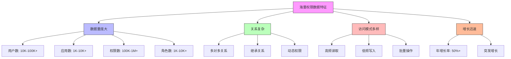

在企业级统一身份治理平台中，随着业务规模的不断扩大，权限数据量往往会呈现指数级增长。从数百个用户、数千个权限到数万个用户、数十万个权限，数据量的增加不仅对存储系统提出了更高要求，也对查询性能、系统响应时间带来了严峻挑战。本文将深入探讨处理海量权限数据时的性能优化策略和技术实践。

## 引言

权限数据是统一身份治理平台的核心资产，其规模往往随着企业的发展而快速增长。在大型企业中，一个典型的权限系统可能需要管理：

- 数万到数十万的用户账户
- 数千到数万个应用系统
- 数十万到数百万的权限策略
- 复杂的角色继承关系和权限继承链

面对如此庞大的数据量，传统的数据处理方式已无法满足性能要求。如何在保证数据一致性和安全性的前提下，实现高效的权限查询和管理，成为系统架构设计的关键挑战。

## 海量权限数据的特征

### 数据规模特征



### 访问模式分析

在海量权限数据场景下，系统的访问模式具有以下特点：

1. **读多写少**：权限查询操作远多于权限变更操作，读写比例通常在95:5以上
2. **热点集中**：部分用户和资源的访问频率远高于其他数据
3. **批量处理**：权限导入、角色分配等操作通常以批量方式进行
4. **实时性要求**：权限变更需要在较短时间内生效

## 数据库层面优化

### 表结构设计优化

```sql
-- 优化前的权限表设计
CREATE TABLE permissions (
    id VARCHAR(50) PRIMARY KEY,
    user_id VARCHAR(50) NOT NULL,
    resource_id VARCHAR(50) NOT NULL,
    action VARCHAR(50) NOT NULL,
    effect VARCHAR(10) NOT NULL,  -- ALLOW/DENY
    created_at TIMESTAMP DEFAULT CURRENT_TIMESTAMP,
    updated_at TIMESTAMP DEFAULT CURRENT_TIMESTAMP ON UPDATE CURRENT_TIMESTAMP,
    
    INDEX idx_user_id (user_id),
    INDEX idx_resource_id (resource_id),
    INDEX idx_action (action)
);

-- 优化后的权限表设计
CREATE TABLE permissions_optimized (
    id VARCHAR(50) PRIMARY KEY,
    user_id_hash CHAR(8) NOT NULL,     -- 用户ID哈希值，用于索引优化
    resource_id_hash CHAR(8) NOT NULL, -- 资源ID哈希值，用于索引优化
    user_id VARCHAR(50) NOT NULL,      -- 原始用户ID
    resource_id VARCHAR(50) NOT NULL,  -- 原始资源ID
    action VARCHAR(50) NOT NULL,
    effect TINYINT NOT NULL,           -- 1: ALLOW, 0: DENY，使用数字减少存储
    priority SMALLINT DEFAULT 0,       -- 权限优先级
    expires_at TIMESTAMP NULL,         -- 过期时间
    created_at TIMESTAMP DEFAULT CURRENT_TIMESTAMP,
    updated_at TIMESTAMP DEFAULT CURRENT_TIMESTAMP ON UPDATE CURRENT_TIMESTAMP,
    
    -- 复合索引优化查询性能
    INDEX idx_user_resource_action (user_id_hash, resource_id_hash, action),
    INDEX idx_resource_user_action (resource_id_hash, user_id_hash, action),
    INDEX idx_user_effect_expires (user_id_hash, effect, expires_at),
    INDEX idx_expires (expires_at),
    INDEX idx_priority (priority),
    
    -- 分区键（按用户ID哈希分区）
    PARTITION BY HASH(user_id_hash) PARTITIONS 16
);

-- 角色权限关联表优化
CREATE TABLE role_permissions_optimized (
    id VARCHAR(50) PRIMARY KEY,
    role_id_hash CHAR(8) NOT NULL,
    permission_id_hash CHAR(8) NOT NULL,
    role_id VARCHAR(50) NOT NULL,
    permission_id VARCHAR(50) NOT NULL,
    granted_at TIMESTAMP DEFAULT CURRENT_TIMESTAMP,
    revoked_at TIMESTAMP NULL,
    is_active BOOLEAN DEFAULT TRUE,
    
    INDEX idx_role_permission (role_id_hash, permission_id_hash),
    INDEX idx_permission_role (permission_id_hash, role_id_hash),
    INDEX idx_role_active (role_id_hash, is_active),
    INDEX idx_granted_at (granted_at),
    
    PARTITION BY HASH(role_id_hash) PARTITIONS 8
);
```

### 查询优化策略

```java
public class PermissionQueryOptimizer {
    private final JdbcTemplate jdbcTemplate;
    private final PermissionCache cache;
    
    // 优化的权限检查查询
    public boolean checkPermissionOptimized(String userId, String resourceId, String action) {
        // 1. 先查询缓存
        String cacheKey = generateCacheKey(userId, resourceId, action);
        Boolean cachedResult = cache.get(cacheKey);
        if (cachedResult != null) {
            return cachedResult;
        }
        
        // 2. 构建优化的SQL查询
        String sql = """
            SELECT p.effect 
            FROM permissions_optimized p 
            WHERE p.user_id_hash = ? 
              AND p.resource_id_hash = ? 
              AND p.action = ? 
              AND (p.expires_at IS NULL OR p.expires_at > NOW())
            ORDER BY p.priority DESC, p.created_at DESC 
            LIMIT 1
            """;
        
        String userIdHash = hashId(userId);
        String resourceIdHash = hashId(resourceId);
        
        List<Integer> results = jdbcTemplate.queryForList(
            sql, 
            Integer.class, 
            userIdHash, 
            resourceIdHash, 
            action
        );
        
        boolean allowed = !results.isEmpty() && results.get(0) == 1;
        
        // 3. 缓存结果
        cache.put(cacheKey, allowed);
        
        return allowed;
    }
    
    // 批量权限检查优化
    public Map<PermissionCheckKey, Boolean> batchCheckPermissions(
            List<PermissionCheckRequest> requests) {
        
        // 1. 按用户分组，减少查询次数
        Map<String, List<PermissionCheckRequest>> groupedByUser = 
            requests.stream().collect(Collectors.groupingBy(PermissionCheckRequest::getUserId));
        
        Map<PermissionCheckKey, Boolean> results = new HashMap<>();
        
        // 2. 批量查询每个用户的权限
        for (Map.Entry<String, List<PermissionCheckRequest>> entry : groupedByUser.entrySet()) {
            String userId = entry.getKey();
            List<PermissionCheckRequest> userRequests = entry.getValue();
            
            // 构建批量查询SQL
            String sql = buildBatchQuery(userId, userRequests);
            
            List<Map<String, Object>> queryResults = jdbcTemplate.queryForList(sql);
            
            // 处理查询结果
            for (Map<String, Object> row : queryResults) {
                String resourceId = (String) row.get("resource_id");
                String action = (String) row.get("action");
                int effect = (Integer) row.get("effect");
                
                PermissionCheckKey key = new PermissionCheckKey(userId, resourceId, action);
                results.put(key, effect == 1);
            }
        }
        
        return results;
    }
    
    private String buildBatchQuery(String userId, List<PermissionCheckRequest> requests) {
        String userIdHash = hashId(userId);
        
        // 构建资源和操作条件
        StringBuilder resourceConditions = new StringBuilder();
        for (int i = 0; i < requests.size(); i++) {
            if (i > 0) resourceConditions.append(" OR ");
            PermissionCheckRequest request = requests.get(i);
            String resourceIdHash = hashId(request.getResourceId());
            resourceConditions.append(
                String.format("(p.resource_id_hash = '%s' AND p.action = '%s')", 
                             resourceIdHash, request.getAction())
            );
        }
        
        return String.format("""
            SELECT p.resource_id, p.action, p.effect
            FROM permissions_optimized p
            WHERE p.user_id_hash = '%s'
              AND (%s)
              AND (p.expires_at IS NULL OR p.expires_at > NOW())
            ORDER BY p.priority DESC, p.created_at DESC
            """, userIdHash, resourceConditions.toString());
    }
    
    private String hashId(String id) {
        return DigestUtils.md5Hex(id).substring(0, 8);
    }
}
```

## 索引策略优化

### 复合索引设计

```sql
-- 权限表的复合索引策略
-- 1. 用户-资源-操作索引：用于用户权限检查
CREATE INDEX idx_user_resource_action ON permissions_optimized 
(user_id_hash, resource_id_hash, action, effect);

-- 2. 资源-用户-操作索引：用于资源访问控制
CREATE INDEX idx_resource_user_action ON permissions_optimized 
(resource_id_hash, user_id_hash, action, effect);

-- 3. 用户-效果-过期时间索引：用于用户权限清理
CREATE INDEX idx_user_effect_expires ON permissions_optimized 
(user_id_hash, effect, expires_at);

-- 4. 优先级索引：用于权限优先级排序
CREATE INDEX idx_priority_created ON permissions_optimized 
(priority DESC, created_at DESC);

-- 5. 过期时间索引：用于定时清理过期权限
CREATE INDEX idx_expires ON permissions_optimized (expires_at);

-- 角色表的索引优化
CREATE INDEX idx_role_name_active ON roles_optimized 
(role_name_hash, is_active, organization_id_hash);

-- 用户角色关联表索引
CREATE INDEX idx_user_role_active ON user_roles_optimized 
(user_id_hash, role_id_hash, is_active, granted_at);
```

### 分区策略

```sql
-- 按用户ID哈希分区
ALTER TABLE permissions_optimized 
PARTITION BY HASH(user_id_hash) PARTITIONS 16;

-- 按时间范围分区（适用于审计日志等）
ALTER TABLE permission_audit_logs 
PARTITION BY RANGE (YEAR(created_at)) (
    PARTITION p2023 VALUES LESS THAN (2024),
    PARTITION p2024 VALUES LESS THAN (2025),
    PARTITION p2025 VALUES LESS THAN (2026),
    PARTITION p_future VALUES LESS THAN MAXVALUE
);

-- 按组织ID分区（适用于多租户场景）
ALTER TABLE permissions_optimized 
PARTITION BY HASH(organization_id_hash) PARTITIONS 8;
```

## 应用层优化策略

### 权限预计算

```python
class PermissionPrecomputer:
    def __init__(self, db_connection, cache_manager):
        self.db = db_connection
        self.cache = cache_manager
        self.batch_size = 1000
    
    async def precompute_user_permissions(self, user_id):
        """预计算用户权限"""
        # 1. 获取用户直接权限
        direct_permissions = await self._get_user_direct_permissions(user_id)
        
        # 2. 获取用户角色权限
        role_permissions = await self._get_user_role_permissions(user_id)
        
        # 3. 获取用户组权限
        group_permissions = await self._get_user_group_permissions(user_id)
        
        # 4. 合并权限（处理冲突和优先级）
        merged_permissions = self._merge_permissions([
            direct_permissions,
            role_permissions,
            group_permissions
        ])
        
        # 5. 缓存计算结果
        cache_key = f"user_permissions:{user_id}"
        await self.cache.set(cache_key, merged_permissions, expire=3600)  # 1小时过期
        
        return merged_permissions
    
    async def batch_precompute_permissions(self, user_ids):
        """批量预计算用户权限"""
        # 分批处理，避免内存溢出
        for i in range(0, len(user_ids), self.batch_size):
            batch = user_ids[i:i + self.batch_size]
            tasks = [self.precompute_user_permissions(user_id) for user_id in batch]
            await asyncio.gather(*tasks)
    
    async def _get_user_direct_permissions(self, user_id):
        """获取用户直接权限"""
        query = """
        SELECT resource_id, action, effect, priority, expires_at
        FROM permissions_optimized
        WHERE user_id_hash = %s
          AND (expires_at IS NULL OR expires_at > NOW())
        """
        user_id_hash = self._hash_id(user_id)
        results = await self.db.fetch_all(query, user_id_hash)
        return [self._row_to_permission(row) for row in results]
    
    async def _get_user_role_permissions(self, user_id):
        """获取用户角色权限"""
        query = """
        SELECT DISTINCT p.resource_id, p.action, p.effect, p.priority, p.expires_at
        FROM user_roles_optimized ur
        JOIN role_permissions_optimized rp ON ur.role_id_hash = rp.role_id_hash
        JOIN permissions_optimized p ON rp.permission_id_hash = p.permission_id_hash
        WHERE ur.user_id_hash = %s
          AND ur.is_active = TRUE
          AND rp.is_active = TRUE
          AND (p.expires_at IS NULL OR p.expires_at > NOW())
        """
        user_id_hash = self._hash_id(user_id)
        results = await self.db.fetch_all(query, user_id_hash)
        return [self._row_to_permission(row) for row in results]
    
    def _merge_permissions(self, permission_lists):
        """合并权限列表，处理优先级和冲突"""
        # 按资源和操作分组
        permission_map = {}
        
        for permissions in permission_lists:
            for perm in permissions:
                key = f"{perm.resource_id}:{perm.action}"
                if key not in permission_map or perm.priority > permission_map[key].priority:
                    permission_map[key] = perm
        
        return list(permission_map.values())
    
    def _hash_id(self, id_string):
        """哈希ID"""
        import hashlib
        return hashlib.md5(id_string.encode()).hexdigest()[:8]
    
    def _row_to_permission(self, row):
        """将数据库行转换为权限对象"""
        return Permission(
            resource_id=row['resource_id'],
            action=row['action'],
            effect=row['effect'] == 1,
            priority=row['priority'],
            expires_at=row['expires_at']
        )
```

### 异步处理与批处理

```javascript
// 权限变更异步处理系统
class AsyncPermissionProcessor {
  constructor(messageQueue, database, cacheManager) {
    this.queue = messageQueue;
    this.db = database;
    this.cache = cacheManager;
    this.batchSize = 100;
    this.processInterval = 1000; // 1秒处理间隔
  }
  
  // 启动异步处理器
  startProcessing() {
    setInterval(async () => {
      try {
        await this.processPermissionChanges();
      } catch (error) {
        console.error('权限变更处理失败:', error);
      }
    }, this.processInterval);
  }
  
  // 处理权限变更
  async processPermissionChanges() {
    // 从队列中获取批量权限变更消息
    const messages = await this.queue.receiveMessages(this.batchSize);
    
    if (messages.length === 0) {
      return;
    }
    
    // 按用户分组处理
    const groupedByUser = this._groupByUser(messages);
    
    // 并行处理每个用户的权限变更
    const processPromises = Object.entries(groupedByUser).map(
      ([userId, userMessages]) => this._processUserPermissions(userId, userMessages)
    );
    
    await Promise.all(processPromises);
    
    // 确认消息处理完成
    await this.queue.acknowledgeMessages(messages);
  }
  
  // 处理单个用户的权限变更
  async _processUserPermissions(userId, messages) {
    try {
      // 1. 批量更新数据库
      await this._batchUpdateDatabase(messages);
      
      // 2. 使用户权限缓存失效
      const userCacheKey = `user_permissions:${userId}`;
      await this.cache.delete(userCacheKey);
      
      // 3. 更新相关资源的缓存
      const affectedResources = this._extractAffectedResources(messages);
      for (const resourceId of affectedResources) {
        const resourceCacheKey = `resource_permissions:${resourceId}`;
        await this.cache.delete(resourceCacheKey);
      }
      
      console.log(`成功处理用户 ${userId} 的 ${messages.length} 个权限变更`);
    } catch (error) {
      console.error(`处理用户 ${userId} 权限变更失败:`, error);
      // 将失败的消息重新入队
      await this.queue.requeueMessages(messages);
    }
  }
  
  // 批量更新数据库
  async _batchUpdateDatabase(messages) {
    const sql = `
      INSERT INTO permissions_optimized 
      (id, user_id_hash, resource_id_hash, user_id, resource_id, action, effect, priority, expires_at)
      VALUES ?
      ON DUPLICATE KEY UPDATE
      effect = VALUES(effect),
      priority = VALUES(priority),
      expires_at = VALUES(expires_at),
      updated_at = CURRENT_TIMESTAMP
    `;
    
    const values = messages.map(msg => [
      msg.permissionId,
      this._hashId(msg.userId),
      this._hashId(msg.resourceId),
      msg.userId,
      msg.resourceId,
      msg.action,
      msg.effect ? 1 : 0,
      msg.priority || 0,
      msg.expiresAt || null
    ]);
    
    await this.db.query(sql, [values]);
  }
  
  // 按用户分组消息
  _groupByUser(messages) {
    const grouped = {};
    for (const message of messages) {
      if (!grouped[message.userId]) {
        grouped[message.userId] = [];
      }
      grouped[message.userId].push(message);
    }
    return grouped;
  }
  
  // 提取受影响的资源
  _extractAffectedResources(messages) {
    const resources = new Set();
    for (const message of messages) {
      resources.add(message.resourceId);
    }
    return Array.from(resources);
  }
  
  // 哈希ID
  _hashId(id) {
    return require('crypto').createHash('md5').update(id).digest('hex').substring(0, 8);
  }
}
```

## 内存与计算优化

### 权限数据结构优化

```java
public class OptimizedPermissionDataStructure {
    
    // 使用位图优化权限存储
    public static class PermissionBitmap {
        private final BitSet allowBitmap;
        private final BitSet denyBitmap;
        private final Map<Integer, String> resourceIdMap;
        private final Map<Integer, String> actionMap;
        
        public PermissionBitmap() {
            this.allowBitmap = new BitSet();
            this.denyBitmap = new BitSet();
            this.resourceIdMap = new HashMap<>();
            this.actionMap = new HashMap<>();
        }
        
        // 添加权限
        public void addPermission(String resourceId, String action, boolean allow) {
            int resourceIndex = getResourceIndex(resourceId);
            int actionIndex = getActionIndex(action);
            int bitPosition = (resourceIndex << 16) | actionIndex;
            
            if (allow) {
                allowBitmap.set(bitPosition);
                denyBitmap.clear(bitPosition);
            } else {
                denyBitmap.set(bitPosition);
                allowBitmap.clear(bitPosition);
            }
        }
        
        // 检查权限
        public boolean checkPermission(String resourceId, String action) {
            int resourceIndex = getResourceIndex(resourceId);
            int actionIndex = getActionIndex(action);
            int bitPosition = (resourceIndex << 16) | actionIndex;
            
            // DENY优先级更高
            if (denyBitmap.get(bitPosition)) {
                return false;
            }
            
            return allowBitmap.get(bitPosition);
        }
        
        private int getResourceIndex(String resourceId) {
            return resourceIdMap.computeIfAbsent(resourceId, 
                k -> resourceIdMap.size());
        }
        
        private int getActionIndex(String action) {
            return actionMap.computeIfAbsent(action, 
                k -> actionMap.size());
        }
    }
    
    // 使用前缀树优化资源路径匹配
    public static class ResourceTrieNode {
        private Map<String, ResourceTrieNode> children;
        private Set<String> permissions;
        private boolean isEnd;
        
        public ResourceTrieNode() {
            this.children = new HashMap<>();
            this.permissions = new HashSet<>();
        }
        
        // 插入资源路径
        public void insert(String path, String permission) {
            ResourceTrieNode node = this;
            String[] parts = path.split("/");
            
            for (String part : parts) {
                node.children.putIfAbsent(part, new ResourceTrieNode());
                node = node.children.get(part);
            }
            
            node.isEnd = true;
            node.permissions.add(permission);
        }
        
        // 匹配资源路径
        public Set<String> match(String path) {
            ResourceTrieNode node = this;
            String[] parts = path.split("/");
            Set<String> result = new HashSet<>();
            
            // 精确匹配
            for (String part : parts) {
                if (!node.children.containsKey(part)) {
                    break;
                }
                node = node.children.get(part);
                result.addAll(node.permissions);
            }
            
            // 通配符匹配
            matchWildcard(this, path, result);
            
            return result;
        }
        
        private void matchWildcard(ResourceTrieNode node, String path, Set<String> result) {
            // 实现通配符匹配逻辑
            // 例如匹配 /api/users/* 这样的模式
        }
    }
}
```

## 监控与调优

### 性能指标监控

```sql
-- 权限查询性能统计表
CREATE TABLE permission_query_stats (
    id VARCHAR(50) PRIMARY KEY,
    query_type VARCHAR(50) NOT NULL,  -- SINGLE, BATCH, PRECOMPUTED
    user_count INT DEFAULT 1,
    resource_count INT DEFAULT 1,
    duration_ms INT NOT NULL,
    result_count INT NOT NULL,
    cache_hit BOOLEAN DEFAULT FALSE,
    error_occurred BOOLEAN DEFAULT FALSE,
    error_message TEXT,
    created_at TIMESTAMP DEFAULT CURRENT_TIMESTAMP,
    
    INDEX idx_query_type (query_type),
    INDEX idx_duration (duration_ms),
    INDEX idx_created_at (created_at),
    INDEX idx_cache_hit (cache_hit)
);

-- 创建性能统计视图
CREATE VIEW permission_performance_dashboard AS
SELECT 
    query_type,
    COUNT(*) as total_queries,
    AVG(duration_ms) as avg_duration_ms,
    MAX(duration_ms) as max_duration_ms,
    MIN(duration_ms) as min_duration_ms,
    COUNT(CASE WHEN cache_hit = TRUE THEN 1 END) as cache_hits,
    COUNT(CASE WHEN cache_hit = FALSE THEN 1 END) as cache_misses,
    ROUND(COUNT(CASE WHEN cache_hit = TRUE THEN 1 END) * 100.0 / COUNT(*), 2) as cache_hit_ratio,
    COUNT(CASE WHEN error_occurred = TRUE THEN 1 END) as error_count
FROM permission_query_stats
WHERE created_at > DATE_SUB(NOW(), INTERVAL 1 HOUR)
GROUP BY query_type;
```

```java
public class PermissionPerformanceMonitor {
    private final MeterRegistry meterRegistry;
    private final Database database;
    
    // 性能指标
    private final Timer singlePermissionCheckTimer;
    private final Timer batchPermissionCheckTimer;
    private final Timer precomputeTimer;
    private final Counter cacheHitCounter;
    private final Counter cacheMissCounter;
    private final Counter errorCounter;
    
    public PermissionPerformanceMonitor(MeterRegistry meterRegistry, Database database) {
        this.meterRegistry = meterRegistry;
        this.database = database;
        
        this.singlePermissionCheckTimer = Timer.builder("permission.check.single")
                .description("单个权限检查耗时")
                .register(meterRegistry);
                
        this.batchPermissionCheckTimer = Timer.builder("permission.check.batch")
                .description("批量权限检查耗时")
                .register(meterRegistry);
                
        this.precomputeTimer = Timer.builder("permission.precompute")
                .description("权限预计算耗时")
                .register(meterRegistry);
                
        this.cacheHitCounter = Counter.builder("permission.cache.hit")
                .description("权限缓存命中次数")
                .register(meterRegistry);
                
        this.cacheMissCounter = Counter.builder("permission.cache.miss")
                .description("权限缓存未命中次数")
                .register(meterRegistry);
                
        this.errorCounter = Counter.builder("permission.error")
                .description("权限检查错误次数")
                .register(meterRegistry);
    }
    
    // 记录单个权限检查性能
    public <T> T recordSingleCheck(Supplier<T> operation) {
        return singlePermissionCheckTimer.record(operation);
    }
    
    // 记录批量权限检查性能
    public <T> T recordBatchCheck(Supplier<T> operation) {
        return batchPermissionCheckTimer.record(operation);
    }
    
    // 记录缓存命中
    public void recordCacheHit() {
        cacheHitCounter.increment();
    }
    
    // 记录缓存未命中
    public void recordCacheMiss() {
        cacheMissCounter.increment();
    }
    
    // 记录错误
    public void recordError(String errorType) {
        errorCounter.increment(Tag.of("type", errorType));
    }
    
    // 持久化性能统计数据
    public void persistStats(String queryType, int userCount, int resourceCount, 
                           long durationMs, int resultCount, boolean cacheHit, 
                           boolean errorOccurred, String errorMessage) {
        String sql = """
            INSERT INTO permission_query_stats 
            (id, query_type, user_count, resource_count, duration_ms, result_count, 
             cache_hit, error_occurred, error_message, created_at)
            VALUES (?, ?, ?, ?, ?, ?, ?, ?, ?, NOW())
            """;
            
        database.execute(sql, 
            UUID.randomUUID().toString(),
            queryType,
            userCount,
            resourceCount,
            durationMs,
            resultCount,
            cacheHit,
            errorOccurred,
            errorMessage
        );
    }
}
```

## 总结

处理海量权限数据的性能优化是一个系统工程，需要从数据库设计、查询优化、索引策略、应用层优化、内存结构优化等多个维度综合考虑。通过合理的架构设计和优化策略，可以显著提升系统的性能和可扩展性。

关键要点包括：

1. **数据库优化**：合理的表结构设计、复合索引策略、分区策略
2. **查询优化**：批量查询、预计算、缓存机制
3. **应用层优化**：异步处理、批处理、内存数据结构优化
4. **监控调优**：完善的性能监控体系，持续优化迭代

在后续章节中，我们将继续探讨国际化和本地化的特殊考量，为构建全球化部署的统一身份治理平台提供技术指导。