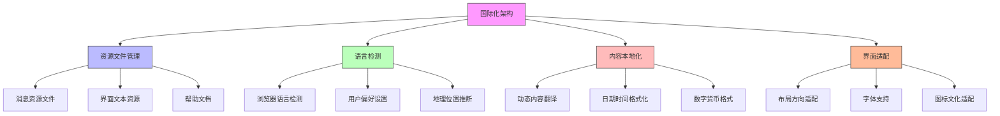

在全球化时代，企业级统一身份治理平台往往需要服务于跨国企业，支持多语言、多时区、多文化背景的用户群体。国际化（Internationalization）和本地化（Localization）不仅仅是简单的语言翻译，更涉及时区处理、文化差异、法律法规遵循等多个维度的复杂考量。本文将深入探讨在构建全球化身份治理平台时需要特别关注的国际化和本地化问题。

## 引言

随着企业业务的全球化扩展，统一身份治理平台面临着前所未有的国际化挑战。一个成功的全球化平台需要能够：

- 支持多种语言界面，满足不同地区用户的使用习惯
- 正确处理全球时区差异，确保时间相关功能的准确性
- 遵循不同国家和地区的法律法规要求
- 适应不同文化背景下的用户交互习惯
- 处理国际化字符集和本地化数据格式

这些要求不仅影响用户体验，更直接关系到平台的合规性和可用性。

## 多语言支持架构

### 国际化架构设计



### 资源文件管理

```java
public class InternationalizationManager {
    private final ResourceBundleService resourceBundleService;
    private final UserPreferenceService userPreferenceService;
    private final LocaleResolver localeResolver;
    
    // 支持的语言列表
    private static final List<Locale> SUPPORTED_LOCALES = Arrays.asList(
        Locale.ENGLISH,
        Locale.SIMPLIFIED_CHINESE,
        Locale.TRADITIONAL_CHINESE,
        Locale.JAPANESE,
        Locale.KOREAN,
        Locale.FRENCH,
        Locale.GERMAN,
        Locale.SPANISH,
        Locale.PORTUGUESE,
        new Locale("ar"),  // 阿拉伯语
        new Locale("ru")   // 俄语
    );
    
    // 获取本地化消息
    public String getLocalizedMessage(String key, Locale locale, Object... params) {
        try {
            // 1. 获取资源包
            ResourceBundle bundle = resourceBundleService.getBundle("messages", locale);
            
            // 2. 获取消息模板
            String messageTemplate = bundle.getString(key);
            
            // 3. 格式化消息
            if (params.length > 0) {
                return MessageFormat.format(messageTemplate, params);
            }
            
            return messageTemplate;
        } catch (MissingResourceException e) {
            // 回退到默认语言
            if (!locale.equals(Locale.ENGLISH)) {
                return getLocalizedMessage(key, Locale.ENGLISH, params);
            }
            // 最后回退到键名
            return key;
        }
    }
    
    // 解析用户语言偏好
    public Locale resolveUserLocale(HttpServletRequest request, String userId) {
        // 1. 检查用户偏好设置
        Locale userPreference = userPreferenceService.getUserLocale(userId);
        if (userPreference != null) {
            return userPreference;
        }
        
        // 2. 解析请求头中的Accept-Language
        Locale requestLocale = localeResolver.resolveLocale(request);
        if (isSupportedLocale(requestLocale)) {
            return requestLocale;
        }
        
        // 3. 根据IP地理位置推断
        Locale geoLocale = localeResolver.resolveLocaleByGeoIP(request);
        if (isSupportedLocale(geoLocale)) {
            return geoLocale;
        }
        
        // 4. 默认返回英语
        return Locale.ENGLISH;
    }
    
    private boolean isSupportedLocale(Locale locale) {
        return SUPPORTED_LOCALES.contains(locale) || 
               SUPPORTED_LOCALES.stream().anyMatch(supported -> 
                   supported.getLanguage().equals(locale.getLanguage()));
    }
}
```

### 资源文件组织

```properties
# messages_en.properties - 英语资源文件
user.management=User Management
user.profile=User Profile
user.settings=User Settings
login.failed=Login failed: {0}
password.expired=Password has expired, please reset your password
account.locked=Account is locked, please contact administrator
mfa.required=Multi-factor authentication is required
permission.denied=Permission denied

# 日期时间格式
datetime.format.full=MMM dd, yyyy HH:mm:ss
datetime.format.short=MMM dd, yyyy
date.format=MM/dd/yyyy
time.format=HH:mm:ss

# 数字格式
number.decimal=.
number.grouping=,
currency.symbol=$

# messages_zh_CN.properties - 简体中文资源文件
user.management=用户管理
user.profile=用户资料
user.settings=用户设置
login.failed=登录失败: {0}
password.expired=密码已过期，请重置密码
account.locked=账户已锁定，请联系管理员
mfa.required=需要多重身份验证
permission.denied=权限被拒绝

# 日期时间格式
datetime.format.full=yyyy年MM月dd日 HH:mm:ss
datetime.format.short=yyyy年MM月dd日
date.format=yyyy-MM-dd
time.format=HH:mm:ss

# 数字格式
number.decimal=.
number.grouping=,
currency.symbol=¥

# messages_ar.properties - 阿拉伯语资源文件
user.management=إدارة المستخدمين
user.profile=ملف المستخدم
user.settings=إعدادات المستخدم
login.failed=فشل تسجيل الدخول: {0}
password.expired=انتهت صلاحية كلمة المرور، يرجى إعادة تعيينها
account.locked=الحساب مغلق، يرجى الاتصال بالمسؤول
mfa.required=مطلوب المصادقة متعددة العوامل
permission.denied=تم رفض الإذن

# 日期时间格式
datetime.format.full=dd/MM/yyyy HH:mm:ss
datetime.format.short=dd/MM/yyyy
date.format=dd/MM/yyyy
time.format=HH:mm:ss

# 数字格式 (阿拉伯语使用阿拉伯数字)
number.decimal=٫
number.grouping=٬
currency.symbol=ر.س
```

## 时区处理策略

### 时区数据存储

```sql
-- 用户时区偏好表
CREATE TABLE user_timezones (
    user_id VARCHAR(50) PRIMARY KEY,
    timezone_id VARCHAR(50) NOT NULL DEFAULT 'UTC',
    auto_detect BOOLEAN DEFAULT TRUE,
    last_detected_ip VARCHAR(45),
    detected_at TIMESTAMP NULL,
    manually_set BOOLEAN DEFAULT FALSE,
    set_at TIMESTAMP NULL,
    
    FOREIGN KEY (user_id) REFERENCES users(id),
    INDEX idx_timezone_id (timezone_id)
);

-- 时区转换视图
CREATE VIEW user_local_times AS
SELECT 
    u.id as user_id,
    u.username,
    ut.timezone_id,
    CONVERT_TZ(NOW(), 'UTC', ut.timezone_id) as local_time,
    CONVERT_TZ(u.created_at, 'UTC', ut.timezone_id) as local_created_at,
    CONVERT_TZ(u.last_login, 'UTC', ut.timezone_id) as local_last_login
FROM users u
JOIN user_timezones ut ON u.id = ut.user_id;

-- 审计日志时区处理
CREATE TABLE audit_logs_tz (
    id VARCHAR(50) PRIMARY KEY,
    event_time_utc TIMESTAMP NOT NULL,
    event_time_local TIMESTAMP GENERATED ALWAYS AS (
        CONVERT_TZ(event_time_utc, 'UTC', user_timezone)
    ) STORED,
    user_id VARCHAR(50),
    user_timezone VARCHAR(50) NOT NULL DEFAULT 'UTC',
    action VARCHAR(100) NOT NULL,
    resource_type VARCHAR(50),
    resource_id VARCHAR(50),
    details JSON,
    
    INDEX idx_event_time_utc (event_time_utc),
    INDEX idx_user_id (user_id),
    INDEX idx_user_timezone (user_timezone)
);
```

### 时区处理服务

```python
class TimezoneService:
    def __init__(self, database):
        self.db = database
        self.default_timezone = 'UTC'
    
    def get_user_timezone(self, user_id):
        """获取用户时区"""
        query = """
        SELECT timezone_id FROM user_timezones 
        WHERE user_id = %s
        """
        result = self.db.fetch_one(query, user_id)
        return result['timezone_id'] if result else self.default_timezone
    
    def set_user_timezone(self, user_id, timezone_id, auto_detect=False):
        """设置用户时区"""
        # 验证时区ID有效性
        if not self._is_valid_timezone(timezone_id):
            raise ValueError(f"无效的时区ID: {timezone_id}")
        
        query = """
        INSERT INTO user_timezones 
        (user_id, timezone_id, auto_detect, manually_set, set_at)
        VALUES (%s, %s, %s, %s, NOW())
        ON DUPLICATE KEY UPDATE
        timezone_id = VALUES(timezone_id),
        auto_detect = VALUES(auto_detect),
        manually_set = VALUES(manually_set),
        set_at = VALUES(set_at)
        """
        
        self.db.execute(query, user_id, timezone_id, auto_detect, not auto_detect)
    
    def convert_to_user_timezone(self, utc_datetime, user_id):
        """将UTC时间转换为用户本地时间"""
        user_timezone = self.get_user_timezone(user_id)
        return self.convert_timezone(utc_datetime, 'UTC', user_timezone)
    
    def convert_timezone(self, datetime_obj, from_tz, to_tz):
        """时区转换"""
        import pytz
        from datetime import datetime
        
        # 确保输入是datetime对象
        if isinstance(datetime_obj, str):
            datetime_obj = datetime.fromisoformat(datetime_obj.replace('Z', '+00:00'))
        
        # 添加源时区信息
        if from_tz == 'UTC':
            source_tz = pytz.UTC
        else:
            source_tz = pytz.timezone(from_tz)
        
        # 如果datetime对象没有时区信息，则添加
        if datetime_obj.tzinfo is None:
            datetime_obj = source_tz.localize(datetime_obj)
        else:
            datetime_obj = datetime_obj.astimezone(source_tz)
        
        # 转换到目标时区
        if to_tz == 'UTC':
            target_tz = pytz.UTC
        else:
            target_tz = pytz.timezone(to_tz)
        
        return datetime_obj.astimezone(target_tz)
    
    def format_datetime_for_user(self, utc_datetime, user_id, format_type='full'):
        """为用户格式化日期时间"""
        # 转换到用户时区
        local_datetime = self.convert_to_user_timezone(utc_datetime, user_id)
        
        # 获取用户语言偏好
        user_locale = self._get_user_locale(user_id)
        
        # 根据语言和格式类型选择格式
        format_patterns = self._get_format_patterns(user_locale, format_type)
        
        # 格式化日期时间
        return local_datetime.strftime(format_patterns['datetime'])
    
    def _get_format_patterns(self, locale, format_type):
        """获取格式化模式"""
        patterns = {
            'en': {
                'full': {'datetime': '%b %d, %Y %H:%M:%S', 'date': '%m/%d/%Y', 'time': '%H:%M:%S'},
                'short': {'datetime': '%b %d, %Y', 'date': '%m/%d/%Y', 'time': '%H:%M'},
                'iso': {'datetime': '%Y-%m-%d %H:%M:%S', 'date': '%Y-%m-%d', 'time': '%H:%M:%S'}
            },
            'zh_CN': {
                'full': {'datetime': '%Y年%m月%d日 %H:%M:%S', 'date': '%Y-%m-%d', 'time': '%H:%M:%S'},
                'short': {'datetime': '%Y年%m月%d日', 'date': '%Y-%m-%d', 'time': '%H:%M'},
                'iso': {'datetime': '%Y-%m-%d %H:%M:%S', 'date': '%Y-%m-%d', 'time': '%H:%M:%S'}
            },
            'ar': {
                'full': {'datetime': '%d/%m/%Y %H:%M:%S', 'date': '%d/%m/%Y', 'time': '%H:%M:%S'},
                'short': {'datetime': '%d/%m/%Y', 'date': '%d/%m/%Y', 'time': '%H:%M'},
                'iso': {'datetime': '%Y-%m-%d %H:%M:%S', 'date': '%Y-%m-%d', 'time': '%H:%M:%S'}
            }
        }
        
        return patterns.get(locale, patterns['en']).get(format_type, patterns['en']['full'])
    
    def _is_valid_timezone(self, timezone_id):
        """验证时区ID是否有效"""
        import pytz
        try:
            pytz.timezone(timezone_id)
            return True
        except pytz.exceptions.UnknownTimeZoneError:
            return False
```

## 文化差异适配

### 界面布局适配

```css
/* 国际化CSS支持 */
/* 默认从左到右布局 */
[dir="ltr"] .layout-container {
    direction: ltr;
    text-align: left;
}

[dir="ltr"] .navigation-menu {
    float: left;
}

[dir="ltr"] .user-actions {
    float: right;
}

/* 阿拉伯语等从右到左布局 */
[dir="rtl"] .layout-container {
    direction: rtl;
    text-align: right;
}

[dir="rtl"] .navigation-menu {
    float: right;
}

[dir="rtl"] .user-actions {
    float: left;
}

/* 字体支持 */
.font-latin {
    font-family: "Helvetica Neue", Arial, sans-serif;
}

.font-chinese {
    font-family: "Microsoft YaHei", "SimHei", sans-serif;
}

.font-japanese {
    font-family: "Hiragino Kaku Gothic Pro", "Meiryo", sans-serif;
}

.font-arabic {
    font-family: "Tahoma", "Arial", sans-serif;
}

/* 响应式设计考虑不同文化的内容长度 */
.localized-content {
    word-wrap: break-word;
    word-break: break-word;
}

/* 阿拉伯语长单词处理 */
[dir="rtl"] .localized-content {
    word-break: break-all;
}
```

### 文化敏感性处理

```javascript
// 文化敏感性处理服务
class CulturalSensitivityService {
  constructor() {
    // 不同文化背景下的敏感设置
    this.culturalSettings = {
      'default': {
        nameOrder: 'given-family',  // 名字-姓氏顺序
        dateFormat: 'MM/DD/YYYY',
        timeFormat: '12h',
        greeting: 'Hello',
        formality: 'moderate'
      },
      'zh_CN': {
        nameOrder: 'family-given',  // 姓氏-名字顺序
        dateFormat: 'YYYY-MM-DD',
        timeFormat: '24h',
        greeting: '您好',
        formality: 'high'
      },
      'ja_JP': {
        nameOrder: 'family-given',
        dateFormat: 'YYYY/MM/DD',
        timeFormat: '24h',
        greeting: 'こんにちは',
        formality: 'high'
      },
      'ar_SA': {
        nameOrder: 'family-given',
        dateFormat: 'DD/MM/YYYY',
        timeFormat: '12h',
        greeting: 'مرحبا',
        formality: 'high',
        textDirection: 'rtl'
      }
    };
  }
  
  // 获取用户文化设置
  getUserCulturalSettings(userId) {
    // 这里应该从用户配置或地理位置获取
    const userLocale = this.getUserLocale(userId);
    return this.culturalSettings[userLocale] || this.culturalSettings['default'];
  }
  
  // 格式化姓名
  formatUserName(user, locale) {
    const settings = this.culturalSettings[locale] || this.culturalSettings['default'];
    
    if (settings.nameOrder === 'family-given') {
      return `${user.familyName}${user.givenName}`;
    } else {
      return `${user.givenName} ${user.familyName}`;
    }
  }
  
  // 日期格式化
  formatDate(date, locale) {
    const settings = this.culturalSettings[locale] || this.culturalSettings['default'];
    const options = {
      year: 'numeric',
      month: '2-digit',
      day: '2-digit',
      hour: '2-digit',
      minute: '2-digit',
      second: '2-digit',
      hour12: settings.timeFormat === '12h'
    };
    
    return new Intl.DateTimeFormat(locale, options).format(date);
  }
  
  // 数字格式化
  formatNumber(number, locale) {
    return new Intl.NumberFormat(locale).format(number);
  }
  
  // 货币格式化
  formatCurrency(amount, currency, locale) {
    return new Intl.NumberFormat(locale, {
      style: 'currency',
      currency: currency
    }).format(amount);
  }
  
  // 问候语适配
  getGreeting(locale, timeOfDay) {
    const settings = this.culturalSettings[locale] || this.culturalSettings['default'];
    const baseGreeting = settings.greeting;
    
    // 根据时间调整问候语
    if (timeOfDay === 'morning') {
      return locale.startsWith('zh') ? '早上好' : 
             locale.startsWith('ja') ? 'おはようございます' :
             locale.startsWith('ar') ? 'صباح الخير' : 'Good morning';
    } else if (timeOfDay === 'afternoon') {
      return locale.startsWith('zh') ? '下午好' : 
             locale.startsWith('ja') ? 'こんにちは' :
             locale.startsWith('ar') ? 'مساء الخير' : 'Good afternoon';
    } else {
      return baseGreeting;
    }
  }
}
```

## 法律法规遵循

### 数据隐私合规

```java
public class PrivacyComplianceManager {
    private final GDPRComplianceService gdprService;
    private final CCPAComplianceService ccpaService;
    private final PIPLComplianceService piplService;  // 中国个人信息保护法
    
    // 隐私合规检查
    public PrivacyComplianceCheck checkCompliance(User user, String jurisdiction) {
        PrivacyComplianceCheck check = new PrivacyComplianceCheck();
        check.setUserId(user.getId());
        check.setJurisdiction(jurisdiction);
        check.setCheckTime(Instant.now());
        
        switch (jurisdiction.toLowerCase()) {
            case "eu":
                check.setGdprCompliance(checkGDPRCompliance(user));
                break;
            case "ca":
                check.setCcpaCompliance(checkCCPACompliance(user));
                break;
            case "cn":
                check.setPiplCompliance(checkPIPLCompliance(user));
                break;
            default:
                check.setGeneralCompliance(checkGeneralCompliance(user));
        }
        
        return check;
    }
    
    // GDPR合规检查
    private GDPRCompliance checkGDPRCompliance(User user) {
        GDPRCompliance gdpr = new GDPRCompliance();
        
        // 检查数据处理合法性
        gdpr.setConsentObtained(user.hasGDPRConsent());
        gdpr.setDataProcessingLegalBasis(user.getLegalBasisForProcessing());
        
        // 检查数据最小化原则
        gdpr.setDataMinimizationCompliant(checkDataMinimization(user));
        
        // 检查用户权利保障
        gdpr.setRightToAccessSupported(gdprService.supportsRightToAccess(user.getId()));
        gdpr.setRightToErasureSupported(gdprService.supportsRightToErasure(user.getId()));
        gdpr.setRightToDataPortabilitySupported(gdprService.supportsRightToPortability(user.getId()));
        gdpr.setRightToObjectSupported(gdprService.supportsRightToObject(user.getId()));
        
        // 检查数据保护影响评估
        gdpr.setDPIARequired(gdprService.requiresDPIA(user));
        gdpr.setDPIACompleted(gdprService.isDPIACompleted(user));
        
        // 检查数据跨境传输
        gdpr.setInternationalTransferMechanism(user.getInternationalTransferMechanism());
        
        return gdpr;
    }
    
    // CCPA合规检查
    private CCPACompliance checkCCPACompliance(User user) {
        CCPACompliance ccpa = new CCPACompliance();
        
        // 检查消费者权利
        ccpa.setRightToKnowSupported(ccpaService.supportsRightToKnow(user.getId()));
        ccpa.setRightToDeleteSupported(ccpaService.supportsRightToDelete(user.getId()));
        ccpa.setRightToOptOutSupported(ccpaService.supportsRightToOptOut(user.getId()));
        ccpa.setRightToNonDiscriminationSupported(ccpaService.supportsRightToNonDiscrimination(user.getId()));
        
        // 检查数据销售披露
        ccpa.setSaleDisclosureProvided(user.hasReceivedSaleDisclosure());
        ccpa.setOptOutMechanismAvailable(ccpaService.hasOptOutMechanism());
        
        return ccpa;
    }
    
    // 中国个人信息保护法合规检查
    private PIPLCompliance checkPIPLCompliance(User user) {
        PIPLCompliance pipl = new PIPLCompliance();
        
        // 检查个人信息处理合法性
        pipl.setConsentObtained(user.hasPIPLConsent());
        pipl.setLegalBasis(user.getPIPLLegalBasis());
        
        // 检查个人信息跨境传输
        pipl.setCrossBorderTransferCompliant(checkCrossBorderTransferCompliance(user));
        
        // 检查个人信息保护影响评估
        pipl.setPIARequired(piplService.requiresPIA(user));
        pipl.setPIACompleted(piplService.isPIACompleted(user));
        
        // 检查个人信息处理者义务
        pipl.setDataSecurityMeasuresImplemented(user.hasDataSecurityMeasures());
        pipl.setBreachNotificationMechanism(user.hasBreachNotificationMechanism());
        
        return pipl;
    }
}
```

### 合规数据存储

```sql
-- 隐私合规记录表
CREATE TABLE privacy_compliance_records (
    id VARCHAR(50) PRIMARY KEY,
    user_id VARCHAR(50) NOT NULL,
    jurisdiction VARCHAR(10) NOT NULL,  -- EU, US-CA, CN, etc.
    compliance_type VARCHAR(20) NOT NULL,  -- GDPR, CCPA, PIPL
    check_time TIMESTAMP DEFAULT CURRENT_TIMESTAMP,
    compliance_status JSON,
    next_check_date TIMESTAMP,
    created_at TIMESTAMP DEFAULT CURRENT_TIMESTAMP,
    updated_at TIMESTAMP DEFAULT CURRENT_TIMESTAMP ON UPDATE CURRENT_TIMESTAMP,
    
    FOREIGN KEY (user_id) REFERENCES users(id),
    INDEX idx_user_id (user_id),
    INDEX idx_jurisdiction (jurisdiction),
    INDEX idx_compliance_type (compliance_type),
    INDEX idx_next_check_date (next_check_date)
);

-- 用户同意记录表
CREATE TABLE user_consent_records (
    id VARCHAR(50) PRIMARY KEY,
    user_id VARCHAR(50) NOT NULL,
    consent_type VARCHAR(50) NOT NULL,  -- PRIVACY_POLICY, DATA_PROCESSING, MARKETING, etc.
    jurisdiction VARCHAR(10) NOT NULL,
    consent_version VARCHAR(20) NOT NULL,
    consent_given BOOLEAN NOT NULL,
    consent_given_at TIMESTAMP,
    consent_withdrawn BOOLEAN DEFAULT FALSE,
    consent_withdrawn_at TIMESTAMP NULL,
    consent_details JSON,  -- 具体同意的内容
    ip_address VARCHAR(45),
    user_agent TEXT,
    created_at TIMESTAMP DEFAULT CURRENT_TIMESTAMP,
    updated_at TIMESTAMP DEFAULT CURRENT_TIMESTAMP ON UPDATE CURRENT_TIMESTAMP,
    
    FOREIGN KEY (user_id) REFERENCES users(id),
    INDEX idx_user_id (user_id),
    INDEX idx_consent_type (consent_type),
    INDEX idx_jurisdiction (jurisdiction),
    INDEX idx_consent_given_at (consent_given_at)
);

-- 数据处理法律依据表
CREATE TABLE legal_basis_records (
    id VARCHAR(50) PRIMARY KEY,
    user_id VARCHAR(50) NOT NULL,
    processing_purpose VARCHAR(100) NOT NULL,
    legal_basis VARCHAR(50) NOT NULL,  -- CONSENT, CONTRACT, LEGAL_OBLIGATION, VITAL_INTEREST, PUBLIC_TASK, LEGITIMATE_INTEREST
    basis_details TEXT,
    documented_at TIMESTAMP DEFAULT CURRENT_TIMESTAMP,
    reviewed_at TIMESTAMP NULL,
    expires_at TIMESTAMP NULL,
    
    FOREIGN KEY (user_id) REFERENCES users(id),
    INDEX idx_user_id (user_id),
    INDEX idx_legal_basis (legal_basis),
    INDEX idx_processing_purpose (processing_purpose)
);
```

## 国际化测试策略

### 多语言测试

```python
class InternationalizationTestSuite:
    def __init__(self):
        self.supported_locales = ['en', 'zh_CN', 'ja_JP', 'ar_SA', 'fr_FR', 'de_DE']
        self.test_data = self._load_test_data()
    
    def run_comprehensive_tests(self):
        """运行全面的国际化测试"""
        results = {}
        
        for locale in self.supported_locales:
            print(f"Testing locale: {locale}")
            results[locale] = {
                'resource_loading': self.test_resource_loading(locale),
                'text_rendering': self.test_text_rendering(locale),
                'date_formatting': self.test_date_formatting(locale),
                'number_formatting': self.test_number_formatting(locale),
                'layout_adaptation': self.test_layout_adaptation(locale),
                'character_encoding': self.test_character_encoding(locale)
            }
        
        return results
    
    def test_resource_loading(self, locale):
        """测试资源文件加载"""
        try:
            # 尝试加载该语言的资源文件
            bundle = self._load_resource_bundle(locale)
            
            # 检查关键资源是否存在
            required_keys = ['user.management', 'login.failed', 'password.expired']
            missing_keys = []
            
            for key in required_keys:
                if not bundle.contains_key(key):
                    missing_keys.append(key)
            
            return {
                'passed': len(missing_keys) == 0,
                'missing_keys': missing_keys,
                'total_keys': bundle.get_key_count()
            }
        except Exception as e:
            return {
                'passed': False,
                'error': str(e)
            }
    
    def test_text_rendering(self, locale):
        """测试文本渲染"""
        test_strings = self.test_data[locale]['test_strings']
        results = []
        
        for test_string in test_strings:
            rendering_result = self._test_single_string_rendering(test_string, locale)
            results.append(rendering_result)
        
        passed_count = sum(1 for r in results if r['passed'])
        return {
            'passed': passed_count == len(results),
            'passed_count': passed_count,
            'total_count': len(results),
            'details': results
        }
    
    def test_date_formatting(self, locale):
        """测试日期格式化"""
        test_dates = [
            datetime(2024, 1, 1, 12, 0, 0),  # 元旦
            datetime(2024, 12, 25, 18, 30, 0),  # 圣诞节
            datetime(2024, 7, 4, 9, 15, 30)   # 美国独立日
        ]
        
        results = []
        for test_date in test_dates:
            formatted = self._format_date(test_date, locale)
            expected = self._get_expected_date_format(test_date, locale)
            
            results.append({
                'date': test_date.isoformat(),
                'formatted': formatted,
                'expected': expected,
                'matched': formatted == expected
            })
        
        passed_count = sum(1 for r in results if r['matched'])
        return {
            'passed': passed_count == len(results),
            'passed_count': passed_count,
            'total_count': len(results),
            'details': results
        }
    
    def test_character_encoding(self, locale):
        """测试字符编码"""
        # 测试特殊字符和表情符号
        test_chars = self.test_data[locale]['special_chars']
        
        results = []
        for char in test_chars:
            encoding_result = self._test_character_encoding(char, locale)
            results.append(encoding_result)
        
        passed_count = sum(1 for r in results if r['passed'])
        return {
            'passed': passed_count == len(results),
            'passed_count': passed_count,
            'total_count': len(results),
            'details': results
        }
    
    def _load_test_data(self):
        """加载测试数据"""
        return {
            'en': {
                'test_strings': [
                    'Hello, World!',
                    'User Management',
                    'Permission Settings'
                ],
                'special_chars': ['é', 'ñ', 'ü', '中文', '日本語', 'العربية']
            },
            'zh_CN': {
                'test_strings': [
                    '你好，世界！',
                    '用户管理',
                    '权限设置'
                ],
                'special_chars': ['é', 'ñ', 'ü', '中文', '日本語', 'العربية']
            },
            'ja_JP': {
                'test_strings': [
                    'こんにちは、世界！',
                    'ユーザー管理',
                    '権限設定'
                ],
                'special_chars': ['é', 'ñ', 'ü', '中文', '日本語', 'العربية']
            },
            'ar_SA': {
                'test_strings': [
                    'مرحبا بالعالم!',
                    'إدارة المستخدمين',
                    'إعدادات الأذونات'
                ],
                'special_chars': ['é', 'ñ', 'ü', '中文', '日本語', 'العربية']
            }
        }
```

## 总结

国际化和本地化是构建全球化统一身份治理平台不可忽视的重要方面。通过合理的架构设计、完善的资源管理、准确的时区处理、文化敏感性适配以及严格的合规遵循，可以为全球用户提供一致且符合当地习惯的使用体验。

关键要点包括：

1. **多语言支持**：完善的资源文件管理机制和语言检测策略
2. **时区处理**：准确的时区转换和本地化时间显示
3. **文化适配**：界面布局、文本格式、交互习惯的文化敏感性处理
4. **法律遵循**：GDPR、CCPA、PIPL等数据隐私法规的合规实现
5. **测试验证**：全面的国际化测试策略确保质量

在后续章节中，我们将继续分享来自一线实战的"坑"与"填坑"经验，为实际项目提供宝贵的实践指导。