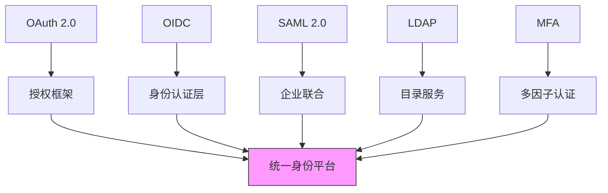

在构建企业级统一身份治理平台时，深入理解核心理论基础和开放标准是至关重要的。这些理论和标准不仅为平台的设计提供了坚实的基础，也为不同系统间的互操作性提供了保障。本文将作为第2章的概述，介绍身份治理领域的核心理论和开放标准。

## 引言

身份与访问管理（IAM）作为企业IT架构的重要组成部分，其理论基础和实现标准直接影响着平台的安全性、可用性和可扩展性。随着数字化转型的深入，企业面临着越来越复杂的身份管理需求，这要求我们不仅要掌握传统的IAM理论，还要了解最新的开放标准和最佳实践。

## 核心理论基础

### 认证与授权理论

认证（Authentication）和授权（Authorization）是身份治理的两个核心概念：

1. **认证**：验证用户身份的真实性，解决"你是谁"的问题
2. **授权**：确定用户可以访问哪些资源，解决"你能做什么"的问题

这两个概念虽然相关，但有着本质的区别，需要采用不同的技术和策略来实现。

### 访问控制模型

访问控制是授权的具体实现，主要包括以下几种模型：

1. **DAC（自主访问控制）**：资源所有者可以自主决定谁可以访问其资源
2. **MAC（强制访问控制）**：基于系统安全策略强制实施访问控制
3. **RBAC（基于角色的访问控制）**：通过角色来管理权限分配
4. **ABAC（基于属性的访问控制）**：基于用户、资源、环境等属性进行访问控制

### 身份生命周期理论

身份生命周期管理涵盖了从身份创建到销毁的全过程，包括：
- 身份的创建和初始化
- 身份属性的维护和更新
- 身份状态的变更管理
- 身份的归档和销毁

## 开放标准体系

### 身份联合标准

现代身份治理平台需要支持多种身份联合标准，以实现跨域身份验证：

1. **OAuth 2.0**：授权框架，允许第三方应用获取有限的用户资源访问权限
2. **OpenID Connect (OIDC)**：基于OAuth 2.0的身份认证层，提供用户身份信息
3. **SAML 2.0**：安全断言标记语言，用于在不同安全域间交换认证和授权数据

### 目录服务标准

目录服务是身份信息存储和管理的重要组成部分：

1. **LDAP（轻量级目录访问协议）**：用于访问和维护分布式目录信息服务的标准协议
2. **Active Directory**：微软的企业级目录服务解决方案

### 现代安全标准

随着安全威胁的不断演进，新的安全标准和最佳实践也在不断发展：

1. **多因子认证（MFA）**：结合多种认证因素提高安全性
2. **无密码认证**：基于生物识别、硬件密钥等技术的新型认证方式
3. **风险感知认证**：基于用户行为和环境因素的动态风险评估

## 标准间的协同与集成

在实际的企业环境中，这些标准和理论并不是孤立存在的，而是需要协同工作：

## 技术实现考量

在实现这些理论和标准时，需要考虑以下技术因素：

### 安全性设计

1. **加密传输**：使用TLS/SSL保护数据传输安全
2. **令牌管理**：安全的令牌生成、存储和验证机制
3. **防重放攻击**：通过时间戳、nonce等机制防止重放攻击
4. **输入验证**：严格的输入验证防止注入攻击

### 可扩展性设计

1. **微服务架构**：将不同功能模块拆分为独立的服务
2. **API设计**：提供RESTful API便于系统集成
3. **缓存策略**：合理的缓存机制提高系统性能
4. **水平扩展**：支持通过增加节点实现系统扩展

### 兼容性设计

1. **标准兼容**：严格遵循相关标准确保互操作性
2. **向后兼容**：保证新版本对旧版本的兼容性
3. **协议适配**：支持多种协议的适配器模式
4. **数据格式**：支持多种数据格式的转换

## 实践中的挑战与解决方案

### 复杂性管理

随着系统规模的扩大，身份治理平台的复杂性也会显著增加。需要通过以下方式管理复杂性：

1. **模块化设计**：将系统拆分为高内聚、低耦合的模块
2. **抽象层设计**：通过抽象层屏蔽底层实现细节
3. **配置驱动**：通过配置文件管理系统的各种参数
4. **监控告警**：建立完善的监控体系及时发现和解决问题

### 性能优化

身份治理平台通常需要处理大量的并发请求，性能优化至关重要：

1. **数据库优化**：合理的索引设计和查询优化
2. **缓存策略**：多级缓存机制减少数据库访问
3. **异步处理**：非关键路径的异步处理提高响应速度
4. **负载均衡**：通过负载均衡分散请求压力

## 总结

核心理论基础和开放标准是构建统一身份治理平台的基石。深入理解认证与授权理论、掌握主流的开放标准、了解现代安全最佳实践，对于设计和实现一个安全、高效、可扩展的身份治理平台具有重要意义。

在后续章节中，我们将深入探讨这些理论和标准的具体实现细节，包括OAuth 2.0、OIDC、SAML 2.0等协议的核心原理，RBAC、ABAC等权限模型的实现，LDAP协议与Active Directory的深度解读，以及现代安全最佳实践等内容。

通过系统地学习这些核心理论和开放标准，我们可以为构建企业级统一身份治理平台打下坚实的基础，确保平台能够满足企业当前和未来的身份管理需求。