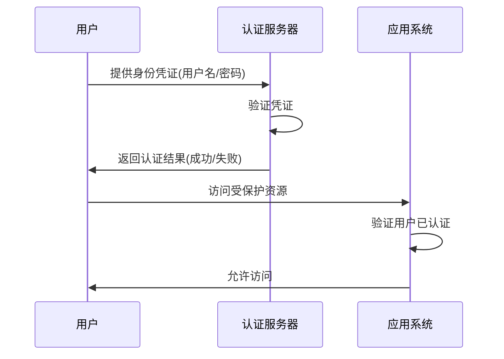
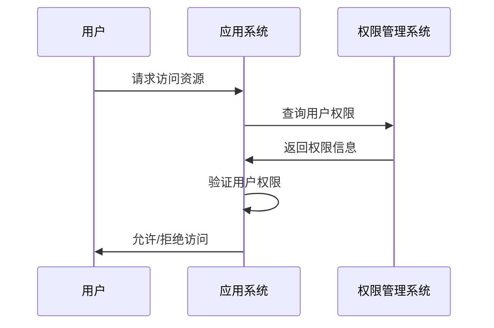
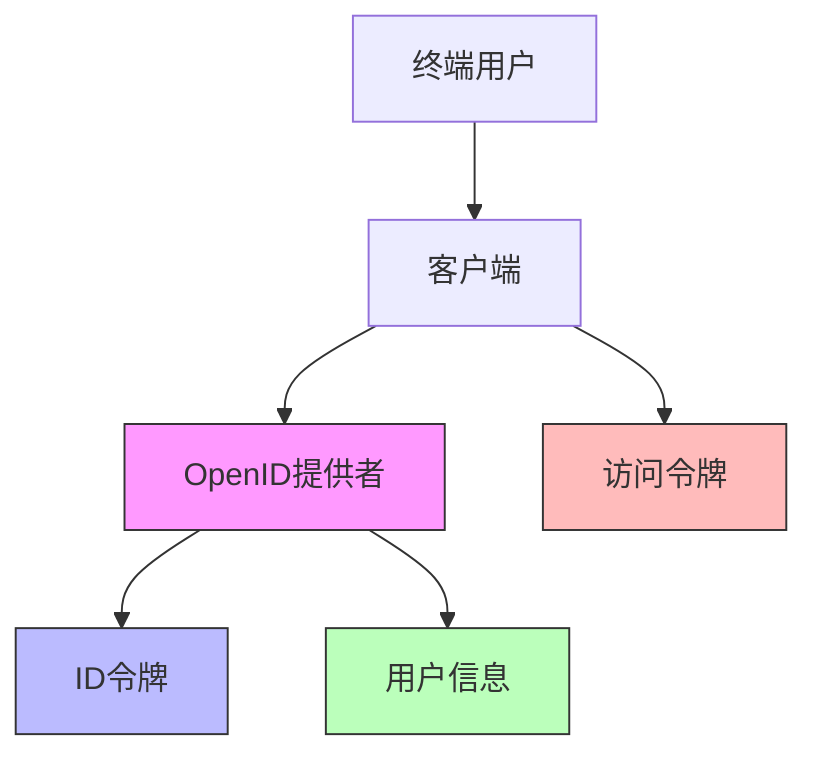
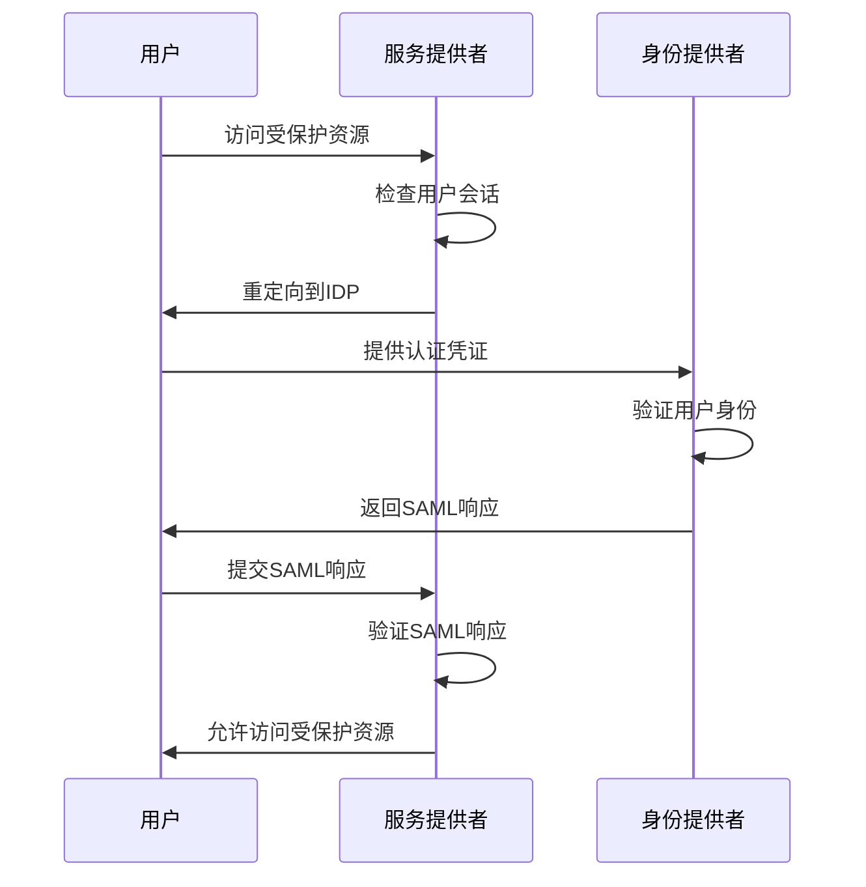

在身份治理领域，认证（Authentication）和授权（Authorization）是两个核心但又容易混淆的概念。虽然它们密切相关，但在实际应用中承担着不同的职责。本文将深入探讨这两个概念的区别，并详细解析OAuth 2.0、OpenID Connect（OIDC）和SAML 2.0这三种主流协议的核心原理。

## 引言

在构建统一身份治理平台时，理解认证与授权的区别以及相关协议的实现原理至关重要。许多安全漏洞和设计缺陷都源于对这两个概念的混淆。通过深入理解这些概念和协议，我们可以设计出更加安全、高效的身份治理解决方案。

## 认证与授权的区别

### 认证（Authentication）

认证是验证用户身份真实性的过程，解决"你是谁"的问题。它通常涉及以下要素：

1. **身份标识**：用户名、邮箱、手机号等
2. **凭证验证**：密码、生物识别、硬件令牌等
3. **身份确认**：系统确认用户身份的真实性



### 授权（Authorization）

授权是确定已认证用户可以访问哪些资源的过程，解决"你能做什么"的问题。它涉及以下要素：

1. **权限定义**：定义哪些用户可以访问哪些资源
2. **权限分配**：将权限分配给用户或用户组
3. **权限验证**：在用户访问资源时验证其权限



### 关系与区别

| 维度 | 认证(Authentication) | 授权(Authorization) |
|------|---------------------|---------------------|
| 目的 | 验证身份真实性 | 确定访问权限 |
| 问题 | "你是谁?" | "你能做什么?" |
| 时机 | 用户访问系统时 | 用户请求资源时 |
| 数据 | 身份凭证 | 权限策略 |

## OAuth 2.0 核心原理

### 概述

OAuth 2.0是一个授权框架，允许第三方应用在用户授权的情况下获取有限的资源访问权限，而无需获取用户的密码。

### 核心角色

```java
public class OAuth2Roles {
    // 资源所有者（用户）
    public class ResourceOwner {
        private String userId;
        private String username;
    }
    
    // 客户端（第三方应用）
    public class Client {
        private String clientId;
        private String clientSecret;
        private String redirectUri;
        private Set<String> scopes;
    }
    
    // 授权服务器
    public class AuthorizationServer {
        private TokenService tokenService;
        private ClientService clientService;
        private UserService userService;
    }
    
    // 资源服务器
    public class ResourceServer {
        private ResourceService resourceService;
        private TokenValidator tokenValidator;
    }
}
```

### 四种授权模式

#### 1. 授权码模式（Authorization Code）

这是最完整、最安全的授权模式，适用于有后端的Web应用：

```javascript
// 授权码模式流程
class AuthorizationCodeFlow {
  // 第一步：重定向用户到授权服务器
  redirectToAuthorizationServer() {
    const authUrl = new URL('https://auth-server.com/oauth/authorize');
    authUrl.searchParams.append('response_type', 'code');
    authUrl.searchParams.append('client_id', 'your_client_id');
    authUrl.searchParams.append('redirect_uri', 'https://your-app.com/callback');
    authUrl.searchParams.append('scope', 'read write');
    authUrl.searchParams.append('state', this.generateState());
    
    window.location.href = authUrl.toString();
  }
  
  // 第三步：客户端使用授权码交换访问令牌
  async exchangeCodeForToken(authorizationCode) {
    const response = await fetch('https://auth-server.com/oauth/token', {
      method: 'POST',
      headers: {
        'Content-Type': 'application/x-www-form-urlencoded',
        'Authorization': 'Basic ' + btoa('client_id:client_secret')
      },
      body: new URLSearchParams({
        'grant_type': 'authorization_code',
        'code': authorizationCode,
        'redirect_uri': 'https://your-app.com/callback'
      })
    });
    
    return await response.json();
  }
}
```

#### 2. 隐式模式（Implicit）

适用于纯前端应用，直接返回访问令牌：

```javascript
// 隐式模式流程
class ImplicitFlow {
  // 重定向用户到授权服务器
  redirectToAuthorizationServer() {
    const authUrl = new URL('https://auth-server.com/oauth/authorize');
    authUrl.searchParams.append('response_type', 'token');
    authUrl.searchParams.append('client_id', 'your_client_id');
    authUrl.searchParams.append('redirect_uri', 'https://your-app.com/callback');
    authUrl.searchParams.append('scope', 'read');
    authUrl.searchParams.append('state', this.generateState());
    
    window.location.href = authUrl.toString();
  }
  
  // 处理回调中的访问令牌
  handleCallback() {
    const hash = window.location.hash.substring(1);
    const params = new URLSearchParams(hash);
    const accessToken = params.get('access_token');
    const tokenType = params.get('token_type');
    const expiresIn = params.get('expires_in');
    
    // 存储访问令牌
    this.storeAccessToken(accessToken, tokenType, expiresIn);
  }
}
```

#### 3. 密码模式（Resource Owner Password Credentials）

用户直接向客户端提供用户名和密码：

```python
class PasswordFlow:
    def request_token(self, username, password):
        """密码模式获取令牌"""
        import requests
        
        # 客户端向授权服务器请求令牌
        response = requests.post(
            'https://auth-server.com/oauth/token',
            auth=('client_id', 'client_secret'),
            data={
                'grant_type': 'password',
                'username': username,
                'password': password,
                'scope': 'read write'
            }
        )
        
        return response.json()
```

#### 4. 客户端凭证模式（Client Credentials）

适用于客户端以自己的名义访问资源：

```java
public class ClientCredentialsFlow {
    private final HttpClient httpClient;
    private final String clientId;
    private final String clientSecret;
    
    public TokenResponse requestToken() {
        try {
            // 构建请求参数
            Map<String, String> params = new HashMap<>();
            params.put("grant_type", "client_credentials");
            params.put("scope", "api_access");
            
            // 发送令牌请求
            HttpRequest request = HttpRequest.newBuilder()
                .uri(URI.create("https://auth-server.com/oauth/token"))
                .header("Content-Type", "application/x-www-form-urlencoded")
                .header("Authorization", "Basic " + encodeCredentials(clientId, clientSecret))
                .POST(buildFormData(params))
                .build();
            
            HttpResponse<String> response = httpClient.send(request, HttpResponse.BodyHandlers.ofString());
            
            // 解析响应
            ObjectMapper mapper = new ObjectMapper();
            return mapper.readValue(response.body(), TokenResponse.class);
        } catch (Exception e) {
            throw new OAuth2Exception("Failed to request token", e);
        }
    }
}
```

### 安全考量

OAuth 2.0的安全实现需要注意以下几点：

1. **使用PKCE**：防止授权码拦截攻击
2. **验证重定向URI**：防止重定向攻击
3. **使用state参数**：防止CSRF攻击
4. **令牌安全存储**：避免令牌泄露
5. **作用域控制**：限制令牌权限范围

## OpenID Connect（OIDC）核心原理

### 概述

OpenID Connect是建立在OAuth 2.0之上的身份认证层，提供了标准化的身份信息获取方式。

### 核心组件



### ID令牌结构

OIDC使用JWT（JSON Web Token）格式的ID令牌：

```javascript
// ID令牌示例
const idToken = {
  // 头部
  header: {
    "alg": "RS256",
    "kid": "key-id"
  },
  
  // 载荷
  payload: {
    "iss": "https://auth-server.com",
    "sub": "user123",
    "aud": "client456",
    "exp": 1640995200,
    "iat": 1640991600,
    "auth_time": 1640991600,
    "nonce": "random-nonce",
    "at_hash": "access-token-hash",
    "name": "张三",
    "email": "zhangsan@example.com",
    "picture": "https://example.com/avatar.jpg"
  },
  
  // 签名
  signature: "signature-here"
};
```

### 核心流程

```java
public class OIDCFlow {
    // 处理认证请求
    public void handleAuthRequest(HttpServletRequest request, HttpServletResponse response) {
        try {
            // 1. 验证请求参数
            validateAuthRequest(request);
            
            // 2. 检查用户是否已认证
            if (!isUserAuthenticated(request)) {
                // 重定向到登录页面
                redirectToLogin(request, response);
                return;
            }
            
            // 3. 获取用户授权
            if (!getUserConsent(request)) {
                sendAuthorizationDenied(response);
                return;
            }
            
            // 4. 生成授权码
            String authorizationCode = generateAuthorizationCode(request);
            
            // 5. 重定向回客户端
            String redirectUri = request.getParameter("redirect_uri");
            String state = request.getParameter("state");
            
            UriComponentsBuilder builder = UriComponentsBuilder.fromHttpUrl(redirectUri)
                .queryParam("code", authorizationCode)
                .queryParam("state", state);
            
            response.sendRedirect(builder.toUriString());
            
        } catch (Exception e) {
            handleError(response, e);
        }
    }
    
    // 处理令牌请求
    public TokenResponse handleTokenRequest(TokenRequest request) {
        try {
            // 1. 验证客户端
            validateClient(request.getClientId(), request.getClientSecret());
            
            // 2. 验证授权码
            AuthorizationCode authCode = validateAuthorizationCode(request.getCode());
            
            // 3. 获取用户信息
            User user = userService.getUserById(authCode.getUserId());
            
            // 4. 生成访问令牌
            String accessToken = tokenService.generateAccessToken(user, authCode.getScopes());
            
            // 5. 生成ID令牌
            String idToken = tokenService.generateIdToken(user, request.getClientId(), 
                                                        authCode.getNonce(), authCode.getScopes());
            
            // 6. 生成刷新令牌（如果需要）
            String refreshToken = null;
            if (authCode.getScopes().contains("offline_access")) {
                refreshToken = tokenService.generateRefreshToken(user, request.getClientId());
            }
            
            return new TokenResponse(accessToken, idToken, refreshToken);
        } catch (Exception e) {
            throw new OIDCException("Failed to handle token request", e);
        }
    }
}
```

## SAML 2.0 核心原理

### 概述

SAML（Security Assertion Markup Language）2.0是一个基于XML的标准，用于在不同安全域之间交换认证和授权数据。

### 核心概念

```xml
<!-- SAML断言示例 -->
<saml:Assertion 
    xmlns:saml="urn:oasis:names:tc:SAML:2.0:assertion"
    ID="assertion-123"
    Version="2.0"
    IssueInstant="2025-09-06T10:00:00Z">
    
    <saml:Issuer>https://idp.example.com</saml:Issuer>
    
    <saml:Subject>
        <saml:NameID Format="urn:oasis:names:tc:SAML:1.1:nameid-format:emailAddress">
            user@example.com
        </saml:NameID>
        <saml:SubjectConfirmation Method="urn:oasis:names:tc:SAML:2.0:cm:bearer">
            <saml:SubjectConfirmationData 
                InResponseTo="request-456"
                Recipient="https://sp.example.com/saml/acs"
                NotOnOrAfter="2025-09-06T10:10:00Z"/>
        </saml:SubjectConfirmation>
    </saml:Subject>
    
    <saml:Conditions 
        NotBefore="2025-09-06T10:00:00Z"
        NotOnOrAfter="2025-09-06T10:10:00Z">
        <saml:AudienceRestriction>
            <saml:Audience>https://sp.example.com</saml:Audience>
        </saml:AudienceRestriction>
    </saml:Conditions>
    
    <saml:AuthnStatement 
        AuthnInstant="2025-09-06T10:00:00Z"
        SessionIndex="session-789">
        <saml:AuthnContext>
            <saml:AuthnContextClassRef>
                urn:oasis:names:tc:SAML:2.0:ac:classes:PasswordProtectedTransport
            </saml:AuthnContextClassRef>
        </saml:AuthnContext>
    </saml:AuthnStatement>
    
    <saml:AttributeStatement>
        <saml:Attribute 
            Name="email"
            NameFormat="urn:oasis:names:tc:SAML:2.0:attrname-format:basic">
            <saml:AttributeValue>user@example.com</saml:AttributeValue>
        </saml:Attribute>
        <saml:Attribute 
            Name="firstName"
            NameFormat="urn:oasis:names:tc:SAML:2.0:attrname-format:basic">
            <saml:AttributeValue>张</saml:AttributeValue>
        </saml:Attribute>
        <saml:Attribute 
            Name="lastName"
            NameFormat="urn:oasis:names:tc:SAML:2.0:attrname-format:basic">
            <saml:AttributeValue>三</saml:AttributeValue>
        </saml:Attribute>
    </saml:AttributeStatement>
</saml:Assertion>
```

### SSO流程



### 核心组件

```java
public class SAMLComponents {
    // 身份提供者（IdP）
    public class IdentityProvider {
        private final SAMLConfiguration config;
        private final CertificateService certificateService;
        private final UserService userService;
        
        // 处理认证请求
        public void handleAuthnRequest(AuthnRequest request, HttpServletResponse response) {
            try {
                // 1. 验证请求
                validateAuthnRequest(request);
                
                // 2. 检查用户认证状态
                if (!isUserAuthenticated()) {
                    redirectToLogin();
                    return;
                }
                
                // 3. 构建SAML响应
                Response samlResponse = buildSAMLResponse(request);
                
                // 4. 发送响应
                sendResponse(response, samlResponse);
            } catch (Exception e) {
                handleError(response, e);
            }
        }
    }
    
    // 服务提供者（SP）
    public class ServiceProvider {
        private final SAMLConfiguration config;
        private final CertificateService certificateService;
        
        // 处理SAML响应
        public void handleSAMLResponse(Response response) {
            try {
                // 1. 验证响应签名
                if (!verifySignature(response)) {
                    throw new SAMLException("Invalid signature");
                }
                
                // 2. 验证断言
                Assertion assertion = extractValidAssertion(response);
                
                // 3. 提取用户信息
                UserInfo userInfo = extractUserInfo(assertion);
                
                // 4. 创建本地会话
                createLocalSession(userInfo);
            } catch (Exception e) {
                throw new SAMLException("Failed to handle SAML response", e);
            }
        }
    }
}
```

## 三种协议的比较

### 适用场景对比

| 协议 | 适用场景 | 优势 | 劣势 |
|------|----------|------|------|
| OAuth 2.0 | 授权第三方应用访问用户资源 | 灵活的授权模式，广泛支持 | 仅是授权框架，不提供身份信息 |
| OIDC | Web应用和移动应用的身份认证 | 标准化身份信息，基于OAuth 2.0 | 相对复杂，需要JWT支持 |
| SAML 2.0 | 企业级SSO，Web浏览器SSO | 成熟标准，强安全性 | XML复杂，主要面向Web浏览器 |

### 技术特性对比

```javascript
// 协议特性对比表
const protocolComparison = {
  "OAuth 2.0": {
    format: "JSON/URL encoded",
    transport: "HTTP",
    token: "Bearer tokens",
    scope: "细粒度权限控制",
    refresh: "支持刷新令牌",
    mobile: "原生支持"
  },
  "OIDC": {
    format: "JWT",
    transport: "HTTP",
    token: "ID Token + Access Token",
    scope: "标准化身份信息",
    refresh: "支持刷新令牌",
    mobile: "原生支持"
  },
  "SAML 2.0": {
    format: "XML",
    transport: "HTTP-Redirect/HTTP-POST",
    token: "XML断言",
    scope: "基于属性的声明",
    refresh: "会话管理",
    mobile: "支持有限"
  }
};
```

## 安全最佳实践

### 通用安全原则

1. **使用HTTPS**：所有通信都应通过TLS加密
2. **验证所有输入**：防止注入攻击
3. **安全存储密钥**：使用HSM或密钥管理服务
4. **定期轮换密钥**：降低密钥泄露风险
5. **实施速率限制**：防止暴力破解攻击

### 协议特定安全措施

#### OAuth 2.0/OIDC安全措施

```python
class OAuth2Security:
    def __init__(self):
        self.pkce_supported = True
        self.state_validation = True
        self.token_binding = True
    
    def validate_authorization_request(self, request):
        """验证授权请求"""
        # 验证client_id
        if not self.is_valid_client(request.client_id):
            raise ValidationError("Invalid client_id")
        
        # 验证redirect_uri
        if not self.is_valid_redirect_uri(request.client_id, request.redirect_uri):
            raise ValidationError("Invalid redirect_uri")
        
        # 验证scope
        if not self.are_valid_scopes(request.scopes):
            raise ValidationError("Invalid scopes")
        
        # 验证state参数
        if not request.state:
            raise ValidationError("Missing state parameter")
        
        # 验证PKCE（如果支持）
        if self.pkce_supported and not self.validate_pkce(request):
            raise ValidationError("Invalid PKCE parameters")
        
        return True
```

#### SAML 2.0安全措施

```java
public class SAML2Security {
    private final SignatureValidator signatureValidator;
    private final CertificateValidator certificateValidator;
    
    // 验证SAML响应
    public boolean validateSAMLResponse(Response response) {
        try {
            // 1. 验证响应签名
            if (!signatureValidator.validateResponseSignature(response)) {
                auditLogger.log("SAML_SIGNATURE_INVALID", response.getID());
                return false;
            }
            
            // 2. 验证证书有效性
            if (!certificateValidator.validateCertificate(response.getIssuer())) {
                auditLogger.log("SAML_CERTIFICATE_INVALID", response.getIssuer());
                return false;
            }
            
            // 3. 验证断言条件
            for (Assertion assertion : response.getAssertions()) {
                if (!validateAssertionConditions(assertion)) {
                    auditLogger.log("SAML_ASSERTION_CONDITIONS_INVALID", assertion.getID());
                    return false;
                }
            }
            
            // 4. 验证受众限制
            if (!validateAudienceRestrictions(response)) {
                auditLogger.log("SAML_AUDIENCE_RESTRICTION_FAILED", response.getID());
                return false;
            }
            
            return true;
        } catch (Exception e) {
            auditLogger.log("SAML_VALIDATION_ERROR", e.getMessage());
            return false;
        }
    }
}
```

## 总结

认证与授权是身份治理的两个核心概念，虽然密切相关但有着本质区别。OAuth 2.0、OIDC和SAML 2.0这三种协议各有特点，适用于不同的场景：

1. **OAuth 2.0**：专注于授权，适用于需要访问用户资源的第三方应用
2. **OIDC**：在OAuth 2.0基础上提供身份认证，适用于现代Web和移动应用
3. **SAML 2.0**：成熟的SSO标准，适用于企业级环境

在实际应用中，需要根据具体需求选择合适的协议，并严格遵循安全最佳实践，确保身份治理平台的安全性和可靠性。

在后续章节中，我们将深入探讨权限模型、目录服务和现代安全最佳实践等内容，为构建完整的统一身份治理平台提供全面的理论基础和技术指导。