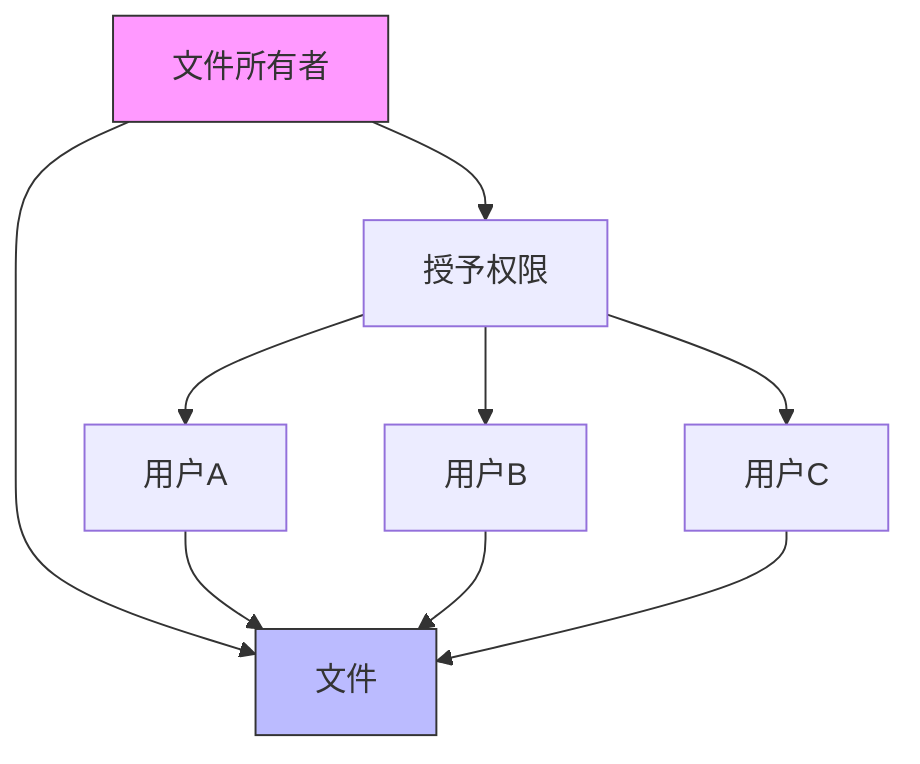
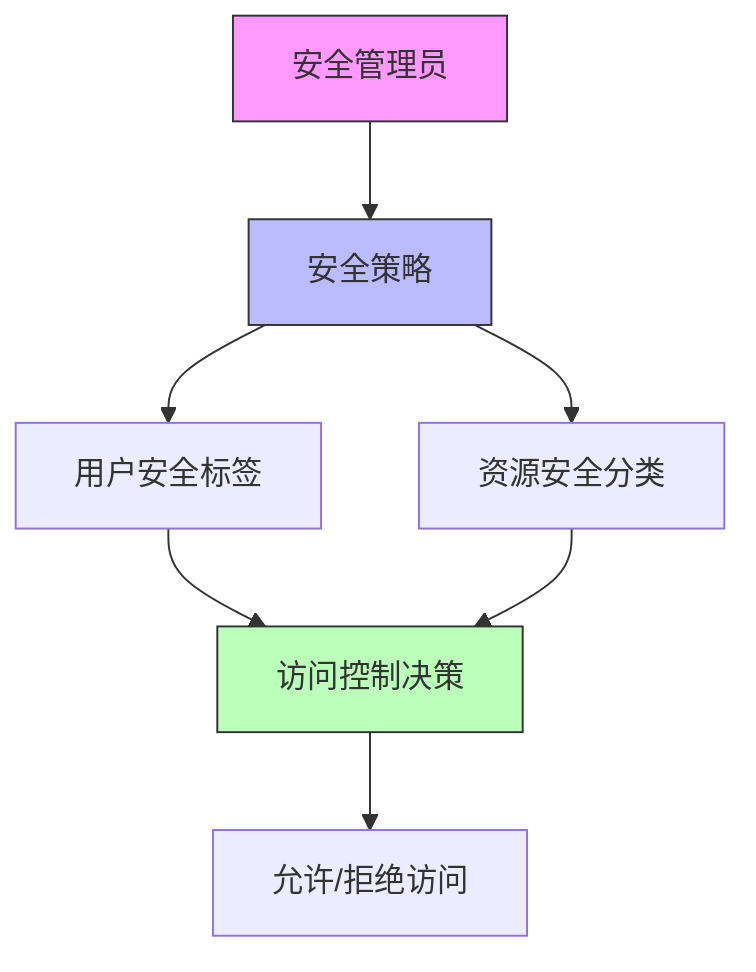
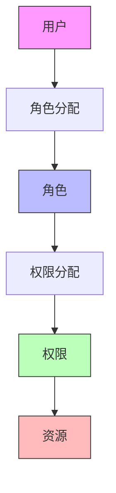
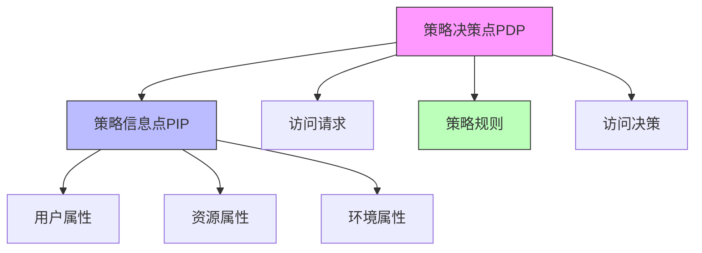

权限管理是统一身份治理平台的核心功能之一，它决定了用户能够访问哪些资源以及可以执行哪些操作。不同的权限模型适用于不同的场景，各有其优势和局限性。本文将深入探讨四种主要的权限模型：自主访问控制（DAC）、强制访问控制（MAC）、基于角色的访问控制（RBAC）和基于属性的访问控制（ABAC），分析它们的特点、适用场景和实现方式。

## 引言

在企业级应用中，权限管理是确保信息安全的关键环节。随着业务复杂性的增加和安全要求的提高，传统的权限管理方式已经无法满足现代企业的需求。理解不同权限模型的特点和适用场景，对于设计和实现一个灵活、安全、可扩展的权限管理系统至关重要。

## 自主访问控制（DAC - Discretionary Access Control）

### 概述

自主访问控制是一种由资源所有者自主决定谁可以访问其资源的访问控制模型。在DAC模型中，资源的所有者可以自由地授予或撤销其他用户对该资源的访问权限。

### 核心特点

1. **自主性**：资源所有者可以自主决定访问权限
2. **灵活性**：权限分配非常灵活
3. **简单性**：模型相对简单，易于理解和实现

### 实现方式

```java
public class DACModel {
    // 访问控制列表（ACL）
    public class AccessControlList {
        private String resourceId;
        private Map<String, Set<Permission>> userPermissions;
        
        // 授予权限
        public void grantPermission(String userId, Permission permission) {
            userPermissions.computeIfAbsent(userId, k -> new HashSet<>()).add(permission);
            auditLogger.log("PERMISSION_GRANTED", userId, resourceId, permission.toString());
        }
        
        // 撤销权限
        public void revokePermission(String userId, Permission permission) {
            Set<Permission> permissions = userPermissions.get(userId);
            if (permissions != null) {
                permissions.remove(permission);
                if (permissions.isEmpty()) {
                    userPermissions.remove(userId);
                }
                auditLogger.log("PERMISSION_REVOKED", userId, resourceId, permission.toString());
            }
        }
        
        // 检查权限
        public boolean checkPermission(String userId, Permission permission) {
            Set<Permission> permissions = userPermissions.get(userId);
            return permissions != null && permissions.contains(permission);
        }
    }
    
    // 资源所有者管理
    public class ResourceOwner {
        private String ownerId;
        private Set<String> ownedResources;
        
        // 转移资源所有权
        public void transferOwnership(String resourceId, String newOwnerId) {
            if (ownedResources.contains(resourceId)) {
                ownedResources.remove(resourceId);
                // 通知资源管理系统更新所有权
                resourceManager.updateOwner(resourceId, newOwnerId);
                auditLogger.log("OWNERSHIP_TRANSFERRED", ownerId, newOwnerId, resourceId);
            }
        }
    }
}
```

### 优缺点分析

#### 优点

1. **灵活性高**：资源所有者可以完全控制资源的访问权限
2. **实现简单**：模型概念清晰，易于实现
3. **用户友好**：符合用户的直觉和习惯

#### 缺点

1. **安全风险**：资源所有者可能错误地授予过多权限
2. **管理困难**：随着用户和资源数量增加，权限管理变得复杂
3. **缺乏统一策略**：难以实施统一的安全策略

### 适用场景

DAC模型适用于以下场景：

1. **个人文件管理**：如个人云存储服务
2. **协作办公**：团队内部的文档共享
3. **内容管理系统**：博客、wiki等系统



## 强制访问控制（MAC - Mandatory Access Control）

### 概述

强制访问控制是一种由系统强制实施访问控制策略的模型。在MAC模型中，权限的分配和控制由系统管理员或安全策略决定，用户和资源所有者无法随意更改。

### 核心特点

1. **强制性**：权限控制由系统强制实施
2. **安全性高**：能够有效防止权限滥用
3. **策略驱动**：基于预定义的安全策略

### 实现方式

```python
class MACModel:
    def __init__(self):
        self.security_levels = {
            'TOP_SECRET': 4,
            'SECRET': 3,
            'CONFIDENTIAL': 2,
            'PUBLIC': 1
        }
        self.compartments = ['FINANCE', 'HR', 'IT', 'R&D']
    
    def assign_security_label(self, user, level, compartments):
        """为用户分配安全标签"""
        user.security_level = level
        user.compartments = compartments
        self.audit_logger.log('SECURITY_LABEL_ASSIGNED', user.id, level, compartments)
    
    def assign_resource_classification(self, resource, level, compartments):
        """为资源分配安全分类"""
        resource.classification_level = level
        resource.compartments = compartments
        self.audit_logger.log('RESOURCE_CLASSIFICATION_ASSIGNED', resource.id, level, compartments)
    
    def check_access(self, user, resource):
        """检查用户对资源的访问权限"""
        # 检查安全级别
        if self.security_levels[user.security_level] < self.security_levels[resource.classification_level]:
            self.audit_logger.log('ACCESS_DENIED', user.id, resource.id, 'INSUFFICIENT_SECURITY_LEVEL')
            return False
        
        # 检查隔离舱
        if not set(user.compartments).intersection(set(resource.compartments)):
            self.audit_logger.log('ACCESS_DENIED', user.id, resource.id, 'NO_COMPARTMENT_ACCESS')
            return False
        
        self.audit_logger.log('ACCESS_GRANTED', user.id, resource.id)
        return True

# 安全标签示例
class SecurityLabel:
    def __init__(self, level, compartments):
        self.level = level  # 安全级别
        self.compartments = compartments  # 隔离舱

# 用户安全信息
class User:
    def __init__(self, user_id):
        self.id = user_id
        self.security_label = None

# 资源安全信息
class Resource:
    def __init__(self, resource_id):
        self.id = resource_id
        self.classification = None
```

### 优缺点分析

#### 优点

1. **安全性高**：能够有效防止权限滥用和信息泄露
2. **策略统一**：可以实施统一的安全策略
3. **审计完善**：便于安全审计和合规检查

#### 缺点

1. **灵活性差**：用户无法自主管理权限
2. **管理复杂**：需要专业的安全管理团队
3. **实施成本高**：系统实现和维护成本较高

### 适用场景

MAC模型适用于以下场景：

1. **军事和政府机构**：处理机密信息的组织
2. **金融机构**：需要严格控制数据访问的场景
3. **医疗系统**：保护患者隐私的医疗信息系统



## 基于角色的访问控制（RBAC - Role-Based Access Control）

### 概述

基于角色的访问控制是一种通过角色来管理权限分配的模型。在RBAC模型中，权限不是直接分配给用户，而是分配给角色，用户通过被分配角色来获得相应的权限。

### 核心特点

1. **角色抽象**：通过角色抽象权限分配
2. **易于管理**：简化权限管理复杂度
3. **可扩展性好**：便于系统扩展和维护

### 实现方式

```java
public class RBACModel {
    // 角色实体
    public class Role {
        private String roleId;
        private String roleName;
        private String roleDescription;
        private Set<Permission> permissions;
        private Set<Role> inheritsFrom; // 继承的角色
        
        // 添加权限
        public void addPermission(Permission permission) {
            permissions.add(permission);
            auditLogger.log("PERMISSION_ADDED_TO_ROLE", roleId, permission.toString());
        }
        
        // 移除权限
        public void removePermission(Permission permission) {
            permissions.remove(permission);
            auditLogger.log("PERMISSION_REMOVED_FROM_ROLE", roleId, permission.toString());
        }
    }
    
    // 用户实体
    public class User {
        private String userId;
        private String username;
        private Set<Role> roles;
        
        // 分配角色
        public void assignRole(Role role) {
            roles.add(role);
            auditLogger.log("ROLE_ASSIGNED", userId, role.getRoleId());
        }
        
        // 移除角色
        public void removeRole(Role role) {
            roles.remove(role);
            auditLogger.log("ROLE_REMOVED", userId, role.getRoleId());
        }
    }
    
    // 权限实体
    public class Permission {
        private String permissionId;
        private String resource;
        private String action; // READ, WRITE, DELETE, EXECUTE等
        
        @Override
        public boolean equals(Object obj) {
            if (this == obj) return true;
            if (obj == null || getClass() != obj.getClass()) return false;
            Permission that = (Permission) obj;
            return Objects.equals(resource, that.resource) && 
                   Objects.equals(action, that.action);
        }
        
        @Override
        public int hashCode() {
            return Objects.hash(resource, action);
        }
    }
    
    // 权限管理器
    public class PermissionManager {
        private Map<String, User> users;
        private Map<String, Role> roles;
        private Map<String, Permission> permissions;
        
        // 检查用户权限
        public boolean checkPermission(String userId, String resource, String action) {
            User user = users.get(userId);
            if (user == null) {
                return false;
            }
            
            Permission targetPermission = new Permission();
            targetPermission.setResource(resource);
            targetPermission.setAction(action);
            
            // 检查用户所有角色的权限
            for (Role role : user.getRoles()) {
                if (checkRolePermission(role, targetPermission)) {
                    auditLogger.log("PERMISSION_GRANTED", userId, resource, action);
                    return true;
                }
            }
            
            auditLogger.log("PERMISSION_DENIED", userId, resource, action);
            return false;
        }
        
        // 递归检查角色权限（包括继承的角色）
        private boolean checkRolePermission(Role role, Permission targetPermission) {
            // 检查当前角色的权限
            if (role.getPermissions().contains(targetPermission)) {
                return true;
            }
            
            // 检查继承角色的权限
            for (Role parentRole : role.getInheritsFrom()) {
                if (checkRolePermission(parentRole, targetPermission)) {
                    return true;
                }
            }
            
            return false;
        }
    }
}
```

### RBAC的层次模型

RBAC模型通常分为以下几个层次：



### 优缺点分析

#### 优点

1. **管理简化**：通过角色管理权限，大大简化了权限管理
2. **易于维护**：权限变更只需要修改角色，不需要修改每个用户
3. **职责分离**：支持职责分离原则，提高安全性
4. **可审计性**：便于权限审计和合规检查

#### 缺点

1. **角色爆炸**：在复杂场景下可能导致角色数量急剧增加
2. **灵活性限制**：难以处理特殊情况的权限需求
3. **继承复杂**：角色继承关系可能变得复杂

### 适用场景

RBAC模型适用于以下场景：

1. **企业应用系统**：ERP、CRM、OA等系统
2. **组织架构清晰的机构**：政府部门、大型企业
3. **需要职责分离的系统**：财务系统、审批系统

```sql
-- RBAC模型数据库设计示例
CREATE TABLE users (
    user_id VARCHAR(50) PRIMARY KEY,
    username VARCHAR(100) NOT NULL,
    email VARCHAR(100),
    created_at TIMESTAMP DEFAULT CURRENT_TIMESTAMP
);

CREATE TABLE roles (
    role_id VARCHAR(50) PRIMARY KEY,
    role_name VARCHAR(100) NOT NULL,
    description TEXT
);

CREATE TABLE permissions (
    permission_id VARCHAR(50) PRIMARY KEY,
    resource VARCHAR(100) NOT NULL,
    action VARCHAR(50) NOT NULL,
    UNIQUE(resource, action)
);

CREATE TABLE user_roles (
    user_id VARCHAR(50),
    role_id VARCHAR(50),
    assigned_at TIMESTAMP DEFAULT CURRENT_TIMESTAMP,
    PRIMARY KEY (user_id, role_id),
    FOREIGN KEY (user_id) REFERENCES users(user_id),
    FOREIGN KEY (role_id) REFERENCES roles(role_id)
);

CREATE TABLE role_permissions (
    role_id VARCHAR(50),
    permission_id VARCHAR(50),
    granted_at TIMESTAMP DEFAULT CURRENT_TIMESTAMP,
    PRIMARY KEY (role_id, permission_id),
    FOREIGN KEY (role_id) REFERENCES roles(role_id),
    FOREIGN KEY (permission_id) REFERENCES permissions(permission_id)
);
```

## 基于属性的访问控制（ABAC - Attribute-Based Access Control）

### 概述

基于属性的访问控制是一种基于用户、资源、环境等属性进行访问控制决策的模型。在ABAC模型中，访问决策基于预定义的策略，这些策略使用各种属性来确定是否允许访问。

### 核心特点

1. **属性驱动**：基于多种属性进行访问决策
2. **策略灵活**：支持复杂的访问控制策略
3. **动态性强**：能够根据环境变化动态调整权限

### 实现方式

```javascript
// ABAC模型实现
class ABACModel {
  constructor() {
    this.policyEngine = new PolicyEngine();
    this.attributeProvider = new AttributeProvider();
  }
  
  // 访问决策
  async evaluateAccessDecision(subject, resource, action, environment) {
    try {
      // 1. 获取相关属性
      const subjectAttributes = await this.attributeProvider.getSubjectAttributes(subject);
      const resourceAttributes = await this.attributeProvider.getResourceAttributes(resource);
      const environmentAttributes = await this.attributeProvider.getEnvironmentAttributes(environment);
      
      // 2. 构建决策上下文
      const context = {
        subject: subjectAttributes,
        resource: resourceAttributes,
        action: action,
        environment: environmentAttributes
      };
      
      // 3. 评估策略
      const decision = await this.policyEngine.evaluate(context);
      
      // 4. 记录审计日志
      this.auditLogger.log({
        event: 'ACCESS_DECISION',
        subject: subject,
        resource: resource,
        action: action,
        decision: decision,
        timestamp: new Date()
      });
      
      return decision;
    } catch (error) {
      this.auditLogger.log({
        event: 'ACCESS_DECISION_ERROR',
        subject: subject,
        resource: resource,
        action: action,
        error: error.message,
        timestamp: new Date()
      });
      throw error;
    }
  }
}

// 策略引擎
class PolicyEngine {
  constructor() {
    this.policies = [];
  }
  
  // 添加策略
  addPolicy(policy) {
    this.policies.push(policy);
  }
  
  // 评估策略
  async evaluate(context) {
    // 按优先级评估策略
    for (const policy of this.policies.sort((a, b) => a.priority - b.priority)) {
      const result = await policy.evaluate(context);
      if (result.decision !== 'NOT_APPLICABLE') {
        return result;
      }
    }
    
    // 默认拒绝
    return {
      decision: 'DENY',
      reason: 'No applicable policy found'
    };
  }
}

// 策略示例
class Policy {
  constructor(name, priority, rules) {
    this.name = name;
    this.priority = priority;
    this.rules = rules;
  }
  
  async evaluate(context) {
    // 评估所有规则
    for (const rule of this.rules) {
      const match = await rule.evaluate(context);
      if (!match) {
        return { decision: 'NOT_APPLICABLE', reason: 'Rule not matched' };
      }
    }
    
    // 所有规则匹配，返回策略决策
    return { decision: this.effect, reason: `Policy ${this.name} matched` };
  }
}

// 规则示例
class Rule {
  constructor(condition, effect) {
    this.condition = condition;
    this.effect = effect;
  }
  
  async evaluate(context) {
    // 简化的条件评估
    // 实际实现可能使用Rego、XACML等策略语言
    return this.condition(context);
  }
}

// 使用示例
const abac = new ABACModel();

// 定义策略
const sensitiveDataPolicy = new Policy('sensitive_data_access', 100, [
  new Rule(
    (context) => context.subject.department === 'IT' && context.subject.level >= 3,
    'PERMIT'
  ),
  new Rule(
    (context) => context.environment.time >= '09:00' && context.environment.time <= '18:00',
    'PERMIT'
  )
]);

abac.policyEngine.addPolicy(sensitiveDataPolicy);
```

### 策略语言

ABAC模型通常使用专门的策略语言来定义访问控制策略：

```rego
# Rego策略示例
package access_control

# 允许IT部门高级工程师在工作时间访问敏感数据
default allow = false

allow {
    input.subject.department == "IT"
    input.subject.level >= 3
    input.environment.time >= "09:00:00"
    input.environment.time <= "18:00:00"
    input.resource.type == "sensitive_data"
}

# 允许文档所有者访问自己的文档
allow {
    input.subject.id == input.resource.owner
    input.resource.type == "document"
}

# 拒绝非工作时间的敏感操作
deny {
    input.environment.time < "09:00:00"
    input.environment.time > "18:00:00"
    input.action == "delete"
    input.resource.type == "critical_system"
}
```

### 优缺点分析

#### 优点

1. **灵活性极高**：可以定义复杂的访问控制策略
2. **动态性强**：能够根据环境变化动态调整权限
3. **细粒度控制**：支持非常细粒度的权限控制
4. **可扩展性好**：易于扩展新的属性和策略

#### 缺点

1. **复杂性高**：策略定义和管理复杂
2. **性能开销**：策略评估可能带来性能开销
3. **学习成本高**：需要学习专门的策略语言
4. **调试困难**：策略冲突和调试较为困难

### 适用场景

ABAC模型适用于以下场景：

1. **复杂权限需求**：需要基于多种条件的复杂权限控制
2. **动态环境**：权限需求随环境变化的场景
3. **高安全性要求**：对安全性要求极高的系统
4. **云环境**：多租户、动态资源分配的云环境



## 四种模型的比较与选择

### 特性对比

| 特性 | DAC | MAC | RBAC | ABAC |
|------|-----|-----|------|------|
| 灵活性 | 高 | 低 | 中 | 极高 |
| 安全性 | 低 | 高 | 中 | 高 |
| 管理复杂度 | 低 | 高 | 中 | 高 |
| 实现复杂度 | 低 | 中 | 中 | 高 |
| 适用场景 | 简单协作 | 高安全要求 | 企业应用 | 复杂权限控制 |

### 选择建议

1. **简单场景**：选择DAC模型，实现简单，管理方便
2. **高安全要求**：选择MAC模型，强制性安全控制
3. **企业级应用**：选择RBAC模型，平衡了安全性和管理复杂度
4. **复杂权限需求**：选择ABAC模型，支持灵活的策略定义

### 混合模型

在实际应用中，往往需要结合多种模型的优点：

```java
public class HybridAccessControl {
    private final DACModel dacModel;
    private final MACModel macModel;
    private final RBACModel rbacModel;
    private final ABACModel abacModel;
    
    // 混合访问控制决策
    public AccessDecision evaluateAccess(Subject subject, Resource resource, Action action) {
        // 1. 首先检查MAC策略（强制性）
        if (!macModel.checkAccess(subject, resource)) {
            return AccessDecision.DENY;
        }
        
        // 2. 检查ABAC策略（基于属性）
        AccessDecision abacDecision = abacModel.evaluate(subject, resource, action);
        if (abacDecision == AccessDecision.DENY) {
            return AccessDecision.DENY;
        }
        
        // 3. 检查RBAC策略（基于角色）
        if (rbacModel.checkAccess(subject, resource, action)) {
            return AccessDecision.PERMIT;
        }
        
        // 4. 最后检查DAC策略（自主控制）
        if (dacModel.checkAccess(subject, resource, action)) {
            return AccessDecision.PERMIT;
        }
        
        return AccessDecision.DENY;
    }
}
```

## 实践中的最佳实践

### 权限设计原则

1. **最小权限原则**：只授予用户完成工作所需的最小权限
2. **职责分离原则**：关键操作需要多人协作完成
3. **权限继承原则**：合理使用权限继承简化管理
4. **定期审查原则**：定期审查和清理不必要的权限

### 实现建议

```python
class AccessControlBestPractices:
    def __init__(self):
        self.permission_cache = {}
        self.access_log = []
    
    def implement_least_privilege(self, user, required_permissions):
        """实现最小权限原则"""
        # 获取用户当前权限
        current_permissions = self.get_user_permissions(user)
        
        # 识别多余权限
        excess_permissions = current_permissions - required_permissions
        
        # 撤销多余权限
        for permission in excess_permissions:
            self.revoke_permission(user, permission)
        
        # 授予缺失权限
        missing_permissions = required_permissions - current_permissions
        for permission in missing_permissions:
            self.grant_permission(user, permission)
    
    def implement_separation_of_duty(self, critical_operation):
        """实现职责分离"""
        # 定义需要多人协作的关键操作
        multi_approval_operations = [
            'DELETE_CRITICAL_DATA',
            'TRANSFER_LARGE_AMOUNT',
            'SYSTEM_CONFIGURATION'
        ]
        
        if critical_operation in multi_approval_operations:
            # 要求至少2个不同角色的用户批准
            return self.require_multi_approval(critical_operation, min_approvers=2)
        
        return True
    
    def cache_permissions(self, user):
        """缓存用户权限以提高性能"""
        if user.id not in self.permission_cache:
            self.permission_cache[user.id] = {
                'permissions': self.calculate_user_permissions(user),
                'timestamp': datetime.now(),
                'ttl': 300  # 5分钟缓存
            }
        
        cache_entry = self.permission_cache[user.id]
        if (datetime.now() - cache_entry['timestamp']).seconds > cache_entry['ttl']:
            # 缓存过期，重新计算
            cache_entry['permissions'] = self.calculate_user_permissions(user)
            cache_entry['timestamp'] = datetime.now()
        
        return cache_entry['permissions']
```

## 总结

权限管理是统一身份治理平台的核心功能，不同的权限模型各有其特点和适用场景：

1. **DAC模型**：简单灵活，适用于个人资源管理
2. **MAC模型**：安全性高，适用于高安全要求的场景
3. **RBAC模型**：平衡了安全性和管理复杂度，是企业级应用的主流选择
4. **ABAC模型**：灵活性极高，适用于复杂权限控制需求

在实际应用中，往往需要根据具体业务需求选择合适的权限模型，或者结合多种模型的优点构建混合访问控制方案。无论选择哪种模型，都需要遵循最小权限原则、职责分离原则等安全最佳实践，确保系统的安全性和可维护性。

在后续章节中，我们将深入探讨目录服务、现代安全最佳实践等内容，为构建完整的统一身份治理平台提供全面的技术指导。