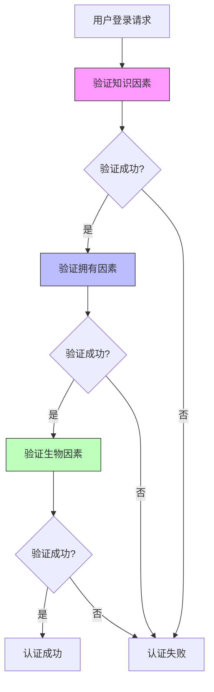
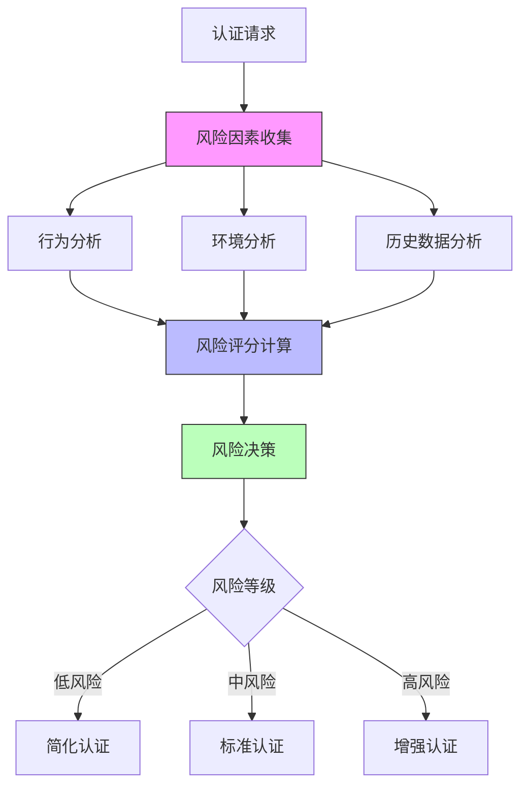
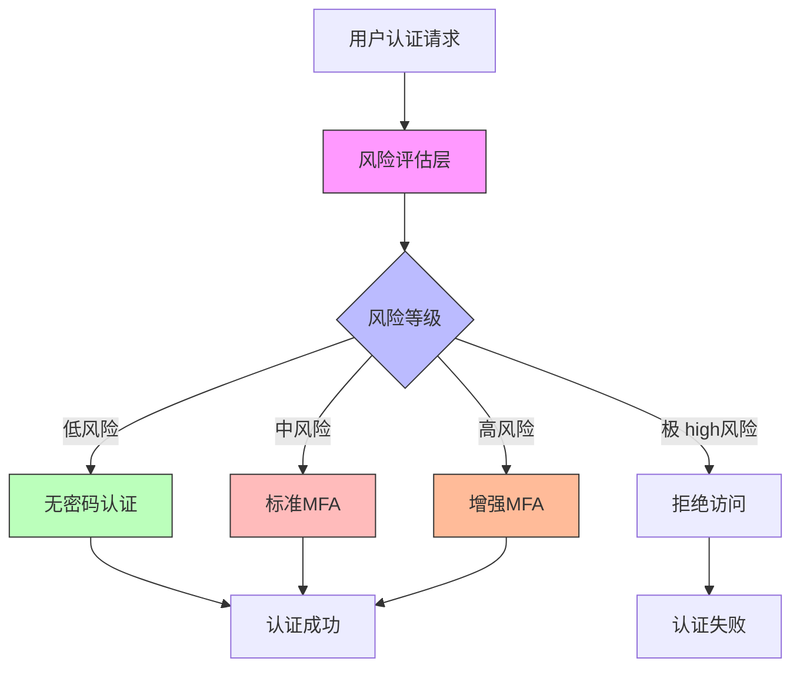

随着网络安全威胁的不断演进，传统的用户名密码认证方式已经无法满足现代企业对安全性的要求。现代身份治理平台需要采用更加先进的安全技术来保护用户身份和系统资源。本文将深入探讨多因子认证（MFA）、无密码认证和风险感知认证等现代安全最佳实践，分析它们的实现原理、技术方案和应用场景。

## 引言

在数字化转型的大背景下，企业面临着前所未有的安全挑战。传统的静态密码认证方式存在诸多安全隐患，如密码泄露、弱密码、密码重用等问题。为了应对这些挑战，业界提出了多种现代安全认证技术，包括多因子认证、无密码认证和风险感知认证等。这些技术通过增加认证因素、消除密码依赖、动态评估风险等方式，显著提升了身份认证的安全性。

## 多因子认证（MFA - Multi-Factor Authentication）

### 概述

多因子认证是一种安全机制，要求用户提供两种或多种不同类型的认证因素来验证身份。这些因素通常分为三类：

1. **知识因素**：用户知道的信息（如密码、PIN码）
2. **拥有因素**：用户拥有的物品（如手机、硬件令牌）
3. **生物因素**：用户的生物特征（如指纹、面部识别）

### MFA实现原理



### 常见MFA技术

#### 1. TOTP（基于时间的一次性密码）

TOTP是一种基于时间同步的一次性密码技术：

```java
public class TOTPAuthenticator {
    private final String secretKey;
    private final int timeStep = 30; // 30秒时间窗口
    private final int digits = 6;    // 6位数字密码
    
    public String generateTOTP() {
        long timeCounter = System.currentTimeMillis() / 1000 / timeStep;
        byte[] key = Base32.decode(secretKey);
        byte[] data = ByteBuffer.allocate(8).putLong(timeCounter).array();
        
        // 使用HMAC-SHA1算法生成TOTP
        byte[] hash = hmacSha1(key, data);
        
        // 动态截断
        int offset = hash[hash.length - 1] & 0xf;
        int binary = ((hash[offset] & 0x7f) << 24) |
                     ((hash[offset + 1] & 0xff) << 16) |
                     ((hash[offset + 2] & 0xff) << 8) |
                     (hash[offset + 3] & 0xff);
        
        // 取模生成指定位数的密码
        int otp = binary % (int) Math.pow(10, digits);
        return String.format("%0" + digits + "d", otp);
    }
    
    // 验证TOTP
    public boolean verifyTOTP(String totp) {
        String generatedTOTP = generateTOTP();
        return generatedTOTP.equals(totp);
    }
    
    private byte[] hmacSha1(byte[] key, byte[] data) {
        try {
            Mac mac = Mac.getInstance("HmacSHA1");
            SecretKeySpec keySpec = new SecretKeySpec(key, "HmacSHA1");
            mac.init(keySpec);
            return mac.doFinal(data);
        } catch (Exception e) {
            throw new RuntimeException("HMAC-SHA1 calculation failed", e);
        }
    }
}
```

#### 2. SMS/邮件验证码

基于短信或邮件的一次性验证码：

```python
class SMSAuthenticator:
    def __init__(self, sms_service):
        self.sms_service = sms_service
        self.otp_store = {}  # 实际应用中应使用安全的存储
    
    def generate_and_send_otp(self, phone_number):
        """生成并发送OTP"""
        # 生成6位数字验证码
        otp = ''.join(random.choices(string.digits, k=6))
        
        # 存储OTP（带过期时间）
        expiration_time = datetime.now() + timedelta(minutes=5)
        self.otp_store[phone_number] = {
            'otp': otp,
            'expires_at': expiration_time
        }
        
        # 发送短信
        message = f"您的验证码是: {otp}，5分钟内有效"
        self.sms_service.send_sms(phone_number, message)
        
        return otp
    
    def verify_otp(self, phone_number, otp):
        """验证OTP"""
        if phone_number not in self.otp_store:
            return False
        
        stored_data = self.otp_store[phone_number]
        
        # 检查是否过期
        if datetime.now() > stored_data['expires_at']:
            del self.otp_store[phone_number]
            return False
        
        # 验证OTP
        if stored_data['otp'] == otp:
            # 验证成功后删除OTP
            del self.otp_store[phone_number]
            return True
        
        return False
```

#### 3. 硬件安全密钥

基于FIDO标准的硬件安全密钥：

```javascript
// WebAuthn API实现
class WebAuthnAuthenticator {
  constructor() {
    this.credentialStore = new CredentialStore();
  }
  
  // 注册新凭证
  async registerCredential(username) {
    try {
      // 1. 生成注册挑战
      const challenge = this.generateChallenge();
      
      // 2. 发送注册选项到客户端
      const registrationOptions = {
        challenge: challenge,
        user: {
          id: this.encodeUserId(username),
          name: username,
          displayName: username
        },
        rp: {
          name: "企业身份平台",
          id: window.location.hostname
        },
        pubKeyCredParams: [
          { type: "public-key", alg: -7 },  // ES256
          { type: "public-key", alg: -257 } // RS256
        ]
      };
      
      // 3. 调用WebAuthn API
      const credential = await navigator.credentials.create({
        publicKey: registrationOptions
      });
      
      // 4. 验证并存储凭证
      const verifiedCredential = await this.verifyRegistrationResponse(credential);
      await this.credentialStore.saveCredential(username, verifiedCredential);
      
      return { success: true, credentialId: credential.id };
    } catch (error) {
      console.error('Registration failed:', error);
      return { success: false, error: error.message };
    }
  }
  
  // 验证凭证
  async authenticateCredential(username) {
    try {
      // 1. 获取用户凭证
      const userCredentials = await this.credentialStore.getUserCredentials(username);
      
      // 2. 生成认证挑战
      const challenge = this.generateChallenge();
      
      // 3. 发送认证选项到客户端
      const authenticationOptions = {
        challenge: challenge,
        allowCredentials: userCredentials.map(cred => ({
          id: cred.credentialId,
          type: "public-key"
        })),
        userVerification: "preferred"
      };
      
      // 4. 调用WebAuthn API
      const assertion = await navigator.credentials.get({
        publicKey: authenticationOptions
      });
      
      // 5. 验证断言
      const isValid = await this.verifyAuthenticationAssertion(assertion, userCredentials);
      
      if (isValid) {
        return { success: true, user: username };
      } else {
        return { success: false, error: "Authentication failed" };
      }
    } catch (error) {
      console.error('Authentication failed:', error);
      return { success: false, error: error.message };
    }
  }
  
  // 生成随机挑战
  generateChallenge() {
    const array = new Uint8Array(32);
    crypto.getRandomValues(array);
    return array;
  }
}
```

### MFA策略管理

```sql
-- MFA策略数据库设计
CREATE TABLE mfa_policies (
    policy_id VARCHAR(50) PRIMARY KEY,
    policy_name VARCHAR(100) NOT NULL,
    description TEXT,
    enabled BOOLEAN DEFAULT TRUE,
    created_at TIMESTAMP DEFAULT CURRENT_TIMESTAMP,
    updated_at TIMESTAMP DEFAULT CURRENT_TIMESTAMP ON UPDATE CURRENT_TIMESTAMP
);

CREATE TABLE mfa_requirements (
    policy_id VARCHAR(50),
    user_group VARCHAR(100),
    required_factors JSON,  -- 要求的认证因素
    fallback_allowed BOOLEAN DEFAULT TRUE,  -- 是否允许降级
    max_attempts INT DEFAULT 3,  -- 最大尝试次数
    lockout_duration INT DEFAULT 300,  -- 锁定持续时间（秒）
    PRIMARY KEY (policy_id, user_group),
    FOREIGN KEY (policy_id) REFERENCES mfa_policies(policy_id)
);

CREATE TABLE user_mfa_enrollments (
    user_id VARCHAR(50),
    factor_type VARCHAR(50),  -- TOTP, SMS, EMAIL, WEBAUTHN等
    factor_data JSON,  -- 因素相关数据
    enrolled_at TIMESTAMP DEFAULT CURRENT_TIMESTAMP,
    last_used TIMESTAMP,
    is_primary BOOLEAN DEFAULT FALSE,
    PRIMARY KEY (user_id, factor_type)
);
```

## 无密码认证（Passwordless Authentication）

### 概述

无密码认证是一种不依赖传统密码的身份验证方式，通过其他安全因素来验证用户身份。这种方式消除了密码管理的复杂性和安全隐患。

### 无密码认证技术

#### 1. 魔法链接（Magic Links）

通过电子邮件发送一次性登录链接：

```java
public class MagicLinkAuthenticator {
    private final EmailService emailService;
    private final TokenService tokenService;
    private final UserService userService;
    
    // 发送魔法链接
    public void sendMagicLink(String email) {
        try {
            // 1. 验证邮箱是否存在
            User user = userService.findByEmail(email);
            if (user == null) {
                throw new UserNotFoundException("User not found");
            }
            
            // 2. 生成一次性令牌
            String token = tokenService.generateOneTimeToken(user.getId(), 15); // 15分钟有效期
            
            // 3. 构建登录链接
            String loginUrl = String.format("https://%s/login?token=%s", 
                                          getDomain(), token);
            
            // 4. 发送邮件
            EmailMessage emailMessage = EmailMessage.builder()
                .to(email)
                .subject("安全登录链接")
                .body(String.format("点击以下链接安全登录（15分钟内有效）：%s", loginUrl))
                .build();
            
            emailService.sendEmail(emailMessage);
            
            // 5. 记录日志
            auditLogger.log("MAGIC_LINK_SENT", user.getId(), email);
            
        } catch (Exception e) {
            auditLogger.log("MAGIC_LINK_SEND_FAILED", email, e.getMessage());
            throw new AuthenticationException("Failed to send magic link", e);
        }
    }
    
    // 验证魔法链接
    public AuthenticationResult verifyMagicLink(String token) {
        try {
            // 1. 验证令牌
            TokenValidationResult result = tokenService.validateOneTimeToken(token);
            if (!result.isValid()) {
                throw new InvalidTokenException("Invalid or expired token");
            }
            
            // 2. 获取用户信息
            User user = userService.findById(result.getUserId());
            if (user == null) {
                throw new UserNotFoundException("User not found");
            }
            
            // 3. 创建认证会话
            Session session = sessionManager.createSession(user);
            
            // 4. 记录日志
            auditLogger.log("MAGIC_LINK_LOGIN_SUCCESS", user.getId());
            
            return AuthenticationResult.success(user, session);
            
        } catch (Exception e) {
            auditLogger.log("MAGIC_LINK_LOGIN_FAILED", token, e.getMessage());
            throw new AuthenticationException("Magic link verification failed", e);
        }
    }
}
```

#### 2. 生物识别认证

基于生物特征的身份验证：

```swift
// iOS生物识别认证实现
import LocalAuthentication

class BiometricAuthenticator {
    private let context = LAContext()
    
    // 检查生物识别可用性
    func isBiometricAvailable() -> Bool {
        var error: NSError?
        let canEvaluate = context.canEvaluatePolicy(.deviceOwnerAuthenticationWithBiometrics, error: &error)
        return canEvaluate
    }
    
    // 执行生物识别认证
    func authenticateWithBiometrics(completion: @escaping (Result<Bool, Error>) -> Void) {
        // 检查生物识别类型
        let biometryType: String
        if #available(iOS 11.0, *) {
            switch context.biometryType {
            case .touchID:
                biometryType = "Touch ID"
            case .faceID:
                biometryType = "Face ID"
            case .opticID:
                biometryType = "Optic ID"
            default:
                biometryType = "Biometrics"
            }
        } else {
            biometryType = "Touch ID"
        }
        
        // 执行认证
        context.evaluatePolicy(.deviceOwnerAuthenticationWithBiometrics, 
                             localizedReason: "使用\(biometryType)验证身份") { success, error in
            DispatchQueue.main.async {
                if success {
                    completion(.success(true))
                } else {
                    completion(.failure(error ?? AuthenticationError.biometricFailed))
                }
            }
        }
    }
    
    // 获取生物识别类型
    func getBiometricType() -> BiometricType {
        if #available(iOS 11.0, *) {
            switch context.biometryType {
            case .touchID:
                return .touchID
            case .faceID:
                return .faceID
            case .opticID:
                return .opticID
            default:
                return .none
            }
        }
        return .touchID
    }
}

enum BiometricType {
    case none
    case touchID
    case faceID
    case opticID
}

enum AuthenticationError: Error {
    case biometricFailed
    case notAvailable
}
```

#### 3. 设备信任认证

基于设备绑定的信任认证：

```python
class DeviceTrustAuthenticator:
    def __init__(self, device_store):
        self.device_store = device_store
        self.trust_evaluator = TrustEvaluator()
    
    def register_trusted_device(self, user_id, device_info):
        """注册可信设备"""
        # 生成设备指纹
        device_fingerprint = self.generate_device_fingerprint(device_info)
        
        # 生成设备证书
        device_certificate = self.generate_device_certificate(user_id, device_fingerprint)
        
        # 存储设备信息
        trusted_device = {
            'user_id': user_id,
            'device_id': device_fingerprint,
            'certificate': device_certificate,
            'registered_at': datetime.now(),
            'last_used': datetime.now(),
            'device_info': device_info
        }
        
        self.device_store.save_trusted_device(trusted_device)
        
        return device_certificate
    
    def authenticate_with_device_trust(self, user_id, device_info):
        """基于设备信任认证"""
        # 生成当前设备指纹
        current_fingerprint = self.generate_device_fingerprint(device_info)
        
        # 查找可信设备
        trusted_device = self.device_store.find_trusted_device(user_id, current_fingerprint)
        if not trusted_device:
            return False
        
        # 验证设备证书
        if not self.verify_device_certificate(trusted_device['certificate']):
            return False
        
        # 评估设备信任等级
        trust_level = self.trust_evaluator.evaluate_device_trust(device_info)
        if trust_level < 0.8:  # 信任等级阈值
            return False
        
        # 更新最后使用时间
        trusted_device['last_used'] = datetime.now()
        self.device_store.update_trusted_device(trusted_device)
        
        return True
    
    def generate_device_fingerprint(self, device_info):
        """生成设备指纹"""
        # 使用设备信息生成唯一指纹
        fingerprint_data = f"{device_info['user_agent']}|{device_info['ip_address']}|{device_info['browser']}|{device_info['os']}"
        return hashlib.sha256(fingerprint_data.encode()).hexdigest()
```

## 风险感知认证（Risk-Aware Authentication）

### 概述

风险感知认证是一种基于用户行为、环境因素和历史数据动态评估认证风险的技术。通过实时分析各种风险因素，系统可以调整认证要求，实现自适应的安全防护。

### 风险评估模型



### 风险因素分析

#### 1. 行为分析

用户行为模式分析：

```javascript
// 用户行为分析引擎
class BehavioralAnalyzer {
  constructor() {
    this.behavioralProfiles = new Map(); // 用户行为画像
    this.anomalyDetectors = new AnomalyDetectors();
  }
  
  // 分析登录行为
  async analyzeLoginBehavior(userId, loginContext) {
    try {
      // 1. 获取用户历史行为数据
      const userProfile = await this.getUserBehavioralProfile(userId);
      
      // 2. 分析时间模式
      const timeRisk = this.analyzeTimePattern(userProfile, loginContext.timestamp);
      
      // 3. 分析地理位置
      const locationRisk = this.analyzeLocationPattern(userProfile, loginContext.ipAddress);
      
      // 4. 分析设备模式
      const deviceRisk = this.analyzeDevicePattern(userProfile, loginContext.userAgent);
      
      // 5. 分析访问模式
      const accessRisk = this.analyzeAccessPattern(userProfile, loginContext.requestedResource);
      
      // 6. 综合风险评分
      const riskScore = this.calculateCompositeRiskScore({
        time: timeRisk,
        location: locationRisk,
        device: deviceRisk,
        access: accessRisk
      });
      
      // 7. 检测异常行为
      const anomalies = this.detectAnomalies(userProfile, loginContext);
      
      return {
        riskScore: riskScore,
        anomalies: anomalies,
        factors: {
          time: timeRisk,
          location: locationRisk,
          device: deviceRisk,
          access: accessRisk
        }
      };
    } catch (error) {
      console.error('Behavioral analysis failed:', error);
      return { riskScore: 0.5, anomalies: [], factors: {} }; // 默认中等风险
    }
  }
  
  // 分析时间模式
  analyzeTimePattern(userProfile, timestamp) {
    const loginHour = new Date(timestamp).getHours();
    const loginDay = new Date(timestamp).getDay();
    
    // 获取用户历史登录时间分布
    const timeDistribution = userProfile.timeDistribution || {};
    
    // 计算时间异常分数
    let timeRisk = 0;
    
    // 工作时间检查（假设工作时间为9-18点）
    if (loginHour < 9 || loginHour > 18) {
      timeRisk += 0.2;
    }
    
    // 周末登录检查
    if (loginDay === 0 || loginDay === 6) { // 周末
      timeRisk += 0.1;
    }
    
    // 与历史模式对比
    const hourKey = `hour_${loginHour}`;
    if (timeDistribution[hourKey]) {
      // 如果历史登录频率很低，则风险较高
      const frequency = timeDistribution[hourKey];
      if (frequency < 0.1) { // 小于10%的历史频率
        timeRisk += 0.3;
      }
    } else {
      // 从未在这个时间登录过
      timeRisk += 0.5;
    }
    
    return Math.min(timeRisk, 1.0); // 限制在0-1之间
  }
  
  // 分析地理位置模式
  analyzeLocationPattern(userProfile, ipAddress) {
    // 简化的地理位置分析
    // 实际实现需要集成IP地理位置服务
    
    // 获取IP地理位置
    const location = this.getIPLocation(ipAddress);
    const userLocations = userProfile.locations || [];
    
    // 检查是否为新位置
    const isNewLocation = !userLocations.some(loc => 
      this.isSameLocation(loc, location)
    );
    
    if (isNewLocation) {
      // 计算与常用位置的距离
      const distances = userLocations.map(loc => 
        this.calculateDistance(loc, location)
      );
      
      if (distances.length > 0) {
        const minDistance = Math.min(...distances);
        // 距离越远风险越高（假设1000公里为高风险阈值）
        return Math.min(minDistance / 1000, 1.0);
      }
      
      // 首次登录
      return 0.8;
    }
    
    return 0; // 熟悉位置
  }
  
  // 综合风险评分计算
  calculateCompositeRiskScore(factors) {
    // 加权计算综合风险评分
    const weights = {
      time: 0.25,
      location: 0.30,
      device: 0.25,
      access: 0.20
    };
    
    let totalScore = 0;
    for (const [factor, weight] of Object.entries(weights)) {
      totalScore += (factors[factor] || 0) * weight;
    }
    
    return totalScore;
  }
}
```

#### 2. 环境分析

认证环境风险评估：

```java
public class EnvironmentalRiskAnalyzer {
    private final IPGeolocationService ipGeolocationService;
    private final DeviceFingerprintService deviceFingerprintService;
    private final ThreatIntelligenceService threatIntelligenceService;
    
    // 环境风险评估
    public EnvironmentalRiskAssessment assessEnvironment(AuthenticationContext context) {
        EnvironmentalRiskAssessment assessment = new EnvironmentalRiskAssessment();
        
        // 1. IP地址风险评估
        IPRisk ipRisk = assessIPRisk(context.getIpAddress());
        assessment.setIpRisk(ipRisk);
        
        // 2. 设备风险评估
        DeviceRisk deviceRisk = assessDeviceRisk(context.getUserAgent(), context.getDeviceFingerprint());
        assessment.setDeviceRisk(deviceRisk);
        
        // 3. 网络环境风险评估
        NetworkRisk networkRisk = assessNetworkRisk(context.getIpAddress(), context.getHeaders());
        assessment.setNetworkRisk(networkRisk);
        
        // 4. 威胁情报检查
        ThreatIntelligence threatIntel = checkThreatIntelligence(context.getIpAddress());
        assessment.setThreatIntelligence(threatIntel);
        
        // 5. 综合风险评分
        double compositeRisk = calculateCompositeRisk(assessment);
        assessment.setRiskScore(compositeRisk);
        
        return assessment;
    }
    
    // IP地址风险评估
    private IPRisk assessIPRisk(String ipAddress) {
        IPRisk ipRisk = new IPRisk();
        
        // 1. 地理位置异常检测
        Location currentLocation = ipGeolocationService.getLocation(ipAddress);
        ipRisk.setLocation(currentLocation);
        
        // 2. IP信誉检查
        IPReputation reputation = threatIntelligenceService.checkIPReputation(ipAddress);
        ipRisk.setReputation(reputation);
        
        // 3. 代理/VPN检测
        boolean isProxy = threatIntelligenceService.isProxy(ipAddress);
        ipRisk.setProxy(isProxy);
        
        // 4. TOR网络检测
        boolean isTor = threatIntelligenceService.isTorExitNode(ipAddress);
        ipRisk.setTor(isTor);
        
        // 5. 计算IP风险分数
        double riskScore = 0.0;
        if (reputation.isMalicious()) {
            riskScore += 0.8;
        }
        if (isProxy) {
            riskScore += 0.3;
        }
        if (isTor) {
            riskScore += 0.5;
        }
        ipRisk.setRiskScore(Math.min(riskScore, 1.0));
        
        return ipRisk;
    }
    
    // 设备风险评估
    private DeviceRisk assessDeviceRisk(String userAgent, String deviceFingerprint) {
        DeviceRisk deviceRisk = new DeviceRisk();
        
        // 1. 用户代理分析
        UserAgentInfo userAgentInfo = UserAgentParser.parse(userAgent);
        deviceRisk.setUserAgentInfo(userAgentInfo);
        
        // 2. 设备指纹分析
        DeviceFingerprint fingerprint = deviceFingerprintService.analyze(deviceFingerprint);
        deviceRisk.setDeviceFingerprint(fingerprint);
        
        // 3. 已知恶意设备检查
        boolean isKnownMalicious = threatIntelligenceService.isKnownMaliciousDevice(deviceFingerprint);
        deviceRisk.setKnownMalicious(isKnownMalicious);
        
        // 4. 浏览器安全性检查
        BrowserSecurity browserSecurity = assessBrowserSecurity(userAgent);
        deviceRisk.setBrowserSecurity(browserSecurity);
        
        // 5. 计算设备风险分数
        double riskScore = 0.0;
        if (isKnownMalicious) {
            riskScore += 0.7;
        }
        if (!browserSecurity.isSecure()) {
            riskScore += 0.3;
        }
        if (fingerprint.hasSuspiciousAttributes()) {
            riskScore += 0.4;
        }
        deviceRisk.setRiskScore(Math.min(riskScore, 1.0));
        
        return deviceRisk;
    }
}
```

#### 3. 历史数据分析

用户历史行为模式分析：

```python
class HistoricalBehaviorAnalyzer:
    def __init__(self, behavior_store):
        self.behavior_store = behavior_store
        self.ml_models = self.load_ml_models()
    
    def analyze_historical_patterns(self, user_id):
        """分析用户历史行为模式"""
        # 获取用户历史行为数据
        historical_data = self.behavior_store.get_user_history(user_id)
        
        # 分析登录频率模式
        login_frequency_patterns = self.analyze_login_frequency(historical_data)
        
        # 分析权限使用模式
        permission_usage_patterns = self.analyze_permission_usage(historical_data)
        
        # 分析访问时间模式
        access_time_patterns = self.analyze_access_time_patterns(historical_data)
        
        # 构建用户行为画像
        behavior_profile = {
            'user_id': user_id,
            'login_patterns': login_frequency_patterns,
            'permission_patterns': permission_usage_patterns,
            'access_patterns': access_time_patterns,
            'risk_baseline': self.calculate_risk_baseline(historical_data),
            'anomaly_threshold': self.calculate_anomaly_threshold(historical_data)
        }
        
        return behavior_profile
    
    def detect_anomalies(self, user_id, current_behavior):
        """检测异常行为"""
        # 获取用户行为画像
        behavior_profile = self.get_user_behavior_profile(user_id)
        
        # 使用机器学习模型检测异常
        anomaly_score = self.ml_models['anomaly_detector'].predict(current_behavior)
        
        # 与历史基线对比
        baseline_deviation = self.calculate_baseline_deviation(
            current_behavior, 
            behavior_profile['risk_baseline']
        )
        
        # 综合异常评分
        composite_anomaly_score = (anomaly_score + baseline_deviation) / 2
        
        # 判断是否为异常
        is_anomaly = composite_anomaly_score > behavior_profile['anomaly_threshold']
        
        return {
            'is_anomaly': is_anomaly,
            'anomaly_score': composite_anomaly_score,
            'confidence': self.calculate_detection_confidence(composite_anomaly_score),
            'factors': {
                'ml_score': anomaly_score,
                'baseline_deviation': baseline_deviation
            }
        }
    
    def calculate_risk_baseline(self, historical_data):
        """计算风险基线"""
        # 计算各种风险因素的历史平均值
        baseline = {
            'average_login_time_risk': self.calculate_average(
                [record['time_risk'] for record in historical_data]
            ),
            'average_location_risk': self.calculate_average(
                [record['location_risk'] for record in historical_data]
            ),
            'average_device_risk': self.calculate_average(
                [record['device_risk'] for record in historical_data]
            ),
            'average_access_risk': self.calculate_average(
                [record['access_risk'] for record in historical_data]
            )
        }
        
        return baseline
```

### 自适应认证策略

```sql
-- 自适应认证策略数据库设计
CREATE TABLE adaptive_auth_policies (
    policy_id VARCHAR(50) PRIMARY KEY,
    policy_name VARCHAR(100) NOT NULL,
    description TEXT,
    enabled BOOLEAN DEFAULT TRUE,
    created_at TIMESTAMP DEFAULT CURRENT_TIMESTAMP,
    updated_at TIMESTAMP DEFAULT CURRENT_TIMESTAMP ON UPDATE CURRENT_TIMESTAMP
);

CREATE TABLE risk_thresholds (
    policy_id VARCHAR(50),
    risk_level VARCHAR(20),  -- LOW, MEDIUM, HIGH, CRITICAL
    min_score DECIMAL(3,2),  -- 最小风险分数
    max_score DECIMAL(3,2),  -- 最大风险分数
    auth_requirements JSON,  -- 认证要求
    PRIMARY KEY (policy_id, risk_level),
    FOREIGN KEY (policy_id) REFERENCES adaptive_auth_policies(policy_id)
);

CREATE TABLE risk_decisions (
    decision_id VARCHAR(50) PRIMARY KEY,
    user_id VARCHAR(50),
    session_id VARCHAR(50),
    risk_score DECIMAL(3,2),
    risk_factors JSON,
    auth_method VARCHAR(50),
    decision_result VARCHAR(20),  -- ALLOW, DENY, CHALLENGE
    decision_time TIMESTAMP DEFAULT CURRENT_TIMESTAMP,
    ip_address VARCHAR(45),
    user_agent TEXT
);

-- 风险因素权重配置
CREATE TABLE risk_factor_weights (
    policy_id VARCHAR(50),
    factor_name VARCHAR(50),  -- time, location, device, access
    weight DECIMAL(3,2),      -- 权重值 0.00-1.00
    PRIMARY KEY (policy_id, factor_name),
    FOREIGN KEY (policy_id) REFERENCES adaptive_auth_policies(policy_id)
);
```

## 综合安全架构

### 分层安全防护



### 安全实现示例

```java
public class ComprehensiveSecurityManager {
    private final RiskAssessmentEngine riskEngine;
    private final MFAService mfaService;
    private final PasswordlessService passwordlessService;
    private final AdaptiveAuthPolicy policy;
    
    // 综合认证流程
    public AuthenticationResult authenticate(AuthenticationRequest request) {
        try {
            // 1. 初步验证
            if (!preliminaryValidation(request)) {
                return AuthenticationResult.failed("Invalid request");
            }
            
            // 2. 风险评估
            RiskAssessment riskAssessment = riskEngine.assess(request);
            
            // 3. 根据风险等级选择认证方式
            AuthenticationMethod authMethod = selectAuthMethod(riskAssessment);
            
            // 4. 执行认证
            AuthenticationResult result = executeAuthentication(request, authMethod);
            
            // 5. 记录认证决策
            recordAuthDecision(request, riskAssessment, authMethod, result);
            
            return result;
        } catch (Exception e) {
            auditLogger.log("AUTHENTICATION_ERROR", request.getUserId(), e.getMessage());
            return AuthenticationResult.failed("Authentication failed");
        }
    }
    
    // 根据风险评估选择认证方法
    private AuthenticationMethod selectAuthMethod(RiskAssessment riskAssessment) {
        double riskScore = riskAssessment.getRiskScore();
        
        if (riskScore < 0.3) {
            // 低风险 - 可以使用无密码认证
            return AuthenticationMethod.PASSWORDLESS;
        } else if (riskScore < 0.6) {
            // 中风险 - 标准MFA
            return AuthenticationMethod.STANDARD_MFA;
        } else if (riskScore < 0.8) {
            // 高风险 - 增强MFA
            return AuthenticationMethod.ENHANCED_MFA;
        } else {
            // 极高风险 - 拒绝访问
            return AuthenticationMethod.DENY;
        }
    }
    
    // 执行认证
    private AuthenticationResult executeAuthentication(AuthenticationRequest request, 
                                                     AuthenticationMethod method) {
        switch (method) {
            case PASSWORDLESS:
                return executePasswordlessAuth(request);
            case STANDARD_MFA:
                return executeStandardMFA(request);
            case ENHANCED_MFA:
                return executeEnhancedMFA(request);
            case DENY:
                auditLogger.log("HIGH_RISK_ACCESS_DENIED", request.getUserId());
                return AuthenticationResult.failed("High risk access denied");
            default:
                return AuthenticationResult.failed("Unsupported authentication method");
        }
    }
    
    // 执行无密码认证
    private AuthenticationResult executePasswordlessAuth(AuthenticationRequest request) {
        // 检查是否支持无密码认证
        if (!passwordlessService.isSupported(request.getUserId())) {
            // 降级到标准MFA
            return executeStandardMFA(request);
        }
        
        // 执行无密码认证
        return passwordlessService.authenticate(request);
    }
    
    // 执行标准MFA
    private AuthenticationResult executeStandardMFA(AuthenticationRequest request) {
        return mfaService.authenticate(request, MFAStrength.STANDARD);
    }
    
    // 执行增强MFA
    private AuthenticationResult executeEnhancedMFA(AuthenticationRequest request) {
        return mfaService.authenticate(request, MFAStrength.ENHANCED);
    }
}
```

## 最佳实践与建议

### 实施策略

1. **渐进式部署**：从低风险场景开始，逐步扩展到高风险场景
2. **用户体验平衡**：在安全性和用户体验之间找到平衡点
3. **多层防护**：结合多种技术构建纵深防御体系
4. **持续监控**：建立完善的监控和告警机制

### 技术选型建议

```javascript
// 安全技术选型指南
class SecurityTechnologySelector {
  recommendTechnologies(organizationProfile) {
    const recommendations = {
      mfa: [],
      passwordless: [],
      riskAware: []
    };
    
    // 根据组织特征推荐技术
    if (organizationProfile.securityLevel === 'high') {
      recommendations.mfa = ['TOTP', 'WebAuthn', 'HardwareToken'];
      recommendations.passwordless = ['WebAuthn', 'MagicLink'];
      recommendations.riskAware = ['BehavioralAnalytics', 'ThreatIntelligence'];
    } else if (organizationProfile.securityLevel === 'medium') {
      recommendations.mfa = ['TOTP', 'SMS'];
      recommendations.passwordless = ['MagicLink'];
      recommendations.riskAware = ['BasicRiskAssessment'];
    } else {
      recommendations.mfa = ['TOTP'];
      recommendations.passwordless = [];
      recommendations.riskAware = [];
    }
    
    // 考虑技术成熟度
    if (organizationProfile.technicalMaturity === 'high') {
      recommendations.mfa.push('WebAuthn');
      recommendations.passwordless.push('WebAuthn');
    }
    
    // 考虑用户接受度
    if (organizationProfile.userAcceptance === 'high') {
      recommendations.mfa.push('Biometric');
    }
    
    return recommendations;
  }
}
```

### 合规性考虑

```python
class ComplianceManager:
    def __init__(self):
        self.compliance_requirements = {
            'GDPR': self.gdpr_requirements,
            'ISO27001': self.iso27001_requirements,
            'SOC2': self.soc2_requirements,
            '等保2.0': self.china_cybersecurity_law_requirements
        }
    
    def check_compliance(self, security_implementation, regulations):
        """检查合规性"""
        compliance_report = {}
        
        for regulation in regulations:
            if regulation in self.compliance_requirements:
                compliance_report[regulation] = self.compliance_requirements[regulation](
                    security_implementation
                )
        
        return compliance_report
    
    def gdpr_requirements(self, implementation):
        """GDPR合规要求"""
        requirements = {
            'data_minimization': implementation.uses_minimal_data(),
            'user_consent': implementation.has_user_consent_mechanism(),
            'data_portability': implementation.supports_data_export(),
            'right_to_erasure': implementation.supports_data_deletion(),
            'privacy_by_design': implementation.has_privacy_controls()
        }
        
        return {
            'compliant': all(requirements.values()),
            'requirements': requirements
        }
```

## 总结

现代安全最佳实践为统一身份治理平台提供了强大的安全保障。通过实施多因子认证、无密码认证和风险感知认证等技术，企业可以显著提升身份认证的安全性：

1. **多因子认证**：通过增加认证因素提高安全性
2. **无密码认证**：消除密码安全隐患，改善用户体验
3. **风险感知认证**：动态评估风险，实现自适应安全防护

在实际应用中，需要根据组织的具体需求和安全要求，选择合适的技术方案，并遵循最佳实践来确保系统的安全性和可用性。同时，还需要考虑合规性要求，确保安全措施符合相关法规和标准。

通过综合运用这些现代安全技术，企业可以构建一个既安全又便捷的身份治理体系，为数字化转型提供坚实的安全保障。

在后续章节中，我们将继续探讨统一身份平台的规划与设计、核心功能实现等内容，为构建完整的企业级身份治理平台提供全面的技术指导。