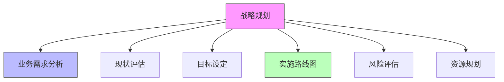

在构建企业级统一身份治理平台之前，进行全面的战略规划和明确的设计原则是确保项目成功的关键。这一阶段的工作不仅决定了平台的技术架构和功能特性，更直接影响到平台能否满足企业的长期业务需求和安全要求。本文将作为第3章的概述，介绍平台建设前的战略规划要点和核心设计原则。

## 引言

统一身份治理平台作为企业数字化基础设施的核心组件，其建设是一项复杂的系统工程。在正式启动开发或选型工作之前，企业需要进行深入的战略规划，明确平台的建设目标、范围和实施路径。同时，制定清晰的设计原则能够确保平台在技术实现过程中保持一致性和高质量。

## 战略规划的重要性

### 为什么需要战略规划

1. **明确目标**：确保所有利益相关者对平台建设目标有一致的理解
2. **资源优化**：合理分配人力、财力和时间资源
3. **风险控制**：提前识别和规避潜在风险
4. **路线清晰**：制定可执行的实施路线图

### 战略规划的核心要素



## 设计原则的价值

### 核心设计原则的作用

1. **技术一致性**：确保技术选型和实现方案的一致性
2. **质量保障**：通过原则指导提升平台质量
3. **决策支持**：在面临技术选择时提供决策依据
4. **可维护性**：确保平台长期可维护和可扩展

### 常见设计原则

1. **安全性优先**：安全是平台设计的首要考虑因素
2. **用户体验**：提供简洁、直观的用户界面和操作流程
3. **可扩展性**：支持业务增长和技术演进
4. **标准化**：遵循行业标准和最佳实践

## 需求调研与现状分析

### 调研内容

1. **业务需求**：了解各业务部门的具体需求
2. **技术现状**：评估现有系统架构和技术栈
3. **用户群体**：识别平台需要服务的用户类型
4. **合规要求**：明确相关法规和标准要求

### 分析方法

```java
public class RequirementsAnalysis {
    // 业务需求分析
    public class BusinessRequirements {
        private List<BusinessUnit> businessUnits;
        private Map<String, List<Requirement>> unitRequirements;
        
        public void analyzeBusinessNeeds() {
            for (BusinessUnit unit : businessUnits) {
                List<Requirement> requirements = collectUnitRequirements(unit);
                unitRequirements.put(unit.getName(), requirements);
                
                // 识别跨部门需求
                identifyCrossUnitRequirements(requirements);
            }
        }
    }
    
    // 技术现状评估
    public class TechnicalAssessment {
        private List<ExistingSystem> existingSystems;
        private TechnologyStack currentStack;
        private IntegrationPoints integrationPoints;
        
        public AssessmentReport assessCurrentState() {
            AssessmentReport report = new AssessmentReport();
            
            // 系统架构分析
            report.setArchitectureAnalysis(analyzeArchitecture());
            
            // 技术债务评估
            report.setTechnicalDebt(assessTechnicalDebt());
            
            // 集成复杂度评估
            report.setIntegrationComplexity(assessIntegrationComplexity());
            
            return report;
        }
    }
}
```

## 演进路线图制定

### 路线图要素

1. **阶段划分**：将整体建设过程划分为可管理的阶段
2. **里程碑设置**：定义关键交付物和验收标准
3. **资源分配**：明确各阶段所需资源
4. **风险管控**：制定风险应对策略

### 实施策略

```python
class ImplementationRoadmap:
    def __init__(self):
        self.phases = []
        self.milestones = []
        self.resources = {}
    
    def create_phase(self, name, duration, objectives, deliverables):
        """创建实施阶段"""
        phase = {
            'name': name,
            'duration': duration,
            'objectives': objectives,
            'deliverables': deliverables,
            'dependencies': [],
            'risks': []
        }
        self.phases.append(phase)
        return phase
    
    def define_milestone(self, name, phase, criteria):
        """定义里程碑"""
        milestone = {
            'name': name,
            'phase': phase,
            'criteria': criteria,
            'deadline': self.calculate_deadline(phase, duration)
        }
        self.milestones.append(milestone)
        return milestone
    
    def plan_resource_allocation(self):
        """规划资源分配"""
        resource_plan = {}
        for phase in self.phases:
            resource_plan[phase['name']] = {
                'team_size': self.estimate_team_size(phase),
                'budget': self.estimate_budget(phase),
                'timeline': phase['duration']
            }
        self.resources = resource_plan
        return resource_plan
```

## 技术选型考量

### 选型因素

1. **功能匹配度**：是否满足业务需求
2. **技术成熟度**：技术的稳定性和社区支持
3. **成本效益**：总体拥有成本
4. **可扩展性**：是否支持未来业务增长
5. **集成能力**：与现有系统的集成难度

### 评估框架

```javascript
// 技术选型评估框架
class TechnologyEvaluationFramework {
  constructor() {
    this.criteria = {
      functionality: 0.3,      // 功能性权重
      reliability: 0.2,        // 可靠性权重
      usability: 0.15,         // 可用性权重
      efficiency: 0.15,        // 效率权重
      maintainability: 0.1,    // 可维护性权重
      portability: 0.1         // 可移植性权重
    };
  }
  
  evaluateOption(option, requirements) {
    const scores = {
      functionality: this.evaluateFunctionality(option, requirements),
      reliability: this.evaluateReliability(option),
      usability: this.evaluateUsability(option),
      efficiency: this.evaluateEfficiency(option),
      maintainability: this.evaluateMaintainability(option),
      portability: this.evaluatePortability(option)
    };
    
    // 计算综合得分
    let totalScore = 0;
    for (const [criterion, weight] of Object.entries(this.criteria)) {
      totalScore += scores[criterion] * weight;
    }
    
    return {
      option: option.name,
      scores: scores,
      totalScore: totalScore,
      recommendation: totalScore > 0.8 ? 'HIGHLY_RECOMMENDED' : 
                     totalScore > 0.6 ? 'RECOMMENDED' : 'NOT_RECOMMENDED'
    };
  }
  
  evaluateFunctionality(option, requirements) {
    // 评估功能匹配度
    const matchedRequirements = requirements.filter(req => 
      option.features.includes(req)
    );
    return matchedRequirements.length / requirements.length;
  }
  
  evaluateReliability(option) {
    // 评估可靠性（基于SLA、故障率等指标）
    return (option.sla || 0.99) * (1 - (option.failureRate || 0));
  }
}
```

## 风险管理

### 常见风险类型

1. **技术风险**：技术实现难度、性能瓶颈
2. **业务风险**：需求变更、用户接受度
3. **项目风险**：进度延误、资源不足
4. **安全风险**：数据泄露、系统漏洞

### 风险应对策略

```sql
-- 风险管理数据库设计
CREATE TABLE risk_register (
    risk_id VARCHAR(50) PRIMARY KEY,
    risk_name VARCHAR(200) NOT NULL,
    risk_category VARCHAR(50),  -- technical, business, project, security
    probability DECIMAL(3,2),   -- 发生概率 0.00-1.00
    impact DECIMAL(3,2),        -- 影响程度 0.00-1.00
    risk_score DECIMAL(3,2),    -- 风险评分 = probability * impact
    mitigation_strategy TEXT,   -- 缓解策略
    contingency_plan TEXT,      -- 应急计划
    owner VARCHAR(100),         -- 风险负责人
    status VARCHAR(20),         -- identified, mitigated, closed
    created_at TIMESTAMP DEFAULT CURRENT_TIMESTAMP,
    updated_at TIMESTAMP DEFAULT CURRENT_TIMESTAMP ON UPDATE CURRENT_TIMESTAMP
);

-- 风险监控视图
CREATE VIEW risk_monitoring AS
SELECT 
    risk_id,
    risk_name,
    risk_category,
    probability,
    impact,
    risk_score,
    CASE 
        WHEN risk_score >= 0.8 THEN 'HIGH'
        WHEN risk_score >= 0.5 THEN 'MEDIUM'
        WHEN risk_score >= 0.2 THEN 'LOW'
        ELSE 'VERY_LOW'
    END as risk_level,
    owner,
    status
FROM risk_register
WHERE status != 'CLOSED'
ORDER BY risk_score DESC;
```

## 成功关键因素

### 组织支持

1. **高层支持**：获得管理层的明确支持和资源承诺
2. **跨部门协作**：建立有效的跨部门沟通机制
3. **变革管理**：制定用户培训和变革管理计划

### 技术能力

1. **团队技能**：确保团队具备必要的技术能力
2. **知识转移**：建立知识管理和转移机制
3. **持续学习**：保持对新技术和最佳实践的关注

## 总结

平台建设前的战略规划与设计原则是统一身份治理平台成功实施的基础。通过深入的需求调研、现状分析、路线图制定和技术选型，企业可以为平台建设奠定坚实的基础。同时，明确的设计原则能够确保平台在实施过程中保持一致性和高质量。

在后续章节中，我们将详细探讨需求调研的具体方法、演进路线图的制定技巧、核心设计原则的实践应用以及技术选型的详细考量，为企业构建统一身份治理平台提供全面的指导。

通过系统性的战略规划和清晰的设计原则，企业可以显著提高统一身份治理平台建设的成功率，确保平台能够满足当前和未来的业务需求，为企业的数字化转型提供强有力的支持。