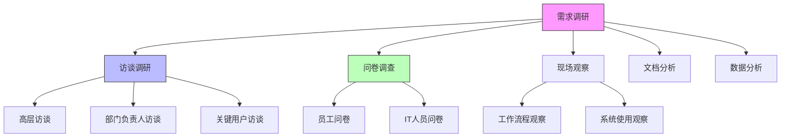
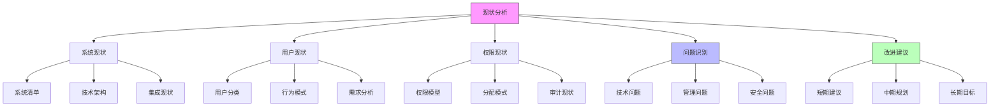

在构建企业级统一身份治理平台之前，深入的需求调研和现状分析是确保平台成功实施的关键步骤。这一阶段的工作将帮助我们全面了解企业的业务需求、技术现状和用户期望，为后续的平台设计和实施提供坚实的基础。本文将详细探讨需求调研的方法、现状分析的要点以及如何梳理现有系统、用户类型和权限场景。

## 引言

需求调研与现状分析是统一身份治理平台建设的第一步，也是至关重要的一步。只有充分了解企业的实际需求和现有状况，才能设计出真正符合企业需要的解决方案。这一阶段的工作不仅涉及技术层面的分析，还需要深入了解业务流程、组织架构和用户行为等多个方面。

## 需求调研方法论

### 调研目标

需求调研的主要目标包括：

1. **业务需求识别**：了解各业务部门对身份治理的具体需求
2. **技术现状评估**：评估现有系统的架构、技术和集成能力
3. **用户需求分析**：识别不同用户群体的使用习惯和期望
4. **合规要求梳理**：明确相关的法规和标准要求

### 调研方法



### 调研工具

```java
public class RequirementsGatheringToolkit {
    // 访谈指南模板
    public class InterviewGuide {
        private List<Question> businessQuestions;
        private List<Question> technicalQuestions;
        private List<Question> userExperienceQuestions;
        
        public InterviewGuide() {
            initializeBusinessQuestions();
            initializeTechnicalQuestions();
            initializeUserExperienceQuestions();
        }
        
        private void initializeBusinessQuestions() {
            businessQuestions = Arrays.asList(
                new Question("当前身份管理面临的主要挑战是什么？"),
                new Question("哪些业务流程受到身份管理问题的影响？"),
                new Question("对统一身份治理平台有哪些具体期望？"),
                new Question("预算和时间安排是怎样的？")
            );
        }
        
        private void initializeTechnicalQuestions() {
            technicalQuestions = Arrays.asList(
                new Question("现有系统架构是怎样的？"),
                new Question("使用了哪些身份认证技术？"),
                new Question("系统集成的难点在哪里？"),
                new Question("对新技术的接受度如何？")
            );
        }
        
        private void initializeUserExperienceQuestions() {
            userExperienceQuestions = Arrays.asList(
                new Question("用户在使用现有系统时的主要痛点？"),
                new Question("用户对登录流程的满意度？"),
                new Question("用户对自助服务功能的需求？"),
                new Question("移动端使用情况如何？")
            );
        }
    }
    
    // 问卷调查模板
    public class SurveyTemplate {
        private List<SurveySection> sections;
        
        public SurveyTemplate() {
            sections = Arrays.asList(
                createBackgroundSection(),
                createCurrentStateSection(),
                createRequirementsSection(),
                createExpectationsSection()
            );
        }
        
        private SurveySection createBackgroundSection() {
            return new SurveySection("背景信息", Arrays.asList(
                new MultipleChoiceQuestion("您的职位是？", Arrays.asList("管理层", "IT人员", "业务人员", "其他")),
                new MultipleChoiceQuestion("您所在的部门是？", Arrays.asList("IT部", "人力资源部", "财务部", "销售部", "其他")),
                new ScaleQuestion("您使用企业系统的频率是？", 1, 5)
            ));
        }
    }
}
```

## 现有系统梳理

### 系统盘点

对企业现有系统的全面盘点是现状分析的基础：

```python
class SystemInventory:
    def __init__(self):
        self.systems = []
        self.integration_points = []
        self.authentication_methods = []
    
    def catalog_systems(self):
        """系统目录化"""
        systems_catalog = {
            'erp_systems': self.identify_erp_systems(),
            'crm_systems': self.identify_crm_systems(),
            'hr_systems': self.identify_hr_systems(),
            'collaboration_tools': self.identify_collaboration_tools(),
            'custom_applications': self.identify_custom_applications(),
            'third_party_services': self.identify_third_party_services()
        }
        return systems_catalog
    
    def analyze_system_characteristics(self, system):
        """分析系统特征"""
        characteristics = {
            'system_name': system.name,
            'vendor': system.vendor,
            'version': system.version,
            'deployment_model': system.deployment_model,  # on-premise, cloud, hybrid
            'user_count': system.user_count,
            'authentication_method': system.authentication_method,
            'integration_capability': system.integration_capability,
            'support_status': system.support_status,
            'security_level': self.assess_security_level(system),
            'maintenance_cost': system.maintenance_cost
        }
        return characteristics
    
    def map_system_relationships(self):
        """映射系统关系"""
        relationships = []
        for system in self.systems:
            relationship = {
                'system': system.name,
                'connected_systems': self.find_connected_systems(system),
                'data_flow': self.analyze_data_flow(system),
                'dependency_level': self.assess_dependency(system)
            }
            relationships.append(relationship)
        return relationships
```

### 身份认证现状分析

```javascript
// 身份认证现状分析
class AuthenticationAnalysis {
  constructor(systems) {
    this.systems = systems;
    this.authenticationPatterns = new Map();
  }
  
  analyzeCurrentAuthMethods() {
    const authMethods = new Map();
    
    for (const system of this.systems) {
      const method = system.authenticationMethod;
      if (!authMethods.has(method)) {
        authMethods.set(method, {
          count: 0,
          systems: [],
          issues: []
        });
      }
      
      const methodInfo = authMethods.get(method);
      methodInfo.count++;
      methodInfo.systems.push(system.name);
      
      // 识别该认证方法的问题
      const issues = this.identifyAuthMethodIssues(system);
      methodInfo.issues.push(...issues);
    }
    
    return authMethods;
  }
  
  identifyAuthMethodIssues(system) {
    const issues = [];
    
    // 检查密码策略
    if (system.passwordPolicy && system.passwordPolicy.weak) {
      issues.push('密码策略过于宽松');
    }
    
    // 检查多因子认证
    if (!system.mfaEnabled) {
      issues.push('未启用多因子认证');
    }
    
    // 检查会话管理
    if (system.sessionTimeout && system.sessionTimeout > 24 * 60) {
      issues.push('会话超时时间过长');
    }
    
    // 检查审计日志
    if (!system.auditLogging) {
      issues.push('缺乏审计日志');
    }
    
    return issues;
  }
  
  generateAuthGapAnalysis() {
    const currentMethods = this.analyzeCurrentAuthMethods();
    const gapAnalysis = {
      consolidationOpportunities: [],
      securityGaps: [],
      integrationChallenges: []
    };
    
    // 识别整合机会
    if (currentMethods.size > 3) {
      gapAnalysis.consolidationOpportunities.push(
        '存在多种认证方法，有统一认证的潜力'
      );
    }
    
    // 识别安全差距
    for (const [method, info] of currentMethods) {
      if (info.issues.length > 0) {
        gapAnalysis.securityGaps.push({
          method: method,
          issues: info.issues,
          affectedSystems: info.systems
        });
      }
    }
    
    return gapAnalysis;
  }
}
```

## 用户类型分析

### 用户分类维度

对企业用户进行准确分类是设计用户中心的关键：

```sql
-- 用户类型分析数据库设计
CREATE TABLE user_types (
    type_id VARCHAR(50) PRIMARY KEY,
    type_name VARCHAR(100) NOT NULL,
    description TEXT,
    user_count INT,
    access_level VARCHAR(20),  -- HIGH, MEDIUM, LOW
    authentication_requirements JSON,
    created_at TIMESTAMP DEFAULT CURRENT_TIMESTAMP
);

CREATE TABLE user_type_characteristics (
    type_id VARCHAR(50),
    characteristic_name VARCHAR(100),
    characteristic_value TEXT,
    importance_level INT,  -- 1-5, 5为最重要
    PRIMARY KEY (type_id, characteristic_name),
    FOREIGN KEY (type_id) REFERENCES user_types(type_id)
);

-- 用户类型示例数据
INSERT INTO user_types (type_id, type_name, description, user_count, access_level) VALUES
('employee', '正式员工', '企业正式聘用的员工', 5000, 'HIGH'),
('contractor', '合同工', '与企业签订合同的临时工作人员', 200, 'MEDIUM'),
('partner', '合作伙伴', '企业的业务合作伙伴', 150, 'LOW'),
('customer', '客户', '企业的产品或服务客户', 50000, 'LOW'),
('vendor', '供应商', '为企业提供产品或服务的供应商', 300, 'LOW');

INSERT INTO user_type_characteristics (type_id, characteristic_name, characteristic_value, importance_level) VALUES
('employee', '工作时间', '9:00-18:00', 5),
('employee', '访问系统', 'ERP,CRM,OA,Email', 5),
('employee', '认证要求', '用户名密码+MFA', 5),
('contractor', '工作时间', '灵活', 3),
('contractor', '访问系统', '项目相关系统', 4),
('contractor', '认证要求', '用户名密码', 3);
```

### 用户行为分析

```java
public class UserBehaviorAnalysis {
    // 用户行为模式
    public class BehaviorPattern {
        private String userType;
        private String accessPattern;
        private String timePattern;
        private String devicePattern;
        private List<String> frequentlyUsedSystems;
        private AuthenticationPreference authPreference;
        
        // 访问模式分析
        public AccessPatternAnalysis analyzeAccessPattern() {
            AccessPatternAnalysis analysis = new AccessPatternAnalysis();
            
            // 分析访问频率
            analysis.setFrequency(this.calculateAccessFrequency());
            
            // 分析访问时间分布
            analysis.setTimeDistribution(this.calculateTimeDistribution());
            
            // 分析系统访问顺序
            analysis.setSystemSequence(this.calculateSystemSequence());
            
            // 分析访问路径
            analysis.setAccessPaths(this.identifyCommonAccessPaths());
            
            return analysis;
        }
        
        // 时间模式分析
        public TimePatternAnalysis analyzeTimePattern() {
            TimePatternAnalysis analysis = new TimePatternAnalysis();
            
            // 工作时间分析
            analysis.setWorkHours(this.identifyWorkHours());
            
            // 高峰期分析
            analysis.setPeakHours(this.identifyPeakHours());
            
            // 异常时间访问
            analysis.setAnomalousAccess(this.identifyAnomalousAccess());
            
            return analysis;
        }
    }
    
    // 用户需求分析
    public class UserRequirementsAnalysis {
        private Map<String, UserRequirement> requirements;
        
        public void analyzeUserRequirements(List<User> users) {
            requirements = new HashMap<>();
            
            for (User user : users) {
                UserRequirement requirement = new UserRequirement();
                
                // 功能需求
                requirement.setFunctionalRequirements(
                    this.identifyFunctionalRequirements(user)
                );
                
                // 非功能需求
                requirement.setNonFunctionalRequirements(
                    this.identifyNonFunctionalRequirements(user)
                );
                
                // 痛点分析
                requirement.setPainPoints(
                    this.identifyUserPainPoints(user)
                );
                
                // 期望分析
                requirement.setExpectations(
                    this.identifyUserExpectations(user)
                );
                
                requirements.put(user.getId(), requirement);
            }
        }
        
        private List<String> identifyFunctionalRequirements(User user) {
            List<String> requirements = new ArrayList<>();
            
            // 单点登录需求
            if (user.getSystemCount() > 3) {
                requirements.add("单点登录");
            }
            
            // 自助服务需求
            if (user.getSupportTickets() > 5) {
                requirements.add("自助密码重置");
                requirements.add("账户信息维护");
            }
            
            // 移动端需求
            if (user.getMobileAccessPercentage() > 0.3) {
                requirements.add("移动端访问");
            }
            
            return requirements;
        }
    }
}
```

## 权限场景梳理

### 权限模型现状

对企业现有权限模型的梳理是设计新平台的重要依据：

```python
class PermissionModelAnalysis:
    def __init__(self, systems):
        self.systems = systems
        self.permission_models = {}
    
    def analyze_current_models(self):
        """分析当前权限模型"""
        for system in self.systems:
            model = {
                'system_name': system.name,
                'model_type': self.identify_model_type(system),
                'roles': self.extract_roles(system),
                'permissions': self.extract_permissions(system),
                'assignment_patterns': self.analyze_assignment_patterns(system),
                'issues': self.identify_model_issues(system)
            }
            self.permission_models[system.name] = model
        
        return self.permission_models
    
    def identify_model_type(self, system):
        """识别权限模型类型"""
        if hasattr(system, 'rbac_enabled') and system.rbac_enabled:
            return 'RBAC'
        elif hasattr(system, 'abac_enabled') and system.abac_enabled:
            return 'ABAC'
        elif hasattr(system, 'dac_enabled') and system.dac_enabled:
            return 'DAC'
        else:
            return 'CUSTOM'
    
    def extract_roles(self, system):
        """提取角色信息"""
        # 这里需要根据具体系统的特点来实现
        # 可能需要连接数据库或调用API来获取角色信息
        roles = []
        if hasattr(system, 'roles'):
            for role in system.roles:
                role_info = {
                    'role_name': role.name,
                    'role_description': role.description,
                    'permissions': role.permissions,
                    'user_count': role.user_count,
                    'system_count': role.system_count
                }
                roles.append(role_info)
        return roles
    
    def analyze_assignment_patterns(self, system):
        """分析权限分配模式"""
        patterns = {
            'direct_assignment': self.count_direct_assignments(system),
            'role_based_assignment': self.count_role_assignments(system),
            'group_based_assignment': self.count_group_assignments(system),
            'inheritance_patterns': self.identify_inheritance_patterns(system)
        }
        return patterns
    
    def identify_model_issues(self, system):
        """识别模型问题"""
        issues = []
        
        # 角色爆炸问题
        if hasattr(system, 'roles') and len(system.roles) > 1000:
            issues.append('角色数量过多，存在角色爆炸问题')
        
        # 权限过度分配
        if self.has_over_privileged_roles(system):
            issues.append('存在权限过度分配的角色')
        
        # 缺乏权限审计
        if not hasattr(system, 'permission_audit') or not system.permission_audit:
            issues.append('缺乏权限审计机制')
        
        # 权限回收不及时
        if self.has_stale_permissions(system):
            issues.append('存在未及时回收的权限')
        
        return issues
```

### 权限场景分类

```javascript
// 权限场景分类
class PermissionScenarioClassifier {
  constructor() {
    this.scenarios = new Map();
  }
  
  classifyPermissionScenarios(systems) {
    const scenarios = new Map();
    
    // 按业务功能分类
    scenarios.set('financial', this.identifyFinancialScenarios(systems));
    scenarios.set('hr', this.identifyHRScenarios(systems));
    scenarios.set('it', this.identifyITScenarios(systems));
    scenarios.set('sales', this.identifySalesScenarios(systems));
    scenarios.set('operations', this.identifyOperationsScenarios(systems));
    
    // 按权限复杂度分类
    scenarios.set('simple', this.identifySimpleScenarios(systems));
    scenarios.set('complex', this.identifyComplexScenarios(systems));
    scenarios.set('dynamic', this.identifyDynamicScenarios(systems));
    
    // 按安全敏感度分类
    scenarios.set('high_security', this.identifyHighSecurityScenarios(systems));
    scenarios.set('medium_security', this.identifyMediumSecurityScenarios(systems));
    scenarios.set('low_security', this.identifyLowSecurityScenarios(systems));
    
    this.scenarios = scenarios;
    return scenarios;
  }
  
  identifyFinancialScenarios(systems) {
    const financialSystems = systems.filter(system => 
      system.category === '财务系统' || system.category === 'ERP'
    );
    
    const scenarios = [];
    for (const system of financialSystems) {
      scenarios.push({
        system: system.name,
        scenario: 'financial_data_access',
        description: '财务数据访问控制',
        security_level: 'HIGH',
        complexity: 'MEDIUM',
        requirements: [
          '基于角色的访问控制',
          '审批流程',
          '详细审计日志',
          '数据脱敏'
        ]
      });
    }
    
    return scenarios;
  }
  
  identifyHRScenarios(systems) {
    const hrSystems = systems.filter(system => 
      system.category === 'HR系统' || system.category === '人事系统'
    );
    
    const scenarios = [];
    for (const system of hrSystems) {
      scenarios.push({
        system: system.name,
        scenario: 'employee_data_management',
        description: '员工数据管理',
        security_level: 'HIGH',
        complexity: 'HIGH',
        requirements: [
          '细粒度权限控制',
          '基于属性的访问控制',
          '分级管理',
          '合规性审计'
        ]
      });
    }
    
    return scenarios;
  }
}
```

## 现状分析报告

### 分析框架



### 报告模板

```java
public class CurrentStateAnalysisReport {
    private ExecutiveSummary executiveSummary;
    private SystemAnalysis systemAnalysis;
    private UserAnalysis userAnalysis;
    private PermissionAnalysis permissionAnalysis;
    private GapAnalysis gapAnalysis;
    private Recommendations recommendations;
    
    // 执行摘要
    public class ExecutiveSummary {
        private String projectName;
        private Date analysisDate;
        private int systemCount;
        private int userCount;
        private String overallAssessment;
        private List<String> keyFindings;
        private List<String> majorRisks;
        
        public String generateSummary() {
            StringBuilder summary = new StringBuilder();
            summary.append(String.format("项目名称：%s\n", projectName));
            summary.append(String.format("分析日期：%s\n", analysisDate));
            summary.append(String.format("系统数量：%d\n", systemCount));
            summary.append(String.format("用户数量：%d\n", userCount));
            summary.append(String.format("整体评估：%s\n", overallAssessment));
            summary.append("关键发现：\n");
            for (String finding : keyFindings) {
                summary.append(String.format("  - %s\n", finding));
            }
            summary.append("主要风险：\n");
            for (String risk : majorRisks) {
                summary.append(String.format("  - %s\n", risk));
            }
            return summary.toString();
        }
    }
    
    // 差距分析
    public class GapAnalysis {
        private List<Gap> technicalGaps;
        private List<Gap> processGaps;
        private List<Gap> securityGaps;
        private List<Gap> complianceGaps;
        
        public GapAnalysisReport generateReport() {
            GapAnalysisReport report = new GapAnalysisReport();
            
            // 技术差距分析
            report.setTechnicalGaps(this.analyzeTechnicalGaps());
            
            // 流程差距分析
            report.setProcessGaps(this.analyzeProcessGaps());
            
            // 安全差距分析
            report.setSecurityGaps(this.analyzeSecurityGaps());
            
            // 合规差距分析
            report.setComplianceGaps(this.analyzeComplianceGaps());
            
            // 优先级排序
            report.setPrioritizedGaps(this.prioritizeGaps(report));
            
            return report;
        }
        
        private List<Gap> prioritizeGaps(GapAnalysisReport report) {
            List<Gap> allGaps = new ArrayList<>();
            allGaps.addAll(report.getTechnicalGaps());
            allGaps.addAll(report.getProcessGaps());
            allGaps.addAll(report.getSecurityGaps());
            allGaps.addAll(report.getComplianceGaps());
            
            // 按风险等级和影响程度排序
            allGaps.sort((g1, g2) -> {
                int riskCompare = Integer.compare(g2.getRiskLevel(), g1.getRiskLevel());
                if (riskCompare != 0) {
                    return riskCompare;
                }
                return Integer.compare(g2.getImpactLevel(), g1.getImpactLevel());
            });
            
            return allGaps;
        }
    }
}
```

## 调研结果应用

### 需求优先级排序

```sql
-- 需求优先级排序数据库设计
CREATE TABLE requirements (
    requirement_id VARCHAR(50) PRIMARY KEY,
    requirement_name VARCHAR(200) NOT NULL,
    description TEXT,
    category VARCHAR(50),  -- business, technical, security, compliance
    priority_level INT,    -- 1-5, 5为最高优先级
    effort_estimate INT,   -- 估计工作量，1-10
    business_value INT,    -- 业务价值，1-10
    dependency_requirements JSON,  -- 依赖的其他需求
    stakeholders JSON,     -- 相关利益方
    created_at TIMESTAMP DEFAULT CURRENT_TIMESTAMP,
    updated_at TIMESTAMP DEFAULT CURRENT_TIMESTAMP ON UPDATE CURRENT_TIMESTAMP
);

CREATE VIEW requirement_priority_view AS
SELECT 
    requirement_id,
    requirement_name,
    category,
    priority_level,
    effort_estimate,
    business_value,
    (business_value * 0.7 + (11 - effort_estimate) * 0.3) as priority_score,
    CASE 
        WHEN priority_level = 5 THEN 'CRITICAL'
        WHEN priority_level >= 3 THEN 'HIGH'
        WHEN priority_level >= 2 THEN 'MEDIUM'
        ELSE 'LOW'
    END as priority_category
FROM requirements
ORDER BY priority_score DESC, priority_level DESC;
```

### 后续行动计划

```python
class FollowUpActionPlan:
    def __init__(self, analysis_results):
        self.analysis_results = analysis_results
        self.action_items = []
    
    def generate_action_plan(self):
        """生成行动计划"""
        # 识别关键问题
        critical_issues = self.identify_critical_issues()
        
        # 制定解决方案
        for issue in critical_issues:
            action_item = self.create_action_item(issue)
            self.action_items.append(action_item)
        
        # 制定时间表
        self.schedule_actions()
        
        # 分配责任人
        self.assign_responsibilities()
        
        return self.action_items
    
    def identify_critical_issues(self):
        """识别关键问题"""
        critical_issues = []
        
        # 技术问题
        if self.analysis_results.has_technical_debt():
            critical_issues.append({
                'type': 'technical',
                'description': '存在严重的技术债务',
                'impact': 'HIGH',
                'urgency': 'HIGH'
            })
        
        # 安全问题
        security_gaps = self.analysis_results.get_security_gaps()
        if len(security_gaps) > 0:
            critical_issues.append({
                'type': 'security',
                'description': f'存在{len(security_gaps)}个安全漏洞',
                'impact': 'HIGH',
                'urgency': 'HIGH'
            })
        
        # 合规问题
        compliance_issues = self.analysis_results.get_compliance_issues()
        if len(compliance_issues) > 0:
            critical_issues.append({
                'type': 'compliance',
                'description': f'存在{len(compliance_issues)}个合规问题',
                'impact': 'MEDIUM',
                'urgency': 'HIGH'
            })
        
        return critical_issues
    
    def create_action_item(self, issue):
        """创建行动项"""
        action_item = {
            'id': self.generate_action_id(),
            'issue': issue,
            'description': f"解决{issue['description']}",
            'objectives': self.define_objectives(issue),
            'tasks': self.break_down_tasks(issue),
            'resources_needed': self.estimate_resources(issue),
            'timeline': self.estimate_timeline(issue),
            'responsible_person': None,
            'status': 'PENDING'
        }
        return action_item
```

## 总结

需求调研与现状分析是统一身份治理平台建设的重要基础工作。通过系统性的调研方法、全面的现状分析和深入的用户需求理解，我们能够为平台设计提供坚实的数据支持和方向指导。

在后续的章节中，我们将基于这些调研结果，制定详细的演进路线图，确立核心设计原则，并进行技术选型的深入分析。这些工作将确保我们构建的统一身份治理平台不仅能够满足当前的需求，还能够适应未来的业务发展和技术演进。

通过科学的需求调研和现状分析，企业可以避免盲目建设，确保投资的有效性和平台的成功率，为数字化转型提供强有力的身份基础设施支撑。