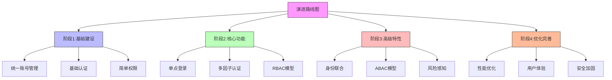
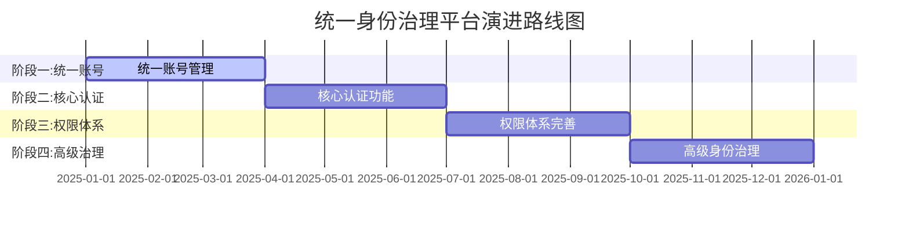

在企业级统一身份治理平台的建设过程中，制定一个清晰、可执行的演进路线图是确保项目成功的关键。演进路线图不仅为项目实施提供了明确的方向和时间表，还能帮助企业在有限的资源和时间内，逐步实现从基础的统一账号管理到全面身份治理的目标。本文将深入探讨如何制定有效的演进路线图，以及从统一账号到全面身份治理的演进路径。

## 引言

企业级统一身份治理平台的建设是一个复杂的系统工程，涉及技术、流程、人员和组织等多个维度。试图一次性完成所有功能的建设往往会面临巨大的风险和挑战。因此，制定一个分阶段、渐进式的演进路线图，能够帮助企业更好地管理项目风险，控制实施成本，并在每个阶段都能获得可见的业务价值。

## 演进路线图设计原则

### 分阶段实施原则

分阶段实施是演进路线图的核心原则，它要求我们将复杂的项目分解为多个可管理的阶段：



### 价值驱动原则

每个阶段都应该交付可衡量的业务价值，确保投资回报：

```java
public class ValueDrivenRoadmap {
    // 阶段价值评估
    public class PhaseValueAssessment {
        private String phaseName;
        private BusinessValue businessValue;
        private TechnicalValue technicalValue;
        private RiskReduction riskReduction;
        private CostBenefitAnalysis costBenefit;
        
        public PhaseValueReport generateValueReport() {
            PhaseValueReport report = new PhaseValueReport();
            
            // 业务价值评估
            report.setBusinessValue(this.assessBusinessValue());
            
            // 技术价值评估
            report.setTechnicalValue(this.assessTechnicalValue());
            
            // 风险降低评估
            report.setRiskReduction(this.assessRiskReduction());
            
            // 成本效益分析
            report.setCostBenefit(this.analyzeCostBenefit());
            
            // 综合价值评分
            report.setOverallValue(this.calculateOverallValue());
            
            return report;
        }
        
        private BusinessValue assessBusinessValue() {
            BusinessValue value = new BusinessValue();
            
            // 用户体验改善
            value.setUserExperienceImprovement(this.calculateUserExperienceGain());
            
            // 运营效率提升
            value.setOperationalEfficiencyGain(this.calculateEfficiencyGain());
            
            // 安全性增强
            value.setSecurityEnhancement(this.calculateSecurityGain());
            
            // 合规性改善
            value.setComplianceImprovement(this.calculateComplianceGain());
            
            return value;
        }
    }
    
    // 价值量化模型
    public class ValueQuantificationModel {
        // 用户体验价值计算
        public double calculateUserExperienceValue(int userCount, double timeSavedPerUser) {
            // 假设每人每小时价值100元
            return userCount * timeSavedPerUser * 100;
        }
        
        // 运营效率价值计算
        public double calculateOperationalEfficiencyValue(int adminCount, double timeSavedPerAdmin) {
            // 假设每个管理员每小时价值200元
            return adminCount * timeSavedPerAdmin * 200;
        }
        
        // 安全风险降低价值计算
        public double calculateSecurityValue(double riskReduction, double potentialLoss) {
            return riskReduction * potentialLoss;
        }
    }
}
```

### 风险控制原则

在路线图设计中充分考虑风险因素，制定相应的控制措施：

```python
class RiskControlRoadmap:
    def __init__(self):
        self.risks = []
        self.mitigation_strategies = {}
    
    def identify_evolution_risks(self):
        """识别演进风险"""
        risks = [
            {
                'id': 'technical_complexity',
                'name': '技术复杂性风险',
                'description': '随着功能增加，技术实现复杂度上升',
                'probability': 0.7,
                'impact': 0.8,
                'mitigation': '分阶段实施，逐步增加复杂度'
            },
            {
                'id': 'user_adoption',
                'name': '用户接受度风险',
                'description': '用户可能抗拒新系统和流程',
                'probability': 0.6,
                'impact': 0.7,
                'mitigation': '用户培训，渐进式切换'
            },
            {
                'id': 'integration_failure',
                'name': '系统集成风险',
                'description': '与现有系统集成可能失败',
                'probability': 0.5,
                'impact': 0.9,
                'mitigation': 'POC验证，预留回退方案'
            },
            {
                'id': 'data_migration',
                'name': '数据迁移风险',
                'description': '用户和权限数据迁移可能出错',
                'probability': 0.4,
                'impact': 0.8,
                'mitigation': '数据备份，分批迁移验证'
            }
        ]
        self.risks = risks
        return risks
    
    def design_risk_control_measures(self):
        """设计风险控制措施"""
        for risk in self.risks:
            self.mitigation_strategies[risk['id']] = {
                'preventive_measures': self.design_preventive_measures(risk),
                'contingency_plans': self.design_contingency_plans(risk),
                'monitoring_indicators': self.define_monitoring_indicators(risk)
            }
    
    def design_preventive_measures(self, risk):
        """设计预防措施"""
        measures = []
        if risk['id'] == 'technical_complexity':
            measures = [
                '技术原型验证',
                '分阶段功能实现',
                '代码审查机制',
                '自动化测试覆盖'
            ]
        elif risk['id'] == 'user_adoption':
            measures = [
                '用户需求调研',
                '用户体验设计',
                '培训计划制定',
                '试点项目实施'
            ]
        elif risk['id'] == 'integration_failure':
            measures = [
                '系统兼容性测试',
                '接口规范定义',
                '容错机制设计',
                '回退方案准备'
            ]
        elif risk['id'] == 'data_migration':
            measures = [
                '数据清洗验证',
                '迁移脚本测试',
                '数据一致性检查',
                '回滚机制准备'
            ]
        return measures
```

## 从统一账号到全面身份治理的演进路径

### 阶段一：统一账号管理（Months 1-3）

这是整个演进过程的基础阶段，主要目标是建立统一的用户身份管理体系：

```javascript
// 阶段一：统一账号管理实施计划
class PhaseOneUnifiedAccount {
  constructor() {
    this.phaseName = "统一账号管理";
    this.duration = "3个月";
    this.objectives = [
      "建立统一用户目录",
      "实现账号生命周期管理",
      "提供基础自助服务"
    ];
  }
  
  getImplementationPlan() {
    return {
      month1: {
        activities: [
          "需求分析和系统设计",
          "技术选型和环境准备",
          "用户数据收集和清洗",
          "基础架构搭建"
        ],
        deliverables: [
          "系统架构设计文档",
          "技术方案说明书",
          " cleaned user data set"
        ]
      },
      month2: {
        activities: [
          "用户目录服务部署",
          "账号管理功能开发",
          "基础自助服务实现",
          "用户数据导入"
        ],
        deliverables: [
          "用户目录服务上线",
          "账号管理功能完成",
          "基础自助服务可用",
          "用户数据迁移完成"
        ]
      },
      month3: {
        activities: [
          "系统测试和优化",
          "用户培训和文档编写",
          "试运行和问题修复",
          "正式上线"
        ],
        deliverables: [
          "测试报告",
          "用户手册",
          "上线报告",
          "运维手册"
        ]
      }
    };
  }
  
  getSuccessMetrics() {
    return {
      userCoverage: ">= 95% 的员工账号统一管理",
      dataAccuracy: ">= 98% 的用户信息准确",
      systemAvailability: ">= 99.5% 的系统可用性",
      userSatisfaction: ">= 4.0/5.0 的用户满意度"
    };
  }
}
```

### 阶段二：核心认证功能（Months 4-6）

在统一账号的基础上，实现核心的认证功能：

```sql
-- 阶段二核心认证功能数据库设计
CREATE TABLE phase_two_auth_features (
    feature_id VARCHAR(50) PRIMARY KEY,
    feature_name VARCHAR(100) NOT NULL,
    description TEXT,
    implementation_phase VARCHAR(20),  -- month4, month5, month6
    dependency_features JSON,          -- 依赖的其他功能
    security_level VARCHAR(20),        -- HIGH, MEDIUM, LOW
    complexity_level INT,              -- 1-5, 5为最复杂
    estimated_effort INT,              -- 人天
    status VARCHAR(20) DEFAULT 'PLANNED'  -- PLANNED, IN_PROGRESS, COMPLETED
);

-- 核心认证功能列表
INSERT INTO phase_two_auth_features (feature_id, feature_name, description, implementation_phase, security_level, complexity_level, estimated_effort) VALUES
('sso_core', '核心SSO功能', '实现基于SAML/OIDC的单点登录', 'month4', 'HIGH', 4, 20),
('pwd_auth', '密码认证', '实现安全的密码认证机制', 'month4', 'HIGH', 3, 15),
('mfa_totp', 'TOTP多因子', '实现基于时间的一次性密码', 'month5', 'HIGH', 3, 12),
('session_mgmt', '会话管理', '实现分布式会话管理', 'month5', 'MEDIUM', 4, 18),
('pwd_policy', '密码策略', '实现企业级密码策略', 'month6', 'HIGH', 2, 8),
('auth_audit', '认证审计', '实现认证日志和审计', 'month6', 'HIGH', 3, 10);

-- 阶段二进度跟踪视图
CREATE VIEW phase_two_progress AS
SELECT 
    implementation_phase,
    COUNT(*) as total_features,
    COUNT(CASE WHEN status = 'COMPLETED' THEN 1 END) as completed_features,
    ROUND(COUNT(CASE WHEN status = 'COMPLETED' THEN 1 END) * 100.0 / COUNT(*), 2) as completion_percentage,
    SUM(estimated_effort) as total_effort,
    SUM(CASE WHEN status = 'COMPLETED' THEN estimated_effort ELSE 0 END) as completed_effort
FROM phase_two_auth_features
GROUP BY implementation_phase
ORDER BY implementation_phase;
```

### 阶段三：权限体系完善（Months 7-9）

建立完善的权限管理体系：

```java
public class PhaseThreeAuthorization {
    private List<AuthorizationFeature> features;
    private Timeline timeline;
    
    public PhaseThreeAuthorization() {
        this.features = this.defineAuthorizationFeatures();
        this.timeline = new Timeline(7, 9); // 第7-9个月
    }
    
    private List<AuthorizationFeature> defineAuthorizationFeatures() {
        List<AuthorizationFeature> features = new ArrayList<>();
        
        // RBAC模型实现
        features.add(new AuthorizationFeature(
            "rbac_model", 
            "RBAC权限模型", 
            "实现基于角色的访问控制模型",
            7,  // 第7个月开始
            20, // 20人天工作量
            Arrays.asList("user_management", "group_management")
        ));
        
        // 权限分配管理
        features.add(new AuthorizationFeature(
            "permission_assignment", 
            "权限分配管理", 
            "实现权限的分配、回收和继承",
            7,  // 第7个月开始
            25, // 25人天工作量
            Arrays.asList("rbac_model")
        ));
        
        // ABAC模型试点
        features.add(new AuthorizationFeature(
            "abac_pilot", 
            "ABAC模型试点", 
            "在特定场景下试点基于属性的访问控制",
            8,  // 第8个月开始
            30, // 30人天工作量
            Arrays.asList("rbac_model", "user_attributes")
        ));
        
        // 权限审计功能
        features.add(new AuthorizationFeature(
            "permission_audit", 
            "权限审计", 
            "实现权限使用和变更的审计功能",
            8,  // 第8个月开始
            15, // 15人天工作量
            Arrays.asList("permission_assignment")
        ));
        
        // 权限优化工具
        features.add(new AuthorizationFeature(
            "permission_optimization", 
            "权限优化", 
            "提供权限分析和优化建议工具",
            9,  // 第9个月开始
            20, // 20人天工作量
            Arrays.asList("permission_audit", "abac_pilot")
        ));
        
        return features;
    }
    
    // 阶段实施计划
    public ImplementationPlan generateImplementationPlan() {
        ImplementationPlan plan = new ImplementationPlan();
        
        // 第7个月计划
        plan.addMonthPlan(7, this.getMonth7Plan());
        
        // 第8个月计划
        plan.addMonthPlan(8, this.getMonth8Plan());
        
        // 第9个月计划
        plan.addMonthPlan(9, this.getMonth9Plan());
        
        return plan;
    }
    
    private MonthPlan getMonth7Plan() {
        MonthPlan plan = new MonthPlan(7);
        plan.addTask(new Task(
            "设计RBAC模型", 
            "完成RBAC模型的详细设计", 
            5,  // 5人天
            Arrays.asList("系统架构师", "安全专家")
        ));
        plan.addTask(new Task(
            "开发角色管理功能", 
            "实现角色的创建、修改、删除功能", 
            8,  // 8人天
            Arrays.asList("后端开发工程师")
        ));
        plan.addTask(new Task(
            "开发权限分配功能", 
            "实现用户到角色的权限分配", 
            7,  // 7人天
            Arrays.asList("后端开发工程师")
        ));
        return plan;
    }
}
```

### 阶段四：高级身份治理（Months 10-12）

实现高级身份治理功能：

```python
class PhaseFourAdvancedIdentity:
    def __init__(self):
        self.phase_name = "高级身份治理"
        self.duration = "3个月"
        self.start_month = 10
        self.end_month = 12
    
    def get_advanced_features(self):
        """获取高级身份治理功能"""
        return {
            'identity_federation': {
                'name': '身份联合',
                'description': '实现与外部身份提供商的联合认证',
                'start_month': 10,
                'duration': 2,
                'key_activities': [
                    '外部IdP集成',
                    'SP/IdP模式实现',
                    'JIT预配机制'
                ]
            },
            'risk_adaptive_auth': {
                'name': '风险自适应认证',
                'description': '基于风险评估的动态认证机制',
                'start_month': 10,
                'duration': 3,
                'key_activities': [
                    '行为分析引擎',
                    '风险评估模型',
                    '动态认证策略'
                ]
            },
            'access_review': {
                'name': '权限审阅',
                'description': '定期权限审阅和治理',
                'start_month': 11,
                'duration': 2,
                'key_activities': [
                    '审阅流程设计',
                    '自动化审阅机制',
                    '审阅报告生成'
                ]
            },
            'identity_governance': {
                'name': '身份治理',
                'description': '全面的身份治理能力',
                'start_month': 12,
                'duration': 1,
                'key_activities': [
                    '治理策略定义',
                    '合规性检查',
                    '治理报告'
                ]
            }
        }
    
    def generate_implementation_timeline(self):
        """生成实施时间线"""
        features = self.get_advanced_features()
        timeline = {}
        
        for month in range(self.start_month, self.end_month + 1):
            timeline[month] = {
                'month': month,
                'features': [],
                'milestones': []
            }
            
            for feature_key, feature in features.items():
                if feature['start_month'] <= month < (feature['start_month'] + feature['duration']):
                    timeline[month]['features'].append({
                        'key': feature_key,
                        'name': feature['name'],
                        'description': feature['description']
                    })
            
            # 定义里程碑
            if month == 10:
                timeline[month]['milestones'] = ['高级身份治理阶段启动']
            elif month == 11:
                timeline[month]['milestones'] = ['身份联合功能完成']
            elif month == 12:
                timeline[month]['milestones'] = ['全面身份治理能力上线']
        
        return timeline
```

## 演进路线图管理

### 路线图可视化



### 进度监控机制

```javascript
// 演进进度监控系统
class EvolutionProgressMonitor {
  constructor(roadmap) {
    this.roadmap = roadmap;
    this.progressData = new Map();
    this.alerts = new AlertSystem();
  }
  
  trackPhaseProgress(phase, completedTasks, totalTasks) {
    const progress = {
      phase: phase,
      completedTasks: completedTasks,
      totalTasks: totalTasks,
      completionRate: completedTasks / totalTasks,
      lastUpdated: new Date(),
      status: this.calculatePhaseStatus(completedTasks, totalTasks)
    };
    
    this.progressData.set(phase, progress);
    
    // 检查是否需要发送警报
    this.checkProgressAlerts(phase, progress);
    
    return progress;
  }
  
  calculatePhaseStatus(completedTasks, totalTasks) {
    const completionRate = completedTasks / totalTasks;
    if (completionRate === 1) return 'COMPLETED';
    if (completionRate >= 0.8) return 'ALMOST_COMPLETED';
    if (completionRate >= 0.5) return 'IN_PROGRESS';
    if (completionRate > 0) return 'STARTED';
    return 'NOT_STARTED';
  }
  
  checkProgressAlerts(phase, progress) {
    // 进度落后警报
    const plannedProgress = this.getPlannedProgress(phase);
    if (progress.completionRate < plannedProgress - 0.1) {
      this.alerts.sendAlert({
        type: 'PROGRESS_BEHIND',
        phase: phase,
        actual: progress.completionRate,
        planned: plannedProgress,
        severity: 'HIGH'
      });
    }
    
    // 关键里程碑警报
    if (this.isCriticalMilestoneApproaching(phase)) {
      this.alerts.sendAlert({
        type: 'CRITICAL_MILESTONE',
        phase: phase,
        milestone: this.getNextMilestone(phase),
        daysRemaining: this.getDaysToMilestone(phase)
      });
    }
  }
  
  generateProgressReport() {
    const report = {
      overallProgress: this.calculateOverallProgress(),
      phaseProgress: Array.from(this.progressData.values()),
      risks: this.identifyProgressRisks(),
      recommendations: this.generateProgressRecommendations()
    };
    
    return report;
  }
}
```

### 变更管理

```sql
-- 演进路线图变更管理数据库设计
CREATE TABLE roadmap_changes (
    change_id VARCHAR(50) PRIMARY KEY,
    change_type VARCHAR(50),           -- SCOPE, TIMELINE, RESOURCE
    phase_affected VARCHAR(50),
    original_plan JSON,
    proposed_change JSON,
    change_reason TEXT,
    impact_assessment JSON,
    approval_status VARCHAR(20),       -- PENDING, APPROVED, REJECTED
    approved_by VARCHAR(100),
    approved_date TIMESTAMP,
    implemented BOOLEAN DEFAULT FALSE,
    created_at TIMESTAMP DEFAULT CURRENT_TIMESTAMP,
    updated_at TIMESTAMP DEFAULT CURRENT_TIMESTAMP ON UPDATE CURRENT_TIMESTAMP
);

-- 变更影响评估视图
CREATE VIEW change_impact_assessment AS
SELECT 
    change_id,
    change_type,
    phase_affected,
    change_reason,
    JSON_EXTRACT(impact_assessment, '$.schedule_impact') as schedule_impact,
    JSON_EXTRACT(impact_assessment, '$.cost_impact') as cost_impact,
    JSON_EXTRACT(impact_assessment, '$.resource_impact') as resource_impact,
    JSON_EXTRACT(impact_assessment, '$.risk_impact') as risk_impact,
    approval_status,
    CASE 
        WHEN JSON_EXTRACT(impact_assessment, '$.schedule_impact') > 0.2 THEN 'HIGH'
        WHEN JSON_EXTRACT(impact_assessment, '$.schedule_impact') > 0.1 THEN 'MEDIUM'
        ELSE 'LOW'
    END as schedule_impact_level
FROM roadmap_changes
WHERE approval_status = 'APPROVED'
ORDER BY created_at DESC;
```

## 成功保障措施

### 治理机制

```java
public class RoadmapGovernance {
    private GovernanceBoard governanceBoard;
    private SteeringCommittee steeringCommittee;
    private WorkingGroups workingGroups;
    
    // 治理委员会职责
    public class GovernanceBoard {
        private List<Stakeholder> members;
        private DecisionMakingProcess decisionProcess;
        
        public void reviewRoadmapProgress() {
            // 月度进度审查
            MonthlyProgressReview review = new MonthlyProgressReview();
            review.setReviewDate(new Date());
            review.setRoadmapStatus(this.assessRoadmapStatus());
            review.setKeyIssues(this.identifyKeyIssues());
            review.setRecommendations(this.generateRecommendations());
            
            // 决策制定
            this.makeDecisions(review);
        }
        
        private RoadmapStatus assessRoadmapStatus() {
            RoadmapStatus status = new RoadmapStatus();
            status.setOverallProgress(this.calculateOverallProgress());
            status.setPhaseStatus(this.getPhaseStatus());
            status.setRiskLevel(this.assessRiskLevel());
            status.setBudgetStatus(this.checkBudgetStatus());
            return status;
        }
    }
    
    // 决策制定流程
    public class DecisionMakingProcess {
        public Decision makeDecision(ReviewReport report) {
            Decision decision = new Decision();
            
            // 紧急决策
            if (report.getUrgencyLevel() == UrgencyLevel.CRITICAL) {
                decision.setType(DecisionType.IMMEDIATE);
                decision.setApprover("Governance Board Chair");
                decision.setTimeline("24小时内");
            }
            // 常规决策
            else if (report.getImpactLevel() == ImpactLevel.HIGH) {
                decision.setType(DecisionType.FORMAL);
                decision.setApprover("Steering Committee");
                decision.setTimeline("5个工作日内");
            }
            // 日常决策
            else {
                decision.setType(DecisionType.ROUTINE);
                decision.setApprover("Project Manager");
                decision.setTimeline("2个工作日内");
            }
            
            return decision;
        }
    }
}
```

### 沟通机制

```python
class CommunicationFramework:
    def __init__(self):
        self.stakeholders = []
        self.communication_channels = {}
        self.communication_schedule = {}
    
    def setup_stakeholder_communication(self):
        """设置利益相关者沟通"""
        # 高层管理者沟通
        self.communication_channels['executives'] = {
            'frequency': 'monthly',
            'format': 'executive_summary',
            'channels': ['email', 'meeting'],
            'content': ['overall_progress', 'budget_status', 'major_risks']
        }
        
        # 项目团队沟通
        self.communication_channels['project_team'] = {
            'frequency': 'weekly',
            'format': 'detailed_report',
            'channels': ['standup_meeting', 'project_management_tool'],
            'content': ['task_status', 'blockers', 'upcoming_work']
        }
        
        # 业务用户沟通
        self.communication_channels['business_users'] = {
            'frequency': 'bi_weekly',
            'format': 'user_focused_update',
            'channels': ['newsletter', 'town_hall'],
            'content': ['new_features', 'training_opportunities', 'feedback_requests']
        }
        
        # 技术团队沟通
        self.communication_channels['technical_team'] = {
            'frequency': 'daily',
            'format': 'technical_updates',
            'channels': ['slack', 'code_reviews'],
            'content': ['technical_challenges', 'architecture_decisions', 'best_practices']
        }
    
    def generate_communication_schedule(self):
        """生成沟通时间表"""
        schedule = {
            'monthly': {
                'day': 1,  # 每月1日
                'audience': ['executives'],
                'template': 'monthly_executive_report'
            },
            'weekly': {
                'day': 'Monday',
                'audience': ['project_team'],
                'template': 'weekly_project_status'
            },
            'bi_weekly': {
                'weeks': [1, 3],  # 每月第1周和第3周
                'audience': ['business_users'],
                'template': 'bi_weekly_user_update'
            }
        }
        self.communication_schedule = schedule
        return schedule
```

## 总结

制定演进路线图是从统一账号到全面身份治理的关键步骤。通过分阶段、价值驱动和风险控制的原则，企业可以有效地管理复杂的身份治理平台建设项目。

从统一账号管理开始，逐步实现核心认证功能、完善权限体系，最终达到高级身份治理的目标，这样的演进路径既保证了项目的可行性，又确保了每个阶段都能交付实际的业务价值。

在实施过程中，建立完善的治理机制、进度监控体系和沟通机制，能够确保演进路线图的有效执行，并及时应对各种挑战和变化。

通过科学的演进路线图设计和管理，企业可以成功构建一个安全、高效、可扩展的统一身份治理平台，为数字化转型提供坚实的身份基础设施支撑。