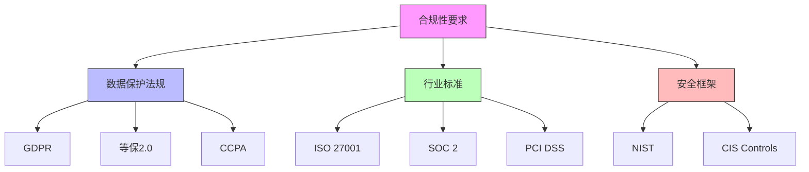

在企业级统一身份治理平台的建设和运营过程中，审计、合规与安全治理是确保平台长期稳定运行和满足监管要求的关键环节。随着网络安全威胁的不断演变和监管要求的日益严格，建立完善的审计机制、满足各类合规性要求以及实施有效的安全治理措施变得尤为重要。

## 引言

企业级统一身份治理平台不仅需要提供强大的身份认证和授权功能，还必须具备完善的审计、合规与安全治理能力。这些能力不仅是满足法律法规要求的基础，更是保障企业信息安全、提升用户信任度的重要手段。

## 审计机制的重要性

审计机制是身份治理平台的重要组成部分，它能够记录和追踪所有与身份相关的操作，包括用户登录、权限变更、资源访问等。通过完整的审计日志，企业可以：

1. **安全事件追溯**：在发生安全事件时，能够快速定位问题根源
2. **合规性证明**：为各类合规性审计提供必要的证据
3. **行为分析**：通过分析用户行为模式，识别异常操作
4. **责任界定**：明确操作责任，防止恶意行为

## 合规性要求

不同行业和地区对企业身份治理平台有着不同的合规性要求。常见的合规性标准包括：

## 安全治理框架

安全治理是确保身份治理平台持续安全运行的管理框架，它包括：

1. **权限治理**：定期审查和优化权限分配
2. **密钥管理**：安全地管理加密密钥和证书
3. **风险评估**：持续评估和缓解安全风险
4. **应急响应**：建立完善的安全事件响应机制

## 本章内容概览

在本章中，我们将深入探讨以下关键主题：

### 9.1 全链路审计日志
- 审计日志的设计原则和最佳实践
- 关键操作的审计覆盖
- 审计日志的存储、检索和分析
- 审计日志的安全保护

### 9.2 合规性支持
- GDPR、等保2.0、SOC2等主要合规标准的要求
- 合规性功能的平台化实现
- 合规性报告的自动生成
- 合规性监控和预警机制

### 9.3 定期权限审阅流程
- 访问权限审阅的业务流程设计
- 自动化权限审阅机制的实现
- 审阅结果的处理和跟踪
- 权限治理的持续优化

### 9.4 密钥、证书安全管理
- 加密密钥的生命周期管理
- 数字证书的申请、部署和轮换
- 密钥存储的安全机制
- 密钥泄露的应急处理

## 实施建议

在实施审计、合规与安全治理功能时，建议遵循以下原则：

1. **全面覆盖**：确保所有关键操作都被审计记录
2. **实时监控**：建立实时监控和告警机制
3. **自动化处理**：尽可能自动化合规性检查和权限审阅
4. **持续改进**：定期评估和优化安全治理措施

## 总结

审计、合规与安全治理是企业级统一身份治理平台不可或缺的重要组成部分。通过建立完善的审计机制、满足各类合规性要求以及实施有效的安全治理措施，企业不仅能够满足监管要求，更能够提升平台的安全性和可信度，为业务的持续发展提供坚实保障。

在后续章节中，我们将详细探讨每个主题的具体实现方案和最佳实践，帮助企业构建一个既满足合规要求又具备强大安全能力的身份治理平台。