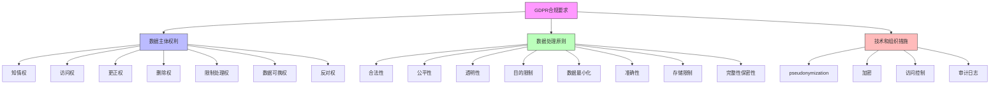

在数字化时代，企业面临着越来越多的数据保护和隐私法规要求。统一身份治理平台作为企业信息安全的核心基础设施，必须满足各种合规性标准，包括GDPR、等保2.0、SOC2等。本文将深入探讨这些主要合规标准对身份治理的具体要求，并提供平台化实现的建议。

## 引言

随着全球数字化进程的加速，数据保护和隐私已成为企业必须面对的重要议题。各国政府和监管机构纷纷出台相关法规，要求企业采取有效措施保护用户数据和隐私。统一身份治理平台作为管理用户身份和访问权限的核心系统，必须满足这些合规性要求，否则企业将面临严重的法律风险和经济损失。

## GDPR合规性要求

### GDPR概述

《通用数据保护条例》(General Data Protection Regulation, GDPR)是欧盟于2018年5月25日生效的数据保护法规，被认为是全球最严格的数据保护法规之一。GDPR适用于所有处理欧盟居民个人数据的组织，无论其所在地。

### GDPR对身份治理的要求



### GDPR合规性实现方案

```java
public class GDPRComplianceService {
    private final UserDataService userDataService;
    private final AuditService auditService;
    private final ConsentManagementService consentService;
    
    // 数据主体访问请求处理
    public UserDataReport handleDataSubjectAccessRequest(String userId) {
        // 验证用户身份
        validateUserIdentity(userId);
        
        // 收集用户所有数据
        UserDataReport report = new UserDataReport();
        report.setPersonalData(userDataService.getPersonalData(userId));
        report.setConsentRecords(consentService.getUserConsents(userId));
        report.setProcessingActivities(getProcessingActivities(userId));
        report.setThirdPartySharing(getThirdPartySharingInfo(userId));
        
        // 记录访问日志
        auditService.logGDPRRequest(userId, "DATA_ACCESS", "SUCCESS");
        
        return report;
    }
    
    // 数据删除请求处理
    public boolean handleRightToErasure(String userId) {
        try {
            // 验证用户身份
            validateUserIdentity(userId);
            
            // 检查是否有合法保留理由
            if (hasLegalRetentionRequirement(userId)) {
                auditService.logGDPRRequest(userId, "RIGHT_TO_ERASURE", "DENIED_LEGAL_RETENTION");
                return false;
            }
            
            // 执行数据删除
            userDataService.deleteUserData(userId);
            consentService.deleteUserConsents(userId);
            deleteProcessingRecords(userId);
            
            // 记录删除操作
            auditService.logGDPRRequest(userId, "RIGHT_TO_ERASURE", "SUCCESS");
            
            return true;
        } catch (Exception e) {
            auditService.logGDPRRequest(userId, "RIGHT_TO_ERASURE", "FAILED", e.getMessage());
            throw new GDPRComplianceException("Failed to erase user data", e);
        }
    }
    
    // 数据可携性实现
    public UserDataPortabilityPackage handleDataPortabilityRequest(String userId) {
        // 验证用户身份
        validateUserIdentity(userId);
        
        // 收集可移植数据
        UserDataPortabilityPackage pkg = new UserDataPortabilityPackage();
        pkg.setPersonalData(userDataService.getStructuredPersonalData(userId));
        pkg.setConsentHistory(consentService.getConsentHistory(userId));
        pkg.setProcessingHistory(getProcessingHistory(userId));
        
        // 格式化为标准格式（JSON）
        pkg.setFormat("JSON");
        pkg.setVersion("1.0");
        
        // 记录请求
        auditService.logGDPRRequest(userId, "DATA_PORTABILITY", "SUCCESS");
        
        return pkg;
    }
    
    // 同意管理
    public ConsentRecord manageUserConsent(String userId, ConsentRequest request) {
        // 验证用户身份
        validateUserIdentity(userId);
        
        // 创建同意记录
        ConsentRecord consent = ConsentRecord.builder()
            .userId(userId)
            .purpose(request.getPurpose())
            .dataTypes(request.getDataTypes())
            .processingActivities(request.getProcessingActivities())
            .consentGiven(true)
            .timestamp(Instant.now())
            .expiryDate(request.getExpiryDate())
            .build();
        
        // 存储同意记录
        ConsentRecord savedConsent = consentService.saveConsent(consent);
        
        // 记录同意操作
        auditService.logConsentAction(userId, "CONSENT_GIVEN", consent.getId());
        
        return savedConsent;
    }
}
```

## 等保2.0合规性要求

### 等保2.0概述

网络安全等级保护2.0（简称等保2.0）是我国网络安全领域的重要制度，对网络和信息系统的安全保护提出了明确要求。等保2.0将保护对象分为五个等级，不同等级有不同的安全要求。

### 等保2.0对身份治理的要求

```python
class LevelProtectionCompliance:
    def __init__(self, level):
        self.level = level  # 1-5级
        self.requirements = self._get_requirements_for_level(level)
    
    def _get_requirements_for_level(self, level):
        """获取指定等级的安全要求"""
        requirements = {
            1: {
                'authentication': '基本身份鉴别',
                'authorization': '基本访问控制',
                'audit': '基本安全审计',
                'protection': '基本数据完整性'
            },
            2: {
                'authentication': '用户身份标识和鉴别',
                'authorization': '自主访问控制',
                'audit': '安全审计功能',
                'protection': '数据完整性保护',
                'backup': '数据备份'
            },
            3: {
                'authentication': '多因子身份鉴别',
                'authorization': '强制访问控制',
                'audit': '详细安全审计',
                'protection': '数据完整性及保密性保护',
                'backup': '重要数据备份与恢复',
                'monitoring': '恶意代码防范'
            },
            4: {
                'authentication': '多因子身份鉴别（生物特征）',
                'authorization': '标记与强制访问控制',
                'audit': '实时审计与分析',
                'protection': '结构化保护',
                'backup': '异地备份',
                'monitoring': '入侵检测与防范'
            },
            5: {
                'authentication': '多因子身份鉴别（生物特征+硬件令牌）',
                'authorization': '细粒度强制访问控制',
                'audit': '智能审计与预警',
                'protection': '域级保护',
                'backup': '容灾备份',
                'monitoring': '主动防御'
            }
        }
        return requirements.get(level, {})
    
    def check_compliance(self, identity_system):
        """检查身份治理系统的合规性"""
        compliance_report = {
            'level': self.level,
            'requirements': self.requirements,
            'compliance_status': {},
            'issues': []
        }
        
        # 检查身份鉴别
        if 'authentication' in self.requirements:
            auth_compliant = self._check_authentication(identity_system)
            compliance_report['compliance_status']['authentication'] = auth_compliant
            if not auth_compliant:
                compliance_report['issues'].append('身份鉴别不符合要求')
        
        # 检查访问控制
        if 'authorization' in self.requirements:
            authz_compliant = self._check_authorization(identity_system)
            compliance_report['compliance_status']['authorization'] = authz_compliant
            if not authz_compliant:
                compliance_report['issues'].append('访问控制不符合要求')
        
        # 检查安全审计
        if 'audit' in self.requirements:
            audit_compliant = self._check_audit(identity_system)
            compliance_report['compliance_status']['audit'] = audit_compliant
            if not audit_compliant:
                compliance_report['issues'].append('安全审计不符合要求')
        
        return compliance_report
    
    def _check_authentication(self, identity_system):
        """检查身份鉴别合规性"""
        if self.level >= 3:
            # 三级及以上要求多因子认证
            return identity_system.has_mfa_enabled()
        elif self.level >= 2:
            # 二级要求用户身份标识和鉴别
            return identity_system.has_basic_authentication()
        else:
            # 一级要求基本身份鉴别
            return identity_system.has_minimal_authentication()
    
    def _check_authorization(self, identity_system):
        """检查访问控制合规性"""
        if self.level >= 4:
            # 四级要求标记与强制访问控制
            return identity_system.has_labeled_mandatory_access_control()
        elif self.level >= 3:
            # 三级要求强制访问控制
            return identity_system.has_mandatory_access_control()
        elif self.level >= 2:
            # 二级要求自主访问控制
            return identity_system.has_discretionary_access_control()
        else:
            # 一级要求基本访问控制
            return identity_system.has_basic_access_control()
```

### 等保2.0合规性实现方案

```sql
-- 等保2.0合规性数据库设计
CREATE TABLE level_protection_compliance (
    id VARCHAR(50) PRIMARY KEY,
    system_id VARCHAR(50) NOT NULL,
    protection_level INT NOT NULL,  -- 保护等级 1-5
    assessment_date TIMESTAMP NOT NULL,
    next_assessment_date TIMESTAMP NOT NULL,
    compliance_status VARCHAR(20),  -- COMPLIANT, NON_COMPLIANT, PENDING
    assessor VARCHAR(100),
    assessment_report TEXT,
    created_at TIMESTAMP DEFAULT CURRENT_TIMESTAMP,
    updated_at TIMESTAMP DEFAULT CURRENT_TIMESTAMP ON UPDATE CURRENT_TIMESTAMP,
    
    INDEX idx_system_level (system_id, protection_level),
    INDEX idx_assessment_date (assessment_date),
    INDEX idx_compliance_status (compliance_status)
);

-- 合规性检查项表
CREATE TABLE compliance_check_items (
    id VARCHAR(50) PRIMARY KEY,
    compliance_id VARCHAR(50) NOT NULL,
    check_category VARCHAR(50),  -- 身份鉴别, 访问控制, 安全审计, etc.
    check_item VARCHAR(200) NOT NULL,
    requirement_level INT,  -- 要求等级
    check_result VARCHAR(20),  -- PASS, FAIL, NOT_APPLICABLE
    evidence TEXT,  -- 检查证据
    comments TEXT,
    
    FOREIGN KEY (compliance_id) REFERENCES level_protection_compliance(id)
);

-- 创建视图展示合规性状态
CREATE VIEW compliance_status_overview AS
SELECT 
    lpc.system_id,
    lpc.protection_level,
    lpc.compliance_status,
    lpc.assessment_date,
    lpc.next_assessment_date,
    COUNT(CASE WHEN cci.check_result = 'FAIL' THEN 1 END) as failed_checks,
    COUNT(CASE WHEN cci.check_result = 'PASS' THEN 1 END) as passed_checks,
    ROUND(COUNT(CASE WHEN cci.check_result = 'PASS' THEN 1 END) * 100.0 / COUNT(*), 2) as compliance_rate
FROM level_protection_compliance lpc
LEFT JOIN compliance_check_items cci ON lpc.id = cci.compliance_id
GROUP BY lpc.id, lpc.system_id, lpc.protection_level, lpc.compliance_status, 
         lpc.assessment_date, lpc.next_assessment_date;
```

## SOC2合规性要求

### SOC2概述

SOC2（Service Organization Control 2）是由美国注册会计师协会(AICPA)制定的服务组织控制框架，主要关注系统的安全性、可用性、处理完整性、保密性和隐私性五个信任服务原则。

### SOC2对身份治理的要求

```javascript
// SOC2合规性检查服务
class SOC2ComplianceService {
  constructor(config) {
    this.config = config;
    this.trustPrinciples = {
      security: '安全性',
      availability: '可用性',
      processingIntegrity: '处理完整性',
      confidentiality: '保密性',
      privacy: '隐私性'
    };
  }
  
  // 安全性原则检查
  async checkSecurityPrinciple(identitySystem) {
    const checks = {
      accessControl: await this.checkAccessControl(identitySystem),
      intrusionDetection: await this.checkIntrusionDetection(identitySystem),
      vulnerabilityManagement: await this.checkVulnerabilityManagement(identitySystem),
      incidentResponse: await this.checkIncidentResponse(identitySystem)
    };
    
    return {
      principle: 'security',
      compliant: Object.values(checks).every(check => check.passed),
      checks: checks
    };
  }
  
  // 隐私性原则检查
  async checkPrivacyPrinciple(identitySystem) {
    const checks = {
      dataCollection: await this.checkDataCollection(identitySystem),
      dataUsage: await this.checkDataUsage(identitySystem),
      dataRetention: await this.checkDataRetention(identitySystem),
      dataDisposal: await this.checkDataDisposal(identitySystem),
      userRights: await this.checkUserRights(identitySystem)
    };
    
    return {
      principle: 'privacy',
      compliant: Object.values(checks).every(check => check.passed),
      checks: checks
    };
  }
  
  // 访问控制检查
  async checkAccessControl(identitySystem) {
    const results = {
      multiFactorAuth: identitySystem.isMFAEnabled(),
      roleBasedAccess: identitySystem.hasRBAC(),
      leastPrivilege: identitySystem.enforcesLeastPrivilege(),
      sessionManagement: identitySystem.hasSecureSessionManagement()
    };
    
    return {
      check: 'accessControl',
      passed: Object.values(results).every(result => result),
      details: results
    };
  }
  
  // 用户权利检查
  async checkUserRights(identitySystem) {
    const results = {
      dataAccess: identitySystem.supportsDataAccessRequests(),
      dataCorrection: identitySystem.supportsDataCorrection(),
      dataDeletion: identitySystem.supportsDataDeletion(),
      dataPortability: identitySystem.supportsDataPortability(),
      consentManagement: identitySystem.hasConsentManagement()
    };
    
    return {
      check: 'userRights',
      passed: Object.values(results).every(result => result),
      details: results
    };
  }
  
  // 生成SOC2合规性报告
  async generateComplianceReport(identitySystem) {
    const principles = Object.keys(this.trustPrinciples);
    const complianceResults = [];
    
    for (const principle of principles) {
      const checkMethod = `check${this.capitalizeFirstLetter(principle)}Principle`;
      if (typeof this[checkMethod] === 'function') {
        const result = await this[checkMethod](identitySystem);
        complianceResults.push(result);
      }
    }
    
    const overallCompliant = complianceResults.every(result => result.compliant);
    
    return {
      reportId: this.generateReportId(),
      generatedAt: new Date().toISOString(),
      systemName: identitySystem.getName(),
      overallCompliant: overallCompliant,
      principles: complianceResults,
      recommendations: this.generateRecommendations(complianceResults)
    };
  }
  
  capitalizeFirstLetter(string) {
    return string.charAt(0).toUpperCase() + string.slice(1);
  }
  
  generateReportId() {
    return 'SOC2-' + Date.now() + '-' + Math.random().toString(36).substr(2, 9);
  }
  
  generateRecommendations(complianceResults) {
    const recommendations = [];
    
    for (const principle of complianceResults) {
      for (const [checkName, checkResult] of Object.entries(principle.checks)) {
        if (!checkResult.passed) {
          recommendations.push({
            principle: principle.principle,
            check: checkName,
            issue: checkResult.details,
            recommendation: this.getRecommendationForIssue(principle.principle, checkName, checkResult.details)
          });
        }
      }
    }
    
    return recommendations;
  }
  
  getRecommendationForIssue(principle, checkName, details) {
    const recommendations = {
      security: {
        accessControl: '实施多因子认证和基于角色的访问控制',
        intrusionDetection: '部署入侵检测系统并定期更新规则',
        vulnerabilityManagement: '建立漏洞管理流程，定期扫描和修复漏洞'
      },
      privacy: {
        dataCollection: '明确数据收集目的并获得用户同意',
        dataUsage: '严格按照用户同意的范围使用数据',
        dataRetention: '制定数据保留策略并定期清理过期数据'
      }
    };
    
    return recommendations[principle]?.[checkName] || '请参考相关安全最佳实践';
  }
}
```

## 合规性功能的平台化实现

### 合规性管理控制台

```java
public class ComplianceManagementConsole {
    private final List<ComplianceStandard> supportedStandards;
    private final ComplianceAssessmentService assessmentService;
    private final ReportingService reportingService;
    
    // 合规性仪表板
    public ComplianceDashboard getComplianceDashboard() {
        ComplianceDashboard dashboard = new ComplianceDashboard();
        
        // 获取各标准的合规状态
        for (ComplianceStandard standard : supportedStandards) {
            ComplianceStatus status = assessmentService.getComplianceStatus(standard);
            dashboard.addStandardStatus(standard.getName(), status);
        }
        
        // 计算整体合规率
        dashboard.setOverallComplianceRate(calculateOverallComplianceRate());
        
        // 获取即将到期的合规性评估
        dashboard.setUpcomingAssessments(getUpcomingAssessments());
        
        // 获取合规性风险
        dashboard.setComplianceRisks(identifyComplianceRisks());
        
        return dashboard;
    }
    
    // 合规性评估
    public ComplianceAssessment performAssessment(ComplianceStandard standard) {
        // 执行自动化检查
        AutomatedChecksResults automatedResults = performAutomatedChecks(standard);
        
        // 执行手动检查
        ManualChecksResults manualResults = performManualChecks(standard);
        
        // 生成评估报告
        ComplianceAssessment assessment = new ComplianceAssessment();
        assessment.setStandard(standard);
        assessment.setAutomatedResults(automatedResults);
        assessment.setManualResults(manualResults);
        assessment.setOverallScore(calculateAssessmentScore(automatedResults, manualResults));
        assessment.setFindings(identifyFindings(automatedResults, manualResults));
        assessment.setRecommendations(generateRecommendations(assessment.getFindings()));
        assessment.setAssessmentDate(Instant.now());
        assessment.setNextAssessmentDate(calculateNextAssessmentDate(standard));
        
        // 保存评估结果
        assessmentService.saveAssessment(assessment);
        
        return assessment;
    }
    
    // 合规性报告生成
    public ComplianceReport generateComplianceReport(ComplianceStandard standard, Date from, Date to) {
        // 收集评估数据
        List<ComplianceAssessment> assessments = assessmentService.getAssessments(standard, from, to);
        
        // 收集审计日志
        List<AuditLog> auditLogs = auditService.getComplianceRelatedLogs(standard, from, to);
        
        // 收集事件数据
        List<SecurityEvent> events = securityEventService.getComplianceRelatedEvents(standard, from, to);
        
        // 生成报告
        ComplianceReport report = new ComplianceReport();
        report.setStandard(standard);
        report.setPeriod(from, to);
        report.setAssessments(assessments);
        report.setAuditLogs(auditLogs);
        report.setEvents(events);
        report.setComplianceTrend(analyzeComplianceTrend(assessments));
        report.setKeyMetrics(calculateKeyMetrics(assessments, auditLogs, events));
        
        return report;
    }
}
```

### 合规性监控和预警

```python
class ComplianceMonitoringService:
    def __init__(self, notification_service):
        self.notification_service = notification_service
        self.compliance_rules = self._load_compliance_rules()
    
    def _load_compliance_rules(self):
        """加载合规性规则"""
        return {
            'gdpr_consent_expiry': {
                'description': 'GDPR用户同意即将过期',
                'check_function': self._check_consent_expiry,
                'threshold': 30,  # 30天前提醒
                'severity': 'MEDIUM'
            },
            'data_retention_violation': {
                'description': '数据保留策略违规',
                'check_function': self._check_data_retention,
                'threshold': 0,  # 立即告警
                'severity': 'HIGH'
            },
            'access_control_violation': {
                'description': '访问控制违规',
                'check_function': self._check_access_control,
                'threshold': 0,  # 立即告警
                'severity': 'HIGH'
            }
        }
    
    def start_monitoring(self):
        """启动合规性监控"""
        while True:
            for rule_name, rule in self.compliance_rules.items():
                try:
                    violations = rule['check_function']()
                    if violations:
                        self._handle_violations(rule_name, rule, violations)
                except Exception as e:
                    logger.error(f"合规性检查失败 {rule_name}: {e}")
            
            # 每小时检查一次
            time.sleep(3600)
    
    def _check_consent_expiry(self):
        """检查即将过期的用户同意"""
        threshold_date = datetime.utcnow() + timedelta(days=30)
        expiring_consents = self.consent_service.get_consents_expiring_before(threshold_date)
        return expiring_consents
    
    def _check_data_retention(self):
        """检查数据保留策略违规"""
        violations = []
        retention_policies = self.data_governance_service.get_retention_policies()
        
        for policy in retention_policies:
            expired_data = self.data_service.get_data_exceeding_retention(policy)
            if expired_data:
                violations.append({
                    'policy': policy,
                    'expired_data': expired_data,
                    'count': len(expired_data)
                })
        
        return violations
    
    def _check_access_control(self):
        """检查访问控制违规"""
        violations = []
        
        # 检查权限过多的用户
        over_privileged_users = self.access_control_service.get_over_privileged_users()
        if over_privileged_users:
            violations.append({
                'type': 'OVER_PRIVILEGED',
                'users': over_privileged_users
            })
        
        # 检查未使用的权限
        unused_permissions = self.access_control_service.get_unused_permissions(days=90)
        if unused_permissions:
            violations.append({
                'type': 'UNUSED_PERMISSIONS',
                'permissions': unused_permissions
            })
        
        return violations
    
    def _handle_violations(self, rule_name, rule, violations):
        """处理违规情况"""
        if not violations:
            return
        
        # 记录违规日志
        logger.warning(f"合规性违规: {rule['description']}, 违规数量: {len(violations)}")
        
        # 发送告警通知
        self.notification_service.send_alert(
            alert_type='COMPLIANCE_VIOLATION',
            rule_name=rule_name,
            rule_description=rule['description'],
            violations=violations,
            severity=rule['severity']
        )
        
        # 如果是严重违规，触发应急响应
        if rule['severity'] == 'HIGH':
            self._trigger_incident_response(rule_name, violations)
    
    def _trigger_incident_response(self, rule_name, violations):
        """触发应急响应"""
        incident = {
            'id': f"COMPLIANCE-{datetime.utcnow().strftime('%Y%m%d%H%M%S')}",
            'type': 'COMPLIANCE_VIOLATION',
            'severity': 'HIGH',
            'rule_name': rule_name,
            'violations': violations,
            'detected_at': datetime.utcnow(),
            'status': 'OPEN'
        }
        
        self.incident_response_service.create_incident(incident)
```

## 总结

合规性支持是企业级统一身份治理平台不可或缺的重要功能。面对GDPR、等保2.0、SOC2等不同的合规性要求，企业需要建立完善的合规性管理体系，包括：

1. **全面理解合规要求**：深入理解各合规标准对身份治理的具体要求
2. **系统化实现**：通过技术手段实现合规性要求
3. **持续监控**：建立合规性监控和预警机制
4. **定期评估**：定期进行合规性评估和改进

通过平台化的合规性功能实现，企业不仅能够满足监管要求，还能提升用户信任度，为业务发展提供坚实保障。在后续章节中，我们将继续探讨定期权限审阅、密钥证书管理等安全治理主题。