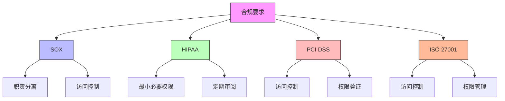

在企业级统一身份治理平台中，定期权限审阅（Access Review）是确保权限分配合理性和合规性的重要机制。通过系统化的权限审阅流程，企业可以及时发现和纠正权限分配中的问题，降低安全风险，满足合规要求。本文将深入探讨权限审阅流程的设计原则和平台化实现方案。

## 引言

随着企业组织结构的复杂化和业务系统的多样化，权限管理变得越来越复杂。不合理的权限分配可能导致安全风险增加、合规性问题以及运营效率下降。定期权限审阅作为一种主动的权限治理手段，能够帮助企业及时发现和解决权限管理中的问题，确保权限分配的合理性和安全性。

## 权限审阅的重要性

### 风险控制

权限审阅能够有效控制以下风险：

1. **权限蔓延**：用户在组织中调动时，旧权限未及时撤销
2. **权限过度**：用户拥有超出工作需要的权限
3. **僵尸账户**：离职员工账户未及时禁用
4. **共享账户**：多个用户共用同一账户导致责任不清

### 合规要求

许多合规标准都要求企业实施定期权限审阅：



## 权限审阅流程设计

### 流程概述

权限审阅流程通常包括以下几个阶段：

```java
public class AccessReviewProcess {
    private final AccessReviewService accessReviewService;
    private final NotificationService notificationService;
    private final UserService userService;
    private final RoleService roleService;
    
    // 启动权限审阅周期
    public AccessReviewCycle startReviewCycle(AccessReviewConfig config) {
        // 创建审阅周期
        AccessReviewCycle cycle = new AccessReviewCycle();
        cycle.setId(UUID.randomUUID().toString());
        cycle.setName(config.getCycleName());
        cycle.setStartDate(Instant.now());
        cycle.setEndDate(cycle.getStartDate().plus(config.getDuration()));
        cycle.setStatus(ReviewCycleStatus.ACTIVE);
        cycle.setConfig(config);
        
        // 识别审阅范围
        Set<ReviewTarget> targets = identifyReviewTargets(config);
        cycle.setTargets(targets);
        
        // 生成审阅任务
        List<ReviewTask> tasks = generateReviewTasks(cycle, targets);
        cycle.setTasks(tasks);
        
        // 保存周期信息
        accessReviewService.saveCycle(cycle);
        
        // 发送启动通知
        notificationService.sendReviewCycleStartedNotification(cycle);
        
        return cycle;
    }
    
    // 识别审阅目标
    private Set<ReviewTarget> identifyReviewTargets(AccessReviewConfig config) {
        Set<ReviewTarget> targets = new HashSet<>();
        
        // 按用户审阅
        if (config.getReviewScope().contains(ReviewScope.USER)) {
            List<User> users = userService.getUsersByCriteria(config.getUserCriteria());
            for (User user : users) {
                ReviewTarget target = new ReviewTarget();
                target.setType(ReviewTargetType.USER);
                target.setTargetId(user.getId());
                target.setTargetName(user.getUsername());
                target.setReviewerIds(determineReviewers(user, config));
                targets.add(target);
            }
        }
        
        // 按角色审阅
        if (config.getReviewScope().contains(ReviewScope.ROLE)) {
            List<Role> roles = roleService.getRolesByCriteria(config.getRoleCriteria());
            for (Role role : roles) {
                ReviewTarget target = new ReviewTarget();
                target.setType(ReviewTargetType.ROLE);
                target.setTargetId(role.getId());
                target.setTargetName(role.getName());
                target.setReviewerIds(determineRoleReviewers(role, config));
                targets.add(target);
            }
        }
        
        // 按部门审阅
        if (config.getReviewScope().contains(ReviewScope.DEPARTMENT)) {
            List<Department> departments = organizationService.getDepartmentsByCriteria(config.getDepartmentCriteria());
            for (Department dept : departments) {
                ReviewTarget target = new ReviewTarget();
                target.setType(ReviewTargetType.DEPARTMENT);
                target.setTargetId(dept.getId());
                target.setTargetName(dept.getName());
                target.setReviewerIds(determineDepartmentReviewers(dept, config));
                targets.add(target);
            }
        }
        
        return targets;
    }
    
    // 生成审阅任务
    private List<ReviewTask> generateReviewTasks(AccessReviewCycle cycle, Set<ReviewTarget> targets) {
        List<ReviewTask> tasks = new ArrayList<>();
        
        for (ReviewTarget target : targets) {
            for (String reviewerId : target.getReviewerIds()) {
                ReviewTask task = new ReviewTask();
                task.setId(UUID.randomUUID().toString());
                task.setCycleId(cycle.getId());
                task.setTarget(target);
                task.setReviewerId(reviewerId);
                task.setStatus(ReviewTaskStatus.PENDING);
                task.setCreatedAt(Instant.now());
                task.setDueDate(cycle.getEndDate());
                tasks.add(task);
            }
        }
        
        return tasks;
    }
}
```

### 审阅任务管理

```python
class AccessReviewTaskManager:
    def __init__(self, notification_service, access_review_service):
        self.notification_service = notification_service
        self.access_review_service = access_review_service
    
    def create_review_task(self, cycle_id, target, reviewer_id):
        """创建审阅任务"""
        task = {
            'id': self._generate_task_id(),
            'cycle_id': cycle_id,
            'target': target,
            'reviewer_id': reviewer_id,
            'status': 'PENDING',
            'created_at': datetime.utcnow(),
            'due_date': self._get_cycle_due_date(cycle_id),
            'reminders_sent': 0
        }
        
        # 保存任务
        self.access_review_service.save_review_task(task)
        
        # 发送任务分配通知
        self.notification_service.send_task_assigned_notification(task)
        
        return task
    
    def process_review_response(self, task_id, reviewer_id, response):
        """处理审阅响应"""
        task = self.access_review_service.get_review_task(task_id)
        
        # 验证审阅者身份
        if task['reviewer_id'] != reviewer_id:
            raise AccessReviewException("Unauthorized reviewer")
        
        # 更新任务状态
        task['status'] = 'COMPLETED'
        task['response'] = response
        task['completed_at'] = datetime.utcnow()
        
        # 保存更新
        self.access_review_service.update_review_task(task)
        
        # 处理审阅结果
        self._process_review_results(task, response)
        
        # 发送完成通知
        self.notification_service.send_task_completed_notification(task)
        
        return task
    
    def _process_review_results(self, task, response):
        """处理审阅结果"""
        target = task['target']
        
        if target['type'] == 'USER':
            self._process_user_review_results(target, response)
        elif target['type'] == 'ROLE':
            self._process_role_review_results(target, response)
        elif target['type'] == 'DEPARTMENT':
            self._process_department_review_results(target, response)
    
    def _process_user_review_results(self, user_target, response):
        """处理用户权限审阅结果"""
        user_id = user_target['target_id']
        
        # 处理确认的权限
        for permission in response.get('confirmed_permissions', []):
            self.access_review_service.confirm_user_permission(user_id, permission)
        
        # 处理撤销的权限
        for permission in response.get('revoked_permissions', []):
            self.access_review_service.revoke_user_permission(user_id, permission)
            # 记录权限撤销日志
            self._log_permission_revocation(user_id, permission, 'ACCESS_REVIEW')
        
        # 处理新增的权限请求
        for permission_request in response.get('new_permission_requests', []):
            self.access_review_service.create_permission_request(
                user_id, permission_request, 'ACCESS_REVIEW'
            )
    
    def send_reminders(self):
        """发送提醒"""
        pending_tasks = self.access_review_service.get_pending_tasks()
        
        for task in pending_tasks:
            # 检查是否需要发送提醒
            if self._should_send_reminder(task):
                self.notification_service.send_review_reminder(task)
                task['reminders_sent'] += 1
                self.access_review_service.update_review_task(task)
    
    def _should_send_reminder(self, task):
        """判断是否需要发送提醒"""
        # 距离截止日期3天且未发送过提醒
        if task['reminders_sent'] == 0:
            due_soon = task['due_date'] - datetime.utcnow() <= timedelta(days=3)
            return due_soon
        
        # 距离截止日期1天且只发送过一次提醒
        if task['reminders_sent'] == 1:
            due_soon = task['due_date'] - datetime.utcnow() <= timedelta(days=1)
            return due_soon
        
        return False
```

## 自动化权限审阅机制

### 智能审阅建议

```sql
-- 权限使用分析视图
CREATE VIEW permission_usage_analysis AS
SELECT 
    up.user_id,
    u.username,
    u.department,
    up.role_id,
    r.role_name,
    up.permission_id,
    p.permission_name,
    p.resource,
    p.action,
    COUNT(al.id) as usage_count,
    MAX(al.timestamp) as last_used,
    MIN(al.timestamp) as first_used,
    CASE 
        WHEN MAX(al.timestamp) < DATE_SUB(NOW(), INTERVAL 90 DAY) THEN 'UNUSED'
        WHEN COUNT(al.id) < 5 THEN 'RARELY_USED'
        ELSE 'ACTIVE'
    END as usage_status
FROM user_permissions up
JOIN users u ON up.user_id = u.user_id
JOIN roles r ON up.role_id = r.role_id
JOIN permissions p ON up.permission_id = p.permission_id
LEFT JOIN audit_logs al ON al.user_id = up.user_id 
    AND al.resource = p.resource 
    AND al.action = p.action
    AND al.timestamp > DATE_SUB(NOW(), INTERVAL 180 DAY)
GROUP BY up.user_id, up.role_id, up.permission_id;

-- 自动生成审阅建议的存储过程
DELIMITER //
CREATE PROCEDURE GenerateReviewRecommendations(IN cycle_id VARCHAR(50))
BEGIN
    DECLARE done INT DEFAULT FALSE;
    DECLARE v_user_id VARCHAR(50);
    DECLARE v_permission_id VARCHAR(50);
    DECLARE v_usage_status VARCHAR(20);
    
    -- 声明游标
    DECLARE usage_cursor CURSOR FOR
        SELECT user_id, permission_id, usage_status
        FROM permission_usage_analysis;
    
    DECLARE CONTINUE HANDLER FOR NOT FOUND SET done = TRUE;
    
    -- 创建临时表存储建议
    CREATE TEMPORARY TABLE temp_recommendations (
        user_id VARCHAR(50),
        permission_id VARCHAR(50),
        recommendation VARCHAR(100),
        confidence_score DECIMAL(3,2)
    );
    
    -- 打开游标
    OPEN usage_cursor;
    
    read_loop: LOOP
        FETCH usage_cursor INTO v_user_id, v_permission_id, v_usage_status;
        IF done THEN
            LEAVE read_loop;
        END IF;
        
        -- 根据使用状态生成建议
        CASE v_usage_status
            WHEN 'UNUSED' THEN
                INSERT INTO temp_recommendations VALUES 
                (v_user_id, v_permission_id, 'REVOKE', 0.95);
            WHEN 'RARELY_USED' THEN
                INSERT INTO temp_recommendations VALUES 
                (v_user_id, v_permission_id, 'REVIEW', 0.75);
            ELSE
                INSERT INTO temp_recommendations VALUES 
                (v_user_id, v_permission_id, 'CONFIRM', 0.90);
        END CASE;
    END LOOP;
    
    -- 关闭游标
    CLOSE usage_cursor;
    
    -- 将建议保存到正式表
    INSERT INTO review_recommendations (cycle_id, user_id, permission_id, recommendation, confidence_score)
    SELECT cycle_id, user_id, permission_id, recommendation, confidence_score
    FROM temp_recommendations;
    
    -- 清理临时表
    DROP TEMPORARY TABLE temp_recommendations;
END //
DELIMITER ;
```

### 机器学习辅助审阅

```javascript
// 机器学习辅助权限审阅
class MLAssistedAccessReview {
  constructor(mlService, accessReviewService) {
    this.mlService = mlService;
    this.accessReviewService = accessReviewService;
  }
  
  // 生成智能审阅建议
  async generateIntelligentRecommendations(reviewTarget) {
    // 收集历史数据
    const historicalData = await this.collectHistoricalData(reviewTarget);
    
    // 提取特征
    const features = this.extractFeatures(historicalData);
    
    // 使用机器学习模型预测
    const predictions = await this.mlService.predictPermissionNecessity(features);
    
    // 生成建议
    const recommendations = this.generateRecommendations(predictions, reviewTarget);
    
    return recommendations;
  }
  
  // 收集历史数据
  async collectHistoricalData(reviewTarget) {
    const data = {
      user_info: await this.accessReviewService.getUserInfo(reviewTarget.targetId),
      permission_usage: await this.accessReviewService.getPermissionUsage(reviewTarget.targetId),
      role_assignments: await this.accessReviewService.getRoleAssignments(reviewTarget.targetId),
      department_info: await this.accessReviewService.getDepartmentInfo(reviewTarget.targetId),
      historical_reviews: await this.accessReviewService.getHistoricalReviews(reviewTarget.targetId)
    };
    
    return data;
  }
  
  // 提取特征
  extractFeatures(historicalData) {
    const features = {
      // 用户特征
      user_tenure: this.calculateUserTenure(historicalData.user_info),
      department_risk_level: this.getDepartmentRiskLevel(historicalData.department_info),
      role_seniority: this.calculateRoleSeniority(historicalData.role_assignments),
      
      // 权限使用特征
      permission_usage_frequency: this.calculateUsageFrequency(historicalData.permission_usage),
      last_permission_use: this.calculateDaysSinceLastUse(historicalData.permission_usage),
      permission_type_risk: this.calculatePermissionRisk(historicalData.permission_usage),
      
      // 历史审阅特征
      historical_review_outcomes: historicalData.historical_reviews.map(r => r.outcome),
      review_consistency: this.calculateReviewConsistency(historicalData.historical_reviews)
    };
    
    return features;
  }
  
  // 生成建议
  generateRecommendations(predictions, reviewTarget) {
    const recommendations = [];
    
    for (const [permissionId, prediction] of Object.entries(predictions)) {
      const recommendation = {
        permissionId: permissionId,
        action: this.determineAction(prediction),
        confidence: prediction.confidence,
        reasoning: this.generateReasoning(prediction, reviewTarget),
        supportingEvidence: this.getSupportingEvidence(prediction, reviewTarget)
      };
      
      recommendations.push(recommendation);
    }
    
    return recommendations;
  }
  
  determineAction(prediction) {
    if (prediction.necessity > 0.8) {
      return 'CONFIRM';
    } else if (prediction.necessity > 0.5) {
      return 'REVIEW';
    } else {
      return 'REVOKE';
    }
  }
  
  generateReasoning(prediction, reviewTarget) {
    const reasons = [];
    
    if (prediction.features.last_permission_use > 90) {
      reasons.push('权限超过90天未使用');
    }
    
    if (prediction.features.permission_type_risk === 'HIGH' && 
        prediction.features.permission_usage_frequency < 0.1) {
      reasons.push('高风险权限使用频率低');
    }
    
    if (prediction.features.user_tenure < 30 && 
        prediction.features.permission_type_risk === 'HIGH') {
      reasons.push('新员工拥有高风险权限');
    }
    
    return reasons.join('; ');
  }
}
```

## 审阅结果处理和跟踪

### 结果处理流程

```java
public class ReviewResultProcessor {
    private final AccessReviewService accessReviewService;
    private final PermissionService permissionService;
    private final AuditService auditService;
    private final NotificationService notificationService;
    
    // 处理审阅结果
    public void processReviewResults(String taskId, ReviewResponse response) {
        ReviewTask task = accessReviewService.getReviewTask(taskId);
        
        // 验证任务状态
        if (task.getStatus() != ReviewTaskStatus.ACTIVE) {
            throw new IllegalStateException("Task is not active");
        }
        
        // 处理确认的权限
        for (String permissionId : response.getConfirmedPermissions()) {
            confirmPermission(task, permissionId);
        }
        
        // 处理撤销的权限
        for (String permissionId : response.getRevokedPermissions()) {
            revokePermission(task, permissionId);
        }
        
        // 处理新增权限请求
        for (PermissionRequest request : response.getNewPermissionRequests()) {
            createPermissionRequest(task, request);
        }
        
        // 更新任务状态
        task.setStatus(ReviewTaskStatus.COMPLETED);
        task.setCompletedAt(Instant.now());
        task.setResponse(response);
        accessReviewService.updateReviewTask(task);
        
        // 记录审计日志
        auditService.logAccessReviewCompletion(task, response);
        
        // 发送完成通知
        notificationService.sendReviewCompletionNotification(task);
    }
    
    // 确认权限
    private void confirmPermission(ReviewTask task, String permissionId) {
        // 记录确认操作
        AccessReviewAction action = new AccessReviewAction();
        action.setTaskId(task.getId());
        action.setActionType("CONFIRM");
        action.setTargetId(permissionId);
        action.setTimestamp(Instant.now());
        accessReviewService.saveReviewAction(action);
        
        // 更新权限状态
        permissionService.updatePermissionStatus(permissionId, PermissionStatus.CONFIRMED);
    }
    
    // 撤销权限
    private void revokePermission(ReviewTask task, String permissionId) {
        // 记录撤销操作
        AccessReviewAction action = new AccessReviewAction();
        action.setTaskId(task.getId());
        action.setActionType("REVOKE");
        action.setTargetId(permissionId);
        action.setTimestamp(Instant.now());
        accessReviewService.saveReviewAction(action);
        
        // 执行权限撤销
        permissionService.revokePermission(task.getTarget().getTargetId(), permissionId);
        
        // 记录审计日志
        auditService.logPermissionRevocation(
            task.getReviewerId(), 
            task.getTarget().getTargetId(), 
            permissionId, 
            "ACCESS_REVIEW"
        );
    }
    
    // 创建权限请求
    private void createPermissionRequest(ReviewTask task, PermissionRequest request) {
        // 创建权限请求
        PermissionRequest newRequest = new PermissionRequest();
        newRequest.setRequesterId(task.getReviewerId());
        newRequest.setTargetUserId(task.getTarget().getTargetId());
        newRequest.setPermissionId(request.getPermissionId());
        newRequest.setReason(request.getReason());
        newRequest.setStatus(RequestStatus.PENDING_APPROVAL);
        newRequest.setSource("ACCESS_REVIEW");
        newRequest.setCreatedAt(Instant.now());
        
        permissionService.createPermissionRequest(newRequest);
        
        // 发送审批通知
        notificationService.sendPermissionRequestNotification(newRequest);
    }
}
```

### 进度监控和报告

```python
class AccessReviewProgressTracker:
    def __init__(self, access_review_service):
        self.access_review_service = access_review_service
    
    def get_cycle_progress(self, cycle_id):
        """获取审阅周期进度"""
        cycle = self.access_review_service.get_cycle(cycle_id)
        tasks = self.access_review_service.get_cycle_tasks(cycle_id)
        
        total_tasks = len(tasks)
        completed_tasks = len([t for t in tasks if t['status'] == 'COMPLETED'])
        pending_tasks = len([t for t in tasks if t['status'] == 'PENDING'])
        overdue_tasks = len([t for t in tasks if self._is_overdue(t)])
        
        progress = {
            'cycle_id': cycle_id,
            'cycle_name': cycle['name'],
            'total_tasks': total_tasks,
            'completed_tasks': completed_tasks,
            'pending_tasks': pending_tasks,
            'overdue_tasks': overdue_tasks,
            'completion_rate': completed_tasks / total_tasks if total_tasks > 0 else 0,
            'status': self._determine_cycle_status(completed_tasks, total_tasks, overdue_tasks)
        }
        
        return progress
    
    def _is_overdue(self, task):
        """判断任务是否逾期"""
        return task['status'] == 'PENDING' and task['due_date'] < datetime.utcnow()
    
    def _determine_cycle_status(self, completed_tasks, total_tasks, overdue_tasks):
        """确定周期状态"""
        if completed_tasks == total_tasks:
            return 'COMPLETED'
        elif overdue_tasks > 0:
            return 'OVERDUE'
        else:
            return 'IN_PROGRESS'
    
    def generate_progress_report(self, cycle_id):
        """生成进度报告"""
        progress = self.get_cycle_progress(cycle_id)
        tasks = self.access_review_service.get_cycle_tasks(cycle_id)
        
        report = {
            'report_id': f"PROGRESS-{cycle_id}-{datetime.utcnow().strftime('%Y%m%d')}",
            'generated_at': datetime.utcnow(),
            'cycle_progress': progress,
            'reviewer_statistics': self._get_reviewer_statistics(tasks),
            'department_statistics': self._get_department_statistics(tasks),
            'risk_assessment': self._assess_risks(tasks),
            'recommendations': self._generate_recommendations(progress)
        }
        
        return report
    
    def _get_reviewer_statistics(self, tasks):
        """获取审阅者统计"""
        reviewer_stats = {}
        
        for task in tasks:
            reviewer_id = task['reviewer_id']
            if reviewer_id not in reviewer_stats:
                reviewer_stats[reviewer_id] = {
                    'total_tasks': 0,
                    'completed_tasks': 0,
                    'overdue_tasks': 0
                }
            
            reviewer_stats[reviewer_id]['total_tasks'] += 1
            if task['status'] == 'COMPLETED':
                reviewer_stats[reviewer_id]['completed_tasks'] += 1
            elif self._is_overdue(task):
                reviewer_stats[reviewer_id]['overdue_tasks'] += 1
        
        return reviewer_stats
    
    def _get_department_statistics(self, tasks):
        """获取部门统计"""
        dept_stats = {}
        
        for task in tasks:
            dept_id = self._get_user_department(task['target']['target_id'])
            if dept_id not in dept_stats:
                dept_stats[dept_id] = {
                    'total_tasks': 0,
                    'completed_tasks': 0,
                    'avg_completion_time': 0
                }
            
            dept_stats[dept_id]['total_tasks'] += 1
            if task['status'] == 'COMPLETED':
                dept_stats[dept_id]['completed_tasks'] += 1
                # 计算平均完成时间
                completion_time = (task['completed_at'] - task['created_at']).total_seconds()
                dept_stats[dept_id]['avg_completion_time'] += completion_time
        
        # 计算平均完成时间
        for dept_id, stats in dept_stats.items():
            if stats['completed_tasks'] > 0:
                stats['avg_completion_time'] /= stats['completed_tasks']
        
        return dept_stats
```

## 权限治理的持续优化

### 治理指标和度量

```sql
-- 权限治理效果度量视图
CREATE VIEW access_governance_metrics AS
SELECT 
    arc.cycle_id,
    arc.cycle_name,
    arc.start_date,
    arc.end_date,
    COUNT(art.id) as total_review_tasks,
    COUNT(CASE WHEN art.status = 'COMPLETED' THEN 1 END) as completed_tasks,
    COUNT(CASE WHEN art.status = 'PENDING' AND art.due_date < NOW() THEN 1 END) as overdue_tasks,
    ROUND(COUNT(CASE WHEN art.status = 'COMPLETED' THEN 1 END) * 100.0 / COUNT(art.id), 2) as completion_rate,
    COUNT(ara.id) as total_actions,
    COUNT(CASE WHEN ara.action_type = 'REVOKE' THEN 1 END) as revoked_permissions,
    COUNT(CASE WHEN ara.action_type = 'CONFIRM' THEN 1 END) as confirmed_permissions,
    COUNT(CASE WHEN ara.action_type = 'REQUEST' THEN 1 END) as permission_requests,
    AVG(TIMESTAMPDIFF(HOUR, art.created_at, art.completed_at)) as avg_review_hours
FROM access_review_cycles arc
LEFT JOIN access_review_tasks art ON arc.cycle_id = art.cycle_id
LEFT JOIN access_review_actions ara ON art.id = ara.task_id
WHERE arc.status = 'COMPLETED'
GROUP BY arc.cycle_id, arc.cycle_name, arc.start_date, arc.end_date;

-- 权限优化效果跟踪
CREATE VIEW permission_optimization_effects AS
SELECT 
    p.id as permission_id,
    p.permission_name,
    p.resource,
    p.action,
    COUNT(DISTINCT up.user_id) as current_users,
    his.historical_peak_users,
    his.removal_suggestions,
    CASE 
        WHEN COUNT(DISTINCT up.user_id) < his.historical_peak_users * 0.5 THEN 'OVER_OPTIMIZED'
        WHEN COUNT(DISTINCT up.user_id) > his.historical_peak_users * 1.2 THEN 'UNDER_OPTIMIZED'
        ELSE 'WELL_OPTIMIZED'
    END as optimization_status
FROM permissions p
LEFT JOIN user_permissions up ON p.id = up.permission_id
LEFT JOIN (
    SELECT 
        permission_id,
        MAX(user_count) as historical_peak_users,
        COUNT(CASE WHEN suggested_action = 'REMOVE' THEN 1 END) as removal_suggestions
    FROM permission_history ph
    JOIN access_review_actions ara ON ph.permission_id = ara.target_id
    WHERE ara.action_type = 'REVOKE'
    GROUP BY permission_id
) his ON p.id = his.permission_id
GROUP BY p.id, p.permission_name, p.resource, p.action, 
         his.historical_peak_users, his.removal_suggestions;
```

### 持续改进机制

```java
public class ContinuousImprovementEngine {
    private final AccessReviewService accessReviewService;
    private final AnalyticsService analyticsService;
    private final MachineLearningService mlService;
    
    // 分析审阅效果
    public ImprovementAnalysis analyzeReviewEffectiveness(String cycleId) {
        // 收集审阅数据
        AccessReviewCycle cycle = accessReviewService.getCycle(cycleId);
        List<ReviewTask> tasks = accessReviewService.getCycleTasks(cycleId);
        List<ReviewAction> actions = accessReviewService.getCycleActions(cycleId);
        
        // 计算关键指标
        ImprovementAnalysis analysis = new ImprovementAnalysis();
        analysis.setCycleId(cycleId);
        analysis.setCompletionRate(calculateCompletionRate(tasks));
        analysis.setAverageReviewTime(calculateAverageReviewTime(tasks));
        analysis.setRevocationRate(calculateRevocationRate(actions));
        analysis.setReviewerSatisfaction(getReviewerFeedback(cycleId));
        
        // 识别问题模式
        analysis.setProblemPatterns(identifyProblemPatterns(tasks, actions));
        
        // 生成改进建议
        analysis.setRecommendations(generateImprovements(analysis));
        
        return analysis;
    }
    
    // 识别问题模式
    private List<ProblemPattern> identifyProblemPatterns(List<ReviewTask> tasks, List<ReviewAction> actions) {
        List<ProblemPattern> patterns = new ArrayList<>();
        
        // 识别完成率低的审阅者
        Map<String, Long> reviewerTaskCount = tasks.stream()
            .collect(Collectors.groupingBy(ReviewTask::getReviewerId, Collectors.counting()));
        
        Map<String, Long> reviewerCompletionCount = tasks.stream()
            .filter(task -> task.getStatus() == ReviewTaskStatus.COMPLETED)
            .collect(Collectors.groupingBy(ReviewTask::getReviewerId, Collectors.counting()));
        
        for (Map.Entry<String, Long> entry : reviewerTaskCount.entrySet()) {
            String reviewerId = entry.getKey();
            Long totalTasks = entry.getValue();
            Long completedTasks = reviewerCompletionCount.getOrDefault(reviewerId, 0L);
            
            double completionRate = (double) completedTasks / totalTasks;
            if (completionRate < 0.8) {  // 完成率低于80%
                ProblemPattern pattern = new ProblemPattern();
                pattern.setType("LOW_COMPLETION_RATE");
                pattern.setReviewerId(reviewerId);
                pattern.setSeverity(ProblemSeverity.HIGH);
                pattern.setDescription(String.format("审阅者 %s 的完成率仅为 %.2f%%", reviewerId, completionRate * 100));
                patterns.add(pattern);
            }
        }
        
        // 识别经常被撤销的权限
        Map<String, Long> revokedPermissionCount = actions.stream()
            .filter(action -> "REVOKE".equals(action.getActionType()))
            .collect(Collectors.groupingBy(ReviewAction::getTargetId, Collectors.counting()));
        
        for (Map.Entry<String, Long> entry : revokedPermissionCount.entrySet()) {
            if (entry.getValue() > 5) {  // 被撤销超过5次
                ProblemPattern pattern = new ProblemPattern();
                pattern.setType("FREQUENTLY_REVOKED_PERMISSION");
                pattern.setPermissionId(entry.getKey());
                pattern.setSeverity(ProblemSeverity.MEDIUM);
                pattern.setDescription(String.format("权限 %s 被撤销 %d 次", entry.getKey(), entry.getValue()));
                patterns.add(pattern);
            }
        }
        
        return patterns;
    }
    
    // 生成改进建议
    private List<ImprovementRecommendation> generateImprovements(ImprovementAnalysis analysis) {
        List<ImprovementRecommendation> recommendations = new ArrayList<>();
        
        // 基于完成率的建议
        if (analysis.getCompletionRate() < 0.9) {
            ImprovementRecommendation rec = new ImprovementRecommendation();
            rec.setType("IMPROVE_REVIEWER_ENGAGEMENT");
            rec.setPriority(RecommendationPriority.HIGH);
            rec.setDescription("提高审阅者参与度");
            rec.setActions(Arrays.asList(
                "发送定期提醒",
                "提供审阅培训",
                "简化审阅界面"
            ));
            recommendations.add(rec);
        }
        
        // 基于撤销率的建议
        if (analysis.getRevocationRate() > 0.3) {
            ImprovementRecommendation rec = new ImprovementRecommendation();
            rec.setType("OPTIMIZE_PERMISSION_ASSIGNMENT");
            rec.setPriority(RecommendationPriority.MEDIUM);
            rec.setDescription("优化初始权限分配");
            rec.setActions(Arrays.asList(
                "实施最小权限原则",
                "改进入职权限分配流程",
                "加强权限申请审批"
            ));
            recommendations.add(rec);
        }
        
        return recommendations;
    }
}
```

## 总结

定期权限审阅是企业级统一身份治理平台中不可或缺的安全治理机制。通过建立系统化的审阅流程、实现自动化审阅机制、有效处理审阅结果并持续优化治理效果，企业可以显著提升权限管理的安全性和合规性。

平台化的权限审阅实现不仅能够提高审阅效率，还能通过智能化手段提供更准确的审阅建议，帮助企业及时发现和解决权限管理中的问题。随着机器学习等先进技术的应用，权限审阅将变得更加智能和高效，为企业的数字化转型提供坚实的安全保障。

在后续章节中，我们将继续探讨密钥证书管理等其他安全治理主题，为企业构建全面的身份安全防护体系提供指导。