在企业级统一身份治理平台中，密钥和证书的安全管理是保障系统整体安全性的关键环节。随着网络安全威胁的不断演变和合规要求的日益严格，建立完善的密钥证书管理体系，包括安全的存储、使用和定期轮换策略，已成为企业信息安全建设的重要组成部分。本文将深入探讨密钥证书安全管理的最佳实践和实施策略。

## 引言

密钥和证书作为身份认证和数据加密的核心要素，在统一身份治理平台中发挥着至关重要的作用。无论是用户密码的哈希存储、通信数据的加密传输，还是服务间的身份验证，都离不开密钥和证书的支持。然而，密钥和证书的管理也面临着诸多挑战，包括密钥泄露、证书过期、轮换复杂性等问题。因此，建立一套完整的密钥证书安全管理体系显得尤为重要。

## 密钥证书安全管理体系

### 管理体系架构

一个完整的密钥证书管理体系通常包括以下几个核心组件：

```mermaid
graph TD
    A[密钥证书管理体系] --> B[密钥管理系统KMS]
    A --> C[证书管理系统CMS]
    A --> D[安全策略引擎]
    A --> E[监控告警系统]
    A --> F[审计日志系统]
    
    B --> B1[密钥生成]
    B --> B2[密钥存储]
    B --> B3[密钥使用]
    B --> B4[密钥轮换]
    B --> B5[密钥销毁]
    
    C --> C1[证书申请]
    C --> C2[证书签发]
    C --> C3[证书部署]
    C --> C4[证书监控]
    C --> C5[证书撤销]
    
    D --> D1[访问控制策略]
    D --> D2[轮换策略]
    D --> D3[存储策略]
    D --> D4[使用策略]
    
    E --> E1[密钥使用监控]
    E --> E2[证书有效期监控]
    E --> E3[异常行为检测]
    E --> E4[安全事件告警]
    
    F --> F1[密钥操作审计]
    F --> F2[证书变更审计]
    F --> F3[策略执行审计]
    F --> F4[合规性审计]
    
    style A fill:#f9f,stroke:#333
    style B fill:#bbf,stroke:#333
    style C fill:#bfb,stroke:#333
    style D fill:#fbb,stroke:#333
    style E fill:#fb9,stroke:#333
    style F fill:#b9f,stroke:#333
```



### 密钥管理系统(KMS)

```java
public class KeyManagementService {
    private final SecureKeyStore keyStore;
    private final KeyLifecycleManager lifecycleManager;
    private final AuditService auditService;
    private final NotificationService notificationService;
    
    // 生成密钥对
    public KeyPair generateKeyPair(KeyGenerationRequest request) {
        // 验证请求参数
        validateKeyGenerationRequest(request);
        
        // 生成密钥对
        KeyPair keyPair = cryptographicProvider.generateKeyPair(
            request.getKeyType(), 
            request.getKeySize(), 
            request.getAlgorithm()
        );
        
        // 创建密钥元数据
        KeyMetadata metadata = KeyMetadata.builder()
            .keyId(UUID.randomUUID().toString())
            .keyType(request.getKeyType())
            .keySize(request.getKeySize())
            .algorithm(request.getAlgorithm())
            .createdAt(Instant.now())
            .status(KeyStatus.ACTIVE)
            .owner(request.getOwner())
            .purpose(request.getPurpose())
            .validityPeriod(request.getValidityPeriod())
            .build();
        
        // 安全存储密钥
        keyStore.storePrivateKey(keyPair.getPrivate(), metadata);
        keyStore.storePublicKey(keyPair.getPublic(), metadata);
        
        // 记录审计日志
        auditService.logKeyGeneration(metadata);
        
        // 设置轮换计划
        if (request.getRotationPeriod() != null) {
            scheduleKeyRotation(metadata.getKeyId(), request.getRotationPeriod());
        }
        
        return keyPair;
    }
    
    // 加密数据
    public EncryptedData encryptData(String keyId, byte[] plaintext) {
        // 获取密钥元数据
        KeyMetadata metadata = keyStore.getKeyMetadata(keyId);
        
        // 验证密钥状态
        if (metadata.getStatus() != KeyStatus.ACTIVE) {
            throw new KeyManagementException("Key is not active");
        }
        
        // 获取加密密钥
        Key encryptionKey = keyStore.getEncryptionKey(keyId);
        
        // 执行加密
        byte[] ciphertext = cryptographicProvider.encrypt(plaintext, encryptionKey);
        
        // 创建加密数据对象
        EncryptedData encryptedData = EncryptedData.builder()
            .keyId(keyId)
            .ciphertext(ciphertext)
            .encryptionAlgorithm(metadata.getAlgorithm())
            .encryptedAt(Instant.now())
            .build();
        
        // 记录使用日志
        auditService.logKeyUsage(keyId, "ENCRYPT");
        
        return encryptedData;
    }
    
    // 解密数据
    public byte[] decryptData(EncryptedData encryptedData) {
        // 获取密钥元数据
        KeyMetadata metadata = keyStore.getKeyMetadata(encryptedData.getKeyId());
        
        // 验证密钥状态
        if (metadata.getStatus() != KeyStatus.ACTIVE && metadata.getStatus() != KeyStatus.DEPRECATED) {
            throw new KeyManagementException("Key is not available for decryption");
        }
        
        // 获取解密密钥
        Key decryptionKey = keyStore.getDecryptionKey(encryptedData.getKeyId());
        
        // 执行解密
        byte[] plaintext = cryptographicProvider.decrypt(encryptedData.getCiphertext(), decryptionKey);
        
        // 记录使用日志
        auditService.logKeyUsage(encryptedData.getKeyId(), "DECRYPT");
        
        return plaintext;
    }
    
    // 密钥轮换
    public KeyRotationResult rotateKey(String keyId) {
        // 获取当前密钥元数据
        KeyMetadata currentMetadata = keyStore.getKeyMetadata(keyId);
        
        // 验证轮换权限
        validateKeyRotationPermission(keyId);
        
        // 生成新密钥对
        KeyGenerationRequest request = KeyGenerationRequest.builder()
            .keyType(currentMetadata.getKeyType())
            .keySize(currentMetadata.getKeySize())
            .algorithm(currentMetadata.getAlgorithm())
            .owner(currentMetadata.getOwner())
            .purpose(currentMetadata.getPurpose())
            .build();
        
        KeyPair newKeyPair = generateKeyPair(request);
        
        // 更新密钥状态
        currentMetadata.setStatus(KeyStatus.DEPRECATED);
        currentMetadata.setDeprecatedAt(Instant.now());
        currentMetadata.setReplacementKeyId(newKeyPair.getMetadata().getKeyId());
        keyStore.updateKeyMetadata(currentMetadata);
        
        // 设置新密钥为激活状态
        KeyMetadata newMetadata = newKeyPair.getMetadata();
        newMetadata.setStatus(KeyStatus.ACTIVE);
        keyStore.updateKeyMetadata(newMetadata);
        
        // 记录轮换日志
        auditService.logKeyRotation(keyId, newKeyPair.getMetadata().getKeyId());
        
        // 发送轮换通知
        notificationService.sendKeyRotationNotification(keyId, newKeyPair.getMetadata().getKeyId());
        
        return KeyRotationResult.builder()
            .oldKeyId(keyId)
            .newKeyId(newKeyPair.getMetadata().getKeyId())
            .rotationTime(Instant.now())
            .status(RotationStatus.SUCCESS)
            .build();
    }
}
```

### 证书管理系统(CMS)

```python
class CertificateManagementService:
    def __init__(self, ca_client, certificate_store, audit_service):
        self.ca_client = ca_client
        self.certificate_store = certificate_store
        self.audit_service = audit_service
        self.notification_service = NotificationService()
    
    def request_certificate(self, cert_request):
        """申请证书"""
        # 验证申请请求
        self._validate_certificate_request(cert_request)
        
        # 生成证书签名请求
        csr = self._generate_csr(cert_request)
        
        # 向CA申请证书
        certificate = self.ca_client.request_certificate(csr, cert_request.validity_period)
        
        # 创建证书元数据
        cert_metadata = {
            'id': self._generate_cert_id(),
            'subject': cert_request.subject,
            'issuer': certificate.issuer,
            'serial_number': certificate.serial_number,
            'not_before': certificate.not_valid_before,
            'not_after': certificate.not_valid_after,
            'status': 'ACTIVE',
            'created_at': datetime.utcnow(),
            'owner': cert_request.owner,
            'purpose': cert_request.purpose,
            'tags': cert_request.tags
        }
        
        # 存储证书
        self.certificate_store.store_certificate(certificate, cert_metadata)
        
        # 记录审计日志
        self.audit_service.log_certificate_issuance(cert_metadata)
        
        # 设置监控和告警
        self._setup_certificate_monitoring(cert_metadata)
        
        return certificate
    
    def renew_certificate(self, cert_id):
        """续期证书"""
        # 获取证书元数据
        cert_metadata = self.certificate_store.get_certificate_metadata(cert_id)
        
        # 验证续期权限
        self._validate_renewal_permission(cert_id)
        
        # 检查证书状态
        if cert_metadata['status'] != 'ACTIVE':
            raise CertificateManagementError("Certificate is not active")
        
        # 生成续期请求
        renewal_request = self._generate_renewal_request(cert_metadata)
        
        # 申请新证书
        new_certificate = self.ca_client.renew_certificate(
            renewal_request, 
            cert_metadata['serial_number']
        )
        
        # 更新证书元数据
        new_cert_metadata = cert_metadata.copy()
        new_cert_metadata['id'] = self._generate_cert_id()
        new_cert_metadata['serial_number'] = new_certificate.serial_number
        new_cert_metadata['not_before'] = new_certificate.not_valid_before
        new_cert_metadata['not_after'] = new_certificate.not_valid_after
        new_cert_metadata['renewed_from'] = cert_id
        new_cert_metadata['renewed_at'] = datetime.utcnow()
        
        # 存储新证书
        self.certificate_store.store_certificate(new_certificate, new_cert_metadata)
        
        # 标记原证书为已续期
        cert_metadata['status'] = 'RENEWED'
        cert_metadata['renewed_to'] = new_cert_metadata['id']
        cert_metadata['renewed_at'] = datetime.utcnow()
        self.certificate_store.update_certificate_metadata(cert_id, cert_metadata)
        
        # 记录续期日志
        self.audit_service.log_certificate_renewal(cert_id, new_cert_metadata['id'])
        
        # 发送续期通知
        self.notification_service.send_certificate_renewal_notification(
            cert_id, new_cert_metadata['id']
        )
        
        return new_certificate
    
    def revoke_certificate(self, cert_id, reason):
        """撤销证书"""
        # 获取证书元数据
        cert_metadata = self.certificate_store.get_certificate_metadata(cert_id)
        
        # 验证撤销权限
        self._validate_revocation_permission(cert_id)
        
        # 向CA发送撤销请求
        self.ca_client.revoke_certificate(cert_metadata['serial_number'], reason)
        
        # 更新证书状态
        cert_metadata['status'] = 'REVOKED'
        cert_metadata['revoked_at'] = datetime.utcnow()
        cert_metadata['revocation_reason'] = reason
        self.certificate_store.update_certificate_metadata(cert_id, cert_metadata)
        
        # 记录撤销日志
        self.audit_service.log_certificate_revocation(cert_id, reason)
        
        # 发送撤销通知
        self.notification_service.send_certificate_revocation_notification(cert_id, reason)
        
        return True
    
    def _setup_certificate_monitoring(self, cert_metadata):
        """设置证书监控"""
        # 计算告警时间点
        expiry_date = cert_metadata['not_after']
        warning_days = [30, 14, 7, 3, 1]  # 到期前30天、14天、7天、3天、1天告警
        
        for days in warning_days:
            warning_date = expiry_date - timedelta(days=days)
            if warning_date > datetime.utcnow():
                self.notification_service.schedule_certificate_expiry_warning(
                    cert_metadata['id'], 
                    cert_metadata['subject'], 
                    warning_date, 
                    days
                )
```

## 密钥存储安全

### 硬件安全模块(HSM)

```sql
-- 密钥存储策略配置表
CREATE TABLE key_storage_policies (
    id VARCHAR(50) PRIMARY KEY,
    policy_name VARCHAR(100) NOT NULL,
    key_type VARCHAR(50) NOT NULL,  -- SYMMETRIC, ASYMMETRIC, HMAC
    storage_type VARCHAR(50) NOT NULL,  -- SOFTWARE, HSM, KMS
    encryption_algorithm VARCHAR(50),
    key_size INT,
    rotation_period INT,  -- 轮换周期（天）
    min_key_length INT,  -- 最小密钥长度
    max_key_age INT,  -- 最大密钥年龄（天）
    backup_required BOOLEAN DEFAULT TRUE,
    audit_required BOOLEAN DEFAULT TRUE,
    created_at TIMESTAMP DEFAULT CURRENT_TIMESTAMP,
    updated_at TIMESTAMP DEFAULT CURRENT_TIMESTAMP ON UPDATE CURRENT_TIMESTAMP
);

-- 密钥元数据表
CREATE TABLE key_metadata (
    id VARCHAR(50) PRIMARY KEY,
    key_alias VARCHAR(200) UNIQUE,
    key_type VARCHAR(50) NOT NULL,
    key_size INT,
    algorithm VARCHAR(50),
    status VARCHAR(20) NOT NULL,  -- ACTIVE, DEPRECATED, DESTROYED
    created_at TIMESTAMP NOT NULL,
    activated_at TIMESTAMP,
    deprecated_at TIMESTAMP,
    destroyed_at TIMESTAMP,
    scheduled_destruction_date TIMESTAMP,
    rotation_period INT,
    last_rotated TIMESTAMP,
    owner VARCHAR(100),
    purpose TEXT,
    policy_id VARCHAR(50),
    tags JSON,
    
    FOREIGN KEY (policy_id) REFERENCES key_storage_policies(id),
    INDEX idx_status (status),
    INDEX idx_owner (owner),
    INDEX idx_created_at (created_at)
);

-- 创建密钥使用审计视图
CREATE VIEW key_usage_audit AS
SELECT 
    km.id as key_id,
    km.key_alias,
    km.key_type,
    ku.usage_type,  -- ENCRYPT, DECRYPT, SIGN, VERIFY
    ku.used_by,
    ku.used_at,
    ku.success,
    ku.error_message,
    TIMESTAMPDIFF(DAY, km.created_at, ku.used_at) as key_age_days
FROM key_metadata km
JOIN key_usage_logs ku ON km.id = ku.key_id
WHERE ku.used_at > DATE_SUB(NOW(), INTERVAL 90 DAY)
ORDER BY ku.used_at DESC;
```

### 加密存储实现

```javascript
// 安全密钥存储服务
class SecureKeyStorage {
  constructor(encryptionService, hsmClient) {
    this.encryptionService = encryptionService;
    this.hsmClient = hsmClient;
    this.masterKey = this._getMasterKey();
  }
  
  // 存储密钥
  async storeKey(keyId, keyMaterial, metadata) {
    try {
      // 生成数据加密密钥(DEK)
      const dek = await this.encryptionService.generateDataKey(256);
      
      // 使用DEK加密密钥材料
      const encryptedKeyMaterial = await this.encryptionService.encrypt(
        keyMaterial, 
        dek.plaintext
      );
      
      // 使用主密钥加密DEK
      const encryptedDek = await this.hsmClient.encrypt(
        this.masterKey, 
        dek.ciphertext
      );
      
      // 构建存储对象
      const storedKey = {
        keyId: keyId,
        encryptedKeyMaterial: encryptedKeyMaterial,
        encryptedDek: encryptedDek,
        metadata: metadata,
        createdAt: new Date().toISOString(),
        version: 1
      };
      
      // 存储到数据库
      await this._saveToDatabase(storedKey);
      
      // 记录审计日志
      await this._logKeyStorage(keyId, metadata);
      
      return storedKey;
    } catch (error) {
      await this._logKeyStorageError(keyId, error);
      throw new KeyStorageError(`Failed to store key: ${error.message}`);
    }
  }
  
  // 获取密钥
  async getKey(keyId) {
    try {
      // 从数据库获取存储的密钥
      const storedKey = await this._getFromDatabase(keyId);
      
      if (!storedKey) {
        throw new KeyNotFoundError(`Key ${keyId} not found`);
      }
      
      // 使用主密钥解密DEK
      const decryptedDek = await this.hsmClient.decrypt(
        this.masterKey, 
        storedKey.encryptedDek
      );
      
      // 使用DEK解密密钥材料
      const decryptedKeyMaterial = await this.encryptionService.decrypt(
        storedKey.encryptedKeyMaterial, 
        decryptedDek
      );
      
      // 记录使用日志
      await this._logKeyAccess(keyId, 'READ');
      
      return {
        keyId: storedKey.keyId,
        keyMaterial: decryptedKeyMaterial,
        metadata: storedKey.metadata
      };
    } catch (error) {
      await this._logKeyAccessError(keyId, error);
      throw new KeyStorageError(`Failed to retrieve key: ${error.message}`);
    }
  }
  
  // 轮换密钥存储
  async rotateKeyStorage(keyId, newKeyMaterial) {
    try {
      // 获取现有密钥元数据
      const existingKey = await this._getFromDatabase(keyId);
      
      // 生成新的数据加密密钥
      const newDek = await this.encryptionService.generateDataKey(256);
      
      // 使用新DEK加密新密钥材料
      const encryptedNewKeyMaterial = await this.encryptionService.encrypt(
        newKeyMaterial, 
        newDek.plaintext
      );
      
      // 使用主密钥加密新DEK
      const encryptedNewDek = await this.hsmClient.encrypt(
        this.masterKey, 
        newDek.ciphertext
      );
      
      // 构建新版本的存储对象
      const rotatedKey = {
        keyId: keyId,
        encryptedKeyMaterial: encryptedNewKeyMaterial,
        encryptedDek: encryptedNewDek,
        metadata: existingKey.metadata,
        createdAt: existingKey.createdAt,
        rotatedAt: new Date().toISOString(),
        version: existingKey.version + 1
      };
      
      // 更新数据库中的密钥
      await this._updateInDatabase(keyId, rotatedKey);
      
      // 记录轮换日志
      await this._logKeyRotation(keyId, rotatedKey.version);
      
      return rotatedKey;
    } catch (error) {
      await this._logKeyRotationError(keyId, error);
      throw new KeyStorageError(`Failed to rotate key storage: ${error.message}`);
    }
  }
  
  // 安全销毁密钥
  async destroyKey(keyId) {
    try {
      // 标记密钥为销毁状态
      await this._markKeyForDestruction(keyId);
      
      // 记录销毁日志
      await this._logKeyDestruction(keyId);
      
      // 实际销毁将在预定时间执行
      return { 
        keyId: keyId, 
        status: 'MARKED_FOR_DESTRUCTION',
        scheduledDestruction: new Date(Date.now() + 7 * 24 * 60 * 60 * 1000) // 7天后
      };
    } catch (error) {
      await this._logKeyDestructionError(keyId, error);
      throw new KeyStorageError(`Failed to destroy key: ${error.message}`);
    }
  }
}
```

## 证书生命周期管理

### 自动化证书管理

```java
public class AutomatedCertificateManager {
    private final CertificateManagementService certService;
    private final MonitoringService monitoringService;
    private final NotificationService notificationService;
    private final ScheduledExecutorService scheduler;
    
    // 启动证书监控
    public void startCertificateMonitoring() {
        // 定期检查即将过期的证书
        scheduler.scheduleAtFixedRate(
            this::checkExpiringCertificates, 
            0, 
            1, 
            TimeUnit.HOURS
        );
        
        // 定期检查需要续期的证书
        scheduler.scheduleAtFixedRate(
            this::checkRenewableCertificates, 
            0, 
            6, 
            TimeUnit.HOURS
        );
    }
    
    // 检查即将过期的证书
    private void checkExpiringCertificates() {
        try {
            // 获取即将过期的证书（30天内）
            List<CertificateMetadata> expiringCerts = certService.getExpiringCertificates(
                Duration.ofDays(30)
            );
            
            for (CertificateMetadata cert : expiringCerts) {
                // 发送告警通知
                notificationService.sendCertificateExpiryWarning(
                    cert.getId(), 
                    cert.getSubject(), 
                    cert.getNotAfter()
                );
                
                // 记录告警日志
                monitoringService.logCertificateExpiryWarning(cert);
            }
        } catch (Exception e) {
            logger.error("Failed to check expiring certificates", e);
        }
    }
    
    // 检查需要续期的证书
    private void checkRenewableCertificates() {
        try {
            // 获取需要自动续期的证书
            List<CertificateMetadata> renewableCerts = certService.getRenewableCertificates(
                Duration.ofDays(14)  // 到期前14天开始续期
            );
            
            for (CertificateMetadata cert : renewableCerts) {
                try {
                    // 自动续期证书
                    Certificate newCert = certService.renewCertificate(cert.getId());
                    
                    // 更新相关服务配置
                    updateServiceConfigurations(cert.getId(), newCert);
                    
                    // 发送续期成功通知
                    notificationService.sendCertificateRenewalSuccess(
                        cert.getId(), 
                        newCert.getId()
                    );
                    
                    logger.info("Successfully renewed certificate: {}", cert.getId());
                } catch (Exception e) {
                    // 发送续期失败通知
                    notificationService.sendCertificateRenewalFailure(
                        cert.getId(), 
                        e.getMessage()
                    );
                    
                    logger.error("Failed to renew certificate: {}", cert.getId(), e);
                }
            }
        } catch (Exception e) {
            logger.error("Failed to check renewable certificates", e);
        }
    }
    
    // 更新服务配置
    private void updateServiceConfigurations(String oldCertId, Certificate newCert) {
        // 获取使用该证书的服务列表
        List<ServiceConfiguration> services = configurationService.getServicesUsingCertificate(oldCertId);
        
        for (ServiceConfiguration service : services) {
            try {
                // 更新服务配置
                configurationService.updateServiceCertificate(
                    service.getId(), 
                    newCert.getId()
                );
                
                // 重启服务以应用新证书
                deploymentService.restartService(service.getId());
                
                logger.info("Updated certificate for service: {}", service.getId());
            } catch (Exception e) {
                logger.error("Failed to update certificate for service: {}", service.getId(), e);
            }
        }
    }
}
```

### 证书部署和验证

```python
class CertificateDeploymentManager:
    def __init__(self, cert_service, deployment_service, verification_service):
        self.cert_service = cert_service
        self.deployment_service = deployment_service
        self.verification_service = verification_service
    
    def deploy_certificate(self, cert_id, target_services):
        """部署证书到目标服务"""
        # 获取证书
        certificate = self.cert_service.get_certificate(cert_id)
        cert_metadata = self.cert_service.get_certificate_metadata(cert_id)
        
        # 部署到每个目标服务
        deployment_results = []
        
        for service in target_services:
            try:
                # 部署证书
                deployment_result = self.deployment_service.deploy_certificate(
                    service, 
                    certificate, 
                    cert_metadata
                )
                
                # 验证部署
                verification_result = self.verification_service.verify_certificate_deployment(
                    service, 
                    cert_id
                )
                
                # 记录部署结果
                result = {
                    'service': service,
                    'deployment_status': 'SUCCESS',
                    'verification_status': verification_result.status,
                    'deployed_at': datetime.utcnow(),
                    'error': None
                }
                
                deployment_results.append(result)
                
                # 发送部署成功通知
                self._send_deployment_notification(service, cert_id, 'SUCCESS')
                
            except Exception as e:
                result = {
                    'service': service,
                    'deployment_status': 'FAILED',
                    'verification_status': 'NOT_PERFORMED',
                    'deployed_at': datetime.utcnow(),
                    'error': str(e)
                }
                
                deployment_results.append(result)
                
                # 发送部署失败通知
                self._send_deployment_notification(service, cert_id, 'FAILED', str(e))
        
        # 更新证书部署状态
        self.cert_service.update_certificate_deployment_status(cert_id, deployment_results)
        
        return deployment_results
    
    def rollback_certificate(self, cert_id, target_services):
        """回滚证书部署"""
        rollback_results = []
        
        for service in target_services:
            try:
                # 执行回滚
                rollback_result = self.deployment_service.rollback_certificate(service, cert_id)
                
                # 验证回滚
                verification_result = self.verification_service.verify_certificate_rollback(
                    service, 
                    cert_id
                )
                
                result = {
                    'service': service,
                    'rollback_status': 'SUCCESS',
                    'verification_status': verification_result.status,
                    'rolled_back_at': datetime.utcnow(),
                    'error': None
                }
                
                rollback_results.append(result)
                
            except Exception as e:
                result = {
                    'service': service,
                    'rollback_status': 'FAILED',
                    'verification_status': 'NOT_PERFORMED',
                    'rolled_back_at': datetime.utcnow(),
                    'error': str(e)
                }
                
                rollback_results.append(result)
        
        return rollback_results
```

## 密钥证书轮换策略

### 轮换策略设计

```sql
-- 密钥轮换策略表
CREATE TABLE key_rotation_policies (
    id VARCHAR(50) PRIMARY KEY,
    policy_name VARCHAR(100) NOT NULL,
    key_type VARCHAR(50) NOT NULL,
    rotation_frequency INT NOT NULL,  -- 轮换频率（天）
    rotation_method VARCHAR(50) NOT NULL,  -- ROTATE, REKEY
    notify_before_rotation INT DEFAULT 7,  -- 轮换前提醒天数
    allow_manual_rotation BOOLEAN DEFAULT TRUE,
    auto_rotate_on_compromise BOOLEAN DEFAULT TRUE,  -- 泄露时自动轮换
    backup_old_keys BOOLEAN DEFAULT TRUE,
    created_at TIMESTAMP DEFAULT CURRENT_TIMESTAMP,
    updated_at TIMESTAMP DEFAULT CURRENT_TIMESTAMP ON UPDATE CURRENT_TIMESTAMP
);

-- 证书轮换策略表
CREATE TABLE certificate_rotation_policies (
    id VARCHAR(50) PRIMARY KEY,
    policy_name VARCHAR(100) NOT NULL,
    cert_type VARCHAR(50) NOT NULL,  -- TLS, CLIENT, CODE_SIGNING
    validity_period INT NOT NULL,  -- 有效期（天）
    renewal_window INT NOT NULL,  -- 续期窗口（天）
    auto_renew BOOLEAN DEFAULT TRUE,
    notify_before_expiry INT DEFAULT 30,  -- 到期前提醒天数
    backup_old_certs BOOLEAN DEFAULT TRUE,
    created_at TIMESTAMP DEFAULT CURRENT_TIMESTAMP,
    updated_at TIMESTAMP DEFAULT CURRENT_TIMESTAMP ON UPDATE CURRENT_TIMESTAMP
);

-- 密钥轮换历史表
CREATE TABLE key_rotation_history (
    id VARCHAR(50) PRIMARY KEY,
    key_id VARCHAR(50) NOT NULL,
    old_key_id VARCHAR(50),
    new_key_id VARCHAR(50) NOT NULL,
    rotation_time TIMESTAMP NOT NULL,
    rotation_reason VARCHAR(100),  -- SCHEDULED, COMPROMISE, MANUAL
    rotated_by VARCHAR(100),
    success BOOLEAN NOT NULL,
    error_message TEXT,
    
    FOREIGN KEY (key_id) REFERENCES key_metadata(id),
    INDEX idx_key_id (key_id),
    INDEX idx_rotation_time (rotation_time)
);
```

### 智能轮换机制

```javascript
// 智能密钥轮换服务
class IntelligentKeyRotationService {
  constructor(keyService, riskAnalyzer, notificationService) {
    this.keyService = keyService;
    this.riskAnalyzer = riskAnalyzer;
    this.notificationService = notificationService;
    this.rotationScheduler = new RotationScheduler();
  }
  
  // 基于风险的智能轮换
  async performRiskBasedRotation() {
    try {
      // 获取所有密钥
      const allKeys = await this.keyService.listAllKeys();
      
      // 分析每个密钥的风险等级
      const riskAssessments = await Promise.all(
        allKeys.map(key => this.riskAnalyzer.assessKeyRisk(key))
      );
      
      // 确定需要轮换的密钥
      const keysToRotate = riskAssessments.filter(
        assessment => this._shouldRotateBasedOnRisk(assessment)
      );
      
      // 执行轮换
      const rotationResults = await Promise.all(
        keysToRotate.map(assessment => this._rotateKey(assessment.keyId, 'RISK_BASED'))
      );
      
      // 发送轮换报告
      await this.notificationService.sendRotationReport(rotationResults);
      
      return rotationResults;
    } catch (error) {
      console.error('Risk-based rotation failed:', error);
      throw new RotationError(`Risk-based rotation failed: ${error.message}`);
    }
  }
  
  // 基于使用模式的轮换
  async performUsageBasedRotation() {
    try {
      // 分析密钥使用模式
      const usagePatterns = await this.keyService.analyzeUsagePatterns();
      
      // 识别使用频繁的密钥
      const frequentlyUsedKeys = usagePatterns.filter(
        pattern => pattern.usageCount > 1000 && pattern.timeSinceLastRotation > 30
      );
      
      // 对高频使用密钥进行轮换
      const rotationResults = await Promise.all(
        frequentlyUsedKeys.map(pattern => 
          this._rotateKey(pattern.keyId, 'USAGE_BASED')
        )
      );
      
      return rotationResults;
    } catch (error) {
      console.error('Usage-based rotation failed:', error);
      throw new RotationError(`Usage-based rotation failed: ${error.message}`);
    }
  }
  
  // 计划性轮换
  async schedulePeriodicRotation() {
    try {
      // 获取需要计划性轮换的密钥
      const keysForScheduledRotation = await this.keyService.getKeysDueForRotation();
      
      // 按优先级排序
      const prioritizedKeys = this._prioritizeKeys(keysForScheduledRotation);
      
      // 分批执行轮换
      const batchSize = 10;
      const results = [];
      
      for (let i = 0; i < prioritizedKeys.length; i += batchSize) {
        const batch = prioritizedKeys.slice(i, i + batchSize);
        const batchResults = await Promise.all(
          batch.map(key => this._rotateKey(key.id, 'SCHEDULED'))
        );
        results.push(...batchResults);
        
        // 批次间短暂延迟
        await this._delay(1000);
      }
      
      return results;
    } catch (error) {
      console.error('Scheduled rotation failed:', error);
      throw new RotationError(`Scheduled rotation failed: ${error.message}`);
    }
  }
  
  // 执行密钥轮换
  async _rotateKey(keyId, reason) {
    try {
      // 发送轮换前通知
      await this.notificationService.sendPreRotationNotification(keyId, reason);
      
      // 执行轮换
      const rotationResult = await this.keyService.rotateKey(keyId, reason);
      
      // 验证新密钥
      const validationResult = await this._validateNewKey(rotationResult.newKeyId);
      
      if (!validationResult.valid) {
        throw new RotationError(`New key validation failed: ${validationResult.error}`);
      }
      
      // 更新依赖系统
      await this._updateDependentSystems(keyId, rotationResult.newKeyId);
      
      // 发送轮换成功通知
      await this.notificationService.sendRotationSuccessNotification(
        keyId, 
        rotationResult.newKeyId, 
        reason
      );
      
      return {
        keyId: keyId,
        newKeyId: rotationResult.newKeyId,
        reason: reason,
        status: 'SUCCESS',
        rotatedAt: new Date().toISOString()
      };
    } catch (error) {
      // 发送轮换失败通知
      await this.notificationService.sendRotationFailureNotification(keyId, reason, error);
      
      return {
        keyId: keyId,
        reason: reason,
        status: 'FAILED',
        error: error.message,
        rotatedAt: new Date().toISOString()
      };
    }
  }
  
  // 验证新密钥
  async _validateNewKey(newKeyId) {
    try {
      // 测试加密/解密功能
      const testResult = await this.keyService.testKeyFunctionality(newKeyId);
      
      // 验证密钥强度
      const strengthResult = await this.keyService.validateKeyStrength(newKeyId);
      
      return {
        valid: testResult.success && strengthResult.valid,
        error: testResult.success ? strengthResult.error : testResult.error
      };
    } catch (error) {
      return {
        valid: false,
        error: error.message
      };
    }
  }
  
  // 更新依赖系统
  async _updateDependentSystems(oldKeyId, newKeyId) {
    // 获取依赖该密钥的系统
    const dependentSystems = await this.keyService.getDependentSystems(oldKeyId);
    
    // 更新每个系统
    await Promise.all(
      dependentSystems.map(system => 
        this.keyService.updateSystemKeyReference(system, oldKeyId, newKeyId)
      )
    );
  }
}
```

## 监控和告警

### 实时监控

```java
public class KeyCertificateMonitoringService {
    private final KeyManagementService keyService;
    private final CertificateManagementService certService;
    private final AlertingService alertingService;
    private final MetricsService metricsService;
    
    // 监控密钥使用
    public void monitorKeyUsage() {
        // 获取密钥使用统计
        List<KeyUsageStats> usageStats = keyService.getKeyUsageStats();
        
        for (KeyUsageStats stats : usageStats) {
            // 检查异常使用模式
            if (isAbnormalUsagePattern(stats)) {
                Alert alert = Alert.builder()
                    .type(AlertType.KEY_USAGE_ANOMALY)
                    .severity(AlertSeverity.HIGH)
                    .keyId(stats.getKeyId())
                    .message(String.format(
                        "异常密钥使用模式检测到: %s, 使用次数: %d, 时间窗口: %s", 
                        stats.getKeyId(), 
                        stats.getUsageCount(), 
                        stats.getTimeWindow()
                    ))
                    .timestamp(Instant.now())
                    .build();
                
                alertingService.sendAlert(alert);
            }
            
            // 更新使用指标
            metricsService.recordKeyUsage(
                stats.getKeyId(), 
                stats.getUsageCount(), 
                stats.getTimeWindow()
            );
        }
    }
    
    // 监控证书状态
    public void monitorCertificateStatus() {
        // 获取即将过期的证书
        List<CertificateMetadata> expiringCerts = certService.getExpiringCertificates(
            Duration.ofDays(30)
        );
        
        for (CertificateMetadata cert : expiringCerts) {
            // 根据剩余时间确定告警级别
            long daysUntilExpiry = Duration.between(
                Instant.now(), 
                cert.getNotAfter()
            ).toDays();
            
            AlertSeverity severity = determineAlertSeverity(daysUntilExpiry);
            
            Alert alert = Alert.builder()
                .type(AlertType.CERTIFICATE_EXPIRY)
                .severity(severity)
                .certificateId(cert.getId())
                .message(String.format(
                    "证书即将过期: %s, 剩余天数: %d", 
                    cert.getSubject(), 
                    daysUntilExpiry
                ))
                .timestamp(Instant.now())
                .build();
            
            alertingService.sendAlert(alert);
        }
    }
    
    // 检测泄露风险
    public void detectCompromiseRisk() {
        // 检查密钥泄露情报
        List<CompromisedKey> compromisedKeys = threatIntelligenceService.checkCompromisedKeys();
        
        for (CompromisedKey compromisedKey : compromisedKeys) {
            // 检查系统中是否存在该密钥
            if (keyService.keyExists(compromisedKey.getKeyId())) {
                Alert alert = Alert.builder()
                    .type(AlertType.KEY_COMPROMISE)
                    .severity(AlertSeverity.CRITICAL)
                    .keyId(compromisedKey.getKeyId())
                    .message(String.format(
                        "检测到密钥泄露: %s, 泄露来源: %s", 
                        compromisedKey.getKeyId(), 
                        compromisedKey.getSource()
                    ))
                    .timestamp(Instant.now())
                    .build();
                
                alertingService.sendAlert(alert);
                
                // 自动轮换泄露密钥
                keyService.rotateCompromisedKey(compromisedKey.getKeyId());
            }
        }
    }
}
```

### 性能指标和报告

```python
class SecurityMetricsReporter:
    def __init__(self, metrics_service, reporting_service):
        self.metrics_service = metrics_service
        self.reporting_service = reporting_service
    
    def generate_security_metrics_report(self, period_start, period_end):
        """生成安全指标报告"""
        report = {
            'report_id': f"SEC-METRICS-{datetime.utcnow().strftime('%Y%m%d')}",
            'generated_at': datetime.utcnow(),
            'period_start': period_start,
            'period_end': period_end,
            'key_metrics': self._collect_key_metrics(period_start, period_end),
            'certificate_metrics': self._collect_certificate_metrics(period_start, period_end),
            'rotation_metrics': self._collect_rotation_metrics(period_start, period_end),
            'security_events': self._collect_security_events(period_start, period_end),
            'compliance_status': self._assess_compliance_status()
        }
        
        return report
    
    def _collect_key_metrics(self, period_start, period_end):
        """收集密钥相关指标"""
        return {
            'total_keys': self.metrics_service.get_total_key_count(),
            'active_keys': self.metrics_service.get_active_key_count(),
            'rotated_keys': self.metrics_service.get_rotated_key_count(period_start, period_end),
            'compromised_keys': self.metrics_service.get_compromised_key_count(period_start, period_end),
            'average_key_age': self.metrics_service.get_average_key_age(),
            'key_usage_distribution': self.metrics_service.get_key_usage_distribution(),
            'encryption_operations': self.metrics_service.get_encryption_operation_count(period_start, period_end),
            'decryption_operations': self.metrics_service.get_decryption_operation_count(period_start, period_end)
        }
    
    def _collect_certificate_metrics(self, period_start, period_end):
        """收集证书相关指标"""
        return {
            'total_certificates': self.metrics_service.get_total_certificate_count(),
            'active_certificates': self.metrics_service.get_active_certificate_count(),
            'renewed_certificates': self.metrics_service.get_renewed_certificate_count(period_start, period_end),
            'expired_certificates': self.metrics_service.get_expired_certificate_count(period_start, period_end),
            'revoked_certificates': self.metrics_service.get_revoked_certificate_count(period_start, period_end),
            'average_certificate_age': self.metrics_service.get_average_certificate_age(),
            'certificate_expiration_forecast': self.metrics_service.get_certificate_expiration_forecast()
        }
    
    def _collect_rotation_metrics(self, period_start, period_end):
        """收集轮换相关指标"""
        return {
            'scheduled_rotations': self.metrics_service.get_scheduled_rotation_count(period_start, period_end),
            'manual_rotations': self.metrics_service.get_manual_rotation_count(period_start, period_end),
            'automatic_rotations': self.metrics_service.get_automatic_rotation_count(period_start, period_end),
            'rotation_success_rate': self.metrics_service.get_rotation_success_rate(period_start, period_end),
            'average_rotation_time': self.metrics_service.get_average_rotation_time(period_start, period_end),
            'rotation_delays': self.metrics_service.get_rotation_delay_statistics()
        }
    
    def _collect_security_events(self, period_start, period_end):
        """收集安全事件"""
        return {
            'security_alerts': self.metrics_service.get_security_alerts(period_start, period_end),
            'compromise_attempts': self.metrics_service.get_compromise_attempts(period_start, period_end),
            'unauthorized_access_attempts': self.metrics_service.get_unauthorized_access_attempts(period_start, period_end),
            'policy_violations': self.metrics_service.get_policy_violations(period_start, period_end)
        }
    
    def _assess_compliance_status(self):
        """评估合规状态"""
        return {
            'key_management_compliance': self.metrics_service.assess_key_management_compliance(),
            'certificate_management_compliance': self.metrics_service.assess_certificate_management_compliance(),
            'rotation_compliance': self.metrics_service.assess_rotation_compliance(),
            'overall_compliance_score': self.metrics_service.calculate_overall_compliance_score()
        }
```

## 总结

密钥和证书的安全管理是企业级统一身份治理平台安全体系的重要基石。通过建立完善的密钥证书管理体系，实施安全的存储策略，建立自动化的轮换机制，以及构建全面的监控告警系统，企业可以有效保障身份认证和数据加密的安全性。

关键要点包括：

1. **体系化管理**：建立包含密钥管理、证书管理、策略引擎、监控告警和审计日志的完整体系
2. **安全存储**：采用HSM、KMS等安全存储方案，确保密钥材料的安全性
3. **智能轮换**：实施基于风险、使用模式和计划的智能轮换策略
4. **自动化运维**：通过自动化工具减少人工操作，降低人为错误风险
5. **全面监控**：建立实时监控和告警机制，及时发现和响应安全事件

随着技术的不断发展，密钥证书管理也在向更加智能化、自动化的方向演进。企业应当持续关注新技术发展，不断完善和优化密钥证书管理体系，为数字化转型提供坚实的安全保障。