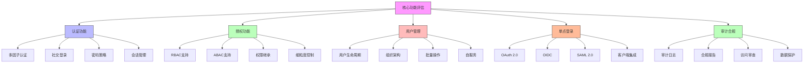

在构建企业级统一身份治理平台时，选择合适的技术栈是一个关键决策。开源IAM系统因其成本效益、灵活性和社区支持而受到广泛关注。然而，面对众多的开源选项，如何评估和选择最适合企业需求的系统成为一大挑战。本指南将提供一个系统性的评估框架，帮助架构师和决策者做出明智的选择。

## 引言

开源IAM系统为企业提供了构建身份治理平台的经济高效途径。然而，每个系统都有其特定的优势和局限性，选择不当可能导致项目失败或后期维护困难。通过建立科学的评估体系，可以有效降低选择风险，确保所选系统能够满足当前和未来的业务需求。

## 评估框架

### 核心功能评估



### 评估维度

```java
public class OpenSourceIAMEvaluationFramework {
    
    // 评估维度
    public enum EvaluationDimension {
        CORE_FUNCTIONALITY("核心功能", 30),
        TECHNICAL_ARCHITECTURE("技术架构", 20),
        EXTENSIBILITY("可扩展性", 15),
        COMMUNITY_SUPPORT("社区支持", 10),
        SECURITY("安全性", 15),
        USABILITY("易用性", 10);
        
        private final String name;
        private final int weight;
        
        EvaluationDimension(String name, int weight) {
            this.name = name;
            this.weight = weight;
        }
        
        public String getName() { return name; }
        public int getWeight() { return weight; }
    }
    
    // 评估指标体系
    public class EvaluationCriteria {
        
        // 核心功能评估指标
        public class CoreFunctionalityCriteria {
            public static final EvaluationMetric[] METRICS = {
                new EvaluationMetric("认证协议支持", "支持OAuth 2.0, OIDC, SAML等标准协议", 10),
                new EvaluationMetric("授权模型", "支持RBAC, ABAC等权限模型", 10),
                new EvaluationMetric("用户管理", "完整的用户生命周期管理功能", 8),
                new EvaluationMetric("单点登录", "SSO功能完整性和易用性", 8),
                new EvaluationMetric("多因子认证", "MFA支持的多样性", 4)
            };
        }
        
        // 技术架构评估指标
        public class TechnicalArchitectureCriteria {
            public static final EvaluationMetric[] METRICS = {
                new EvaluationMetric("微服务架构", "是否采用现代化微服务架构", 5),
                new EvaluationMetric("容器化支持", "Docker/Kubernetes部署支持", 5),
                new EvaluationMetric("数据库支持", "多数据库兼容性", 5),
                new EvaluationMetric("缓存机制", "Redis/Memcached等缓存支持", 3),
                new EvaluationMetric("消息队列", "异步处理能力", 2)
            };
        }
        
        // 可扩展性评估指标
        public class ExtensibilityCriteria {
            public static final EvaluationMetric[] METRICS = {
                new EvaluationMetric("插件机制", "插件化架构支持", 5),
                new EvaluationMetric("API完备性", "RESTful API的完整性和文档质量", 5),
                new EvaluationMetric("自定义策略", "支持自定义认证授权策略", 3),
                new EvaluationMetric("主题定制", "UI主题和品牌定制能力", 2)
            };
        }
    }
    
    // 评估模型
    public class EvaluationModel {
        private final Map<String, SystemEvaluation> evaluations;
        
        public EvaluationResult evaluateSystem(IAMSystem system) {
            SystemEvaluation evaluation = new SystemEvaluation(system);
            
            // 1. 核心功能评估
            int coreScore = evaluateCoreFunctionality(system);
            evaluation.setCoreFunctionalityScore(coreScore);
            
            // 2. 技术架构评估
            int techScore = evaluateTechnicalArchitecture(system);
            evaluation.setTechnicalArchitectureScore(techScore);
            
            // 3. 可扩展性评估
            int extensibilityScore = evaluateExtensibility(system);
            evaluation.setExtensibilityScore(extensibilityScore);
            
            // 4. 社区支持评估
            int communityScore = evaluateCommunitySupport(system);
            evaluation.setCommunitySupportScore(communityScore);
            
            // 5. 安全性评估
            int securityScore = evaluateSecurity(system);
            evaluation.setSecurityScore(securityScore);
            
            // 6. 易用性评估
            int usabilityScore = evaluateUsability(system);
            evaluation.setUsabilityScore(usabilityScore);
            
            // 计算综合评分
            int totalScore = calculateWeightedScore(evaluation);
            evaluation.setTotalScore(totalScore);
            
            return new EvaluationResult(evaluation);
        }
        
        private int calculateWeightedScore(SystemEvaluation evaluation) {
            return (int) (
                evaluation.getCoreFunctionalityScore() * 0.3 +
                evaluation.getTechnicalArchitectureScore() * 0.2 +
                evaluation.getExtensibilityScore() * 0.15 +
                evaluation.getCommunitySupportScore() * 0.1 +
                evaluation.getSecurityScore() * 0.15 +
                evaluation.getUsabilityScore() * 0.1
            );
        }
    }
}
```

## 主流开源IAM系统对比

### Keycloak

```python
class KeycloakEvaluation:
    def __init__(self):
        self.system_info = {
            "name": "Keycloak",
            "vendor": "Red Hat",
            "license": "Apache 2.0",
            "github_stars": 7000,
            "first_release": "2014",
            "latest_version": "22.0.0"
        }
    
    def evaluate_core_functionality(self):
        return {
            "authentication": {
                "oauth2": True,
                "oidc": True,
                "saml": True,
                "mfa": True,
                "social_login": True,
                "passwordless": True,
                "score": 9
            },
            "authorization": {
                "rbac": True,
                "abac": True,
                "fine_grained": True,
                "policy_enforcement": True,
                "score": 8
            },
            "user_management": {
                "lifecycle": True,
                "federation": True,
                "self_service": True,
                "batch_operations": True,
                "score": 8
            },
            "sso": {
                "protocols": ["OAuth2", "OIDC", "SAML"],
                "clients": ["Web", "Mobile", "Backend"],
                "session_management": True,
                "score": 9
            }
        }
    
    def evaluate_technical_architecture(self):
        return {
            "architecture": "Microservices",
            "container_support": True,
            "database_support": ["PostgreSQL", "MySQL", "MariaDB", "Oracle"],
            "caching": True,
            "messaging": True,
            "score": 8
        }
    
    def evaluate_extensibility(self):
        return {
            "plugins": True,
            "api": "Comprehensive RESTful API",
            "custom_policies": True,
            "themes": True,
            "score": 7
        }

# Keycloak优势
keycloak_strengths = [
    "功能完整，覆盖IAM所有核心领域",
    "社区活跃，文档完善",
    "企业级特性丰富",
    "与Red Hat生态系统集成良好",
    "支持多种部署方式"
]

# Keycloak劣势
keycloak_weaknesses = [
    "资源消耗较大",
    "学习曲线较陡峭",
    "配置复杂度高",
    "性能优化需要专业知识"
]
```

### CAS (Central Authentication Service)

```sql
-- CAS系统评估数据表
CREATE TABLE cas_evaluation (
    id VARCHAR(50) PRIMARY KEY,
    evaluation_aspect VARCHAR(100) NOT NULL,
    rating INT NOT NULL,  -- 1-10分
    comments TEXT,
    evaluated_at TIMESTAMP DEFAULT CURRENT_TIMESTAMP
);

INSERT INTO cas_evaluation (id, evaluation_aspect, rating, comments) VALUES
('cas-001', '协议支持', 9, '支持多种认证协议，包括CAS, OAuth, OIDC, SAML'),
('cas-002', '架构设计', 8, '模块化设计，易于扩展'),
('cas-003', '性能表现', 7, '高并发场景下表现良好'),
('cas-004', '社区支持', 6, '社区相对较小，文档有待完善'),
('cas-005', '部署复杂度', 5, '部署配置相对复杂'),
('cas-006', '安全性', 8, '安全特性完善，支持多种加密算法');
```

```javascript
// CAS评估结果
const CASEvaluation = {
  systemInfo: {
    name: "CAS (Central Authentication Service)",
    vendor: "Apereo Foundation",
    license: "Apache 2.0",
    githubStars: 2000,
    firstRelease: "2005",
    latestVersion: "6.6.0"
  },
  
  strengths: [
    "历史悠久，稳定性好",
    "协议支持广泛",
    "架构模块化，易于扩展",
    "性能表现优秀",
    "与Java生态系统集成良好"
  ],
  
  weaknesses: [
    "学习曲线陡峭",
    "文档质量参差不齐",
    "社区相对较小",
    "配置复杂"
  ],
  
  useCases: {
    "适合场景": [
      "大型教育机构",
      "政府机构",
      "需要高并发支持的场景"
    ],
    "不适合场景": [
      "小型企业",
      "快速原型开发",
      "资源有限的项目"
    ]
  }
};
```

### Ory Stack

```java
public class OryEvaluation {
    private static final SystemInfo ORY_INFO = new SystemInfo(
        "Ory Stack",
        "Ory GmbH",
        "Apache 2.0",
        8500,
        "2015",
        "v0.10.0"
    );
    
    public EvaluationResult evaluate() {
        return EvaluationResult.builder()
            .systemInfo(ORY_INFO)
            .coreFunctionality(evaluateCoreFunctionality())
            .technicalArchitecture(evaluateTechnicalArchitecture())
            .extensibility(evaluateExtensibility())
            .communitySupport(evaluateCommunitySupport())
            .security(evaluateSecurity())
            .usability(evaluateUsability())
            .strengths(Arrays.asList(
                "现代化架构设计",
                "云原生友好",
                "API优先设计",
                "文档质量高",
                "Go语言实现，性能优秀"
            ))
            .weaknesses(Arrays.asList(
                "相对较新，生态不够成熟",
                "企业级功能相对较少",
                "社区规模较小"
            ))
            .build();
    }
    
    private DimensionScore evaluateCoreFunctionality() {
        return DimensionScore.builder()
            .score(7)
            .details(Map.of(
                "认证", Map.of("OAuth2", true, "OIDC", true, "MFA", true),
                "授权", Map.of("RBAC", true, "ABAC", false),
                "用户管理", Map.of("基础功能", true, "高级功能", false)
            ))
            .build();
    }
    
    private DimensionScore evaluateTechnicalArchitecture() {
        return DimensionScore.builder()
            .score(9)
            .details(Map.of(
                "微服务", true,
                "容器化", true,
                "云原生", true,
                "性能", "优秀"
            ))
            .build();
    }
}
```

## 评估实践建议

### 评估流程

```yaml
# 开源IAM系统评估流程
iam_system_evaluation_process:
  phase_1_preparation:
    duration: "1-2 weeks"
    activities:
      - "需求收集与分析"
      - "评估标准制定"
      - "候选系统筛选"
      - "测试环境准备"
    deliverables:
      - "需求规格说明书"
      - "评估标准文档"
      - "候选系统清单"
      - "测试环境"
  
  phase_2_technical_evaluation:
    duration: "2-3 weeks"
    activities:
      - "功能测试"
      - "性能测试"
      - "安全测试"
      - "集成测试"
    deliverables:
      - "功能测试报告"
      - "性能测试报告"
      - "安全测试报告"
      - "集成测试报告"
  
  phase_3_business_evaluation:
    duration: "1-2 weeks"
    activities:
      - "成本效益分析"
      - "风险评估"
      - "团队技能匹配度评估"
      - "长期维护成本评估"
    deliverables:
      - "成本效益分析报告"
      - "风险评估报告"
      - "技能匹配度报告"
      - "维护成本评估报告"
  
  phase_4_decision_making:
    duration: "1 week"
    activities:
      - "综合评估结果分析"
      - "决策委员会评审"
      - "最终决策"
      - "实施计划制定"
    deliverables:
      - "综合评估报告"
      - "决策建议书"
      - "实施计划"
```

### 评分标准

```python
class ScoringStandards:
    def __init__(self):
        self.scoring_scale = {
            "优秀 (9-10分)": "完全满足或超出预期要求",
            "良好 (7-8分)": "基本满足要求，有少量不足",
            "一般 (5-6分)": "部分满足要求，有明显不足",
            "较差 (3-4分)": "勉强满足最低要求",
            "很差 (1-2分)": "不满足要求或存在严重缺陷"
        }
    
    def calculate_final_score(self, dimension_scores):
        """计算最终评分"""
        total_weighted_score = 0
        total_weight = 0
        
        for dimension, score_info in dimension_scores.items():
            weight = score_info['weight']
            score = score_info['score']
            weighted_score = score * weight
            total_weighted_score += weighted_score
            total_weight += weight
        
        return round(total_weighted_score / total_weight, 2)
    
    def generate_recommendation(self, final_score):
        """生成推荐建议"""
        if final_score >= 8.5:
            return "强烈推荐"
        elif final_score >= 7.0:
            return "推荐"
        elif final_score >= 5.5:
            return "可考虑"
        else:
            return "不推荐"
```

## 选型决策矩阵

### 综合评估表

```javascript
// 开源IAM系统综合评估矩阵
const evaluationMatrix = {
  systems: [
    {
      name: "Keycloak",
      coreFunctionality: 8.5,
      technicalArchitecture: 8.0,
      extensibility: 7.5,
      communitySupport: 9.0,
      security: 8.5,
      usability: 7.0,
      totalScore: 8.1
    },
    {
      name: "CAS",
      coreFunctionality: 7.5,
      technicalArchitecture: 8.0,
      extensibility: 7.0,
      communitySupport: 6.5,
      security: 8.0,
      usability: 6.0,
      totalScore: 7.2
    },
    {
      name: "Ory Stack",
      coreFunctionality: 7.0,
      technicalArchitecture: 9.0,
      extensibility: 8.0,
      communitySupport: 6.0,
      security: 8.5,
      usability: 7.5,
      totalScore: 7.7
    },
    {
      name: "Authelia",
      coreFunctionality: 6.5,
      technicalArchitecture: 7.5,
      extensibility: 6.5,
      communitySupport: 5.5,
      security: 8.0,
      usability: 6.5,
      totalScore: 6.8
    }
  ],
  
  recommendation: {
    "大型企业": "推荐Keycloak，功能完整且企业级特性丰富",
    "中型企业": "可考虑Keycloak或Ory Stack，根据技术栈偏好选择",
    "初创公司": "推荐Ory Stack，现代化架构且资源消耗较小",
    "教育机构": "推荐CAS，历史悠久且在教育领域应用广泛"
  }
};
```

### 决策因素权重

```sql
-- 决策因素权重表
CREATE TABLE decision_factors (
    id VARCHAR(50) PRIMARY KEY,
    factor_name VARCHAR(100) NOT NULL,
    description TEXT,
    weight DECIMAL(3,2) NOT NULL,  -- 权重(0-1)
    category VARCHAR(50) NOT NULL,  -- 功能性, 非功能性, 商业因素
    created_at TIMESTAMP DEFAULT CURRENT_TIMESTAMP
);

INSERT INTO decision_factors (id, factor_name, description, weight, category) VALUES
('df-001', '功能完整性', '系统是否满足核心IAM功能需求', 0.25, '功能性'),
('df-002', '技术架构', '系统架构是否现代化且可扩展', 0.15, '非功能性'),
('df-003', '安全性', '系统安全特性和防护能力', 0.15, '非功能性'),
('df-004', '社区支持', '社区活跃度和文档完善程度', 0.10, '商业因素'),
('df-005', '成本效益', '总体拥有成本和ROI', 0.15, '商业因素'),
('df-006', '团队匹配度', '与现有技术栈和团队技能匹配度', 0.10, '商业因素'),
('df-007', '长期维护', '系统长期维护和升级的可持续性', 0.10, '商业因素');
```

## 实施建议

### 试点实施策略

```python
class PilotImplementationStrategy:
    def __init__(self, selected_system):
        self.selected_system = selected_system
        self.pilot_scope = None
        self.success_criteria = None
    
    def define_pilot_scope(self):
        """定义试点范围"""
        return {
            "user_groups": ["内部测试用户", "部分业务部门"],
            "applications": ["非关键业务系统", "测试环境应用"],
            "functions": ["基础认证", "用户管理", "简单权限控制"],
            "duration": "2-3个月",
            "success_metrics": [
                "系统可用性>99.5%",
                "用户满意度>80%",
                "故障恢复时间<30分钟",
                "性能指标达标"
            ]
        }
    
    def risk_mitigation_plan(self):
        """风险缓解计划"""
        return {
            "技术风险": {
                "风险": "系统集成复杂度高",
                "缓解措施": [
                    "提前进行POC验证",
                    "准备回退方案",
                    "分阶段集成"
                ]
            },
            "业务风险": {
                "风险": "影响现有业务流程",
                "缓解措施": [
                    "选择非关键业务试点",
                    "制定应急预案",
                    "充分用户培训"
                ]
            },
            "人员风险": {
                "风险": "团队技能不足",
                "缓解措施": [
                    "组织专项培训",
                    "寻求外部专家支持",
                    "建立知识库"
                ]
            }
        }
```

## 总结

开源IAM系统的评估是一个系统性工程，需要从多个维度进行全面考量。通过建立科学的评估框架和标准化的评估流程，可以有效降低选型风险，确保所选系统能够满足企业当前和未来的业务需求。

关键要点包括：

1. **建立评估框架**：明确评估维度和指标体系
2. **深入技术评估**：全面测试系统功能和性能
3. **考虑商业因素**：综合评估成本效益和长期维护
4. **试点验证**：通过小范围试点验证系统适用性
5. **持续评估**：定期评估系统表现，及时调整策略

选择合适的开源IAM系统只是第一步，成功的实施还需要周密的规划、专业的团队和持续的优化。希望本指南能为您的IAM系统选型提供有价值的参考。