在构建企业级统一身份治理平台时，选择合适的技术栈是至关重要的决策。开源IAM解决方案因其灵活性、成本效益和社区支持而受到广泛关注。本指南将深入分析主流开源IAM系统的特性、优劣势及适用场景，为技术选型提供参考。

## 引言

随着企业对身份治理需求的不断增长，开源IAM解决方案逐渐成为许多组织的首选。这些系统不仅提供了丰富的功能特性，还具备良好的可扩展性和定制能力。然而，面对众多选择，如何评估和选择最适合的系统成为一大挑战。

## 主流开源IAM系统概览

### Keycloak

Keycloak是Red Hat开发的开源身份和访问管理解决方案，是目前最流行的开源IAM系统之一。

#### 核心特性

```yaml
Keycloak特性:
  认证功能:
    - OAuth 2.0/OpenID Connect支持
    - SAML 2.0身份提供者和服务中心
    - 社交登录集成（Google, Facebook, GitHub等）
    - 多因子认证（MFA）
    - 用户注册和密码重置
  授权功能:
    - 基于角色的访问控制（RBAC）
    - 基于属性的访问控制（ABAC）
    - 细粒度授权服务
    - 用户管理权限（UMA）
  扩展性:
    - 主题和模板定制
    - 提供商SPI扩展机制
    - 事件监听器和脚本支持
  部署:
    - 支持集群部署
    - 数据库支持（MySQL, PostgreSQL, MariaDB等）
    - Docker容器化部署
```

#### 优势分析

1. **功能全面**：提供了完整的IAM功能，从认证到授权一应俱全
2. **易于部署**：支持多种部署方式，包括Docker、Kubernetes等
3. **社区活跃**：拥有庞大的社区支持和丰富的文档资源
4. **企业级特性**：支持高可用、集群部署等企业级需求

#### 劣势分析

1. **资源消耗**：在大规模部署时资源消耗较大
2. **学习曲线**：功能丰富但也带来了较高的学习成本
3. **定制复杂性**：深度定制需要掌握其SPI机制

#### 适用场景

- 需要完整IAM功能的企业级应用
- 已有微服务架构需要集成统一认证
- 希望快速搭建身份治理平台的项目

### Casdoor

Casdoor是一个基于OAuth 2.0/OIDC协议的开源身份和访问管理平台，采用Go语言开发。

#### 核心特性

```go
// Casdoor核心特性示例代码
type CasdoorFeatures struct {
    Authentication struct {
        OAuth20         bool `json:"oauth2_0"`
        OIDC            bool `json:"oidc"`
        SAML20          bool `json:"saml2_0"`
        SocialLogin     []string `json:"social_login"` // Google, GitHub, WeChat等
        MFA             bool `json:"mfa"`
        PasswordPolicy  bool `json:"password_policy"`
    } `json:"authentication"`
    
    Authorization struct {
        RBAC            bool `json:"rbac"`
        ABAC            bool `json:"abac"`
        ResourcePerm    bool `json:"resource_permissions"`
    } `json:"authorization"`
    
    Management struct {
        UserMgmt        bool `json:"user_management"`
        RoleMgmt        bool `json:"role_management"`
        OrgMgmt         bool `json:"organization_management"`
        AuditLog        bool `json:"audit_log"`
    } `json:"management"`
    
    Deployment struct {
        MultiTenant     bool `json:"multi_tenant"`
        Kubernetes      bool `json:"kubernetes_support"`
        Docker          bool `json:"docker_support"`
    } `json:"deployment"`
}
```

#### 优势分析

1. **多语言支持**：提供多种SDK（JavaScript, Java, Go, Python等）
2. **轻量级**：相比Keycloak更加轻量，资源消耗较少
3. **易于集成**：提供丰富的API和SDK，便于集成到现有系统
4. **现代化界面**：前端采用React，界面现代化且响应式

#### 劣势分析

1. **社区规模**：相比Keycloak社区规模较小
2. **功能成熟度**：某些高级功能仍在发展中
3. **文档完善度**：部分文档和示例仍在完善中

#### 适用场景

- 需要轻量级IAM解决方案的中小型项目
- 希望快速集成认证功能的Web应用
- 对资源消耗有严格要求的环境

### Ory Kratos

Ory Kratos是Ory生态系统中的身份管理组件，专注于身份和用户管理。

#### 核心特性

```yaml
Kratos特性:
  身份管理:
    - 用户注册、登录、密码重置
    - 多因素认证支持
    - 社交登录集成
    - 身份模式自定义
  安全特性:
    - 密码安全策略
    - 会话管理
    - 风险检测
    - 安全审计
  集成能力:
    - 与Ory生态系统其他组件集成
    - RESTful API设计
    - 支持自定义UI
  部署:
    - 云原生设计
    - Kubernetes友好
    - 支持多种数据库后端
```

#### 优势分析

1. **专注性**：专注于身份管理核心功能，设计简洁
2. **云原生**：专为云原生环境设计，与Kubernetes集成良好
3. **可扩展性**：通过API和钩子机制提供良好的扩展性
4. **安全性**：内置多种安全机制和最佳实践

#### 劣势分析

1. **功能范围**：相比Keycloak功能范围较窄
2. **学习成本**：需要理解Ory生态系统才能充分发挥价值
3. **社区支持**：社区相对较小，文档资源有限

#### 适用场景

- 云原生应用的身份管理需求
- 需要高度定制化身份流程的项目
- 已使用Ory生态系统其他组件的环境

## 评估维度对比

### 功能完整性对比

```mermaid
graph TD
    A[功能完整性] --> B[认证功能]
    A --> C[授权功能]
    A --> D[用户管理]
    A --> E[安全特性]
    A --> F[扩展能力]
    
    B --> B1[Keycloak: ★★★★★]
    B --> B2[Casdoor: ★★★★☆]
    B --> B3[Kratos: ★★★★☆]
    
    C --> C1[Keycloak: ★★★★★]
    C --> C2[Casdoor: ★★★★☆]
    C --> C3[Kratos: ★★★☆☆]
    
    D --> D1[Keycloak: ★★★★★]
    D --> D2[Casdoor: ★★★★☆]
    D --> D3[Kratos: ★★★★☆]
    
    E --> E1[Keycloak: ★★★★★]
    E --> E2[Casdoor: ★★★★☆]
    E --> E3[Kratos: ★★★★☆]
    
    F --> F1[Keycloak: ★★★★★]
    F --> F2[Casdoor: ★★★★☆]
    F --> F3[Kratos: ★★★★☆]
    
    style A fill:#f9f,stroke:#333
    style B fill:#bbf,stroke:#333
    style C fill:#bfb,stroke:#333
    style D fill:#fbb,stroke:#333
    style E fill:#fb9,stroke:#333
    style F fill:#bfb,stroke:#333
```



### 易用性对比

```mermaid
graph TD
    A[易用性] --> B[部署难度]
    A --> C[配置复杂度]
    A --> D[学习曲线]
    A --> E[文档完善度]
    A --> F[社区支持]
    
    B --> B1[Keycloak: ★★★☆☆]
    B --> B2[Casdoor: ★★★★☆]
    B --> B3[Kratos: ★★★★☆]
    
    C --> C1[Keycloak: ★★★☆☆]
    C --> C2[Casdoor: ★★★★☆]
    C --> C3[Kratos: ★★★★☆]
    
    D --> D1[Keycloak: ★★★☆☆]
    D --> D2[Casdoor: ★★★★☆]
    D --> D3[Kratos: ★★★★☆]
    
    E --> E1[Keycloak: ★★★★★]
    E --> E2[Casdoor: ★★★★☆]
    E --> E3[Kratos: ★★★★☆]
    
    F --> F1[Keycloak: ★★★★★]
    F --> F2[Casdoor: ★★★★☆]
    F --> F3[Kratos: ★★★★☆]
    
    style A fill:#f9f,stroke:#333
    style B fill:#bbf,stroke:#333
    style C fill:#bfb,stroke:#333
    style D fill:#fbb,stroke:#333
    style E fill:#fb9,stroke:#333
    style F fill:#bfb,stroke:#333
```



### 性能与扩展性对比

```mermaid
graph TD
    A[性能与扩展性] --> B[资源消耗]
    A --> C[并发处理能力]
    A --> D[集群支持]
    A --> E[数据库支持]
    A --> F[定制能力]
    
    B --> B1[Keycloak: ★★★☆☆]
    B --> B2[Casdoor: ★★★★★]
    B --> B3[Kratos: ★★★★★]
    
    C --> C1[Keycloak: ★★★★★]
    C --> C2[Casdoor: ★★★★☆]
    C --> C3[Kratos: ★★★★☆]
    
    D --> D1[Keycloak: ★★★★★]
    D --> D2[Casdoor: ★★★★☆]
    D --> D3[Kratos: ★★★★☆]
    
    E --> E1[Keycloak: ★★★★★]
    E --> E2[Casdoor: ★★★★☆]
    E --> E3[Kratos: ★★★★☆]
    
    F --> F1[Keycloak: ★★★★★]
    F --> F2[Casdoor: ★★★★☆]
    F --> F3[Kratos: ★★★★★]
    
    style A fill:#f9f,stroke:#333
    style B fill:#bbf,stroke:#333
    style C fill:#bfb,stroke:#333
    style D fill:#fbb,stroke:#333
    style E fill:#fb9,stroke:#333
    style F fill:#bfb,stroke:#333
```



## 选型建议

### 根据项目规模选择

```python
class IAMSelectionGuide:
    def __init__(self):
        self.systems = {
            'Keycloak': {
                'strengths': ['功能全面', '企业级特性', '社区活跃'],
                'weaknesses': ['资源消耗大', '学习曲线陡峭'],
                'best_for': ['大型企业', '复杂需求', '长期项目']
            },
            'Casdoor': {
                'strengths': ['轻量级', '易于集成', '现代化界面'],
                'weaknesses': ['功能相对简单', '社区较小'],
                'best_for': ['中小项目', '快速原型', '资源受限环境']
            },
            'Kratos': {
                'strengths': ['云原生', '专注核心', '安全性高'],
                'weaknesses': ['功能范围窄', '生态系统依赖'],
                'best_for': ['云原生应用', '定制化需求', 'Ory用户']
            }
        }
    
    def recommend_by_scale(self, scale):
        """根据项目规模推荐"""
        recommendations = {
            'small': ['Casdoor', 'Kratos'],
            'medium': ['Keycloak', 'Casdoor'],
            'large': ['Keycloak']
        }
        return recommendations.get(scale, ['Keycloak'])
    
    def recommend_by_requirements(self, requirements):
        """根据需求推荐"""
        # 实现基于需求的推荐逻辑
        pass
```

### 根据技术栈选择

1. **Java技术栈**：Keycloak是最佳选择，与Spring生态系统集成良好
2. **Go技术栈**：Casdoor是自然选择，同为Go语言开发
3. **云原生环境**：Kratos或Keycloak都适合，但Kratos更专注于云原生设计
4. **微服务架构**：Keycloak提供完整的解决方案，Casdoor更轻量

## 实施建议

### 评估流程

1. **需求分析**：明确项目对IAM系统的具体需求
2. **功能验证**：搭建测试环境验证核心功能
3. **性能测试**：进行压力测试评估系统性能
4. **集成验证**：测试与现有系统的集成能力
5. **成本评估**：综合考虑开发、部署、维护成本

### 迁移策略

```javascript
// IAM系统迁移策略示例
class IAMMigrationStrategy {
  constructor(currentSystem, targetSystem) {
    this.currentSystem = currentSystem;
    this.targetSystem = targetSystem;
  }
  
  createMigrationPlan() {
    return {
      phases: [
        {
          name: '评估阶段',
          duration: '2-4周',
          activities: [
            '需求分析',
            '功能对比',
            '技术验证'
          ]
        },
        {
          name: '试点阶段',
          duration: '4-8周',
          activities: [
            '环境搭建',
            '核心功能实现',
            '用户测试'
          ]
        },
        {
          name: '并行阶段',
          duration: '8-12周',
          activities: [
            '逐步迁移',
            '数据同步',
            '用户培训'
          ]
        },
        {
          name: '切换阶段',
          duration: '2-4周',
          activities: [
            '系统切换',
            '监控观察',
            '应急回滚'
          ]
        }
      ],
      rollbackPlan: {
        // 回滚计划
      }
    };
  }
}
```

## 总结

选择合适的开源IAM系统需要综合考虑项目需求、技术栈、团队能力等多个因素。Keycloak适合功能要求全面的企业级项目，Casdoor适合需要轻量级解决方案的中小型项目，而Kratos则适合云原生环境下的定制化需求。

在实际选型过程中，建议通过搭建测试环境进行实际验证，并制定详细的迁移计划以降低实施风险。无论选择哪种方案，都应该关注系统的安全性、可扩展性和维护成本，确保选择的系统能够满足当前和未来的业务需求。