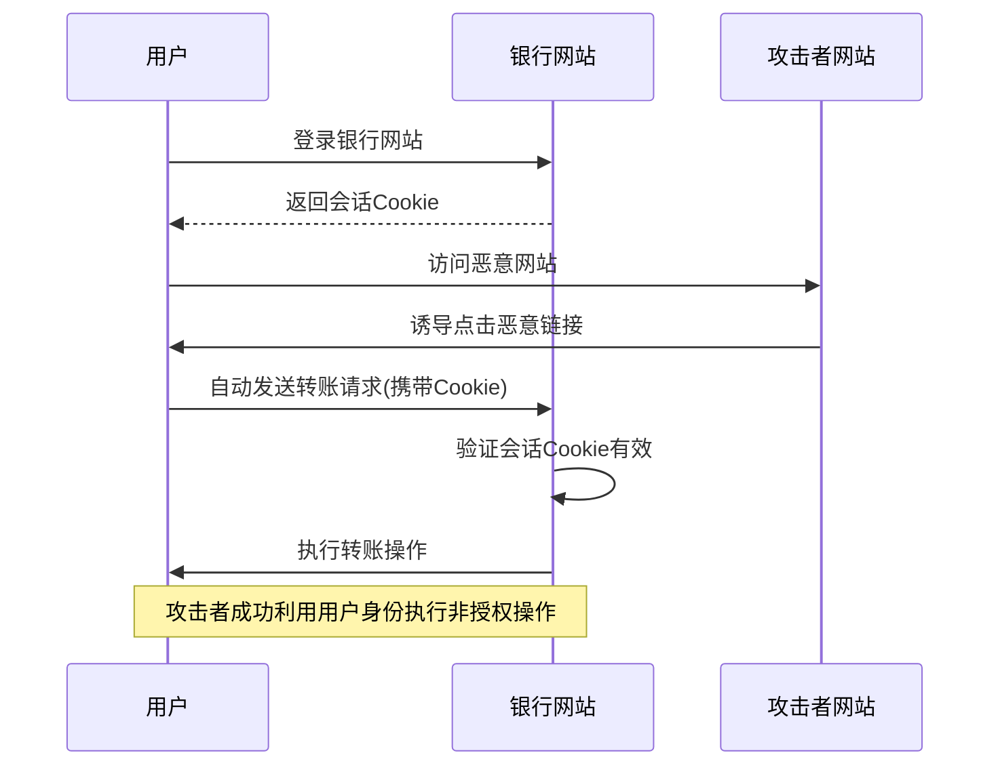

在构建企业级统一身份治理平台时，安全是最重要的考虑因素之一。身份管理系统作为企业安全的核心组件，必须具备完善的安全防护机制。本清单将详细列出常见的安全漏洞类型及其防范措施，帮助开发团队构建更加安全可靠的系统。

## 引言

身份治理平台处理着企业最敏感的用户身份和权限信息，一旦出现安全漏洞，可能导致严重的数据泄露和业务中断。因此，在系统设计和开发过程中，必须系统性地识别和防范各类安全风险。

## 跨站请求伪造（CSRF）防护

### CSRF攻击原理

CSRF攻击利用用户已登录的身份，在用户不知情的情况下执行非授权操作。攻击者通过诱导用户点击恶意链接或访问恶意网站，以用户的名义向目标网站发送请求。



### 防护措施

#### 1. 同步器令牌模式（Synchronizer Token Pattern）

```java
@Controller
public class SecureFormController {
    
    // 生成CSRF令牌
    @GetMapping("/transfer")
    public String showTransferForm(Model model, HttpServletRequest request) {
        // 生成唯一的CSRF令牌
        String csrfToken = UUID.randomUUID().toString();
        
        // 将令牌存储在会话中
        request.getSession().setAttribute("CSRF_TOKEN", csrfToken);
        
        // 将令牌传递给视图
        model.addAttribute("csrfToken", csrfToken);
        
        return "transfer-form";
    }
    
    // 处理表单提交
    @PostMapping("/transfer")
    public String processTransfer(
            @RequestParam("amount") BigDecimal amount,
            @RequestParam("toAccount") String toAccount,
            @RequestParam("csrfToken") String csrfToken,
            HttpServletRequest request,
            Model model) {
        
        // 验证CSRF令牌
        String sessionToken = (String) request.getSession().getAttribute("CSRF_TOKEN");
        
        if (sessionToken == null || !sessionToken.equals(csrfToken)) {
            // CSRF攻击检测
            logger.warn("CSRF攻击检测: 无效的CSRF令牌");
            throw new CsrfException("无效的CSRF令牌");
        }
        
        // 清除已使用的令牌
        request.getSession().removeAttribute("CSRF_TOKEN");
        
        // 执行转账操作
        try {
            transferService.transfer(amount, toAccount);
            model.addAttribute("success", "转账成功");
        } catch (Exception e) {
            model.addAttribute("error", "转账失败: " + e.getMessage());
        }
        
        return "transfer-result";
    }
}
```

#### 2. 双重Cookie模式（Double Submit Cookie）

```javascript
// 前端实现
class CSRFProtection {
  constructor() {
    this.token = this.getCSRFToken();
  }
  
  // 获取CSRF令牌
  getCSRFToken() {
    // 从Cookie中获取令牌
    const cookies = document.cookie.split(';');
    for (let cookie of cookies) {
      const [name, value] = cookie.trim().split('=');
      if (name === 'XSRF-TOKEN') {
        return value;
      }
    }
    return null;
  }
  
  // 为所有AJAX请求添加CSRF头
  setupAjaxProtection() {
    const self = this;
    
    // jQuery
    $.ajaxSetup({
      beforeSend: function(xhr) {
        if (self.token) {
          xhr.setRequestHeader('X-XSRF-TOKEN', self.token);
        }
      }
    });
    
    // Fetch API
    const originalFetch = window.fetch;
    window.fetch = function(...args) {
      const [resource, options = {}] = args;
      const headers = options.headers || {};
      
      if (self.token) {
        headers['X-XSRF-TOKEN'] = self.token;
      }
      
      return originalFetch(resource, {
        ...options,
        headers
      });
    };
  }
  
  // 为表单添加隐藏字段
  protectForms() {
    if (!this.token) return;
    
    const forms = document.querySelectorAll('form[method="POST"]');
    forms.forEach(form => {
      // 检查是否已存在CSRF字段
      const existingField = form.querySelector('input[name="_csrf"]');
      if (!existingField) {
        const csrfField = document.createElement('input');
        csrfField.type = 'hidden';
        csrfField.name = '_csrf';
        csrfField.value = this.token;
        form.appendChild(csrfField);
      }
    });
  }
}

// 初始化CSRF保护
document.addEventListener('DOMContentLoaded', () => {
  const csrfProtection = new CSRFProtection();
  csrfProtection.setupAjaxProtection();
  csrfProtection.protectForms();
});
```

#### 3. 自定义请求头验证

```java
@Component
public class CsrfProtectionFilter implements Filter {
    
    private static final String CSRF_HEADER = "X-CSRF-TOKEN";
    private static final String CSRF_COOKIE = "XSRF-TOKEN";
    
    @Override
    public void doFilter(ServletRequest request, ServletResponse response, 
                        FilterChain chain) throws IOException, ServletException {
        
        HttpServletRequest httpRequest = (HttpServletRequest) request;
        HttpServletResponse httpResponse = (HttpServletResponse) response;
        
        // 只对修改操作进行CSRF检查
        if (isModificationRequest(httpRequest)) {
            String headerToken = httpRequest.getHeader(CSRF_HEADER);
            String cookieToken = getCookieValue(httpRequest, CSRF_COOKIE);
            
            // 验证令牌匹配
            if (headerToken == null || cookieToken == null || 
                !headerToken.equals(cookieToken)) {
                
                logger.warn("CSRF攻击检测: 令牌不匹配 - Header: {}, Cookie: {}", 
                           headerToken, cookieToken);
                
                httpResponse.setStatus(HttpServletResponse.SC_FORBIDDEN);
                httpResponse.getWriter().write("CSRF token validation failed");
                return;
            }
        }
        
        chain.doFilter(request, response);
    }
    
    private boolean isModificationRequest(HttpServletRequest request) {
        String method = request.getMethod();
        return "POST".equals(method) || "PUT".equals(method) || 
               "DELETE".equals(method) || "PATCH".equals(method);
    }
    
    private String getCookieValue(HttpServletRequest request, String cookieName) {
        Cookie[] cookies = request.getCookies();
        if (cookies != null) {
            for (Cookie cookie : cookies) {
                if (cookieName.equals(cookie.getName())) {
                    return cookie.getValue();
                }
            }
        }
        return null;
    }
}
```

## 状态参数注入防护

### 状态参数注入攻击原理

状态参数注入是指攻击者通过操纵URL中的状态参数（如redirect_uri、state等）来实施重定向攻击或会话固定攻击。

### 防护措施

#### 1. 重定向URI验证

```java
@Service
public class RedirectUriValidator {
    
    private final Set<String> allowedRedirectUris;
    
    public RedirectUriValidator(@Value("${app.allowed-redirect-uris}") String uris) {
        this.allowedRedirectUris = new HashSet<>(
            Arrays.asList(uris.split(",")));
    }
    
    /**
     * 验证重定向URI是否合法
     */
    public boolean isValidRedirectUri(String redirectUri) {
        if (redirectUri == null || redirectUri.isEmpty()) {
            return false;
        }
        
        try {
            URI uri = new URI(redirectUri);
            
            // 检查协议
            if (!"https".equals(uri.getScheme()) && !"http".equals(uri.getScheme())) {
                logger.warn("重定向URI协议无效: {}", redirectUri);
                return false;
            }
            
            // 检查主机名
            String host = uri.getHost();
            if (host == null || host.isEmpty()) {
                logger.warn("重定向URI主机名无效: {}", redirectUri);
                return false;
            }
            
            // 精确匹配允许的URI
            if (allowedRedirectUris.contains(redirectUri)) {
                return true;
            }
            
            // 前缀匹配（适用于路径参数）
            for (String allowedUri : allowedRedirectUris) {
                if (redirectUri.startsWith(allowedUri)) {
                    return true;
                }
            }
            
            logger.warn("重定向URI不在允许列表中: {}", redirectUri);
            return false;
            
        } catch (URISyntaxException e) {
            logger.warn("重定向URI格式无效: {}", redirectUri, e);
            return false;
        }
    }
    
    /**
     * 安全的重定向处理
     */
    public String getSafeRedirectUri(String requestedUri, String defaultUri) {
        if (isValidRedirectUri(requestedUri)) {
            return requestedUri;
        }
        return defaultUri;
    }
}
```

#### 2. State参数安全处理

```java
@Service
public class StateParameterManager {
    
    private final RedisTemplate<String, String> redisTemplate;
    private final int stateTtlSeconds = 300; // 5分钟过期
    
    /**
     * 生成安全的state参数
     */
    public String generateStateParameter(String clientId, String redirectUri) {
        // 生成唯一标识符
        String state = UUID.randomUUID().toString();
        
        // 创建状态数据
        StateData stateData = StateData.builder()
            .state(state)
            .clientId(clientId)
            .redirectUri(redirectUri)
            .createdAt(System.currentTimeMillis())
            .build();
        
        // 存储到Redis，设置过期时间
        String key = "oauth2:state:" + state;
        redisTemplate.opsForValue().set(key, stateData.toJson(), stateTtlSeconds, TimeUnit.SECONDS);
        
        return state;
    }
    
    /**
     * 验证state参数
     */
    public StateValidationResult validateStateParameter(String state, String clientId) {
        if (state == null || state.isEmpty()) {
            return StateValidationResult.invalid("State参数为空");
        }
        
        String key = "oauth2:state:" + state;
        String jsonData = redisTemplate.opsForValue().get(key);
        
        if (jsonData == null) {
            return StateValidationResult.invalid("State参数无效或已过期");
        }
        
        try {
            StateData stateData = StateData.fromJson(jsonData);
            
            // 验证客户端ID
            if (!clientId.equals(stateData.getClientId())) {
                return StateValidationResult.invalid("客户端ID不匹配");
            }
            
            // 验证时间有效性（防止重放攻击）
            long currentTime = System.currentTimeMillis();
            if (currentTime - stateData.getCreatedAt() > stateTtlSeconds * 1000) {
                return StateValidationResult.invalid("State参数已过期");
            }
            
            // 删除已使用的state参数
            redisTemplate.delete(key);
            
            return StateValidationResult.valid(stateData.getRedirectUri());
            
        } catch (Exception e) {
            logger.error("解析state参数失败: {}", state, e);
            return StateValidationResult.invalid("State参数解析失败");
        }
    }
    
    @Data
    @Builder
    static class StateData {
        private String state;
        private String clientId;
        private String redirectUri;
        private long createdAt;
        
        public String toJson() {
            try {
                ObjectMapper mapper = new ObjectMapper();
                return mapper.writeValueAsString(this);
            } catch (Exception e) {
                throw new RuntimeException("序列化StateData失败", e);
            }
        }
        
        public static StateData fromJson(String json) {
            try {
                ObjectMapper mapper = new ObjectMapper();
                return mapper.readValue(json, StateData.class);
            } catch (Exception e) {
                throw new RuntimeException("反序列化StateData失败", e);
            }
        }
    }
    
    @Data
    static class StateValidationResult {
        private final boolean valid;
        private final String errorMessage;
        private final String redirectUri;
        
        public static StateValidationResult valid(String redirectUri) {
            return new StateValidationResult(true, null, redirectUri);
        }
        
        public static StateValidationResult invalid(String errorMessage) {
            return new StateValidationResult(false, errorMessage, null);
        }
    }
}
```

## 跨站脚本攻击（XSS）防护

### XSS攻击原理

XSS攻击通过在网页中注入恶意脚本，当其他用户浏览该页面时执行这些脚本，从而窃取用户信息或执行恶意操作。

### 防护措施

#### 1. 输入验证和输出编码

```java
@Component
public class XssProtectionService {
    
    private static final Pattern SCRIPT_PATTERN = 
        Pattern.compile("<script>(.*?)</script>", Pattern.CASE_INSENSITIVE);
    private static final Pattern SRC_PATTERN = 
        Pattern.compile("src[\r\n]*=[\r\n]*\\\'(.*?)\\\'", Pattern.CASE_INSENSITIVE | Pattern.MULTILINE | Pattern.DOTALL);
    private static final Pattern EVAL_PATTERN = 
        Pattern.compile("eval\\((.*?)\\)", Pattern.CASE_INSENSITIVE | Pattern.MULTILINE | Pattern.DOTALL);
    
    /**
     * 清理用户输入中的潜在XSS代码
     */
    public String sanitizeInput(String input) {
        if (input == null || input.isEmpty()) {
            return input;
        }
        
        String sanitized = input;
        
        // 移除<script>标签
        sanitized = SCRIPT_PATTERN.matcher(sanitized).replaceAll("");
        
        // 移除事件处理器
        sanitized = removeEventHandlers(sanitized);
        
        // 移除javascript:协议
        sanitized = removeJavascriptProtocol(sanitized);
        
        // HTML编码特殊字符
        sanitized = HtmlUtils.htmlEscape(sanitized);
        
        return sanitized;
    }
    
    /**
     * 移除事件处理器
     */
    private String removeEventHandlers(String input) {
        String[] eventHandlers = {
            "onload", "onunload", "onchange", "onsubmit", "onreset",
            "onselect", "onblur", "onfocus", "onclick", "ondblclick",
            "onmousedown", "onmouseup", "onmouseover", "onmousemove",
            "onmouseout", "onkeypress", "onkeydown", "onkeyup"
        };
        
        String result = input;
        for (String event : eventHandlers) {
            result = result.replaceAll("(?i)" + event + "[^a-zA-Z0-9]*=", "");
        }
        
        return result;
    }
    
    /**
     * 移除javascript:协议
     */
    private String removeJavascriptProtocol(String input) {
        return input.replaceAll("(?i)javascript:", "");
    }
    
    /**
     * 安全的HTML输出
     */
    public String safeHtmlOutput(String content) {
        if (content == null) {
            return "";
        }
        
        // 使用OWASP Java HTML Sanitizer进行安全清理
        PolicyFactory policy = new HtmlPolicyBuilder()
            .allowElements("p", "br", "strong", "em", "ul", "ol", "li")
            .allowAttributes("class").onElements("p", "strong", "em")
            .toFactory();
            
        return policy.sanitize(content);
    }
}
```

#### 2. 内容安全策略（CSP）

```java
@Component
public class ContentSecurityPolicyFilter implements Filter {
    
    @Override
    public void doFilter(ServletRequest request, ServletResponse response, 
                        FilterChain chain) throws IOException, ServletException {
        
        HttpServletResponse httpResponse = (HttpServletResponse) response;
        
        // 设置内容安全策略头
        StringBuilder csp = new StringBuilder();
        csp.append("default-src 'self'; ");  // 默认只允许同源资源
        csp.append("script-src 'self' 'unsafe-inline' 'unsafe-eval'; ");  // 脚本源
        csp.append("style-src 'self' 'unsafe-inline'; ");  // 样式源
        csp.append("img-src 'self' data:; ");  // 图片源
        csp.append("font-src 'self'; ");  // 字体源
        csp.append("connect-src 'self'; ");  // 连接源
        csp.append("frame-ancestors 'none'; ");  // 禁止被嵌入到frame中
        csp.append("base-uri 'self'; ");  // 基础URI限制
        csp.append("form-action 'self'; ");  // 表单提交目标
        
        httpResponse.setHeader("Content-Security-Policy", csp.toString());
        httpResponse.setHeader("X-Content-Security-Policy", csp.toString());
        httpResponse.setHeader("X-WebKit-CSP", csp.toString());
        
        chain.doFilter(request, response);
    }
}
```

## 会话安全防护

### 会话固定攻击防护

```java
@Component
public class SessionSecurityManager {
    
    /**
     * 生成安全的会话ID
     */
    public String generateSecureSessionId() {
        // 使用安全的随机数生成器
        SecureRandom secureRandom = new SecureRandom();
        byte[] randomBytes = new byte[32];
        secureRandom.nextBytes(randomBytes);
        
        // 使用Base64编码
        return Base64.getUrlEncoder().encodeToString(randomBytes);
    }
    
    /**
     * 重新生成会话ID（防止会话固定）
     */
    public void regenerateSessionId(HttpServletRequest request) {
        HttpSession session = request.getSession(false);
        if (session != null) {
            // 创建新的会话
            HttpSession newSession = request.getSession();
            
            // 复制会话属性
            Enumeration<String> attributeNames = session.getAttributeNames();
            while (attributeNames.hasMoreElements()) {
                String attributeName = attributeNames.nextElement();
                Object attributeValue = session.getAttribute(attributeName);
                newSession.setAttribute(attributeName, attributeValue);
            }
            
            // 使旧会话失效
            session.invalidate();
        }
    }
    
    /**
     * 验证会话安全性
     */
    public boolean isSessionSecure(HttpSession session, HttpServletRequest request) {
        // 检查会话是否超时
        if (session.getMaxInactiveInterval() > 1800) { // 30分钟
            logger.warn("会话超时时间过长: {}", session.getMaxInactiveInterval());
            return false;
        }
        
        // 检查IP地址绑定
        String sessionIp = (String) session.getAttribute("client_ip");
        String currentIp = request.getRemoteAddr();
        
        if (sessionIp != null && !sessionIp.equals(currentIp)) {
            logger.warn("会话IP地址不匹配: 会话IP={}, 当前IP={}", sessionIp, currentIp);
            return false;
        }
        
        // 检查用户代理一致性
        String sessionUserAgent = (String) session.getAttribute("user_agent");
        String currentUserAgent = request.getHeader("User-Agent");
        
        if (sessionUserAgent != null && !sessionUserAgent.equals(currentUserAgent)) {
            logger.warn("会话User-Agent不匹配");
            return false;
        }
        
        return true;
    }
}
```

## JWT令牌安全防护

### JWT安全最佳实践

```java
@Component
public class JwtSecurityService {
    
    private final Key signingKey;
    private final JwtParser jwtParser;
    
    public JwtSecurityService(@Value("${jwt.secret}") String secret) {
        // 使用强密钥
        this.signingKey = Keys.hmacShaKeyFor(secret.getBytes(StandardCharsets.UTF_8));
        this.jwtParser = Jwts.parserBuilder()
            .setSigningKey(signingKey)
            .build();
    }
    
    /**
     * 生成安全的JWT令牌
     */
    public String generateSecureToken(String subject, Map<String, Object> claims, 
                                    long expirationMillis) {
        Date now = new Date();
        Date expiration = new Date(now.getTime() + expirationMillis);
        
        return Jwts.builder()
            .setSubject(subject)
            .addClaims(claims)
            .setIssuedAt(now)
            .setExpiration(expiration)
            .signWith(signingKey, SignatureAlgorithm.HS512) // 使用强算法
            .compact();
    }
    
    /**
     * 验证JWT令牌
     */
    public Claims validateToken(String token) {
        try {
            Claims claims = jwtParser.parseClaimsJws(token).getBody();
            
            // 额外验证
            validateClaims(claims);
            
            return claims;
        } catch (JwtException | IllegalArgumentException e) {
            logger.warn("JWT令牌验证失败: {}", e.getMessage());
            throw new InvalidTokenException("无效的JWT令牌", e);
        }
    }
    
    /**
     * 验证声明内容
     */
    private void validateClaims(Claims claims) {
        Date now = new Date();
        
        // 检查过期时间
        if (claims.getExpiration().before(now)) {
            throw new InvalidTokenException("JWT令牌已过期");
        }
        
        // 检查签发时间
        if (claims.getIssuedAt().after(now)) {
            throw new InvalidTokenException("JWT令牌签发时间无效");
        }
        
        // 检查受众
        if (claims.getAudience() != null && 
            !claims.getAudience().equals("expected-audience")) {
            throw new InvalidTokenException("JWT令牌受众无效");
        }
    }
    
    /**
     * JWT刷新令牌管理
     */
    public class RefreshTokenManager {
        private final RedisTemplate<String, String> redisTemplate;
        private final int refreshTokenTtlSeconds = 2592000; // 30天
        
        /**
         * 生成刷新令牌
         */
        public String generateRefreshToken(String userId) {
            String refreshToken = UUID.randomUUID().toString();
            String key = "refresh_token:" + refreshToken;
            
            // 存储刷新令牌与用户ID的映射
            redisTemplate.opsForValue().set(key, userId, refreshTokenTtlSeconds, TimeUnit.SECONDS);
            
            return refreshToken;
        }
        
        /**
         * 验证刷新令牌
         */
        public String validateRefreshToken(String refreshToken) {
            String key = "refresh_token:" + refreshToken;
            String userId = redisTemplate.opsForValue().get(key);
            
            if (userId == null) {
                throw new InvalidTokenException("刷新令牌无效或已过期");
            }
            
            return userId;
        }
        
        /**
         * 撤销刷新令牌
         */
        public void revokeRefreshToken(String refreshToken) {
            String key = "refresh_token:" + refreshToken;
            redisTemplate.delete(key);
        }
    }
}
```

## 安全配置检查清单

### Spring Security配置

```java
@Configuration
@EnableWebSecurity
public class SecurityConfig {
    
    @Bean
    public SecurityFilterChain filterChain(HttpSecurity http) throws Exception {
        http
            // 启用安全头
            .headers(headers -> headers
                .frameOptions().deny()
                .contentTypeOptions().and()
                .httpStrictTransportSecurity(hstsConfig -> hstsConfig
                    .maxAgeInSeconds(31536000)
                    .includeSubdomains(true)
                    .preload(true))
                .contentTypeOptions(contentTypeOptionsConfig -> contentTypeOptionsConfig
                    .disableXssProtection())
            )
            
            // CSRF保护
            .csrf(csrf -> csrf
                .csrfTokenRepository(CookieCsrfTokenRepository.withHttpOnlyFalse())
                .requireCsrfProtectionMatcher(new DefaultRequiresCsrfMatcher())
            )
            
            // 会话管理
            .sessionManagement(session -> session
                .sessionCreationPolicy(SessionCreationPolicy.IF_REQUIRED)
                .maximumSessions(1)
                .maxSessionsPreventsLogin(false)
            )
            
            // 认证配置
            .authorizeHttpRequests(authz -> authz
                .requestMatchers("/public/**").permitAll()
                .requestMatchers("/api/**").authenticated()
                .anyRequest().authenticated()
            )
            
            // 表单登录
            .formLogin(form -> form
                .loginPage("/login")
                .defaultSuccessUrl("/dashboard")
                .failureHandler(new CustomAuthenticationFailureHandler())
                .successHandler(new CustomAuthenticationSuccessHandler())
            )
            
            // 登出配置
            .logout(logout -> logout
                .logoutUrl("/logout")
                .logoutSuccessUrl("/login?logout")
                .invalidateHttpSession(true)
                .deleteCookies("JSESSIONID")
                .clearAuthentication(true)
            );
            
        return http.build();
    }
    
    /**
     * 自定义认证成功处理器
     */
    @Component
    public class CustomAuthenticationSuccessHandler implements AuthenticationSuccessHandler {
        
        private final SessionSecurityManager sessionSecurityManager;
        
        @Override
        public void onAuthenticationSuccess(HttpServletRequest request, 
                                          HttpServletResponse response,
                                          Authentication authentication) 
                throws IOException, ServletException {
            
            // 重新生成会话ID防止会话固定
            sessionSecurityManager.regenerateSessionId(request);
            
            // 记录登录事件
            auditService.logLoginEvent(authentication.getName(), request.getRemoteAddr());
            
            // 重定向到默认页面
            response.sendRedirect("/dashboard");
        }
    }
    
    /**
     * 自定义认证失败处理器
     */
    @Component
    public class CustomAuthenticationFailureHandler implements AuthenticationFailureHandler {
        
        @Override
        public void onAuthenticationFailure(HttpServletRequest request, 
                                          HttpServletResponse response,
                                          AuthenticationException exception) 
                throws IOException, ServletException {
            
            // 记录失败的登录尝试
            String username = request.getParameter("username");
            auditService.logFailedLoginAttempt(username, request.getRemoteAddr());
            
            // 增加失败计数
            loginAttemptService.registerFailedAttempt(request.getRemoteAddr());
            
            // 重定向到登录页面并显示错误信息
            response.sendRedirect("/login?error=true");
        }
    }
}
```

## 总结

安全防护是一个持续的过程，需要在系统设计、开发、测试和运维的全生命周期中贯彻实施。本清单涵盖了身份治理平台中常见的安全漏洞类型及其防护措施，但实际应用中还需要根据具体业务场景和安全要求进行深入分析和定制化防护。

关键要点包括：

1. **深度防御**：采用多层防护策略，不依赖单一防护机制
2. **持续监控**：建立安全监控和告警机制，及时发现和响应安全事件
3. **定期审计**：定期进行安全审计和渗透测试，发现潜在安全风险
4. **安全培训**：加强开发团队的安全意识和技能培训
5. **应急响应**：建立完善的安全事件应急响应机制

通过系统性地实施这些安全防护措施，可以显著提升统一身份治理平台的安全性，保护企业核心的身份和权限数据。